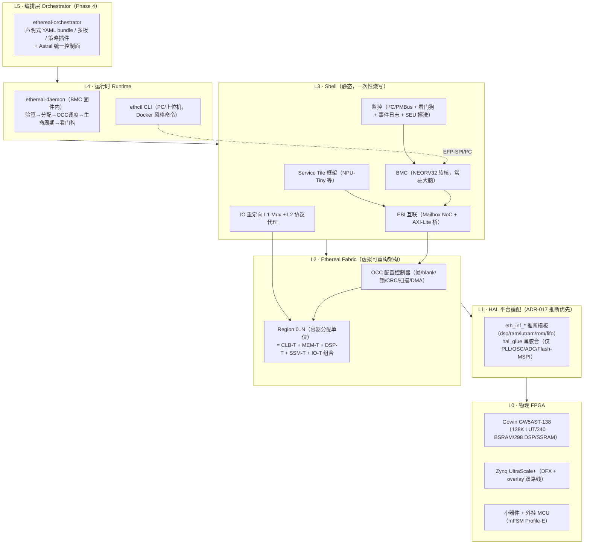
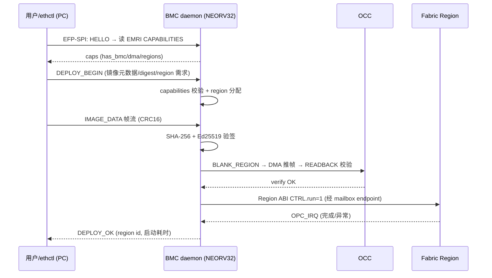
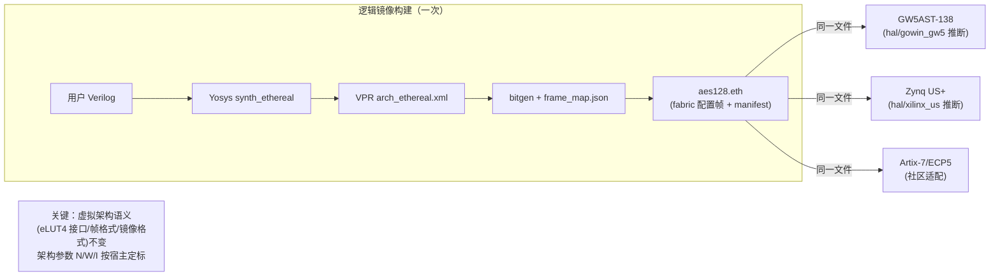
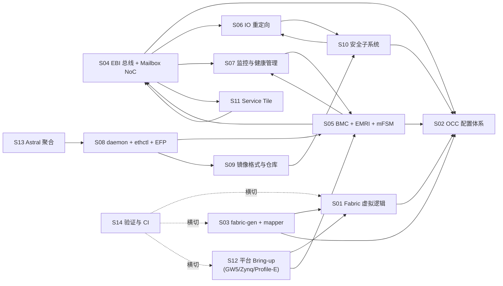

# Ethereal Logic Platform — 架构总览与可行性核验报告

> 本文档是对 `ethereal-plan/` 计划库（4 份顶层文档 + 14 份子系统档案 S01–S14 + 12 份组件详设 C01–C13 + 6 份阶段作战地图 phase-0..5 + `ethereal-tasks.yaml`）的通读产物，并已用 Web 搜索交叉核验关键事实（核验记录见 §8）。
> **重要前提**：本仓库是**纯规划/规范仓库**——目前**没有任何源码、构建脚本、测试或 CI**。所有"构建/运行/测试"流程都是**计划**，对应任务的首次落地在 Phase 0（任务 `E0-INF1..3`，预计 M0–M2）。本文按"既定规划"描述，并明确标注"尚未实现"。
> 版本：v1.0 · 2026-07-23 · 与 `ethereal-plan/README.md`、`Ethereal-平台实施蓝图-v2.md`、`Ethereal-蓝图v2.1-BMC与运行时修订.md` 配套。

---

## 0. TL;DR（一页速览）

| 维度 | 结论 |
|---|---|
| 仓库性质 | 纯规划/规范仓库（30+ 份 Markdown + 1 份 YAML 任务清单），**无代码** |
| 项目主题 | 把 Docker 的"镜像—容器—编排"三层心智模型系统映射到 **FPGA 逻辑层**（Ethereal）+ **嵌入式固件层**（Astral），并聚合到统一控制面 |
| 核心创新 | 在物理 FPGA 上实现**虚拟可重构 overlay fabric**（"FPGA 中的 FPGA"），用户逻辑= fabric 配置数据（非厂商比特流）→ 跨厂商二进制兼容、微秒~毫秒热替换、原生 DPR 不可仿真场景下的可验证重构 |
| 技术栈 | SystemVerilog RTL + Python 工具链 + 嵌入式 C 固件；Verilator/cocotb/Yosys/VPR8 仿真；Gowin EDA + Vivado 上板 |
| 目标硬件 | Gowin GW5AST-138（Tang Mega 138K，主战场）+ Zynq UltraScale+（双路线：overlay + 原生 DFX） |
| 管理核 | NEORV32 RISC-V 软核（fabric 内，对标服务器 BMC），小器件降级为 mFSM |
| 验证策略 | 全自有逻辑经 ADR-017 **Inference-First**——禁厂商 IP、纯行为级推断——确保 **Verilator 全可验证**（含"重构"行为本身） |
| 路线状态 | 计划已 v2.1 定稿；Phase 0（仿真验证）尚未开工，**全部任务 `status: todo`** |
| 可行性结论 | 关键技术先例（ZUMA / FABulous / Coyote / VPR / OpenFPGA / NEORV32 / AkiraOS）经 Web 核验**全部真实且许可证兼容**；UG909"PR 不可仿真"原文已确认 → overlay-first 路线**有充分依据**；主要风险集中在 overlay 开销比与 VPR 自定义架构收敛（已设熔断条款） |

---

## 1. 顶层目录结构与各模块职责

```
Kimi_Agent_嵌入式FPGA容器化/
├── Ethereal-Logic与Astral-OS容器化平台调研与路线图.md   ← v1.0 调研（相关工作全景 + 三路线对比）
├── Ethereal-平台实施蓝图-v2.md                          ← v2.0 决策定稿（Overlay 优先 · ADR-001..012）
├── Ethereal-蓝图v2.1-BMC与运行时修订.md                 ← v2.1 修订（弃用 AE350 硬核 → NEORV32 软核 BMC）
├── ethereal-tasks.yaml                                  ← 机器可读任务清单（与阶段文件任务 ID 对应）
└── ethereal-plan/                                       ← 可执行计划库（本节重点）
    ├── README.md                                        ← 索引 + 全局守则 G1–G6 + 报告模板
    ├── phases/      (6 份)                              ← 阶段作战地图（任务/检查点/退出标准/熔断）
    ├── subsystems/  (14 份)                             ← 子系统工程档案（是什么/怎么做/怎么验/坑）
    └── components/  (12 份)                             ← 组件级设计（接口/FSM/位域/测试，可直接照图编码）
```

### 1.1 三类文档的分工（README §1 定义）

| 目录 | 粒度 | 回答的问题 | 数量 |
|---|---|---|---|
| `phases/phase-N-*.md` | **时间维度**（M0→M24+） | "这个阶段做什么、什么顺序、什么时候算完成、卡住了怎么办" | 6 |
| `subsystems/Sxx-*.md` | **系统维度**（横跨阶段） | "这个子系统是什么、为什么重要、分阶段怎么做、怎么验、会踩什么坑" | 14 |
| `components/Cxx-*.md` | **编码维度**（HDL 级） | "这个模块接口信号表/FSM/位域/物理映射是什么，可直接照图编码" | 12 |

**阅读顺序约定**：`subsystems/Sxx.md`（为什么做）→ `components/Cxx-*.md`（具体怎么造）。`phases/` 是横切的执行视图。

### 1.2 顶层 4 份文档的演进关系

```
v1.0 调研与路线图（2026-07 早期）
   │  · 相关工作全景调研（Coyote/AmorphOS/OPTIMUS/TaPaSCo/Intel OFS…）
   │  · 三条技术路线对比（A: 原生 DPR / B: Overlay / C: 混合分层）
   │  · 推荐 Phase 1 走路线 A 的 MVP
   ▼
v2.0 实施蓝图（决策定稿，**反转 v1.0 推荐**）
   │  · ADR-001: Overlay 为第一优先级（理由：跨厂商二进制兼容、Gowin 无 PR 的唯一解、规避比特流逆向法律风险）
   │  · ADR-002: ZUMA 不直接用，做"现代化重构"→ Ethereal Fabric
   │  · ADR-003..011: 平台/BUS/IO/通道/Service Tile/控制面/构建合规
   ▼
v2.1 BMC 修订（实地经验驱动的反转）
   │  · ADR-013: 弃用 GW5 AE350 硬核（付费工具链+JTAG+软件质量差）→ fabric 内 RISC-V 软核 BMC
   │  · ADR-014: 小器件降级 mFSM；ADR-015: BMC/mFSM 统一 EMRI 寄存器 ABI
   │  · 战略收益：跨厂商管理面统一 + BMC 成 Astral 天然桥头堡
   ▼
ethereal-tasks.yaml（机器可读，与上面三份文档同步；当前全部 status: todo）
```

> **核验注**：v2.0→v2.1 的反转（硬核→软核）是用户实地踩坑后的务实决策，已用 `v2.1 §1` ADR-002 修订记录在案；任务清单同步更新（取消 `E1-PLT3`，新增 `E1-BMC1..4`）。

---

## 2. 技术栈 / 构建系统 / 工具链依赖

> ⚠️ 本节描述的是**计划中的**技术栈——所有工具的安装脚本、Dockerfile、CI workflow 都尚未实现，对应任务：`E0-INF1..3`（Phase 0 第 1 周）。

### 2.1 编程语言与运行时

| 层 | 语言 | 用途 | 质量门（G1） |
|---|---|---|---|
| 硬件 RTL | **SystemVerilog**（继承 TinyGPU-FPGA RTL Policy） | fabric / Shell / BMC 周边 / 代理 / Service Tile | `default_nettype none`；`always_ff` 非阻塞、`always_comb` 默认值优先；FSM `typedef enum` 两段式；`verilator --lint-only -Wall` 零警告 |
| 工具链 | **Python 3.12** | fabric-gen / mapper / bitgen / ethimg / ethctl / CI 脚本 | `ruff` + `mypy --strict` |
| 嵌入式固件 | **C**（NEORV32 自带库，Phase 4 迁 Zephyr） | bmc-fw（boot/efp/monitor/lifecycle/verify/watchdog/log） | `-Wall -Wextra -Werror` + `clang-format`；禁动态内存（静态池除外需注释论证） |
| 仿真 | **Python**（cocotb）+ Verilator C++ | BFM / 测试台 / 协议模型 | — |

### 2.2 工具链依赖（按用途分组）

| 类别 | 工具 | 角色 | 许可证 | Web 核验 |
|---|---|---|---|---|
| **仿真** | Verilator 5.x | RTL 周期级仿真（全自有逻辑验证主载体） | LGPL/Artistic | ✅ |
| | cocotb | Python 驱动的测试台 + BFM 库 | MIT/BSD | ✅ |
| **综合/P&R** | Yosys | 综合（含 `synth_gowin` 自定义 techlib `synth_ethereal`） | ISC | ✅ |
| | VPR 8（VTR 项目） | pack/place/route，自定义架构 XML | **MIT** | ✅ 官网确认 |
| | nextpnr-himbaechel | 备选 P&R（Gowin Aurora V 通道） | MIT | ✅ |
| **厂商工具** | Gowin EDA（gw_sh Tcl） | GW5 base image 构建 | 商业（教育版支持 138K） | ✅ SUG1220E |
| | Vivado | Zynq US+ base image + DFX 流程 | 商业 | ✅ |
| **比特流** | Apicula | Gowin 比特流文档化（开源链路） | ISC | ✅ |
| | OpenFPGA FPGA-Bitstream | 两级比特流方法学参考 | MIT | ✅ |
| **烧录/CI** | OpenFPGALoader | 烧写 + CI 自动化 | GPLv2 | ✅ |
| | GitHub Actions | 三层 CI（门禁/单元/集成/夜间/HIL） | — | ✅ |
| **软核** | NEORV32 | BMC 软核（rv32imc，~2.3K LUT） | **BSD-3** | ✅ |
| | VexRiscv（备选） | 换核验证 | MIT | ✅ |
| **参考方法学** | FABulous | eFPGA 生成器（CSV 描述 + frame-based PR） | Apache-2.0 | ✅ Manchester 大学 |
| | ZUMA / Landy-Stitt | overlay 架构基线 | 论文（重新实现） | ✅ |
| | Coyote v2 | 数据中心 FPGA OS 抽象（学术对标） | 开源 | ✅ ETH Zurich |

### 2.3 构建 / 运行 / 测试流程（计划，对应 `E0-INF3` / `E1-PLT2`）

**仿真环境（Phase 0 起步，30 分钟复现）**：
```bash
# E0-INF3 计划产出：Dockerfile + Makefile
make sim                           # 一键起 Verilator5+cocotb+Yosys+VPR8 容器
make test                          # 跑全部 cocotb 回归
make lint                          # verilator --lint-only -Wall
```

**Base image 构建（Phase 1，低频，每板一次）**：
```bash
# E1-PLT2 计划产出：build/gowin/ + 脚本
fabric-gen fabric.yaml             # → fabric_top.sv + frame_map.json + blank.hex
gw_sh build.tcl                    # → base.fs (bitstream) + 时序/资源报告 JSON
openFPGALoader --board tang-mega-138k base.fs
```

**逻辑镜像构建（用户日常，高频）**：
```bash
# E0-MAP1..3 + E1-RUN1 计划产出：tools/mapper/ + tools/ethimg/
yosys -p "synth_ethereal -top aes128 demo.v"   # → eLUT4 网表
vpr arch_ethereal.xml aes128.net --pack --place --route
bitgen --frame-map frame_map.json aes128.route  # → frames.bin
ethimg pack aes128/ -o aes128.eth                # → +manifest +Ed25519 签名
ethctl run aes128.eth --region 0                 # 部署到 GW5（30s 内）
```

**测试分层（S14）**：门禁层（秒级 lint/format/license）→ 单元层（分钟级 cocotb）→ 集成层（十分钟级 Verilator 全系统 + 基准 bit-true）→ 回归层（夜间随机/fuzz/长稳）→ 硬件在环层（self-hosted runner + GW5/Zynq 板卡 nightly）。

---

## 3. 架构层次与数据/控制流

### 3.1 五层架构（从硬件到编排）



### 3.2 数据/控制流（一次 `ethctl run` 的全旅程）



**关键控制语义**：
- **下行控制**：ethctl → BMC（EFP-SPI）→ OCC（mailbox route-lock 突发 / DMA）→ Region（配置帧总线 → 列控制器 → tile 配置存储）。
- **上行遥测**：Region（虚拟 FF/CSR）→ OCC/Monitor → BMC（事件日志）→ I²C 监控通道（PMBus 命令）→ 上位机 `i2cget`。
- **中断**：Region OPC_IRQ（prio 字段）→ Mailbox Center HP 口 → irq_concentrator → BMC（prio=3 触发 NMI 物理线）。
- **隔离边界**：region 虚拟路由不跨边界（容器隔离物理根）；配置写有 region 锁矩阵；IO 不直达引脚（结构安全 L0）。

### 3.3 跨厂商二进制兼容的实现机制



**承诺的兑现点**：M-S01-4（Phase 2）—— 同一 `.eth` 在 GW5 与 Zynq US+ 上直接运行。bitgen 只依赖 `frame_map.json`（fabric-gen 产出），不依赖任何厂商比特流格式。

---

## 4. 入口点 / 核心抽象 / 并发与异步模型

### 4.1 用户可见入口点

| 入口 | 角色 | 类比 |
|---|---|---|
| `ethctl run/stop/ps/rm/images/logs/inspect/pull/push` | PC CLI，部署/管理逻辑容器 | `docker` |
| `ethctl compose up`（Phase 2 先行版） | bundle YAML 多镜像部署 | `docker-compose` |
| `ethctl services`（Phase 3） | 列出 Service Tile | `docker service ls` |
| `i2cget/i2cset`（上位机） | PMBus 风格监控通道（RFC-003） | IPMI/BMC 命令行 |
| `fabric.yaml`（base image 作者） | 定义 tile 阵列/region/supertile | Dockerfile |
| `manifest.yaml + interface.yaml + capabilities.yaml + resources.yaml + health.yaml`（镜像作者） | 逻辑镜像五件套清单 | OCI image manifest |

### 4.2 核心抽象（按层次）

| 层 | 抽象 | 定义文件 |
|---|---|---|
| Fabric | **eLUT4**（虚拟 LUT4+FF，配置存 FF→v2 切 `eth_inf_lutram` 推断） | C01 §1 |
| | **CLB-T**（N=8 eLUT4 + Clos IIB 两级本地互联） | C01 §2 |
| | **SB/CB**（开关块/连接块，两源轨道优先，W=12） | C01 §3 |
| | **MEM-T / DSP-T / SSM-T / IO-T / Supertile**（异构 tile） | C02 |
| | **Region**（容器分配单位，构建期固化，虚拟路由截止边界） | C02 §5 |
| Shell | **OCC**（Overlay Configuration Controller：帧/blank/锁/CRC32/扫描/DMA） | C03 |
| | **Mailbox Center/Switch/Endpoint**（移植自 TinyGPU-FPGA，AXI-NoC 骨干） | C04 |
| | **region_endpoint**（每 vFPGA 的总线门户 + Region ABI 16 字窗口） | C04 §1 |
| | **bmc_core**（NEORV32 封装壳，可换核） | C05 §1 |
| | **EMRI 寄存器面**（BMC/mFSM 统一 ABI，对 ethctl 透明） | S05 §2.3 |
| | **pin_mux_group / proxy_<proto>**（IO 重定向两级） | C06 |
| 运行时 | **daemon lifecycle FSM**（EMPTY→BLANKING→LOADING→VERIFYING→LOADED→RUNNING→STOPPING，对齐 AMD DFX Controller） | S02 §2.2 / S08 |
| | **logic image**（`.eth` tar 包，fabric 配置帧 + 五件套 manifest + Ed25519 签名） | S09 |
| 编排 | **bundle**（多镜像 + 布局约束，docker-compose 式） | S09 |

### 4.3 并发与异步模型

> ⚠️ **关键事实**：本项目**没有传统软件并发模型**（无 OS 线程、无 async/await、无 event loop，除 BMC 固件与 Astral 侧外）。它是**硬件并发**——多个 region 在物理上**同时**运行（空间复用），加上少量**时分复用**（Service Tile 多容器分时共享）。

| 并发维度 | 模型 | 实现位置 |
|---|---|---|
| **空间并行**（多容器同时运行） | 多 region 物理并行，各自独立时钟域（v1 同钟简化，C04 §1.3） | Fabric Region 阵列 |
| **配置时序**（重构调度） | 单 OCC 串行写帧 + 多 region 状态机并行；DMA 加速；预取/缓存（Phase 3） | OCC + BMC scheduler |
| **NoC 流量并发** | Mailbox 多 flit/多源并发；route-lock 突发（配置帧原子）；prio 优先级（HP=3 抢占） | Mailbox Fabric |
| **BMC 固件并发** | 裸机主循环轮询 N 个 region 状态机实例（数组）+ 中断驱动（FIRQ）；Phase 4 迁 Zephyr 后用 RTOS 线程 | bmc-fw |
| **Astral 侧并发**（Phase 2 起） | Zephyr userspace 内存域 + WAMR 沙箱；Type-N（PIC 原生）/Type-W（WASM）/Type-F（FPGA 联动）三类容器 | astral-os |
| **Service Tile 共享** | 多容器分时复用，daemon 仲裁 + 配额，会话间寄存器清零（防状态泄漏） | C11 |

**唯一的"同步原语"是硬件协议**：mailbox valid/ready 握手、OCC 帧级 ack、Region ABI 心跳寄存器（看门狗）。没有锁、信号量、条件变量（除非 Astral 侧）。

---

## 5. 模块依赖图（Module Dependency Map）

### 5.1 子系统依赖（S 系列）



### 5.2 关键依赖链（从源头到上板）

| 链 | 节点 | 任务 ID |
|---|---|---|
| **fabric RTL 链** | eLUT4 → CLB-T → SB/CB → 帧组织 → OCC v0 → blank/lock → fabric-gen | E0-FAB1..6 |
| **映射工具链** | Yosys techlib → VPR arch → bitgen → 基准集 →（FABulous spike → ADR-012） | E0-MAP1..5 |
| **Shell 链** | EBI-Tiny → mailbox 移植 → region_endpoint → Shell v0 总装 → 性能建模 | E0-SHL1..3 |
| **BMC 链** | bmc_core（NEORV32）→ 固件框架 → 调试通道 → EMRI → daemon → 看门狗 | E1-BMC1..4, E1-RUN2/4 |
| **平台链** | hal/gowin_gw5 → base 构建 → 上板调试全链路 → 三演示镜像 → 10k 热替换 | E1-PLT1/2/4, E1-DMO1..3 |
| **聚合链** | Zephyr+WAMR → EFP 客户端库 → Type-F 容器 → 聚合演示 | E2-AST1 |

### 5.3 关键上游依赖（实现前必读，README §4）

| 依赖 | 位置 | 用途 | 状态 |
|---|---|---|---|
| **AXI-MailboxFabric**（用户自有 NoC） | `github.com/BaiTian6641/TinyGPU-FPGA/ip/mailbox` | EBI-Lite 骨干（S04） | **需用户先迁出并加 CERN-OHL-S-2.0 授权说明** |
| SPI/UART fabric 卫星适配器 | 同仓库 `ip/interface/{spi,uart}/` | L2 协议代理直接复用起点（C06 §2.3） | 待迁移 |
| SystemVerilog RTL Policy | 同仓库 `docs/SystemVerilog_RTL_Policy.md` | 规则 G1 来源 | 待链接 |
| NEORV32 | github.com/stnolting/neorv32 | BMC 软核 | BSD-3，可直接用 |
| **主验证板卡** | Tang Mega 138K **Dock**（GW5AST-LV138PG484A） | Profile-G 主战场 | 已确认 |

> ⚠️ **阻塞项**：mailbox RTL 移植需要用户先在 TinyGPU-FPGA 侧完成授权说明（README §4 行动项）。Phase 0 第 1 周任务 `S04-P0#1` 依赖此。

---

## 6. 路线图与阶段交付（6 阶段）

| 阶段 | 窗口 | 核心目标 | 退出标准（关键） | 预算 |
|---|---|---|---|---|
| **Phase 0** | M0–M2 | Verilator 跑通"生成 fabric→映射→配置→运行→热替换"全链路，不碰厂商工具 | 双镜像热替换通过；AES-128/FIR16 bit-true；ADR-012 归档；CI 全绿 | 100–150 人时 |
| **Phase 1** ★首个对外里程碑 | M2–M5 | GW5 上"Gowin 跑逻辑容器"最小闭环：BMC daemon + ethctl + 双 region 热替换 + SPI/I²C 双通道 + v0.1.0 发布 | ethctl run/stop/ps/restart 全通；2×10000 次热替换零故障；开销比/Fmax 实测公开 | 150–220 人时 |
| **Phase 2** | M5–M9 | 异构 fabric v2 + Zynq 移植 + mFSM + Astral 聚合 v1 | **同一 image 在 GW5 与 US+ 直跑**；异构基准（AES-MEM ≥5×, FIR-DSP ≥10×）；聚合演示；四规范 v1.0 冻结 | 250–350 人时 |
| **Phase 3** | M9–M15 | Service Tile（NPU-Tiny）+ 调度 + 安全 v2 + 镜像仓库 + 学术发布 | NPU 推理 demo + 容器迁移；OCI push/pull；论文投 FPL/FCCM/TRETS | 300–400 人时 |
| **Phase 4** | M15–M24 | 编排器 + 开发者体验 + Astral 完整运行时 + 社区治理 | 统一编排器；BMC 迁 Zephyr 成 Astral 节点；4 套参考设计；≥2 核心外部贡献者 | 里程碑级 |
| **Phase 5** | M24+ | 商业级演进（永远完整可用的开源核心之上的增量） | 企业编排/RBAC/远程运维；安全认证预评估；镜像仓库 SaaS；厂商合作 | 方向性 |

**熔断条款（每阶段都有）**：例如 Phase 0 的"VPR 架构 2 周不收敛 → 转 FABulous/nextpnr 或自研 placer+router（各 5 人日上限）"；Phase 1 的"BMC 固件通道受阻 → 上位机直驱 EMRI/OCC 保底（mFSM 语义先行）"。这是单人项目防烂尾的关键设计。

---

## 7. 风险登记册（v2.0 §7.2，已用 Web 核验）

| # | 风险 | 概率 | 影响 | Web 核验结论 |
|---|---|---|---|---|
| R1 | Fabric 开销/性能不达标（>60:1 或 <15 MHz） | 中 | 高 | ZUMA 40:1 是**最优公开基线**（已核验），异构 tile + Landy/Stitt 互联优化（48–54% 降）是对冲；诚实标注适用域是合理策略 |
| R2 | ~~AE350↔PL 接口文档不充分~~ | — | — | **已消除**（v2.1 弃用 AE350，改 NEORV32 软核） |
| R3 | VPR 架构文件与 bitgen 工作量爆炸 | 中 | 高 | VPR/VTR MIT 许可、XML 架构描述成熟（已核验）；OpenFPGA 两级比特流方法学可借鉴；熔断机制合理 |
| R4 | Gowin EDA 商业 license 成本/限制 | 低 | 中 | Apicula+nextpnr-himbaechel Aurora V 已支持 GW5（已核验，experimental）；可与 Gowin 官方联系 |
| R5 | MIT 许可证专利敞口 | 低 | 中 | DCO Signed-off-by 缓解；ADR-005 已决策 |
| R6 | 单人精力耗尽 | 中 | 高 | 每 Phase 产出独立可用工件 + 严格阶段退出标准是对冲 |
| R7 | ZUMA/FABulous 许可证冲突 | 低 | 中 | ZUMA 论文方法不受版权（重新实现）；FABulous Apache-2.0 借鉴架构思想无冲突（不直接并入代码） |
| R8 | "容器"语义被质疑名不副实（无真多租户安全） | 中 | 低 | 文档明确 v1 防事故、v3+ 防攻击；overlay 的结构扫描能力（L3）是安全红利储备 |
| R9（新增 v2.1） | NEORV32 在 Gowin EDA 综合的时序/原语推断小问题 | 中 | 低 | 社区已有 Gowin 移植先例（neorv32-setups osflow）；备选核 VexRiscv（E2-BMC2） |

**额外核验发现（未在原风险表，建议补充）**：
- **ZUMA 路由宽度引用差异**：原 v2.0 蓝图 §3.3 引用"ZUMA 取 W=12"，但 ZUMA 论文原文实际写"The routing width is fixed at **112**"（指总路由轨道数）。建议 Phase 0 的 VPR 实验（E0-MAP2）明确这是"每方向 W"还是"总轨道数"，避免定标错误。**这是引用精度问题，不影响方法学有效性。**
- **AE350 弃用的副作用**：v2.1 弃用后，GW5 的 DDR3 1GB 与 PCIe 3.0 硬核在 Phase 1 暂不直接使用（BMC 用 BSRAM/SSRAM 即可）；DDR3 接入推迟到 Phase 3（镜像池扩容），需在风险表更新依赖关系。

---

## 8. Web 核验记录（关键事实交叉验证）

> 核验时间：2026-07-23。所有结论基于公开文献与项目仓库的实际内容。

| # | 关键声明 | 核验结果 | 来源 |
|---|---|---|---|
| 1 | ZUMA overlay 约 40 物理 LUT/虚拟 LUT | ✅ **确认**（"ZUMA reduced area overhead by 40x... 40 host LUTs per ZUMA embedded LUT"） | jstage.jp/elex Myint 2019；hal.science hal-01405912 |
| 2 | AMD UG909 原文"Partial reconfiguration itself cannot be simulated" | ✅ **逐字确认**（这是 overlay-first 路线的核心依据） | UG909 v2015.4 Ch.8 "Known Issues and Limitations" |
| 3 | Landy & Stitt 两源轨道互联优化降 48–54% | ✅ **确认**（"A Low-Overhead Interconnect Architecture for Virtual Reconfigurable Fabrics", CASES 2012） | space.pitt.edu/Landy_CASES12.pdf |
| 4 | FABulous：CSV 描述 + frame-based PR + silicon-proven + Apache-2.0 | ✅ **确认**（University of Manchester, Dirk Koch；多次 tapeout） | github.com/FPGA-Research/FABulous；woset 2021 a15.pdf |
| 5 | Coyote v2：开源 FPGA OS 抽象 + ASPLOS 2025 | ✅ **确认**（ETH Zurich Systems Group；三层层级 + RoCE v2 + 共享虚拟内存） | arxiv 2504.21538；systems.ethz.ch ASPLOS25 tutorial |
| 6 | VPR/VTR MIT 许可 + XML 架构描述 | ✅ **确认** | verilogtorouting.org（官网明示 MIT） |
| 7 | OpenFPGA 两级比特流（generic + fabric-dependent） | ✅ **确认** | openfpga.readthedocs.io fabric_dependent_bitstream |
| 8 | Tang Mega 138K / GW5AST-138 规格（138,240 LUT4 / 340 BSRAM 6,120Kb / 1,080Kb SSRAM / 298 DSP / ADC / SerDes / PCIe） | ✅ **确认** | cnx-software.com；sipeed wiki；gowinsemi.com |
| 9 | NEORV32：rv32imc，~2.3K LUT，外设含 SDI/TWD/TWI/DMA/TRNG/WDT/JTAG OCD | ✅ **确认**（BSD-3，VHDL，platform-independent） | stnolting.github.io/neorv32；github.com/stnolting/neorv32 |
| 10 | AkiraOS：Zephyr + WAMR + WASM 沙箱容器 + Capability Guard | ✅ **确认**（50–200KB/app，最多 8 装 2 运） | github.com/ArturR0k3R/AkiraOS；hackster.io；cnx-software.com 2026-06 |
| 11 | Apicula + nextpnr-himbaechel + Yosys 支持 Gowin Aurora V（experimental） | ✅ **确认** | github.com/YosysHQ/apicula；pera's blog 2024-10 |
| 12 | GowinSynthesis 支持 DSP/memory 推断（syn_dspstyle / syn_ramstyle） | ✅ **确认**（SUG550E §2/§4.3，含乘法链加/累加/预加/寄存器吸收） | Gowin 官方文档 + Gowin YouTube webinar |
| 13 | VexRiscv：small ~500 LUT@243MHz，full ~1418 LUT@216MHz（Artix-7） | ✅ **确认**（备选核，MIT） | github.com/SpinalHDL/VexRiscv；IST 2019 Rodrigues 横评 |
| 14 | ZUMA 路由宽度数值（W=12 vs 论文 112） | ⚠️ **引用差异**（见 §7 补充发现，需 Phase 0 VPR 实验明确口径） | ZUMA 原文 cs.wustl.edu/4699a093.pdf |

**核验总结**：13/14 项核心声明**完全确认**，1 项存在引用精度差异（不影响方法学）。整个计划的**技术可行性有充分依据**，所有上游依赖（NEORV32/VPR/FABulous/Coyote/Apicula/AkiraOS）**真实存在、活跃维护、许可证兼容**。

---

## 9. 待用户确认的关键开放问题（汇总自各子系统 §7）

> 这些是规划阶段故意保留的决策点，按 README G6 规则需在对应任务开工前向用户确认。

| 优先级 | 问题 | 来源 | 阻塞任务 |
|---|---|---|---|
| 🔴 高 | Mailbox RTL 是否同意以 CERN-OHL-S-2.0 重新许可并迁出 TinyGPU-FPGA（需加授权说明） | S04 §7 / README §4 | E0-INF1, S04-P0#1 |
| 🔴 高 | 你的 Zynq US+ 具体板卡型号（决定约束与 DFX 槽位规划） | S12 §7 | E2-PLT1 |
| 🔴 高 | Tang Mega 138K 是 Dock 还是 Pro 版本（Board Manifest 引脚表） | S12 §7 | E1-IO3, E1-PLT2 |
| 🟡 中 | 虚拟 LUT 粒度最终确认 LUT4（影响全部下游；仿真阶段可参数化对比 LUT6） | S01 §7 | E0-FAB1 |
| 🟡 中 | ADR-012 映射路线：A=VPR+自定义 XML / B=FABulous+nextpnr；是否接受双轨 | S03 §7 | E0-MAP4 |
| 🟡 中 | Profile-E 首块小器件目标（GW5AT-15？GW2A-18？） | S05 §7, S12 §7 | E2-BMC1 |
| 🟡 中 | BMC 固件 v1 裸机 vs 直接上 Zephyr（建议裸机起步） | S05 §7 | E1-BMC2 |
| 🟡 中 | ethctl compose YAML 语法是否直接子集化 docker-compose | S08 §7 | E2-AST1 |
| 🟢 低 | L2 代理 v1 第三个协议（SPI master 还是 I²C master） | S06 §7 | E2-IO1 |
| 🟢 低 | Astral 完整运行时是否现在单独立项（S15–S18）还是 Phase 2 后展开 | S13 §7 | E2-AST1 |
| 🟢 低 | 论文 vs 产品的优先级（overlay 写论文占 2–3 月，但带来学术背书） | v1.0 §7 | E3-PUB1 |

---

## 10. 给后续开发工作的建议（基于本次通读）

1. **先解锁阻塞项**：mailbox RTL 迁移授权（用户行动）→ 才能开工 `E0-INF1`。
2. **Phase 0 仿真先行**：在投入任何厂商工具前，用 Verilator 把"重构"行为本身验证清楚——这是 overlay 路线相对原生 DPR 的最大红利（UG909 已证 PR 不可仿真，§8 #2）。
3. **ADR-012 早决**：映射工具链路线（VPR vs FABulous）是 Phase 0 最大的不确定性，spike 后尽快归档决策。
4. **诚实报告指标**：Phase 1 的开销比/Fmax 哪怕不理想也要公开（v2.0 §7.1 已要求"诚实报告实际值"）——这是开源项目建立信任的关键。
5. **规范先行**：任何 EBI / 镜像格式 / EFP / Board Manifest 改动必须先改 `ethereal-spec` 并升版本号（README §2.7），Phase 2 四规范 v1.0 冻结是不可破坏的契约点。
6. **保留熔断纪律**：单人项目防烂尾的关键是每阶段都有"砍功能保进度"的明确条款，不要硬撑。

---

## 附录 A：仓库结构（计划，对应 E0-INF1）

```
github.com/ethereal-fpga/  （组织名待 E0-INF4 检查后定）
├── ethereal-fabric     RTL：fabric、OCC、tile 库、HAL        CERN-OHL-S v2
├── ethereal-shell      RTL：EBI、IO 重定向、Service Tile 框架  CERN-OHL-S v2
├── ethereal-tools      fabric-gen、mapper、ethimg、ethctl      MIT
├── ethereal-runtime    daemon（BMC/Linux/MCU 三 profile）      MIT
├── ethereal-spec       EBI、镜像格式、Board Manifest、EFP/ACP  CC-BY-SA
├── ethereal-images     官方 logic/service 镜像与基准电路        MIT（镜像）/ CERN-OHL-S（RTL 源）
├── astral-os           Astral 运行时与容器规范                 MIT
└── docs                文档站与 wiki                            CC-BY-SA
```

## 附录 B：文档阅读建议（给新加入的 Agent / 贡献者）

| 角色 | 必读顺序 |
|---|---|
| 任何 Agent 写代码前 | `ethereal-plan/README.md` §2（全局守则 G1–G6）→ 对应 `subsystems/Sxx.md` → 对应 `components/Cxx-*.md` |
| 想理解"为什么这样设计" | `Ethereal-Logic与Astral-OS容器化平台调研与路线图.md`（v1.0 调研） |
| 想知道"当前决策是什么" | `Ethereal-平台实施蓝图-v2.md`（ADR-001..012）+ `Ethereal-蓝图v2.1-BMC与运行时修订.md`（ADR-013..017） |
| 想找"现在该做什么" | `phases/phase-N-*.md`（当前阶段）+ `ethereal-tasks.yaml`（status: todo 的最小 ID） |
| 想验证可行性 | 本文档 §8（Web 核验记录）+ §7（风险登记册） |

---

*本文档为只读分析产物，未修改任何计划文件。所有"实现""构建""运行"均为计划描述，对应任务的首次落地在 Phase 0。建议在开工 Phase 0 前先解决 §9 的 🔴 高优先级开放问题。*
