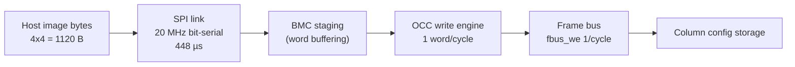

# Ethereal Fabric Performance Model

> Plan-Ref: ethereal-plan/subsystems/S02-OCC与配置体系.md (OCC) · task E0-SHL3 (`docs/ethereal-tasks.yaml`)
> Status: v0.1 · 2026-09-01 · All numbers below are produced by `ethereal-tools/tools/perf_model.py`
> (run: `python3 ethereal-tools/tools/perf_model.py`) or cited from an archived acceptance report.

---

## 1. Configuration size model

### 1.1 Bitfield budget per tile (v1.1 fabric)

The single source of truth is `frame_map.FrameMap` (`ethereal-tools/tools/frame_map.py`), which also generates
`frame_map.json` consumed by bitgen / OCC / readback. Per-tile config point widths are frozen v1
bitfields matching the RTL and specs:

| Block | Points | Width (bits) | Arithmetic |
|---|---|---:|---|
| CLB-T logic | 8 eLUT4 × 20 + 32 IIB-mux × 5 | 320 | 8×20 + 32×5 |
| Switch box (Wilton + bidir-inject) | 48 × 2-bit sel + 8 inj_en + 8 inj_dir × 2 | 120 | 4×12×2 + 8×1 + 8×2 |
| Connection block | 18 × 6-bit sel | 108 | 18×⌈log₂(4·12)⌉ = 18×6 |
| **Tile total** | | **548** | 320 + 120 + 108 |

A **frame = one column** of tiles' config bits, 32-bit-word packed, plus a **CRC16 tail word** (CRC-16/CCITT-FALSE)
appended as one extra 32-bit word (field [15:0]).

### 1.2 Frame geometry (homogeneous, R rows)

```
bits_per_col = R × 548
data_words   = ⌈bits_per_col / 32⌉
frame words  = data_words + 1            (CRC tail word)
image        = C frames × frame words × 4 bytes
```

### 1.3 Computed sizes (perf_model.py output)

| Fabric | bits/col | data words | words/frame (+CRC) | frames | Image words | Image bytes |
|---|---:|---:|---:|---:|---:|---:|
| 2×2 homogeneous | 2×548 = 1096 | 35 | 36 | 2 | 72 | **288 B** |
| 4×4 homogeneous | 4×548 = 2192 | 69 | 70 | 4 | 280 | **1120 B** |
| 2×2 hetero (col0: MEM+CLB, col1: DSP+CLB) | 846 / 894 | 27 / 28 | 28 / 29 | 2 | 57 | **228 B** |

Heterogeneous note: per C03 §1 each frame (column) carries its own length — `column_data_words(col)`; the 2×2-het reference
layout (`fabric_2x2_het.yaml` layout col0=[MEM,CLB], col1=[DSP,CLB]) gives 846-bit / 894-bit columns,
27/28 data words + CRC tail. Matches `generated/fabric_2x2_het/frame_map.json` (`per_column_data_words=[27, 28]`,
verified by perf_model.py against the tracked artifact.

## 2. OCC latency model

### 2.1 Cycle counts from the FSM (occ_top.sv, two-segment FSM, 1 word/clock streaming)

From `occ_top.sv`: after the command-accept cycle, ST_WRITE streams one word per clock while
`wdata_valid_i & wdata_ready_o`; plus 1 accept + 1 DONE cycle:

| Command | Cycles |
|---|---|
| WRITE frame (N words) | N + 2 |
| BLANK frame (N words) | N + 2 |
| READBACK frame (N words) | N + 3 (extra CMP cycle) |

Whole-image time (one OCC command per frame, sequential, no backpressure, 1 word/cycle streaming):

```
T_write(f_occ)          = Σ_cols (N_col + 2) / f_occ
T_blank(f_occ)          = Σ_cols (N_col + 2) / f_occ
T_hot_swap(f_occ)       = T_blank + T_write
T_verified(f_occ)       = T_blank + T_write + T_readback   (+1 per frame for CMP)
```

For the 4×4 homogeneous fabric (N = 70 words/frame):

| Operation | Cycles | @ 50 MHz | @ 100 MHz |
|---|---:|---:|---:|
| Full-image WRITE | 4×(70+2) = 288 | 5.76 µs | 2.88 µs |
| Hot-swap (BLANK+WRITE) | 576 | 11.52 µs | 5.76 µs |
| Verified hot-swap (+READBACK) | 868 | 17.36 µs | 8.68 µs |

## 3. Config-path latency budget vs Phase-1 targets



| Path | Budget term | Value |
|---|---|---|
| Host → SPI @ 20 MHz | 1120 B × 8 / 20 MHz | 448.0 µs |
| Host → SPI @ 10 MHz | | 896.0 µs |
| Host → SPI @ 50 MHz | | 179.2 µs |
| OCC write @ 50 MHz | 288 cyc | 5.76 µs |
| OCC hot-swap (blank+write) @ 50 MHz | 576 cyc | 11.52 µs |
| OCC verified hot-swap (+readback) @ 50 MHz | 868 cyc | 17.36 µs |

**Conclusion:** the 4×4 image (1120 B) is dominated by the transport link, not the write engine. Even
the pessimistic host path (SPI 10 MHz → 0.896 ms) beats the < 100 ms host-SPI target by > 100×;
the BMC+DMA path (~17 µs) beats the < 10 ms target by ~500×. Per-frame command
overhead (2–3 cycles/frame) is negligible until frames per image ≫ 100.

## 4. Virtual Fmax (v0 estimate)

| Circuit | CPD | Fmax | Source |
|---|---:|---:|---|
| c432 (62 eLUT4, W=12, v1.0 VPR arch) | 5.111 ns | **195.66 MHz** | report-E0-MAP2-20260725 |
| c17 (smoke) | 0.690 ns | 1449 MHz | report-E0-MAP2-20260725 |

Caveats (ASSUMPTIONs, TBD 2026-09-01):
1. **90 nm PTM delays** inherited from the VPR k4_N4 template — not silicon
   characterised; Phase-1+ must re-time against GW5 route delays.
2. **VPR arch models v1.0** (subset/disjoint SB). The production fabric is now **v1.1 Wilton + bidir-inject**
   (incr4c); Wilton mux delays are **not re-characterised in VPR** — Fmax delta unknown, expected
   small (Fs stays 3, one mux level) but unproven. Open item: re-characterise arch_ethereal.xml
   with `switch_block type=wilton` + re-run c432.
3. Het tiles: `dsp_t` MAC pipeline latency is image-selectable via mode word
   `lat_sel[1:0]` = 0–3 cycles (eth_inf_dsp_mac); cascade chains shift Fmax
   pressure to the 27×18 behavioural MAC inference (ADR-017).

## 5. Open items

- 🟡 Re-run VPR with Wilton arch; report Fmax delta (E0-MAP follow-up).
- 🟡 Post-P&R virtual Fmax on GW5 hal path (E1-PLT1 outcome).
