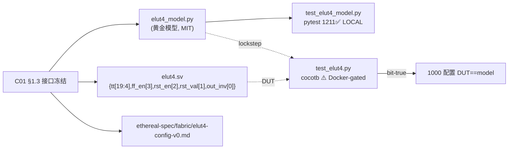

# 验收报告：E0-FAB1 — eLUT4 + 虚拟 FF（fabric 原子单元）

> 日期：2026-07-24 · 执行者：agent · 关联计划：`ethereal-plan/phases/phase-0-基础设施与仿真验证.md §1`（任务 6）· 组件设计：`ethereal-plan/components/C01-fabric-核心单元.md §1`
> DUT：`ethereal-fabric/rtl/clb/elut4.sv` · 黄金模型：`ethereal-fabric/tests/clb/elut4_model.py`

---

## 1. 本阶段实现内容

| 检查点（C01 §1.6 / phase-0 §1） | 状态 | 证据 |
|---|---|---|
| eLUT4+FF RTL（G1-clean，CERN-OHL-S-2.0 头 + Plan-Ref） | ✅ | `ethereal-fabric/rtl/clb/elut4.sv`；`make help` 显示 lint 已纳入该文件 |
| 真值表穷举（1000 组随机 tt × 16 输入） | ✅ | 黄金模型 pytest `test_elut4_model.py`：**1211 passed**（含 1000 组 comb 真值表 + 双独立法交叉核对） |
| FF 行为（ff_en / rst_en / rst_val / out_inv 全组合） | ✅ | 同 pytest：`test_ff_*`（注册/CE 保持/复位优先/复位禁用/复位值）+ invert 全过 |
| 配置位域（20-bit 位偏移冻结） | ✅ | `ethereal-spec/fabric/elut4-config-v0.md`（spec-first）+ RTL 头注释 |
| 配置写与运行隔离（配置期输出未定义，OCC 系统级防护） | ✅ | RTL 按 C01 §1.4 实现；cocotb 测试在 cfg_we 边不比对、但保持模型 vff lockstep |
| **cocotb DUT-vs-黄金模型 bit-true（1000 随机配置）** | ⚠️ | `test_elut4.py` 已编写并 `py_compile` 通过；**Docker-gated**（本地无 verilator/cocotb） |
| **`verilator --lint-only -Wall elut4.sv`** | ⚠️ | **Docker-gated**（elut4.sv 已在 `make lint` glob 内，等维护者在 ethereal-sim 内跑） |

> ⚠️ = 已交付文件、结构/语法本地已验；真实 verilator lint + cocotb bit-true 比对需 `make docker-build && make lint && make test`（在装好 Docker 的机器）。

## 2. 验证结果

**本地可验（已通过）**
- 黄金模型 pytest（`.venv/bin/pytest`，PEP-668 故建 gitignored venv）：**1211 passed in 0.48s**。
  - 200 组配置字 round-trip + 精确位偏移断言；
  - 1000 组随机 tt × 16 输入：`comb_out` 同时用「直接定义 `(tt>>vin)&1`」与「独立布尔评估 `lut4_bool`」交叉核对；
  - FF：注册、CE 保持、复位优先于 CE、复位禁用、复位值、输出取反、配置跨复位持久、500 步随机序列自洽。
- 验证过程发现并修复 1 个**测试期望 bug**（`test_ff_registers_output` 误以为 vout 反映边沿前 vff；模型与 RTL 一致——边沿后更新 vff）。模型/RTL 语义一致，bug 在测试侧。

**Docker-gated（已编写，待跑）**
- `make lint`（verilator --lint-only -Wall，含 elut4.sv）；
- `make -C ethereal-fabric/tests/clb test`（cocotb，1000 随机配置 DUT↔黄金模型 lockstep 比对）。

**新增可复用约定（固化进根 Makefile）**
- `make test-model`：本地跑纯 Python 黄金模型 pytest（自动 `find ... -name 'test_*_model.py'`），无需仿真器——这让"无 Docker 也能验证 spec"成为常态。
- 命名约定：cocotb 测试 = `test_<unit>.py`（Docker-gated）；黄金模型测试 = `test_<unit>_model.py`（本地）。

## 3. 示意图

## 4. 遇到的问题与解决

| 问题 | 根因 | 解决方案 | 搜索关键词 |
|---|---|---|---|
| `test_ff_registers_output` 失败（1210 过 1 败） | 测试误期望"边沿前 vff"；模型/RTL 边沿后更新 | 修正测试：vff 在使能边沿载入 comb，vout 跟随 vff | `cocotb registered output nonblocking same edge` |
| 系统 pip 被 PEP-668 锁 | Debian/Ubuntu 外部托管环境 | 建 gitignored `.venv` 装 pytest（不污染系统 Python） | `pip PEP 668 externally-managed venv` |
| 无 verilator/iverilog，RTL 无法本地仿真 | 环境限制 | RTL 黄金模型化：纯 Python 模型 + pytest 验 spec；DUT bit-true 留 Docker | — |

## 5. 待确认清单（ASSUMPTION）

1. **🟡 虚拟 FF 复位风格**：v1 采用**同步**低有效复位（rst_ni），仅在 ff_rst_en=1 生效、优先于 CE。待权威 SystemVerilog RTL Policy 文档链接到位后确认（README §4）；现为 ADR-017 推断友好默认值。
2. **🟡 配置位域位偏移**：按 C01 §1.3 拼接序 `{tt[15:0], ff_en, ff_rst_en, ff_rst_val, out_inv}`（[19:4]=tt…[0]=out_inv）冻结。需与帧映射生成器 `S02-P0#1` 及 OCC `E0-FAB4` 保持一致——已在 `ethereal-spec/fabric/elut4-config-v0.md` 落 spec。
3. **🟢 v2 真值表存储**：v1 = FF+16:1 mux；v2 切 `eth_inf_lutram`（分布式 RAM 推断）待 C13 §6 推断验证（Phase 1）。

## 6. 下一阶段需要做的内容

| 任务 ID | 内容 | 依赖 |
|---|---|---|
| **E0-FAB2** | CLB-T cluster（N=8 eLUT4 + Clos 两级 IIB，I=26），参数化；连通性穷举 + UNOPTFLAT 零报告 | E0-FAB1（本任务） |
| （维护者） | Docker 机器跑 `make docker-build && make lint && make test`，回填 elut4 的 verilator lint + cocotb bit-true 结果 | E0-INF3 |
| S02-P0#1 | 帧映射生成脚本（消费本任务冻结的 eLUT4 位域 + 后续 CLB/IIB 位域） | E0-FAB3 |
