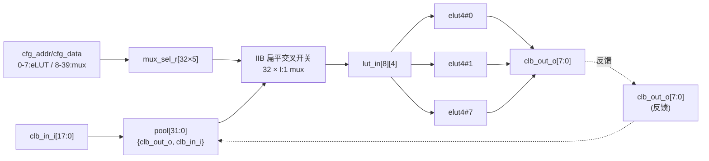

# 验收报告：E0-FAB2 — CLB-T cluster（fabric 布局单元）

> 日期：2026-07-24 · 执行者：agent · 关联计划：`ethereal-plan/phases/phase-0-基础设施与仿真验证.md §1`（任务 7）· 组件设计：`ethereal-plan/components/C01-fabric-核心单元.md §2`
> DUT：`ethereal-fabric/rtl/clb/clb_t.sv` · 黄金模型：`ethereal-fabric/tests/clb/clb_t_model.py`（复用 `elut4_model.Elut4`）

---

## 1. 本阶段实现内容

| 检查点（phase-0 §1 / C01 §2.6） | 状态 | 证据 |
|---|---|---|
| CLB-T RTL（参数化 N=8/K=4/EXT=18，CERN-OHL-S + Plan-Ref C01 §2） | ✅ | `ethereal-fabric/rtl/clb/clb_t.sv`；`make help` 显示 lint 已纳入（elut4+clb_t+counter） |
| **连通性穷举**（任一 cluster 输入 → 任一 LUT 输入可达） | ✅ | pytest `test_clb_t_model.py::test_connectivity_exhaustion`：8×4×26 = **832 条路由全通**（外部 0..17 + 反馈 18..25） |
| 参数推导 + 配置地址解码（0-7=eLUT，8-39=IIB mux） | ✅ | `test_params_v1` + `test_config_decode_elut_vs_mux` + `test_route_helper` |
| 反馈路由 + 注册反馈电路（自翻转 FF） | ✅ | `test_toggle_ff_feedback`：LUT0=NOT(自身反馈)、ff_en=1 → 复位后 1→0→1→0… 序列正确 |
| 随机无环配置 settle 收敛 + 输出纯函数性 | ✅ | `test_random_acyclic_settles_and_stable`：200 组（全外部输入、ff_en=0）settle 收敛、二次求值一致、与逐 LUT 重算交叉核对 |
| 组合环检测（settle 报错而非静默误算） | ✅ | `test_comb_loop_detected`：LUT0 组合自反馈（ff_en=0）→ `RuntimeError` |
| **UNOPTFLAT 零报告** | ⚠️ | RTL 已对反馈区施加 scoped `lint_off UNOPTFLAT` 豁免（C01 §2.4 problem 2）；**Docker-gated**——待 `verilator --lint-only -Wall` 确认零报告 |
| **cocotb DUT-vs-黄金模型 bit-true** | ⚠️ | `test_clb_t.py`（200 周期无环配置 lockstep）已编写并 `py_compile` 通过；**Docker-gated** |

> ⚠️ = 已交付文件、本地可验项已过；真实 verilator lint + cocotb bit-true 比对需 `make docker-build && make lint && make test`（Docker 机器）。

## 2. 验证结果

**本地可验（已通过）**：`make test-model` → **1218 passed**（elut4 1211 + clb_t 7 个测试函数，含 832 条连通性断言）。

**关键设计决策（G6，已冻结为 v1 + ASSUMPTION 待确认）**
- **IIB = 扁平全输入交叉开关**（flat full-input crossbar）：N·K=32 个 LUT 输入 mux，每个 I:1（I=26）可选任意 cluster 输入。理由：C01 §2.3/§2.4 的配置核账（"32 个选择点 × 6 bit"、无第一级 mux 配置）**只与扁平交叉开关自洽**；"两级 Clos 26→16→4" 是 §2.5 的 **v2 面积优化**。扁平交叉开关是 Clos 连通性的**超集**（满足"任一输入→任一 LUT 输入"），且 cfg 接口不变 → 后续切 Clos 只改 mux 内部（低返工可逆）。详见 `ethereal-spec/fabric/clb-t-config-v0.md`。
- **反馈组合环 + UNOPTFLAT 豁免**：N 条反馈构成结构性组合环（pool→LUT 输入→eLUT→clb_out_o→pool），这是**设计意图**（虚拟锁存器/组合环是用户自由）。RTL 在 pool/IIB/eLUT 区施加 `/* verilator lint_off UNOPTFLAT */` 局部豁免（C01 §2.4 problem 2）→ 预期 verilator 零 UNOPTFLAT 报告（待 Docker 确认）。
- **CLB 级 FF CE**：eLUT 的 cfg_ce_i 在 CLB 顶层恒接 1'b1（冻结 §2.3 接口无 CLB 级 CE）；逐位 CE 路由延后。
- **mux 选择位宽**：C01"低 6 bit"是字段预算；v1 用 SELW=$clog2(POOL)=5 bit（I=26，POOL=32），第 6 位保留。

## 3. 示意图

## 4. 遇到的问题与解决

| 问题 | 根因 | 解决方案 | 搜索关键词 |
|---|---|---|---|
| C01 §2.2"Clos 两级"与冻结 cfg 接口（32 mux 点、无第一级配置）不一致 | 文档方法学描述与冻结接口存在张力 | v1 取**扁平交叉开关**（唯一接口自洽读法 + Clos 超集 + 低返工可逆），Clos 列为 v2；落 spec + ASSUMPTION 待确认 | `FPGA CLB input interconnect block crossbar vs Clos` |
| 反馈组合环 → Verilator UNOPTFLAT | N 条 vout 回送 IIB | scoped `lint_off UNOPTFLAT` 豁免（C01 §2.4 明示对策） | `verilator UNOPTFLAT combinational feedback FPGA fabric` |
| 黄金模型需处理组合反馈的 settle | 反馈使输出非逐拍自明 | 固定点迭代 settle（无环配置收敛，真组合环 raise）；测试仅用无环配置 + 显式组合环用例 | `cycle accurate model combinational feedback fixed point` |
| 单 Makefile 跑两个 cocotb 测试（elut4/clb_t） | TOPLEVEL/MODULE 固定 | 改为 `?=` 可覆盖；VERILOG_SOURCES 含两个 .sv；文档化 `make ... TOPLEVEL=clb_t MODULE=test_clb_t` | `cocotb multiple tests one makefile toplevel override` |

## 5. 待确认清单（ASSUMPTION）

1. **🟡 IIB v1 = 扁平交叉开关 vs 真两级 Clos**：已取扁平（接口自洽 + 低返工可逆）。请确认；若坚持 v1 即 Clos，需补第一级 mux 配置（cfg 接口需扩）。
2. **🟡 CLB 级 FF CE**：v1 恒接 1（冻结接口无 CLB CE）。逐位 CE 是否需在 v1 暴露？
3. **🟢 UNOPTFLAT 零报告**：豁免已施加，待 `verilator --lint-only -Wall`（Docker）确认；黄金模型已验证无环配置行为正确。
4. **🟢 Clos/I 参数**：N=8/I=26 待 E0-MAP2 VPR 实验复核（RTL 已参数化，易调）。

## 6. 下一阶段需要做的内容

| 任务 ID | 内容 | 依赖 |
|---|---|---|
| **E0-FAB3** | SB + 通道互联（W=12，两源轨道优先），4×4 cluster 网格例化无组合环 | E0-FAB2（本任务） |
| S02-P0#1 | 帧映射生成脚本（消费 eLUT4 + CLB-T 冻结位域） | E0-FAB3 |
| （维护者） | Docker 机器跑 `make lint`（含 clb_t.sv）+ clb_t cocotb，回填结果 | E0-INF3 |
