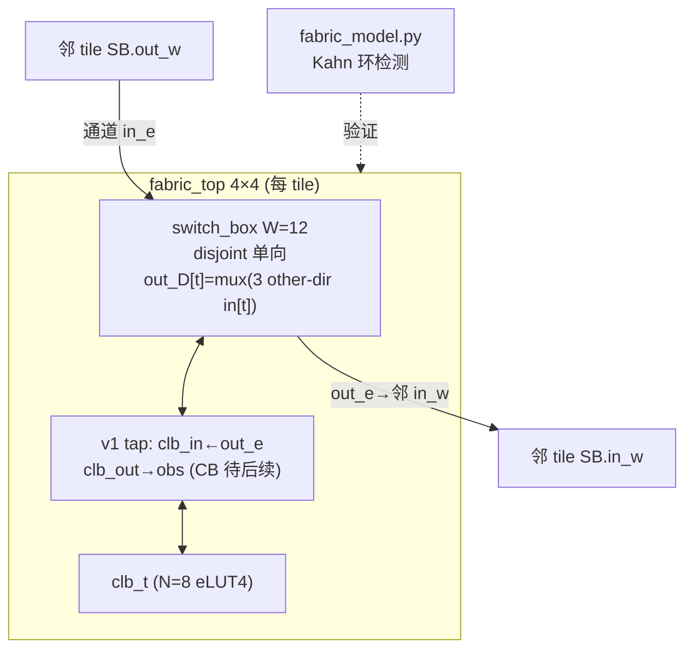

# 验收报告：E0-FAB3 — SB + 通道互联（4×4 fabric 网格）

> 日期：2026-07-24 · 执行者：agent（switch_box 经 sub-agent，fabric_top/模型自建）· 关联计划：`ethereal-plan/phases/phase-0-基础设施与仿真验证.md §1`（任务 8）· 组件设计：`ethereal-plan/components/C01-fabric-核心单元.md §3 §5`
> RTL：`ethereal-fabric/rtl/interconnect/{switch_box,fabric_top}.sv` · 模型：`ethereal-fabric/tests/interconnect/{sb_model,fabric_model}.py`

---

## 1. 本阶段实现内容

| 检查点（phase-0 §1 / C01 §3.5/§3.6） | 状态 | 证据 |
|---|---|---|
| switch_box RTL（W=12，disjoint 单向，UNOPTFLAT 豁免，G1-clean，CERN-OHL-S + Plan-Ref C01 §3） | ✅ | `switch_box.sv`；lint glob 已纳入；sub-agent 自验 651 例 |
| fabric_top RTL（参数化 R×C，默认 4×4，clb_t+switch_box+通道，UNOPTFLAT 豁免） | ✅ | `fabric_top.sv`；lint glob 已纳入 |
| **4×4 网格例化** | ✅ | `fabric_top.sv` 默认 R=C=4 例化 16 tile（clb+SB）；cocotb `test_fabric_top.py` 证明可 elaborate + clock（**Docker-gated**） |
| **无组合环（default config）** | ✅ | `fabric_model.py` Kahn 环检测：4×4（及 1×1/2×2/2×3/3×5）default 全 **acyclic** |
| 拓扑自洽（无悬空、驱动源数合规） | ✅ | `test_topology_self_consistent` + `test_graph_nodes_well_formed`；通道边数 = 576（4×4）精确核对 |
| 环检测 + 断环 | ✅ | `test_cyclic_ring_detected`（4-tile 环→检出）+ `test_ring_breaks_when_one_mux_disconnects`（断一 mux→acyclic） |
| **verilator --lint-only -Wall（5 个 RTL）** | ⚠️ | **Docker-gated**（含 UNOPTFLAT 豁免确认） |
| **cocotb DUT（fabric_top elaborate + clock）** | ⚠️ | **Docker-gated** |

> ⚠️ = 已交付文件、本地可验项已过；真实 verilator lint + cocotb 需 `make docker-build && make lint && make test`。

## 2. 验证结果

**本地可验（已通过）**：`make test-model` → **1876 passed**（elut4 1211 + clb_t 7 + sb 651 + fabric 7）。
- SB：48 addr 解码 round-trip + 每 (dir,track,sel) 源正确性（432 例）+ 断连 + `dependency_edges` 形状。
- Fabric：拓扑自洽 + 通道边精确计数 + default 各尺寸 acyclic + 无环路由保持无环 + 4-tile 环检出 + 断环恢复。

**关键设计决策（G6，已冻结为 v1 + ASSUMPTION 待确认）**
1. **SB 拓扑 = disjoint 单向（v1 参考）**：C01 §3.3 problem 1 + §6 #4 明示"SB 拓扑表最终参数待 S03 VPR 实验输出"。cfg 接口（`DIR*W+t`、2-bit sel）与模型 `dependency_edges()` 拓扑无关 → VPR 后换 Wilton/自定义只改 per-mux 源映射（低返工）。
2. **"无组合环"语义**：任何可布 fabric 的 mux 结构上都允许环（→ UNOPTFLAT，同 CLB 反馈族，C01 §2.4）。acceptance = **default/未配置网格无功能性组合环**，经图级 Kahn 环检测验证；用户配置致环由 mapper(S10) 处理。结构性 UNOPTFLAT 经 scoped 豁免（Docker-gated 确认零报告）。
3. **CLB↔channel = v1 最小 tap**：`clb_in` 读本 tile 的 `out_e` 轨、`clb_out` 可观测。**完整可布 CB**（`clb_out→track` 注入）是后续设计步骤（frame-map S02-P0#1 + OCC E0-FAB4 + VPR E0-MAP2）；可布率是 VPR 测试（C01 §3.5），非 E0-FAB3 范围。

## 3. 示意图

## 4. 遇到的问题与解决

| 问题 | 根因 | 解决方案 | 搜索关键词 |
|---|---|---|---|
| SB 拓扑需 VPR 验证才能冻结 | C01 §3.3/§6 明示 VPR-dependent | v1 取 disjoint 参考（VPR-retunable，接口无关），落 spec + ASSUMPTION | `VPR switch block disjoint vs Wilton routability` |
| 可布 fabric 的 mux 结构性组合环 | 任何可布 fabric 允许环 | 图级 Kahn 环检测验证 default 无环；scoped UNOPTFLAT 豁免（同 CLB §2.4） | `verilator UNOPTFLAT FPGA routing loop waiver` |
| sub-agent 的 SB 纯 track-to-track，无 CLB-pin 源 | CB 架构未在 SB 合约中 | v1 用最小 tap（clb_in 读轨）；完整 CB（clb_out→track 注入）列为后续设计项 + G6 flag | `FPGA connection block CLB output track injection multi-drive` |
| 多 driver 风险（clb_out 与 SB 同驱 out_*） | SB 驱动全部 out_* | v1 tap 只读（clb_in←out_e），clb_out 不驱动 routing → 无 multi-drive | `FPGA multi-driver channel track` |

## 5. 待确认清单（ASSUMPTION）

1. **🟡 SB 拓扑**：disjoint 单向（v1 参考）待 E0-MAP2 VPR 验证后冻结/替换。
2. **🟡 完整 CB 设计**：`clb_out → track` 注入（需 SB 扩展 CLB-pin 源 或 独立 CB + 轨分区避 multi-drive）——影响可布性，是 E0-FAB3 之后的架构项。是否现在立项 `S02-P0#1`/CB 子任务？
3. **🟢 UNOPTFLAT 零报告**：scoped 豁免已施加，待 verilator（Docker）确认。
4. **🟢 长线（length>1 轨）**：v3（C01 §3.4），大 fabric 必做。

## 6. 下一阶段需要做的内容

| 任务 ID | 内容 | 依赖 |
|---|---|---|
| **S02-P0#1** | 帧映射生成脚本（消费 eLUT4+CLB-T+SB 冻结位域 + 拓扑表） | E0-FAB3（本任务） |
| **E0-FAB4** | OCC v0（WRITE/BLANK/READBACK，帧译码 → 列/tile 配置） | E0-FAB3 |
| （架构项） | 完整 CB（clb_out→track 注入）设计 + 立项 | E0-FAB3 + VPR |
| （维护者） | Docker 跑 `make lint`（5 RTL，确认 UNOPTFLAT 零报告）+ fabric_top cocotb | E0-INF3 |
