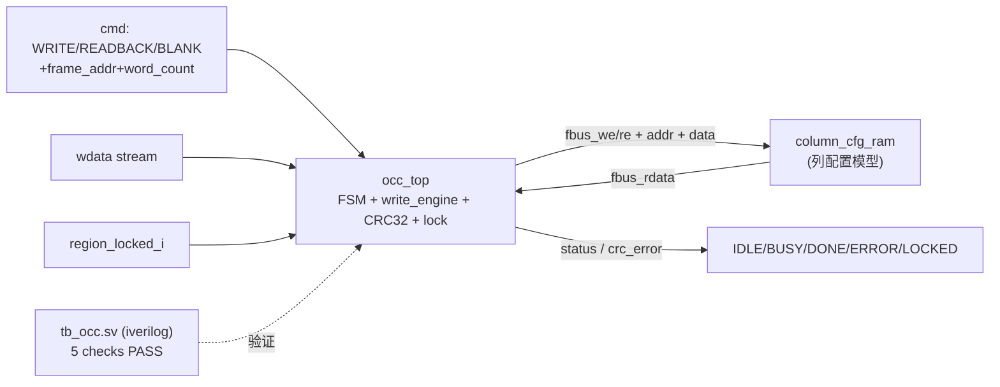

# 验收报告：E0-FAB4 — OCC v0（Overlay Configuration Controller）

> 日期：2026-07-24 · 执行者：agent（occ_top/模型/TB 经 sub-agent，本人复核）· 关联计划：`ethereal-plan/phases/phase-0-基础设施与仿真验证.md §1`（任务 10）· 组件设计：`ethereal-plan/components/C03-OCC组件.md §2`
> RTL：`ethereal-fabric/rtl/occ/occ_top.sv` · 模型/TB：`ethereal-fabric/tests/occ/{column_cfg_ram,tb_occ}.sv`

---

## 1. 本阶段实现内容

| 检查点（phase-0 §1 / C03 §2） | 状态 | 证据 |
|---|---|---|
| OCC v0 RTL（命令译码 + write_engine + 帧总线 + CRC32 + lock，G1-clean，CERN-OHL-S + Plan-Ref C03 §2） | ✅ | `occ_top.sv`；`make lint` 严格 `-Wall` 零警告（本人复核） |
| write_engine FSM（IDLE→WRITE/BLANK/READBACK→CMP，typedef enum 两段式，C03 §2.2） | ✅ | 5 状态；`make lint` 通过 |
| **WRITE→READBACK 配置成功（CRC 校验通过）** | ✅ | tb_occ check 1：写 8 字帧→读回→status=DONE、crc_error=0 |
| CRC 篡改检出（数据字翻转） | ✅ | tb_occ check 2：status=ERROR、crc_error=1（sticky） |
| BLANK（零帧写入，blank-before-write 基础） | ✅ | tb_occ check 3：8 字全清零、status=DONE |
| LOCK 拒绝写（region 锁定→WRITE 被拒，RAM 不变） | ✅ | tb_occ check 4：status=LOCKED、cmd_ready=0、RAM 字节不变 |
| `make lint` / `make test-sv` 集成 | ✅ | lint clean-loop 现覆盖 occ_top；test-sv 含 tb_occ（4 TB 全 PASS） |
| **加法器/计数器样例电路运行** | ⚠️ 顺延 | v0 验证"配置通路正确"（写+读回+CRC+blank+lock）；**运行实际电路需可布 CB**（fabric_top 当前是最小 tap，完整 CB 为延后架构项） |

> ⚠️ = v0 范围：OCC 配置通路已验证；运行加法器/计数器需 routable fabric（完整 CB），顺延到 CB 落地后。

## 2. 验证结果

**本地可验（已通过，OSS-CAD）**：
- `verilator --lint-only -Wall --top-module occ_top` → **零警告、零豁免**（rc 0）。occ_top 是纯控制逻辑，无组合环 → 严格 `-Wall`（不需 `-Wno-UNOPTFLAT`）。
- `iverilog -g2012` + `vvp` → `tb_occ` **TEST PASSED**（5 项检查 + 复位恢复）。本人重跑复核。

**FSM（C03 §2.2，v0 简化）**：`IDLE → WRITE/BLANK/READBACK → CMP → IDLE`。
- WRITE/BLANK：流式写帧总线（`fbus_we`，addr 自增），逐字更新 CRC32；字数到 → 存 `write_crc_r` → DONE。
- READBACK：`fbus_re` 读回，逐字更新 CRC32 → CMP 比 `write_crc_r` → DONE/ERROR（`crc_error_o` sticky）。
- LOCK：`region_locked_i` 时 WRITE/BLANK → status=LOCKED、拒绝（cmd_ready=0）。
- CRC32：以太网多项式 0x04C11DB7，init 0xFFFFFFFF，1 字/拍流式。

**v0 简化与延后（ASSUMPTION）**：
- READBACK 目标为组合读 RAM（`column_cfg_ram`）；寄存器读 RAM 需 1 拍流水（v1，C03 §4.2）。
- "配置成功"在 v0 = **配置通路正确**（写+读回+CRC+blank+lock 全验）；**运行加法器/计数器需 routable CB**（fabric_top 当前 CLB↔channel 仅最小 tap，完整 CB 待立项）。
- OCC↔fabric_top 的列/帧→瓦片地址翻译（C03 帧模型 vs fabric_top 扁平 cfg）：v0 用 `column_cfg_ram` 模型代替真列控制器；真集成在 Shell v0（E0-SHL2）/ 列控制器落地时做。

## 3. 示意图

## 4. 遇到的问题与解决

| 问题 | 根因 | 解决方案 | 搜索关键词 |
|---|---|---|---|
| `make lint` 未真正 lint occ_top | clean 段是逐模块硬编码调用，加 RTL_CLEAN 无效 | 重构为 `for f in $(RTL_CLEAN)` 循环（从文件名派生 --top-module），可扩展 | `makefile loop verilator lint per file top-module` |
| 运行加法器/计数器不可行 | fabric_top 无 routable CB（最小 tap） | v0 验证配置通路；运行电路顺延到 CB 落地 | `FPGA fabric connection block routability` |
| OCC↔fabric 帧模型 vs 扁平 cfg | C03 列级帧 vs fabric_top 每瓦片 cfg | v0 用 column_cfg_ram 模型；真翻译留列控制器/Shell v0 | `FPGA frame config column controller` |
| TB 时序：crc_error sticky 比 status=ERROR 晚 1 拍 | sticky 寄存器在 CMP 末拍锁存 | TB 注释 + 次拍采样（RTL 符合 spec） | `verilator sticky status register timing testbench` |

## 5. 待确认清单（ASSUMPTION）

1. **🟡 OCC↔fabric 集成**：v0 用 column_cfg_ram 模型。真集成（列控制器把帧写分发到 tile）在 Shell v0（E0-SHL2）或独立列控制器任务。是否现在立项列控制器？
2. **🟡 完整 CB**：运行加法器/计数器（phase-0 验收的"样例电路运行"）需 routable fabric（clb_out→track 注入）。是否立项 CB 任务以解锁端到端电路演示？
3. **🟢 READBACK 寄存器读**：v0 组合读；v1 加 1 拍流水（C03 §4.2）。
4. **🟢 word_count=0**：v0 优雅处理（立即 DONE），非支持用例。

## 6. 下一阶段需要做的内容

| 任务 ID | 内容 | 依赖 |
|---|---|---|
| **E0-FAB5** | blank-before-write + LOCK（邻区无毛刺断言；LOCK 写被拒——LOCK 已在 occ_top，E0-FAB5 补 region 级 blank 时序 + 邻区无毛刺 SVA） | E0-FAB4 |
| （架构项）| 完整 CB（clb_out→track 注入）解锁端到端电路运行 | E0-FAB3 + VPR |
| E0-MAP1..3 | Yosys techlib + VPR arch + bitgen（消费 frame_map） | S02-P0#1 + E0-FAB4 |

> 本阶段交付 OCC v0（命令 FSM + write_engine + 帧总线 + CRC32 + lock），经 `make lint`（零警告）+ `tb_occ`（5 检查 PASS）验证配置通路正确；为端到端配置写入奠定控制核心。
