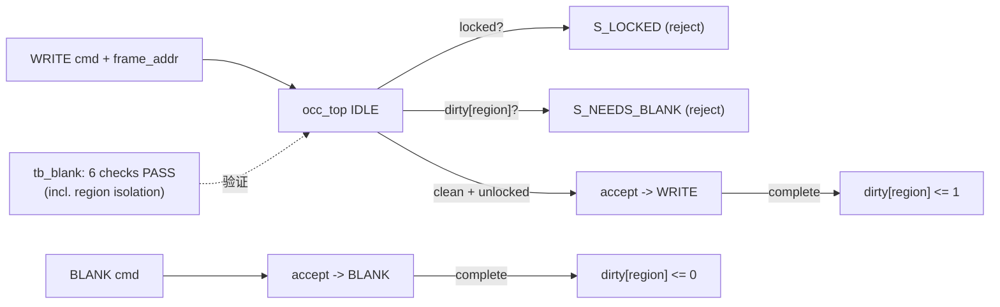

# 验收报告：E0-FAB5 — blank-before-write + LOCK

> 日期：2026-07-24 · 执行者：agent（occ_top 自改；tb_blank 经 sub-agent，本人复核）· 关联计划：`ethereal-plan/phases/phase-0-基础设施与仿真验证.md §1`（任务 11）· 组件设计：`ethereal-plan/components/C03-OCC组件.md §3 §5`
> RTL：`ethereal-fabric/rtl/occ/occ_top.sv`（扩展）· TB：`ethereal-fabric/tests/occ/{tb_occ,tb_blank}.sv`

---

## 1. 本阶段实现内容

| 检查点（phase-0 §1 / C03 §3 §5） | 状态 | 证据 |
|---|---|---|
| blank-before-write 硬件强制（C03 §3 红线） | ✅ | occ_top：per-region `dirty_r`；WRITE 到 dirty region → `S_NEEDS_BLANK` 拒绝；BLANK 清 dirty；WRITE 完成置 dirty；reset 全 clean |
| **LOCK 写被拒** | ✅ | occ_top `region_locked_i` → `S_LOCKED`（优先于 dirty 检查）；tb_occ/tb_blank 验证 |
| **邻区无毛刺断言（配置级）** | ✅ | tb_blank check 5：写 region0 时 region1 配置存储（0x1xxx）**完全不变**（region 隔离） |
| 写→重写被拒 → blank → 再写 OK | ✅ | tb_blank checks 1-4 |
| `make lint` / `make test-sv` 集成 | ✅ | occ_top 仍 lint-clean（strict -Wall，rc 0）；test-sv 现 5 TB（含 tb_blank）全 PASS；tb_occ 回归 PASS |
| **邻区 fabric 输出无毛刺（运行级）** | ⚠️ 顺延 | 需 fabric_top 的 region 隔离门（region 划分 + 可布 CB），延后；v0 验证配置存储级隔离 |

> ⚠️ = "邻区无毛刺"在 v0 验证于**配置存储级**（region 隔离：写一 region 不触另一 region 的配置）；fabric 输出级毛刺防护需 region 隔离硬件，延后。

## 2. 验证结果

**本地可验（OSS-CAD，已通过，本人复核）**：
- `verilator --lint-only -Wall --top-module occ_top` → **零警告**（rc 0）。E0-FAB5 扩展（dirty 位图 + region_id + S_NEEDS_BLANK）未引入 lint 问题。
- `tb_occ`（回归）→ **TEST PASSED**（E0-FAB4 的 5 检查仍过；check3 改用 region1 地址以适配 dirty 规则）。
- `tb_blank`（E0-FAB5）→ **TEST PASSED**（6 检查：首写 clean→DONE；重写 dirty→NEEDS_BLANK+RAM 不变；BLANK 清零；blank 后再写 OK；**region 隔离**（写 R0 不触 R1）+ R0 dirty 不阻 R1；LOCK 优先于 dirty）。

**关键设计（C03 §3 §5）**
- **blank-before-write 硬件强制**：`dirty_r[15:0]`（16 region），region_id = `frame_addr[15:12]`。WRITE 到 dirty region → `S_NEEDS_BLANK`(=5)，cmd_ready 不脉冲、FSM 留 IDLE、RAM 不变。BLANK 完成清 dirty；WRITE 完成置 dirty；reset 全 clean（首写总允许）。这是 FABulous "any region rewrite must blank-before-write" 红线的硬件保证。
- **LOCK 优先**：IDLE 的 WRITE 分支先查 `region_locked_i`（→LOCKED）再查 dirty（→NEEDS_BLANK）。READBACK 不查锁/不查 dirty（非破坏）。
- **region 隔离**：frame_addr 的 region_id 把各 region 配置路由到不重叠地址空间（R0=0x0xxx, R1=0x1xxx）；写 R0 只驱动 0x0100..0x0107，结构性不触 R1。tb_blank 实测确认。

**v0 简化与延后（ASSUMPTION）**
- "邻区无毛刺" v0 = **配置存储级隔离**（OCC 写一 region 不改另一 region 配置）。**fabric 输出级**毛刺防护（reconfig 时邻区运行中 region 输出无脉冲）需 fabric_top 的 region 隔离门 + region 划分——延后到 region/CB 工作。
- dirty 位图为 16 region（frame_addr top-4-bit）；足够 v0。

## 3. 示意图

## 4. 遇到的问题与解决

| 问题 | 根因 | 解决方案 | 搜索关键词 |
|---|---|---|---|
| tb_occ 回归失败（重写 dirty region 被拒） | E0-FAB5 dirty 规则使 check3 的重写被拒 | check3 改用 fresh region1（0x1200）地址 | `FPGA config region dirty blank-before-write test` |
| region1 地址 0x1200 RAM 越界 | tb_occ 覆盖 `.DEPTH(4096)`，0x1200=4608 越界 → X | tb_occ `.DEPTH(8192)`；column_cfg_ram 默认 8192 | `iverilog out of bounds array mem depth` |
| 注释含 `Verilator` 前缀触发 BADVLTPRAGMA | linter 把 `// Verilator...` 当元注释 | 注释不以 Verilator 起首（之前已修，本次沿用） | `verilator BADVLTPRAGMA comment` |

## 5. 待确认清单（ASSUMPTION）

1. **🟡 fabric 输出级邻区无毛刺**：需 fabric_top region 隔离门（reconfig 时邻区输出无脉冲）+ region 划分。是否立项 region/CB 任务以解锁？
2. **🟢 dirty 位图 16 region**：v0 够用；大 fabric 再扩。
3. **🟢 LOCK 优先于 dirty**：合理（锁更强）；确认。

## 6. 下一阶段需要做的内容

| 任务 ID | 内容 | 依赖 |
|---|---|---|
| E0-FAB6 | fabric-gen v0（fabric.yaml → RTL + frame_map.json，调 frame_map 模块） | E0-FAB3 + S02-P0#1 |
| （架构项）| region 划分 + 可布 CB（解锁 fabric 输出级隔离 + 端到端电路运行） | E0-FAB3 + VPR |
| E0-MAP1..3 | Yosys techlib + VPR arch + bitgen | S02-P0#1 + E0-FAB4 |

> 本阶段把 C03 blank-before-write 红线从"协议级（BMC）"提升为**硬件强制**（occ_top dirty + NEEDS_BLANK），并验证 LOCK + region 配置隔离；fabric 输出级毛刺防护随 region/CB 延后。
