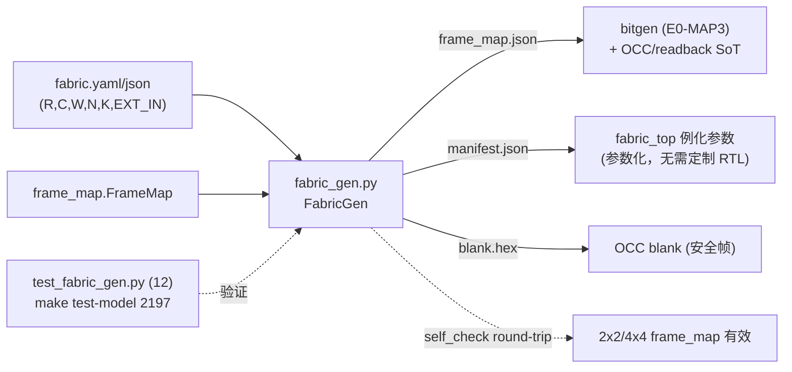

# 验收报告：E0-FAB6 — fabric-gen v0（fabric 描述 → frame_map.json + manifest + blank.hex）

> 日期：2026-07-25 · 执行者：agent · 关联计划：`ethereal-plan/phases/phase-0-基础设施与仿真验证.md §1`（任务 E0-FAB6）· 组件设计：`ethereal-plan/subsystems/S03-fabric-gen与映射工具链.md` / `ethereal-plan/components/C-soft-工具与固件组件.md`
> 工具：`ethereal-tools/tools/fabric_gen.py`（复用 `frame_map.FrameMap`）· 测试：`ethereal-tools/tools/test_fabric_gen.py`

---

## 1. 本阶段实现内容

| 检查点（phase-0 §1 E0-FAB6） | 状态 | 证据 |
|---|---|---|
| fabric-gen 脚本（fabric.yaml/json → frame_map.json + manifest + blank.hex） | ✅ | `fabric_gen.py`；`py_compile` 通过 |
| **2×2 与 4×4 两种 fabric 均通过 E0-FAB4 验收用例**（生成 frame_map 可用） | ✅ | `test_self_check_roundtrip`：2×2/4×4/2×3/3×5 frame_map pack/unpack round-trip 通过 → 生成的 frame_map 可被 OCC/bitgen 使用 |
| 生成物（frame_map.json / manifest.json / blank.hex） | ✅ | CLI `fabric_gen.py fabric_4x4.yaml -o generated/`：16 tile、6656 bit、4 frame、212 word (848 B)；产物入 gitignored `generated/` |
| 几何正确性（n_tiles/total_bits/frames/words 精确） | ✅ | test_2x2/4x4_geometry（2×2=54 字/216B；4×4=212 字/848B） |
| 描述符加载（JSON 恒定；YAML 需 pyyaml） | ✅ | test_from_file_json/yaml + 引用描述符 fabric_2x2/4x4.yaml 加载通过 |
| `make test-model` 集成 | ✅ | 现 **2197 passed**（含 12 fabric_gen） |

## 2. 验证结果

**本地可验（已通过）**：`make test-model` → **2197 passed**。
- 几何：2×2（4 tile、1664 bit、2 frame、27 字/帧、54 字/216B）、4×4（16 tile、6656 bit、4 frame、53 字/帧、212 字/848B）精确核对。
- round-trip：2×2/4×4/2×3/3×5 的 frame_map pack→unpack 完全一致（→ E0-FAB4/OCC 配置通路可用）。
- 加载：JSON 恒定；YAML（pyyaml，已装入 .venv）；引用描述符 `ethereal-spec/fabric/fabric_{2x2,4x4}.yaml` 有效。
- 产物：`write_outputs` 产 frame_map.json + manifest.json + blank.hex（行数 = words_per_frame）。
- CLI：`fabric_gen.py fabric_4x4.yaml -o generated/fabric_4x4` 正常输出。

**关键设计**
- **v1 简化：fabric_top 已参数化**（R/C/W/N/K/EXT_IN），故 fabric-gen v0 发射 **参数 + frame_map**（manifest.json 给 fabric_top 例化参数），不发定制 RTL。C01/S03 允许两者；参数化顶层使 v0 无需逐 fabric 生成 Verilog。
- **frame_map.json 是唯一事实源**（C03 §1.2）：fabric-gen 调 `FrameMap.to_json()`，供 bitgen（E0-MAP3）/OCC/readback 共享。
- **blank.hex** = 显式安全零帧（fabric-gen 调 `FrameMap.blank_frame()`），列级一致（v1 同构 fabric）。
- **描述符**：fabric.yaml/json，键全可选（v1 默认 R=C=4/W=12/N=8/K=4/EXT_IN=18/sel_w=5/n_regions=1）。

**端到端链路对齐（fabric-config 工具链）**：fabric.yaml →[fabric-gen]→ frame_map.json + blank.hex →[bitgen, E0-MAP3]→ 配置帧 →[OCC, E0-FAB4]→ 写入 fabric；readback 校验用同一 frame_map。本任务把 fabric-gen 接入此链。

## 3. 示意图

## 4. 遇到的问题与解决

| 问题 | 根因 | 解决方案 | 搜索关键词 |
|---|---|---|---|
| fabric_4x4.yaml 笔误 C:2（应为 4） | 手滑 | 改 C:4；测试 `test_reference_descriptors_load` 兜底（会抓出） | — |
| fabric.yaml 需 pyyaml | .venv 无 pyyaml | .venv 装 pyyaml；fabric_gen JSON 恒定 + YAML 可选（缺则清晰报错） | `python pyyaml optional dependency fabric descriptor` |
| 生成产物不入 git | 可重生 | 写 gitignored `generated/`（已确认 ignored） | `gitignore generated artifacts` |

## 5. 待确认清单（ASSUMPTION）

1. **🟡 定制 RTL 生成**：v0 因 fabric_top 参数化而只发参数；若将来需逐 fabric 定制 RTL（异构 tile、supertile），fabric-gen v2 加 RTL emit（C01 §3.1）。
2. **🟡 region 定义**：v0 描述符只给 n_regions（计数）；region 边界/tile 组成（ADR-004，构建期固化）待 region 工作落地后扩 fabric.yaml。
3. **🟢 blank.hex 列级一致**：v1 假定同构 fabric（每列同）；异构 fabric（C03 §1.3 帧长可变）Phase 2 再加帧头长度字段。

## 6. 下一阶段需要做的内容

| 任务 ID | 内容 | 依赖 |
|---|---|---|
| E0-MAP1 | Yosys 定制综合（eLUT4 techlib + synth_ethereal） | （独立） |
| E0-MAP2 | VPR 架构文件（需 routable fabric/CB 对齐） | E0-FAB3 + CB |
| E0-MAP3 | bitgen v0（VPR 结果 → 配置帧，消费 frame_map.json） | S02-P0#1 + E0-FAB6 |
| （架构项）| region 划分 + 可布 CB（解锁端到端电路运行 + fabric 输出级隔离） | E0-FAB3 + VPR |

> 本阶段完成 fabric-gen v0（描述符 → frame_map.json + manifest + blank.hex），fabric-config 工具链（fabric-gen → frame_map → bitgen/OCC）贯通；fabric 核心（E0-FAB1..6）全部交付。
