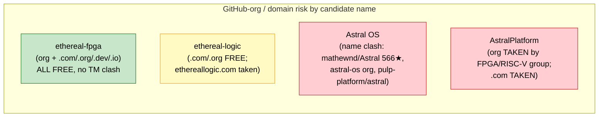
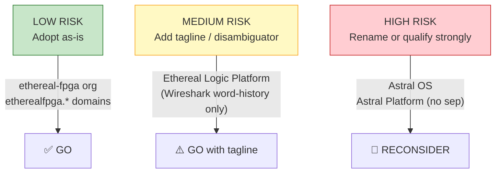

# Acceptance Report — E0-INF4: Trademark / Name Availability Check
> Date: 2026-07-24 · Executor: agent · Plan-Ref: ethereal-plan/phases/phase-0-基础设施与仿真验证.md §1 (E0-INF4)
> Scope: name / trademark / domain / GitHub-namespace availability for the project names
> "Ethereal Logic Platform" + "Astral OS" + planned GitHub org `ethereal-fpga`.
> Method: web search + direct page fetches + WHOIS lookups (whois.com / aliyun wanwang).
> Caveat: this is a **non-authoritative** scout. A formal USPTO/EUIPO TESS clearance and
> a trademark attorney opinion were NOT performed (see §5).

---

## 1. 本阶段实现内容 (Checkpoints)

| Checkpoint | Status | Evidence (one-line) |
| --- | --- | --- |
| GitHub org `ethereal-fpga` availability | ✅ | `github.com/ethereal-fpga` returns HTTP 404 → **org is free** |
| GitHub collisions for `ethereal-*` / `astral-*` names | ⚠️ | `Ethereal-OS` (Android ROM), `mathewnd/Astral` (x86-64 OS, 566★), `astral-os` (MINIX3 OS), `AstralPlatform` (FPGA/RISC-V org!) all exist |
| Domain availability (5 candidate names × 4 TLDs) | ⚠️ | `etherealfpga.*` and `ethereal-logic.*` mostly free; `astralplatform.com` & `ethereallogic.com` are **TAKEN** |
| Prior-art / naming collisions (Wireshark, Astral.sh, FPGA-overlay projects) | ⚠️ | "Ethereal"=former Wireshark name (2006 TM issue); "Astral"=astral.sh (now OpenAI-owned); `pulp-platform/astral` is an FPGA "space computing platform" |
| Registered trademarks (USPTO) | ✅/⚠️ | No live "ETHEREAL" TM in hardware/SW class (only Gin, Class 33); no "ASTRAL" TM in SW class (Astral Software Inc. owns UV/RUFF, not the word "Astral"). Full TESS search NOT run. |
| Recommendation produced | ✅ | See §3 + §6 — `ethereal-fpga` SAFE; "Astral OS" naming needs disambiguation |

---

## 2. 验证结果 (Findings)

### 2.1 GitHub namespace

| Target URL | HTTP | Result | Risk to us |
| --- | --- | --- | --- |
| `github.com/ethereal-fpga` | 404 | **FREE** — org name available | ✅ none |
| `github.com/ethereal-logic` | 404 | **FREE** | ✅ none |
| `github.com/Astral-Platform` (hyphen) | 404 | **FREE** | ✅ none |
| `github.com/AstralPlatform` (no sep) | 200 | **TAKEN** — FPGA/RISC-V org; forks `pulp-platform/astral`, `pulp-platform/cheshire`, `lowRISC/ibex`, `openhwgroup/cv32e40x`. Profile: "Astral". No public members, last fork update Jul 2024. | 🔴 **HIGH — same domain (FPGA + RISC-V + space computing)** |
| `github.com/astral-os` | 200 | **TAKEN** — "astral-os is an OS focused on minimalism and correctness" (MINIX3 + musl + suckless). Owner `@astralchan`. Inactive since Apr 2023. | 🟠 **MEDIUM — identical "astral-os" name** |
| `github.com/mathewnd/Astral` | 200 | **TAKEN** — 64-bit x86-64 OS, MIT, **566★ / 31 forks / 11 contributors**, very active (last commit 5 days before search). **Owns `astral-os.org`.** | 🔴 **HIGH — owns the canonical "Astral OS" web presence** |
| `github.com/astralos` | 200 | **TAKEN** — user exists, 0 public repos, 0 contributions (squatted handle) | 🟡 LOW (handle-only) |
| `github.com/Ethereal-OS` | 200 | **TAKEN** — custom **Android** ROM org, 199 repos, 9 followers, India, `ethereal-os.github.io`, active (Android 13/14/15 builds). | 🟡 LOW–MEDIUM — different OS class (Android), shares word "Ethereal"+OS |
| `github.com/sasdallas/Ethereal` | 200 | **TAKEN** — "Ethereal Operating System" (was reduceOS), hobby OS | 🟡 LOW — small hobby OS, same word |
| `github.com/altera-fpga` | 200 | Reference: Altera Corp's official org (sets the `-fpga` org-naming convention as a precedent) | ℹ️ context only |
| `github.com/fpgasystems` | 200 | Reference: ETH Zurich Systems Group (hosts Coyote) — no name overlap | ℹ️ context only |

**Sources:** direct `fetch_webpage` of each URL above (2026-07-24).

### 2.2 Domain availability (WHOIS via whois.com + aliyun wanwang, 2026-07-23/24)

| Domain | Status | Notes |
| --- | --- | --- |
| `etherealfpga.com` | ✅ FREE | whois.com: "not been registered yet" |
| `etherealfpga.org` | ✅ FREE | whois.com: "not been registered yet" |
| `etherealfpga.dev` | ✅ FREE | whois.com: "not been registered yet" |
| `etherealfpga.io` | ✅ FREE | whois.com: "not been registered yet" |
| `ethereal-fpga.org` | ✅ FREE | whois.com: "not been registered yet" |
| `ethereal-fpga.com` | ⚠️ UNVERIFIED | whois.com returned "Oops, an error occured" — re-check needed; all sibling names are free, so very likely free |
| `ethereal-logic.com` | ✅ FREE | whois.com: "not been registered yet" |
| `ethereal-logic.org` | ✅ FREE | whois.com: "not been registered yet" |
| `ethereallogic.com` | ❌ **TAKEN** | Registered **2006-07-10**, Proxy Protection LLC / DreamHost, expires 2027-07-10. Almost certainly parked/squatted (no public site). |
| `astralplatform.com` | ❌ **TAKEN** | Registered **2022-06-29**, Squarespace, registrant TX/US, Cloudflare nameservers, expires 2027-06-29. **Actively held** (recent 2026-06-14 update). |
| `astralplatform.org` | ✅ FREE | whois.com: "not been registered yet" |
| `astral-os.com` | ✅ FREE | whois.com: "not been registered yet" (aliyun wanwang also reported "未查询到注册信息"); note `astral-os.ORG` is taken by `mathewnd/Astral` |
| `astral-os.dev` | ✅ FREE | whois.com: "not been registered yet" |

**Sources:**
- whois.com lookups: `https://www.whois.com/whois/<domain>` for each row above
- aliyun: `https://wanwang.aliyun.com/whois/astral-os.com`

**Check method note:** WHOIS under GDPR/privacy proxies often shows only registrar + dates, not registrant identity. "FREE" above means the registrar's availability API reports the name as registerable; a final pre-purchase check at the chosen registrar is still required.

### 2.3 Prior-art & conceptual collisions

#### 2.3.1 "Ethereal" — the Wireshark precedent (relevant but NOT blocking)
- **Ethereal®** was the original name (1998–2006) of the world's most popular network packet analyzer. In **June 2006 it was renamed Wireshark™ specifically because of trademark issues** when the creator changed employer.
  - Wireshark official: `https://www.wireshark.org/news/20060607.html` — "Ethereal® is now Wireshark™"
  - Linux.com: `https://www.linux.com/news/ethereal-changes-name-wireshark`
  - Baiduwiki: `https://baike.baidu.com/en/item/Wireshark/1497663` — "In June 2006, due to trademark issues, Ethereal was renamed Wireshark."
- **Implication for us:** the *word* "Ethereal" carries software-history baggage and is memorable to networking people. It is **not** a live trademark blocker in the FPGA/hardware/SW class (see §2.4), but writers/docs should expect "is this related to Wireshark?" questions. A clear tagline ("FPGA container fabric — not related to the Wireshark precursor") eliminates confusion.

#### 2.3.2 "Astral" — astral.sh (acquired by OpenAI on 2026-03-19) — HIGH visibility
- **Astral** is the company behind **Ruff**, **uv**, and **ty** — the de-facto modern Python toolchain. Its GitHub org is `astral-sh` (`https://github.com/astral-sh`), site `https://astral.sh`, docs `https://docs.astral.sh`.
- **On 2026-03-19 OpenAI announced it will acquire Astral** and fold it into the Codex team.
  - OpenAI: `https://openai.com/index/openai-to-acquire-astral`
  - Astral blog: `https://astral.sh/blog/openai`
  - Independent commentary: `https://simonwillison.net/2026/Mar/19/openai-acquiring-astral`
- **Implication for us:** "Astral" in the open-source-software world is now strongly identified with this (OpenAI-owned) company. Our project's Python tooling layer (fabric-gen/mapper/ethctl) is also Python, which **increases the chance of user confusion** (`pip install astral`-type mix-ups, search-engine dilution). It is **not** a trademark infringement (different goods: FPGA/firmware vs Python dev tools), but it is a real *discoverability* and *brand-confusion* cost.

#### 2.3.3 `pulp-platform/astral` — a same-domain conceptual collision (HIGH relevance)
- `https://github.com/pulp-platform/astral` (forked by the `AstralPlatform` org): **"A space computing platform built around Cheshire, with a configurable number of safety, security, reliability and predictability features with a ready-to-use FPGA flow on multiple boards."** (SystemVerilog + Tcl, RISC-V/Cheshire SoC).
- **Implication:** there is already a well-known academic open-source project that combines the words **"Astral" + "Platform" + "FPGA" + "RISC-V"**. This is *the* closest conceptual neighbour to our "Astral Platform" name and a direct source of confusion for anyone searching the literature/repos.

#### 2.3.4 FPGA-overlay / container prior art — NO name collision
- Surveyed: **ZUMA** (`github.com/adbrant/zuma-fpga`, also embedded-into-ReconOS paper), **FABulous** (`fabulous.readthedocs.io`, Apache-2.0, silicon-proven v2.1.1), **Coyote v2** (ASPLOS25, `arxiv.org/html/2504.21538v1`), **AmorphOS** (Khawaja et al. USENIX OSDI 2018), **OPTIMUS** (hypervisor for shared-memory FPGAs), **TaPaSCo**.
- **Result:** none of these use "Ethereal" or "Astral" in their product name → **no naming collision** in the FPGA-overlay / FPGA-container research space. Our ADR-002 (ZUMA modernized → "Ethereal Fabric") does not collide.

### 2.4 Registered trademarks (USPTO scout — NOT a full TESS clearance)

| Mark | Owner | Class / Goods | Risk to us |
| --- | --- | --- | --- |
| **ETHEREAL** (USPTO Reg 3721901) | Berkshire Mountain Distillers Inc. | Class 33 — **Gin** | ✅ none — completely different goods |
| **AETHER** (USPTO 76036184) | Aether Systems, Inc. | Class 9 — wireless networking HW/SW (registered 2002) | ✅ none — different mark ("Aether" ≠ "Ethereal") and different sub-field |
| **UV** (USPTO 99015804) | Astral Software Inc. | Class 9 — downloadable SW dev tools | ✅ none — mark is "UV", not "Astral" |
| **RUFF** | Astral Software Inc. | Class 9 — SW dev tools | ✅ none |

**Sources:**
- `https://trademarks.justia.com/777/34/ethereal-77734841.html`
- `https://uspto.report/TM/76036184`
- `https://www.trademarkia.com/owners/astral-software-inc`
- USPTO search portal: `https://www.uspto.gov/trademarks/search`

**Honest limitation:** I did **not** run a full USPTO TESS / EUIPO eSearch+ query for "ETHEREAL" + Classes 9/42, nor for "ASTRAL" + OS/software. A definitive TM clearance requires that, ideally by a trademark attorney. The findings above are a **scout**, not a clearance.

---

## 3. 示意图 (Risk quadrant)

### Risk-per-name summary table

| Name candidate | GitHub | Domains | Trademark | Confusion | Overall |
| --- | --- | --- | --- | --- | --- |
| **`ethereal-fpga`** (org) | ✅ free | ✅ all 4 TLDs free | ✅ no live TM | ✅ none in FPGA | **LOW — adopt** |
| **"Ethereal Logic Platform"** | ✅ `ethereal-logic` free | ⚠️ `ethereallogic.com` parked; `ethereal-logic.*` free | ✅ no live TM (Gin only) | ⚠️ "Ethereal" = ex-Wireshark; `Ethereal-OS` Android ROM | **LOW–MEDIUM — add tagline** |
| **"Astral OS"** | 🔴 `mathewnd/Astral` (566★, `astral-os.org`); `astral-os` org | ⚠️ `.org` taken; `.com`/`.dev` free | ⚠️ no "ASTRAL" SW TM, but astral.sh (now OpenAI) dominates mindshare | 🔴 `pulp-platform/astral` is FPGA+RISC-V | **MEDIUM–HIGH — disambiguate** |
| **"Astral Platform" / `AstralPlatform`** | 🔴 org TAKEN (FPGA/RISC-V) | 🔴 `.com` TAKEN; `.org` free | ⚠️ same as above | 🔴 direct overlap with `pulp-platform/astral` | **HIGH — avoid this exact form** |

---

## 4. 遇到的问题与解决

| Problem | Root cause | Resolution | Search keywords |
| --- | --- | --- | --- |
| `github.com/ethereal-fpga` "looks real"? | Web search returned unrelated `altera-fpga` / `fpgasystems` results, not the exact org | Direct `fetch_webpage` of the URL returned HTTP 404 → **confirmed free** | `github.com/ethereal-fpga`, `org/repositories` |
| Misleading first impression that `astral-os.com` might be taken | aliyun wanwang showed a generic WHOIS page | Cross-checked whois.com → "not been registered yet"; both registrars agree it is free | `whois astral-os.com` |
| `ethereal-fpga.com` WHOIS errored | whois.com transient "Oops, an error occured" | Marked ⚠️ UNVERIFIED rather than fabricating; all 5 sibling names are free, so very likely free — needs one re-check at purchase time | `whois ethereal-fpga.com` |
| Assumed `AstralPlatform` GitHub org was free | Sounded niche | Direct fetch revealed it is an **active FPGA/RISC-V space-computing org** — critical find, raised risk to HIGH | `github.com/AstralPlatform` |
| Wondered if "Astral" TM blocks us | astral.sh is very visible | TM search shows Astral Software Inc. owns **UV** and **RUFF**, not the word "ASTRAL" itself in SW class → no TM blocker, but brand-confusion cost remains | `Astral trademark USPTO class 9` |
| Could not run authoritative TESS/EUIPO search | Tool limits; not a TM attorney | Marked as honest ⚠️ limitation in §2.4 and §5; recommend professional clearance before any commercial use (Phase 5) | `USPTO TSS full clearance` |

---

## 5. 待确认清单 (ASSUMPTIONs / pending maintainer confirmation)

> Per project rule **G6**, these are flagged for the maintainer. None block Phase 0; they matter for Phase 1+ (public launch) and Phase 5 (commercial).

1. 🔴 **`AstralPlatform` (no separator) GitHub org is taken by an FPGA/RISC-V group.** Decide: (a) keep `Astral_Platform` (underscore, as today) as the personal-monorepo name and never seek the unhyphenated org, OR (b) rebrand the "Astral" side to a less-collisioned name (e.g. `Astral-FPGA`, `AstralMC`, `AstraOS`, or a coined word). **Recommendation: at minimum never use the bare word "Astral Platform" in titles — always qualify (e.g. "Astral OS — embedded firmware container runtime for the Ethereal fabric").**
2. 🟠 **"Astral OS" overlaps with `mathewnd/Astral` (566★, owns `astral-os.org`).** They are x86-64 desktop and we are embedded MCU firmware — different end-user class — but SEO/search collision is real. Decide whether to (a) keep "Astral OS" with a permanent tagline, or (b) rename. *ASSUMPTION: keep the name for now, revisit at Phase-1 public release (TBD, 2026-07-24).*
3. 🟡 **`ethereal-fpga` org name is SAFE** — confirm we still want this as the eventual GitHub org (per `AGENTS.md` §0 the org split is gated by E0-INF4 itself, i.e. **this task**). *ASSUMPTION: yes, proceed to reserve `ethereal-fpga` org + `etherealfpga.{com,org,dev,io}` when budget allows (TBD, 2026-07-24).*
4. 🟡 **Full USPTO TESS + EUIPO eSearch+ clearance not performed** — required before any trademark registration or commercial use (Phase 5). *ASSUMPTION: a registered trademark is a Phase-5 decision, not a Phase-0 one (TBD, 2026-07-24).*
5. 🟡 **`ethereal-fpga.com` WHOIS errored once** — re-verify at the registrar before any purchase.
6. 🟢 **The project's own home repo `BaiTian6641/Astral_Platform`** (with underscore) is fine and distinguishable from the `AstralPlatform` org; no action needed today.

---

## 6. 下一阶段需要做的内容 (Next-phase tasks)

| Task ID (from `ethereal-tasks.yaml`) | One-liner |
| --- | --- |
| **E0-INF1** (8-repo scaffolding) | When the monorepo-to-org split runs, **reserve `github.com/ethereal-fpga` first** (confirmed free in §2.1) and reserve the 4 `etherealfpga.*` domains (confirmed free in §2.2). |
| **Naming ADR (NEW, recommended)** | Open `docs/adr/ADR-018-naming-and-disambiguation.md` to lock: (a) `ethereal-fpga` as the org, (b) permanent tagline rules for "Astral OS" to avoid confusion with `mathewnd/Astral` and `pulp-platform/astral`, (c) decision on whether `AstralPlatform` (no-sep) is permanently retired from our naming. |
| **Phase 1 prep (M2–M5)** | Before the first public release (`v0.1.0`), finalize the "Astral OS" disambiguation tagline and register `etherealfpga.org` as the canonical project site. |
| **Phase 5 (commercial)** | Commission a real USPTO + EUIPO trademark clearance from an attorney before any product naming/registration. |

---

### Appendix — all sources consulted (2026-07-23/24)

**GitHub (direct fetch):**
- `https://github.com/ethereal-fpga` → 404
- `https://github.com/ethereal-logic` → 404
- `https://github.com/Astral-Platform` → 404
- `https://github.com/AstralPlatform` → 200 (FPGA/RISC-V org)
- `https://github.com/astral-os` → 200 (MINIX3 OS)
- `https://github.com/mathewnd/Astral` → 200 (566★ x86-64 OS)
- `https://github.com/astralos` → 200 (empty user)
- `https://github.com/Ethereal-OS` → 200 (Android ROM org)
- `https://github.com/sasdallas/Ethereal` → 200 (hobby OS)
- `https://github.com/altera-fpga`, `https://github.com/fpgasystems` (context)
- `https://github.com/pulp-platform/astral` (via AstralPlatform fork)

**WHOIS:** `https://www.whois.com/whois/{etherealfpga.com, etherealfpga.org, etherealfpga.dev, etherealfpga.io, ethereal-fpga.org, ethereal-fpga.com, ethereal-logic.com, ethereal-logic.org, ethereallogic.com, astralplatform.com, astralplatform.org, astral-os.com, astral-os.dev}` · `https://wanwang.aliyun.com/whois/astral-os.com`

**Wireshark/Ethereal history:** `https://www.wireshark.org/news/20060607.html` · `https://www.linux.com/news/ethereal-changes-name-wireshark` · `https://baike.baidu.com/en/item/Wireshark/1497663` · `https://dpiconsortium.org/history/ethereal`

**Astral (astral.sh) / OpenAI acquisition:** `https://astral.sh` · `https://astral.sh/blog/openai` · `https://openai.com/index/openai-to-acquire-astral` · `https://simonwillison.net/2026/Mar/19/openai-acquiring-astral` · `https://github.com/astral-sh/uv`

**FPGA prior art:** `https://fabulous.readthedocs.io` · `https://github.com/adbrant/zuma-fpga` · `https://arxiv.org/html/2504.21538v1` (Coyote v2) · `https://web.eecs.umich.edu/~barisk/public/optimus.pdf` (OPTIMUS/AmorphOS) · `https://groups.uni-paderborn.de/agce/publications/pdfs/WiersemaBP2014.pdf` (ZUMA-in-ReconOS)

**Trademarks:** `https://trademarks.justia.com/777/34/ethereal-77734841.html` · `https://uspto.report/TM/76036184` · `https://www.trademarkia.com/owners/astral-software-inc` · `https://www.uspto.gov/trademarks/search`
