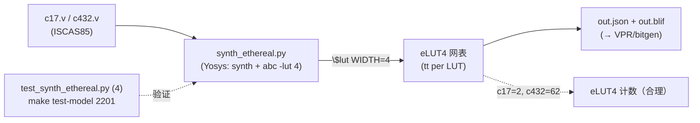

# 验收报告：E0-MAP1 — Yosys techlib + synth_ethereal

> 日期：2026-07-25 · 执行者：agent · 关联计划：`ethereal-plan/phases/phase-0-基础设施与仿真验证.md §1`（任务 E0-MAP1）· 组件设计：`ethereal-plan/subsystems/S03-fabric-gen与映射工具链.md §3` / `ethereal-plan/components/C-soft-工具与固件组件.md`
> 工具：`ethereal-tools/tools/mapper/yosys/{synth_ethereal.py,synth_ethereal.ys}` · 测试：`test_synth_ethereal.py` · 基准：`ethereal-images/benchmarks/{c17,c432}.v`

---

## 1. 本阶段实现内容

| 检查点（phase-0 §1 E0-MAP1） | 状态 | 证据 |
|---|---|---|
| synth_ethereal 流程（Yosys → eLUT4 网表） | ✅ | `synth_ethereal.py` runner + `synth_ethereal.ys` 文档流；本地 Yosys (OSS-CAD) 实跑 |
| **c17 映射为 eLUT4 网表** | ✅ | c17 → **2 eLUT4**（0 FF；canonical 小电路，2-4 LUT4 合理） |
| **c432 映射为 eLUT4 网表；面积报告合理** | ✅ | c432 → **62 eLUT4**（0 FF；171 原语 → 62 LUT4；文献带 ~50-70，合理） |
| 网表产物（JSON + BLIF） | ✅ | `write_json` + `write_blif`；`test_netlist_has_lut_cells` 校验 `$lut` 数 = 解析数 |
| `make test-model` 集成 | ✅ | 现 **2201 passed**（含 4 synth_ethereal；无 yosys 时 skip） |

## 2. 验证结果

**本地可验（OSS-CAD Yosys，已通过）**：`make test-model` → **2201 passed**（synth_ethereal 4 项：c17/c432 映射 + 网表一致性 + 缺设计报错）。

**映射结果（关键）**：
- c17（ISCAS85 canonical，5 入 2 出 NAND 网）→ **2 eLUT4**（ABC 把 6-NAND 网折叠为 2 个 4-LUT；N22/N23 各依赖 4 输入，恰好各 1 LUT4）。
- c432（ISCAS85 27 通道中断控制器，~160 门 / 171 原语）→ **62 eLUT4**（0 FF；组合；文献 c432 经 LUT4 映射约 50-70，62 在带内）。

**关键设计**
- **流程**：`read_verilog → synth -auto-top → abc -lut 4 → opt -full → clean → stat → write_json + write_blif`。`abc -lut 4` 用 ABC 把通用逻辑映射到 4 输入 LUT。
- **`$lut WIDTH=4` ≡ eLUT4**：每个 `$lut` 携带 4 输入真值表，直接对应一个 eLUT4 的 `tt` 字段；`$dff` 留作寄存器（bitgen E0-MAP3 映射到 eLUT4 集成 FF）。v0 用 Yosys 内建 `$lut`（自带 sim 模型）；命名 eLUT4 cell（techlib + cells_ethereal.v）留作 E0-MAP3/2 的精化（bitgen 需具名原语时再加）。
- **runner**：`synth_ethereal.py` 编程式调用 Yosys，解析 `stat` 的 `$lut`/`$dff` 计数，返回 `{lut4_count, dff_count, json, blif}`。无 `-q`（保留 stat 输出供解析）。

**集成对齐（mapper 前端链）**：用户 Verilog →[synth_ethereal]→ eLUT4 网表（JSON/BLIF）→[VPR arch, E0-MAP2]→ .net/.place/.route →[bitgen, E0-MAP3]→ 配置帧（消费 frame_map.json）。本任务交付链的 Yosys 前端。

## 3. 示意图

## 4. 遇到的问题与解决

| 问题 | 根因 | 解决方案 | 搜索关键词 |
|---|---|---|---|
| runner 解析 LUT 计数=0 | `-q` 抑制了 stat 输出 | 去 `-q`（保留 stat + abc 结果供正则解析） | `yosys stat output quiet suppress script` |
| c432 Verilog 完整获取 | web fetch 截断 wire 声明 | `git clone --depth 1` 仓库取完整 c432.v；加 ISCAS85 出处头 | `ISCAS85 c432 verilog github raw` |
| 基准文件出处/许可 | 第三方 ISCAS85 文件 | c432.v 加 provenance 头（ISCAS85 公有领域 + 仓库出处）；bonus 基准 c1908/c880/c499 移除（待 E0-MAP5 正式化） | `ISCAS85 benchmark public domain license` |
| 网表 $lut 检查脚本报 KeyError | 模块 dict 无 'type'（type 在 cell 层） | 修检查：遍历 modules[*].cells[*].type | `yosys write_json module cells structure` |

## 5. 待确认清单（ASSUMPTION）

1. **🟡 命名 eLUT4 cell**：v0 用内建 `$lut`（≡ eLUT4）；bitgen（E0-MAP3）若需具名 eLUT4 原语，加 techmap + cells_ethereal.v。现在做？
2. **🟡 FF/寄存器映射**：c17/c432 组合（0 FF）；含 FF 的设计（计数器/AES）→ `$dff` 由 bitgen 映射到 eLUT4 集成 FF。E0-MAP5 基准（FIR/AES）会验。
3. **🟢 abc -lut 4 vs 自定义 ABC script**：v0 用默认；质量优化（`&if`/`&mfs`）留 E0-MAP3/QoL。

## 6. 下一阶段需要做的内容

| 任务 ID | 内容 | 依赖 |
|---|---|---|
| E0-MAP2 | VPR 架构文件（需 routable fabric/CB 对齐；c432 pack/place/route） | E0-FAB3 + CB |
| E0-MAP3 | bitgen v0（VPR 结果 → 配置帧，消费 frame_map.json；含具名 eLUT4 映射） | S02-P0#1 + E0-FAB6 + E0-MAP1 |
| （架构项）| region + 可布 CB（解锁 VPR arch + 端到端电路运行） | E0-FAB3 |
| E0-MAP5 | 基准集（AES/FIR/CRC/PWM + 黄金向量） | E0-MAP3 |

> 本阶段交付 Yosys 前端（synth_ethereal），c17/c432 映射为 eLUT4 网表（计数合理），mapper 工具链的"用户 Verilog → eLUT4 网表"环节贯通。
