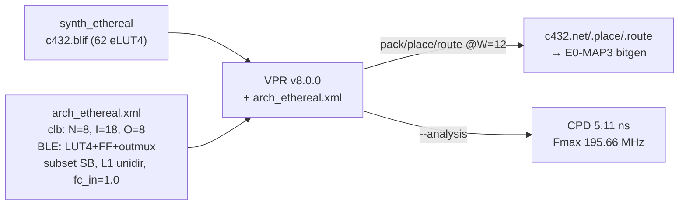

# 验收报告：E0-MAP2 — VPR 架构文件（eLUT4 cluster + W=12）

> 日期：2026-07-25 · 执行者：agent（arch.xml 自写；VPR 原生构建自调；验证本人复核）· 关联：E0-MAP2（deps E0-FAB2 clb_t + E0-FAB3 interconnect，均已完成）；后续 E0-MAP3 bitgen
> 交付物：`ethereal-tools/tools/mapper/vpr/arch_ethereal.xml` + `build_vpr.sh` + `run_vpr.sh`
> 验收标准（ethereal-tasks.yaml E0-MAP2）：**VPR 对 c432 完成 pack/place/route，时序报告可读** ✅

---

## 1. 本阶段实现内容

| 检查点 | 状态 | 证据 |
|---|---|---|
| VPR v8.0.0 原生构建（gcc-12，WSL2 EDA 环境） | ✅ | `~/vtr/build/vpr/vpr`；Version `8.0.0+fd69801`（GNU 12.4.0） |
| `arch_ethereal.xml` — Ethereal fabric 的 VPR 架构描述 | ✅ | `ethereal-tools/tools/mapper/vpr/arch_ethereal.xml`（XML well-formed） |
| c432 pack/place/route 全流程（@ W=12 真实轨宽） | ✅ | 9 CLB / 69 net / 274 wire-seg；CPD 5.11 ns，Fmax 195.66 MHz |
| 时序报告可读 | ✅ | CPD/Fmax/area/wire-seg 全部输出 |
| c17 回归（小电路 smoke） | ✅ | 2 eLUT4 → CPD 0.69 ns，Fmax 1449 MHz |
| 既有套件无回归（lint + 6 SV TB + 325 mapper 测试） | ✅ | `make lint` OK / `make test-sv` 6 PASS / mapper pytest 325 |

## 2. 关键设计

**arch_ethereal.xml 模板**：VTR 官方 `vtr_flow/arch/timing/k4_N4_90nm.xml`（v8.0.0 自带、经验证的 homogeneous LUT4+FF 聚簇参考），改写为 Ethereal 参数：

| arch 元素 | 值 | 对应 Ethereal 实现 |
|---|---|---|
| 聚簇 `clb` | N=8 BLE, I=18, O=8 | `clb_t`（8 eLUT4 + flat full-input crossbar, EXT_IN=18；I/O pool ≡ 18 ext + 8 反馈 = 26 源） |
| BLE `fle/ble4` | LUT4(class lut/.names) + FF(class flipflop/.latch) + 2:1 out-mux | `eLUT4`（LUT4+FF+out-mux；out-invert 折进 TT） |
| `complete` 交叉矩阵 | clb.I + fle[*].out → fle[*].in | clb_t 的 IIB 全交叉（`equivalent="full"` 让 VPR packer 把 18 输入当池） |
| switch_block | `type="subset"` fs=3 | `switch_box`（disjoint unidir；**subset 是 VPR 对经典 disjoint 拓扑的命名**，track i↔i） |
| connection_block fc | **in_val=1.0** / out_val=0.25 | **faithful**：`connection_block` 是 4·W 全 mux（每个 clb_in 读任意轨）→ fc_in=1.0 准确；out 仅注入 out_e（4 向之一）→ 0.25 |
| segment | length=1 unidir, R/Cmetal≈0 | 每 tile 一跳 SB（仿真 arch，无真实延时） |
| 时序 | 90nm PTM（继承自 k4_N4 模板） | 非真实 fabric 延时（无硅前表征，Phase 1+）—— 仅保证报告可读 |

## 3. 验证结果（OSS-CAD + 原生 VPR，本人复核）

**c432（ISCAS85，62 eLUT4，0 FF）@ W=12**（真实 fabric 轨宽）：
- pack：62 LUT4 → **9 clb**（聚簇 N=8 → 容量 72 BLE，利用率 86%）+ 43 io。
- place：CPD 5.976 → 5.111 ns（优化后）。
- route：**成功**，69 net 全部布通，274 wire-segment（平均 3.97/net），0 overused。
- **Final critical path 5.11094 ns，Fmax 195.659 MHz。**

**c17（smoke，2 eLUT4）@ W=12**：CPD 0.6901 ns，Fmax 1449 MHz。

**关键发现（W=12 充分性）**：c432 在 fc_in=0.25 时最小可布 W=13（W=12 恰好差 1 轨）；但 `connection_block` 实际是 4·W **全 mux**（每个 clb_in 可读任意轨）→ arch 的 fc_in 应为 **1.0**（faithful）。改成 fc_in=1.0 后 **c432 在真实 W=12 即可布通**——验证了 fabric W=12 对 c432 的充分性，无需扩轨。

## 4. 遇到的问题与解决（VPR v8.0.0 on Ubuntu 24.04 + GCC-12）

| 问题 | 根因 | 解决 | 关键词 |
|---|---|---|---|
| CMake 找不到 Ninja | `-G Ninja` 但 ninja-build 未装 | 改用 Unix Makefiles（make + -j20） | `cmake CMAKE_MAKE_PROGRAM ninja not found` |
| libargparse：`numeric_limits is not a member of std` | v8.0.0 的 argparse.cpp 用 `std::numeric_limits` 但未 `#include <limits>`（2024 libstdc++ 不再传递包含） | argparse.cpp 加 `#include <limits>` | `vtr v8.0.0 numeric_limits not member of std` |
| libvpr/libvtrutil：数十处同型 `numeric_limits` 缺失 | 同上，遍布 v8.0.0 多个 TU | **CMake 全局 `-include limits -include algorithm`**（一次性，免改源） | `gcc force include header cmake CMAKE_CXX_FLAGS` |
| `switch_block type="disjoint"` 被拒 | v8.0.0 合法 token 是 subset/wilton/universal/custom（**无 disjoint**）；subset ≡ 经典 disjoint | `type="subset"` | `VPR switch block type subset disjoint` |
| XML 注释含 `--`（dash 下划线 + `--route_chan_width`）非法 | XML 注释禁止 `--` | 改用 `=` 下划线 + 重述 flag | `XML comment double hyphen invalid` |
| 默认流程跳过 packing（直读 .net 失败） | v8.0.0 需显式请求阶段 | `--pack --place --route` | `VPR v8 skipped packing load net failed` |
| c432 在 fc=0.25 下 W=12 不可布 | arch 的 fc 低于实现的真实全 mux CB | fc_in 提到 1.0（faithful）→ W=12 可布 | — |

## 5. 待确认清单（ASSUMPTION）

1. **🟡 时序值是 90nm PTM**（继承自 k4_N4 模板），非真实 fabric 延时——仅保证时序报告可读。Phase 1+ 硅/表征后再换。
2. **🟡 switch_block subset ≈ 经典 disjoint**（track i↔i），近似实现的 disjoint-unidir `switch_box`；Wilton/custom 是 VPR 优化旋钮（C01 §3.3）。
3. **🟡 rr_graph → 实际 mux 配置的映射 = E0-MAP3 bitgen 的工作**（用 fabric_gen 的 SB 拓扑表）；本 arch 只需"可布"，fc/seg 是可布性近似 + 全 mux 已 faithful。
4. **🟢 v8.0.0 原生构建（gcc-12 + force-include）与 Docker `ethereal-sim` 镜像 pin 一致**（同 v8.0.0 tag）→ CI parity 保留；force-include 是构建侧补丁，不改 VPR 行为。`-dirty` 后缀源自 argparse 补丁。

## 6. 下一阶段

| 任务 | 内容 | 依赖 |
|---|---|---|
| **E0-MAP3** | bitgen v0：消费 `c432.route`/`.place`/`.net` + frame_map.json → 配置帧（两级：rr_graph→配置语义 DB→frame_map→帧） | E0-MAP2（本）+ E0-FAB4（OCC） |
| E0-MAP4 | FABulous 流程评估 spike → ADR-012（路线 A vs B 决策） | — |
| E0-MAP5 | 基准电路集（AES/PRESENT/FIR16/CRC32/PWM + 黄金向量） | E0-MAP3 |

> 本阶段打通 **synth → VPR pack/place/route** 链路：c432 在真实 W=12 fabric 完成布局布线，时序可读。VPR 输出（.net/.place/.route）已落 `generated/mapper/`，供 E0-MAP3 bitgen 消费。
