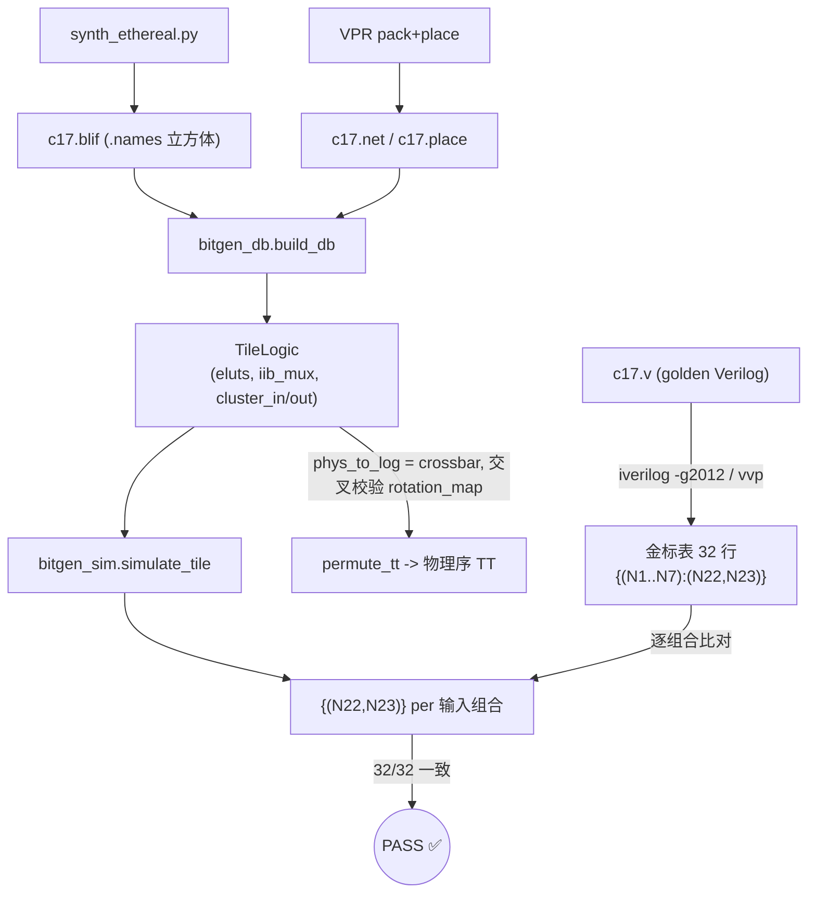

# 报告: E0-MAP3 increment 1 — bitgen LEVEL-1 配置语义 DB

**Task:** E0-MAP3 increment 1 (bitgen level-1: config semantic DB)
**Date:** 2026-07-25
**Plan-Ref:** `ethereal-plan/components/C-soft-工具与固件组件.md §2` (bitgen 两级设计，本次实现 LEVEL 1)
**Scope:** 从 VPR pack/place 结果 (`.net`/`.place`) + Yosys BLIF 提取 **fabric-independent** 的每 tile 配置语义 (哪个 eLUT4 装载哪个真值表、哪个 IIB mux 选哪个源)，并在 **c17 单簇**上证明 **bit-true**。LEVEL-2 帧打包、簇间 / SB / CB 布线均为后续增量，本次**不做**。

---

## 本阶段实现内容

| 检查点 | 状态 | 说明 |
|---|---|---|
| `bitgen_db.py` LEVEL-1 DB 构建器 (parse .net/.place/.blif) | ✅ | 纯 Python，`FabricConfigDB` / `TileLogic` / `ElutConfig` 数据模型；`build_db()` / `elut_cfg_word()` / `iib_sel_for()` 公共 API；`parse_blif` / `blif_names_to_logical_tt` / `permute_tt` / `parse_place` 辅助函数 |
| TT 物理序置换 (端口旋转问题) | ✅ | crossbar 派生 `phys_to_log` (物理→逻辑) 为主，`port_rotation_map` 交叉校验；c17 上两者**完全一致**，无需 brute-force |
| `bitgen_sim.py` 簇/tile 求值器 | ✅ | 纯 Python，镜像 `clb_t/elut4` 语义 (`tt[vin]`、FF/反相、IIB pool 0..25、反馈迭代到不动点)；c17 组合逻辑下完全 bit-true |
| `test_bitgen.py` 单元测试 + bit-true | ✅ | 8 项全绿，含 `test_c17_bittrue` (iverilog 金标 32/32) |
| ruff (默认规则 E4/E7/E9/F) | ✅ | clean |
| RTL / frame_map / fabric_gen / arch.xml 未改动 | ✅ | 仅在 `ethereal-tools/tools/mapper/bitgen/` 下新增文件 |
| `make lint` (RTL 未受影响) | ✅ | "OK - all project RTL lint-clean." |

### 关键正确性问题：4-LUT 引脚置换 (port_rotation)

VPR 打包时会置换 4-LUT 输入。eLUT4 硬件按 `vout = tt[vin]`、`vin = {pin3,pin2,pin1,pin0}` (pin0=LSB) 求值，因此存储的 `tt` 必须按**物理引脚序**索引；而 Yosys 给出的真值表是**逻辑序** (`.names` 输入表顺序，MSB-first：input[0]=bit3)。`permute_tt()` 用 `phys_to_log[gk]` = 物理引脚 gk 承载的逻辑输入位置，把逻辑 TT 置换到物理序。

**结论 (c17 已验证 bit-true)：** `port_rotation_map[i]` = **物理引脚 i 承载的逻辑输入位置** (物理→逻辑映射)，与 crossbar 派生结果**完全一致**。crossbar 是硬件真值，authoritative；rotation_map 仅作 VPR 簿记/交叉校验。

| fle | 驱动 | 逻辑输入 (BLIF `.names`) | rotation_map | crossbar 派生 phys_to_log | 警告 |
|---|---|---|---|---|---|
| fle[6] | N22 | `[N2,N3,N1,N6]` | `[3,2,1,0]` | `[3,2,1,0]` | 无 |
| fle[7] | N23 | `[N6,N3,N7,N2]` | `[2,3,0,1]` | `[2,3,0,1]` | 无 |

> 推论 (可复用于 E0-MAP3 后续增量)：物理↔逻辑**无置换**时的"恒等"图是 `[3,2,1,0]` (位翻转，因为逻辑 TT 是 MSB-first 而硬件 pin0=LSB)；`[0,1,2,3]` 反而是对索引做位翻转。`permute_tt` 是 16 位 TT 上的双射 (popcount 不变)。

### bit-true 流程 (Mermaid, G4)



---

## 下一阶段需要做的内容

- **E0-MAP3 increment 2 (LEVEL-2 帧打包):** 把 `FabricConfigDB` 的语义配置映射到 OCC 帧位 (复用 `frame_map.py` 的 tile 位布局)，输出 `.eth` 逻辑镜像的配置帧段。
- **E0-MAP3 簇间布线:** 解析 `c17.route` / `c432.route`，提取 SB (switch box) / CB (connection box) mux 选择，扩展 DB 覆盖互连；c432 多簇届时可做端到端 bit-true。
- **FF 建模 (时钟驱动):** 当前 `bitgen_sim` 的 FF 仅作为外部存储状态；含寄存器的设计需要带时钟的求值驱动。
- **`elut_cfg_word` 布局确认 (见下 ASSUMPTION):** 待 maintainer 裁定后，LEVEL-2 帧打包须与之一致。

---

## ⚠️ ASSUMPTION (G6，待 maintainer 确认)：cfg_data 位布局冲突

任务简报把 20-bit eLUT cfg 字描述为 `tt[15:0] | ff_en<<16 | ff_rst_en<<17 | ff_rst_val<<18 | out_inv<<19`；而**实际 RTL** (`ethereal-fabric/rtl/clb/elut4.sv`) 实现为 `tt<=cfg_data[19:4], ff_en<=[3], ff_rst_en<=[2], ff_rst_val<=[1], out_inv<=[0]`，且 `clb_t.sv` 注释把 Verilog 拼接 `{tt[15:0], ff_en, ff_rst_en, ff_rst_val, out_inv}` (左=MSB) 解释为 `[19:4]=tt…`。两者冲突 (简报按 Python 位赋值读；RTL 按 Verilog 拼接=左为 MSB 读)。

- **采取方案 (A，跟随 RTL)：** `elut_cfg_word` 按 RTL 实现 (`tt` 在 `[19:4]`)。理由：RTL 是可执行硬件真值；LEVEL-2 帧打包必须与之匹配，否则配置出的 fabric 会算错。
- **方案 (B，跟随简报)：** `tt` 在 `[15:0]`。会与 RTL 冲突。
- c17 bit-true 验证**不依赖**此选择 (求值器直接用 `ElutConfig` dataclass，不经过打包字)，故验证证据对两种方案均有效。
- `bitgen_db.py` 模块文档串与 `test_elut_cfg_word_uses_rtl_layout` 均按 RTL 断言并记录此分歧。**建议 maintainer 裁定**后统一简报与 RTL 表述。

---

## 验证结果

环境：本地 OSS-CAD Suite (`~/oss-cad-suite`；Verilator 5.051 / iverilog 14) + `.venv` (pytest 9.1.1, ruff)。无 docker。

```
# 1) bitgen 套件
.venv/bin/python -m pytest ethereal-tools/tools/mapper/bitgen/ -v
=> 8 passed in 0.06s   (含 test_c17_bittrue: iverilog 金标 32/32)

# 2) 全 mapper/tools 套件 (无回归)
.venv/bin/python -m pytest ethereal-tools/ -q
=> 333 passed in 0.96s

# 3) ruff (默认规则，与仓库现有代码同一标准)
.venv/bin/ruff check --select E4,E7,E9,F ethereal-tools/tools/mapper/bitgen/
=> All checks passed!

# 4) RTL 未受影响
make lint
=> [lint] OK - all project RTL lint-clean.

# 5) 结构/语义计数
c17 : 1 cluster tile, 2 eLUT4 (fle[6]=N22, fle[7]=N23), ff_en 全 False
c432: 9 cluster tiles, 62 eLUT4  (每个 eLUT4 非平凡 TT, 所有 IIB mux 解析到 0..25)
c17 bit-true: 32/32 输入组合与 iverilog 金标完全一致 (crossbar 派生置换, 0 次 brute-force)
```

### 新增文件

| 路径 | 角色 |
|---|---|
| `ethereal-tools/tools/mapper/bitgen/bitgen_db.py` | LEVEL-1 配置语义 DB 构建器 (parse .net/.place/.blif → `FabricConfigDB`) |
| `ethereal-tools/tools/mapper/bitgen/bitgen_sim.py` | 簇/tile 纯 Python 求值器 |
| `ethereal-tools/tools/mapper/bitgen/test_bitgen.py` | 单元测试 + c17 bit-true (iverilog 金标) + c432 结构校验 |

(附带可再生产产物：`generated/mapper/golden_c17_tb.v`，位于 git-ignored 的 `generated/` 下。)

### 解析过程中的注意点 / surprises

- c432 的 `port_rotation_map` 对开路引脚会写 `open` 文本 → `_derive_phys_to_log` 已容错 (按 None 跳过/回填)。
- c432 存在簇内反馈 (如 `fle[0].in` 引用 `fle[7].out`)；`cluster_outputs` 从每个被使用 fle 的 `lut[0]` 叶节点 out-net 派生 (而非仅看 cluster O port)，从而正确解析仅内部反馈、外部 O=open 的 fle。
- eLUT4 硬件 `pin0=LSB` 与逻辑 TT `MSB-first` 的差异使"恒等"映射为 `[3,2,1,0]` 而非 `[0,1,2,3]` —— 详见上方推论。
