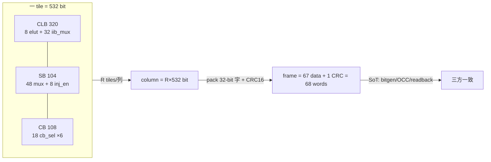

# 验收报告：E0-MAP3 increment 2 — frame_map SoT gap 修复（CB + inject_en）

> 日期：2026-07-25 · 执行者：agent（本人完成；frame_map 是 SoT，精度关键，未委派）· 关联：E0-MAP3 increment 2；前置 = routable CB Step 1+2 已落地但 frame_map 未同步
> 影响文件：`ethereal-tools/tools/frame_map.py`（核心）+ `ethereal-spec/fabric/interconnect-config-v0.md`（spec-first）+ `test_frame_map.py`/`test_fabric_gen.py`/`fabric_gen.py`（ripple）

---

## 1. 本阶段实现内容

| 检查点 | 状态 | 证据 |
|---|---|---|
| frame_map 补全 `connection_block` + SB `inject_en`（匹配 RTL 配置点） | ✅ | tile_width 416→**532** = CLB(320)+SB(104)+CB(108) |
| spec-first：interconnect-config-v0.md 同步（inject_en cfg / connection_block / §4 routable CB） | ✅ | spec §2/§4/§5/§6 更新 |
| ripple 测试更新（frame_map + fabric_gen geometry） | ✅ | 321 frame_map+fabric_gen 测试 PASS |
| 既有套件无回归 | ✅ | lint OK / 6 SV TB / **2491 model** |
| artifact 重生成验证新布局 | ✅ | 4×4：tile_width=532, words_per_frame=68, n_points=114 |

## 2. 根因与修复

**根因（"loose end"）：** routable CB Step 1（switch_box inject_en）+ Step 2（connection_block）在 fabric RTL 落地后，**没有同步** `frame_map.py`（S02-P0#1 产物，frozen 在 routable CB 之前）。frame_map 是 bitgen/OCC/readback 三方共享的**单一事实源**——缺 CB(108b)+inject(8b) 意味着任何 LEVEL-2 帧打包都会产出**不完整配置**。本轮修复。

**新 tile 配置点（与 RTL 逐一核对）：**

| 单元 | 配置点 | 宽度 | 合计 | RTL cfg |
|---|---|---|---|---|
| CLB (`clb_t`) | `elut{0..7}` (tt+ff) | 20×8 | 160 | addr 0..7 ← data[19:0] |
| | `iib_mux{0..31}` (pool sel) | 5×32 | 160 | addr 8..39 ← data[4:0] |
| SB (`switch_box`) | `mux_{n,s,e,w}_{0..11}` | 2×48 | 96 | addr 0..47 ← data[1:0] |
| | **`inj_en_{0..7}`** (NEW) | 1×8 | 8 | addr 4W..4W+7 ← data[0] |
| **CB (`connection_block`)** (NEW) | **`cb_sel_{0..17}`** | 6×18 | 108 | addr i ← data[5:0] |
| **tile** | | | **532** | (CLB unit=00 / SB=01 / CB=10) |

**新 frame 几何（默认 4×4，W=12）：** column_bits = R×532 = 2128；data_words = ceil(2128/32) = **67**；words_per_frame = **68**（+CRC）。2×2：data_words 34 / words 35。

## 3. 验证（本人复核）

- `make lint` → OK（RTL 未动）。
- `make test-sv` → 6 TB PASS。
- `pytest ethereal-fabric/tests ethereal-tools` → **2491 passed**（含 321 frame_map+fabric_gen）。
- `fabric_gen.py fabric_4x4.yaml` → 重生成 frame_map.json：`tile_width=532, words_per_frame=68, n_points=114`（= 40 CLB + 56 SB[48 mux+8 inj] + 18 CB），与设计一致。

## 4. 示意图

## 5. 待确认清单（ASSUMPTION）

1. **🟡 配置点 ↔ fabric cfg_addr 的帧→寄存器映射机制**：frame_map 定义帧**位布局**（哪个 bit = 哪个命名配置点），但"帧位 → fabric_top cfg 写（unit/tile/intra 译码）"的应用机制（OCC frame-applier / config-bridge）尚未单独验证——本轮只保证 frame_map 内部位布局自洽 + 三方一致。LEVEL-2（incr 3）打包 + 未来 OCC 集成时再端到端核对。
2. **🟢 sel 宽度**：IIB sel_w=5（POOL=$clog2(32)，0..25 有效/26..31 保留）；CB sel_w=$clog2(4W)=6（W=12）。均与 RTL 一致。
3. **🟢 inject_en 归属 SB 单元**（RTL 中 inject 经 switch_box 配置，unit=SB），符合 fabric_top cfg 译码。

## 6. 下一阶段

| 任务 | 内容 | 依赖 |
|---|---|---|
| **E0-MAP3 incr 3** | LEVEL-2 帧打包：bitgen DB（incr 1）→ frame_map 帧；验证 round-trip + c17 逻辑帧正确性（CB/SB/inject 先 blank，routing 半 = incr 4） | incr 1 + incr 2（本） |
| E0-MAP3 incr 4 | routing bitgen（SB/CB/inject）+ IO path + sim harness → c432 bit-true（E0-MAP3 acceptance） | incr 3 |

> 本轮把 frame_map SoT 与 routable-CB fabric 对齐（+116 bit/tile：8 inject + 108 CB），消除"bitgen 产不完整配置"的隐藏风险，解锁 LEVEL-2 帧打包。
