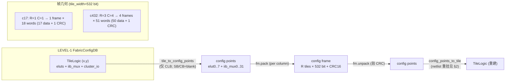

# 验收报告：E0-MAP3 increment 3 — bitgen LEVEL-2 帧打包（DB → frames → DB）

> 日期：2026-07-25 · 执行者：agent（本人完成；LEVEL-2 精度关键，未委派）· 关联：E0-MAP3 increment 3；前置 = incr 1（LEVEL-1 DB）+ incr 2（frame_map SoT 含 CB+inject_en）已落地
> 影响文件：`ethereal-tools/tools/mapper/bitgen/bitgen_db.py`（新增 `elut_from_word`）+ `ethereal-tools/tools/mapper/bitgen/bitgen_pack.py`（**新建**，LEVEL-2）+ `ethereal-tools/tools/mapper/bitgen/test_bitgen.py`（+5 测试）
> Plan-Ref：`ethereal-plan/components/C-soft-工具与固件组件.md §2`（bitgen two-level 设计，本轮 = LEVEL 2）

---

## 1. 本阶段实现内容

| 检查点 | 状态 | 证据 |
|---|---|---|
| `elut_from_word`（`elut_cfg_word` 的精确逆）加入 `bitgen_db.py` | ✅ | `[19:4]=tt, [3]=ff_en, [2]=ff_rst_en, [1]=ff_rst_val, [0]=out_inv`；双向往返测试 PASS |
| 新建 `bitgen_pack.py`（LEVEL-2：DB↔frames 纯 Python） | ✅ | `db_grid_bounds` / `tile_to_config_points` / `config_points_to_tile` / `db_to_frames` / `frames_to_db` |
| CLB 配置点打包（elut0..7 + iib_mux0..31）；SB/CB/inject_en 留 blank=0 | ✅ | incr 3 仅 CLB；routing = incr 4（约定，符合任务范围） |
| c17 帧往返（配置点保真） | ✅ | 单 tile eluts(TT/ff_en/out_inv) + iib_mux 全部 bit-exact |
| **c17 功能后打包（关键测试）** | ✅ | frames→reconstruct→重挂 netlist→`simulate_tile` → **32/32** 匹配 iverilog golden |
| c432 多 tile 帧往返（9 tiles / 62 eLUT4） | ✅ | 全部 eluts TT + iib_mux 保真；gap tile 为 blank；多列（C=4） |
| 既有套件无回归 | ✅ | `make lint` OK；bitgen 13/13 PASS；全 mapper 套件 **333→338 passed** |
| ruff（E4,E7,E9,F）clean | ✅ | `All checks passed!` |

## 2. 设计要点

**LEVEL-2 = LEVEL-1 DB ↔ 物理配置帧。** LEVEL-1（incr 1）产出 fabric-independent 的*语义*配置 DB（每 eLUT4 的 TT、IIB mux 选择、cluster I/O 网表映射）。LEVEL-2（本轮）按 `frame_map`（SoT，incr 2 已含 CB+inject_en）把这 DB 打包成物理 **config frames**（一帧 = 一列 tile 的配置位 + CRC16 尾字），并能无损还原。

**本轮 scope = 仅 CLB 配置点。** 每 tile 产出：`elut0..7`（20-bit：tt[15:0]+ff_en+ff_rst_en+ff_rst_val+out_inv，按 RTL `elut4.sv` 布局）+ `iib_mux0..31`（5-bit，`m = gi*K + gk`）。SB（`mux_{n,s,e,w}_*` / `inj_en_*`）与 CB（`cb_sel_*`）位仍由 frame_map 预留但读回为 0（= 安全静态模式）——routing 配置位在 incr 4 落地，本轮不打包，帧宽不变。

**网名重挂（by design）。** 配置帧只承载 *bit 级* 配置，**不含网名**：`TileLogic.cluster_inputs/outputs`（及 DB 的 `primary_inputs/outputs`）是 netlist 级 *设计* 上下文，不是 fabric 配置位。因此从帧还原的 `TileLogic` 的 `cluster_inputs/outputs` 为空——这是有意的，对应硬件模型：OCC 只写原始配置位，设计的 I/O 映射在 apply 时由 OCC/sim harness 从 LEVEL-1 DB 重挂。`test_c17_functional_after_pack` 即把原 tile 的 `cluster_inputs/outputs` 拷到重建 tile 上再 `simulate_tile`，完整复现 apply-time 行为。

### cfg 字布局（`elut_cfg_word` / `elut_from_word`，对齐 RTL `elut4.sv`）

| 域 | 位 | 说明 |
|---|---|---|
| `tt` | [19:4] | 16-bit 真值表（physical-pin 顺序，`tt[vin]`） |
| `ff_en` | [3] | 1 = 寄存 LUT 输出 |
| `ff_rst_en` | [2] | 1 = 用户 reset 影响虚拟 FF |
| `ff_rst_val` | [1] | reset 装入值 |
| `out_inv` | [0] | 1 = 输出取反 |

> 全 0 的 `ElutConfig(tt=0)` 打包为 word 0 = "未用槽位" 哨兵；`config_points_to_tile` 把 word-0 的 `elut{i}` 视为未用（不入 `tile.eluts`），与 LEVEL-1 DB 语义一致（absent = unused）。`iib_mux` 同理：sel-0 的项不存储，但 `iib_mux.get((gi,gk),0)` 读回等价 → 语义保真。

## 3. 验证（本人复核，`export PATH=~/oss-cad-suite/bin:$PATH`）

| 命令 | 结果 |
|---|---|
| `make lint` | `[lint] OK - all project RTL lint-clean.`（RTL 未动） |
| `pytest ethereal-tools/tools/mapper/bitgen/ -v` | **13 passed**（8 既有 + 5 新增；含 `test_c17_functional_after_pack` 32/32） |
| `pytest ethereal-tools/ -q` | **338 passed**（was 333；+5） |
| `ruff check --select E4,E7,E9,F ethereal-tools/tools/mapper/bitgen/` | `All checks passed!` |

**c17 功能后打包（关键证据）：** build c17 DB → `db_to_frames` → `frames_to_db` 重建 → 重挂原 tile 的 `cluster_inputs/outputs` → 对 iverilog golden 的 32 组输入 `simulate_tile` → **N22/N23 全部 32/32 匹配**。证明打包后的帧应用到 fabric 上能正确计算 c17。

**c432 多 tile 往返：** 9 tiles / 62 eLUT4 的 TT + iib_mux 全部 bit-exact 保真；sparse placement（4×3 bounding box，3 个 gap 位置 (1,2)/(4,2)/(4,4)）的 gap tile 还原为 blank（空 eluts + 空 iib_mux），符合"帧代表整列物理 tile"的模型。

## 4. 帧几何

| 设计 | grid bounds | R×C | #tiles_used | #frames | words/frame | tile_width |
|---|---|---|---|---|---|---|
| c17 | (1,1,1,1) | 1×1 | 1 | 1 | **18** (17+CRC) | 532 bit |
| c432 | (1,2,4,4) | 3×4 | 9 | **4** | **51** (50+CRC) | 532 bit |

> c432 的 column_bits = R×532 = 3×532 = 1596 bit → data_words = ceil(1596/32) = 50；+CRC = 51。c17 column_bits = 532 → data_words = 17；+CRC = 18。

## 5. ASSUMPTION / 待确认（G6）

- **🟡 sparse placement → 全 bounding-box 填充（已自洽，提请记录）：** VPR 把 c432 的 9 个 cluster tile 稀疏放在 4×3 bounding box 内（3 个 gap）。`db_to_frames` 对每列输出一帧、每个行槽位（缺失→blank `{}`）都写；`frames_to_db` 因此在**每个** `(col+min_x, row+min_y)` 还原一个 tile（含 gap 位置的 blank tile）。这是"帧代表整列物理 tile"的正确语义（未用 tile 仍需 blank=安全静态配置），但意味着还原 DB 的 tile key 集是原 DB 的**超集**。测试已据此调整（原 9 位置 ⊆ 还原位置；gap tile 必为 blank）。**ASSUMPTION (TBD, 2026-07-25)：** OCC 实际写帧时是否对全空列（该列无任何 used tile）也写 blank 帧——本轮 c432 每列都至少有 1 个 used tile，未触及全空列情形；留待 incr 4 / OCC 集成时确认。
- 无新增 RTL/arch/frame_map 语义变更（约束遵守）；`elut_from_word` 是 `elut_cfg_word` 的纯逆，无新设计决定。

## 6. 下一阶段需要做的内容

- **E0-MAP3 incr 4（routing 帧位）：** 把 SB（`mux_{n,s,e,w}_*` + `inj_en_*`）与 CB（`cb_sel_*`）配置点从 VPR `.route` 解析进 DB，并入 `tile_to_config_points`，实现完整 532-bit tile 打包；届时 c432 等多 tile 设计的 inter-tile 互连也进帧。
- **E0-MAP4（`.eth` logic image）：** 把 LEVEL-2 frames + manifest（fabric 几何、primary I/O、签名）打包成 `.eth` = tar(frames + 5-piece manifest + Ed25519)，对齐 ADR-011。
- **OCC 集成：** LEVEL-2 frames 即 OCC 的写入单位；验证 OCC blank-before-write + CRC 校验路径用真实帧（`tb_occ` / `tb_blank` 已过，待接真帧）。
- **ADR-012 收尾：** VPR 路线 A（本套 DB+frames 链路）已在 c17/c432 上 bit-true + 功能验证；c432 多列打包为 ADR-012 归档再添一项证据。
