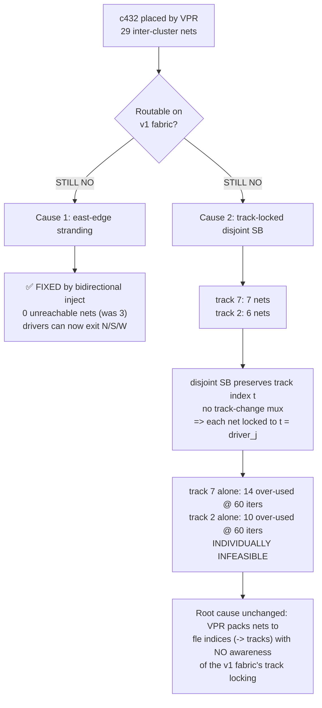

# Report — E0-MAP3 increment 4b: bidirectional inject model/test ripple + c432 re-route

- **Task**: E0-MAP3 incr 4b (Option B ripple — model + frame_map + tests + bitgen_route)
- **Date**: 2026-07-26
- **Plan-Ref**: `ethereal-plan/components/C01-fabric-核心单元.md §3` (switch_box) + `C-soft-工具与固件组件.md §2` (bitgen routing)
- **Status**: ✅ Model/test/tooling ripple DONE + lint/test/ruff green. **c432 does NOT converge** — bidirectional inject **fixed Cause 1** (east-edge stranding) but **Cause 2** (track-locked over-subscription) remains. Also found + fixed a **realizability bug** in the router.

---

## 0. TL;DR

The `switch_box` RTL was changed to **bidirectional inject** (Option B): each
`clb_out[j]` injects onto ONE configurable `out_D[j]` (D=`inj_dir[j]`,
0=N/1=S/2=E/3=W) instead of east-only. This ripple-updates the golden model,
frame_map, all tests, the SystemVerilog TB, and the PathFinder router.

**THE KEY QUESTION — does c432 converge now?** **NO.** Bidirectional inject
**completely fixed Cause 1** (east-edge driver stranding: 0 unreachable nets,
was 3) but **Cause 2 remains**: the disjoint track-locked SB over-subscribes
track 7 (7 nets) and track 2 (6 nets), which never converge even in isolation.
Additionally, the initial 4-direction inject edges in the possibility graph
exposed a **realizability bug** (multi-sink nets branching through different
inject directions — the hardware only supports one direction per j); fixed by
making `_route_net` pick ONE direction per net via 4 per-direction Dijkstras.

---

## 1. 本阶段实现内容 (this phase)

### ✅ Files modified (11 files; NO RTL/arch/bitgen_pack changes)

| File | Change |
|---|---|
| `sb_model.py` | +`inject_dir` dict; `configure` 3-bit inject (en+dir); `inject(track,enable,direction)`; `inject_of`→`(bool,str\|None)`; `outputs`/`dependency_edges` directional inject (clear-on-0) |
| `fabric_model.py` | docstring: bidirectional inject note |
| `test_sb_model.py` | inject tests updated for en+dir; +4 parametrized bidirectional tests (outputs/edges/suppression × all dirs) + cfg encoding test |
| `test_fabric_model.py` | inject data 1→5 (east); +parametrized `test_routability_inject_all_directions` (E/W/S/N) |
| `tb_switch_box.sv` | `cfg_data` 2→3 bit; inject section tests **E + W + N** directions (3 dirs) + clear/override |
| `frame_map.py` | `sb_tile_type`: +`inj_dir_{j}` (2-bit/j); SB width 104→**120** |
| `test_frame_map.py` | geometry: tile 532→**548**, words_per_frame 68→**70**, tile_points 114→**122** |
| `test_fabric_gen.py` | geometry: 2×2 words 35→**36**, 4×4 words 68→**70**; +F841 fix (pre-existing) |
| `bitgen_route.py` | inject edges 4 dirs; `TileRoute.inject: dict[int,str]`; `_route_net` **4-direction fix**; `_populate_tiles`/`apply_route_to_grid` en+dir |
| `test_bitgen_route.py` | xfail reason (Cause 1 fixed); finding test (0 unreachable + tracks 2&7); feasible subset (16 nets); synthetic (inject dict) |
| `ethereal-spec/fabric/interconnect-config-v0.md` | spec: inject_en → bidirectional inject (en+dir, 3-bit) |

### ✅ New frame geometry (frozen)

| Metric | Old (east-only) | New (bidir inject) |
|---|---|---|
| SB bitfield width | 104 | **120** (96 mux + 8 inj_en + 16 inj_dir) |
| tile_width | 532 | **548** |
| 4×4 column_bits | 2128 | **2192** |
| 4×4 data_words_per_frame | 67 | **69** |
| 4×4 words_per_frame | 68 | **70** |
| 2×2 words_per_frame | 35 | **36** |
| tile_points count | 114 | **122** (+8 inj_dir) |

### ⚠️ THE REALIZABILITY BUG (found + fixed)

With 4 inject edges per `clb_out[j]` in the possibility graph, the original
`_route_net` ran a single Dijkstra from the driver. A **multi-sink** net's
shortest-path tree could **branch through different inject directions** (e.g.
one sink west via inject-W, another north via inject-N) — but the hardware only
supports **ONE** direction per j. The PathFinder "converged" (0 over-use) but
`apply_route_to_grid` + `route_exists` proved the solution was **unrealizable**.
Caught by `test_c432_feasible_subset_routable` (net `new_n63` failed route_exists).

**Fix**: `_route_net` now runs Dijkstra from EACH of the 4 exit nodes
(`out_n/s/e/w[j]@T`) and picks the ONE direction whose tree reaches all sinks at
minimum cost — enforcing single-direction inject at the routing level. The
inject edge meta `("inj", j, d)` is added manually so `_populate_tiles` records
`inject{j: d}`. N_INJ threaded through `_run_pathfinder` → `_route_net`.

---

## 2. c432 re-route outcome (THE KEY QUESTION)

**c432 does NOT converge.** Bidirectional inject fixed Cause 1 but Cause 2
remains. Reported honestly per G6 (not faked).

### c432 routing stats (exact, fixed router)

| Metric | Value |
|---|---|
| grid (R, C) | (3, 4) |
| inter-cluster nets | **29** |
| primary_in / primary_out | 36 / 33 |
| **converged (full design)** | **False** |
| n_iters | 30 (limit) |
| n_routed | 0 |
| n_overuse_final | **48** |
| **unreachable nets (Cause 1)** | **0** (was 3 — **FIXED** by bidir inject) |
| over-subscribed tracks (≥5 nets) | **2** (j=2: 6 nets, j=7: 7 nets) |

### Per-track isolated convergence (fixed 4-direction router)

| Track j | #nets | Result |
|---|---|---|
| 0 | 3 | ✅ converges |
| 1 | 4 | ✅ converges |
| **2** | **6** | ❌ **10 over-used @ 60 iters** |
| 3 | 1 | ✅ converges |
| 4 | 3 | ✅ converges |
| 5 | 4 | ✅ converges |
| 6 | 1 | ✅ converges |
| **7** | **7** | ❌ **14 over-used @ 60 iters** |

### ✅ The router is still sound (feasible subset realizable)

The feasible subset (16 nets = all inter except tracks 2 & 7) **converges in 35
iters, 0 over-used**, and every driver→sink pair is `route_exists` True on the
configured real `FabricGrid` — the Option-B realizability proof, now with the
corrected single-direction inject.

---

## 3. Verification (exact)

| Check | Result |
|---|---|
| `make lint` (Verilator, RTL untouched) | **OK** — all project RTL lint-clean |
| `make test-sv` (iverilog, 6 TBs) | **ALL PASS** incl. `tb_switch_box` (tests E+W+N inject) |
| `pytest ethereal-fabric/tests ethereal-tools -q` | **2517 passed, 1 xfailed** |
| `pytest .../test_bitgen_route.py -v` | **4 passed, 1 xfailed** (c432 convergence xfail) |
| `ruff --select E4,E7,E9,F` (touched files) | **All checks passed!** |

### tb_switch_box confirms inject in 3 directions
The updated TB inject section tests:
1. **EAST** inject (`en[5]`, `dir=E`, data=5) → `out_e=0x020`, n/s/w=0
2. **WEST** inject (`en[3]`, `dir=W`, data=7) → `out_w=0x008`, `out_e` still 0x020 (coexistence)
3. **NORTH** inject (`en[1]`, `dir=N`, data=1) → `out_n=0x002`
4. Clear `en[5]` → `out_e[5]` falls back to disjoint sel
5. Disjoint sel `out_e[5]<-in_n[5]` (inject off) → 1
6. Re-enable E-inject with `clb_out[5]=0`, `in_n[5]=1` → inject wins → 0

---

## 4. 下一阶段需要做的内容 (next phase)

The architectural finding is sharper now: **bidirectional inject fixed the
inject-direction limitation (Cause 1) but the disjoint track-locked SB
(Cause 2) is the remaining blocker.** Candidate next steps (maintainer decision):

| Option | What | Basis |
|---|---|---|
| **A** | **Track-flexible SB** (Wilton/universal) — let nets change tracks | Directly removes Cause 2. VPR default is Wilton. RTL rework of `switch_box`. |
| **C** | **Track-aware packing** — rebalance VPR's fle→track assignment so no track is over-loaded | Keeps v1 fabric; fixes root cause (VPR's track-blindness). New tool pass. |
| **D** | **Accept v1 limitation** — defer to Phase 1 with a broader benchmark | Phase 0's gate is sim validation, not arbitrary routability. |

**Immediate next-task candidates:**
- **E0-MAP3 incr 4c** — primary-IO injection (36 PI / 33 PO nets), independent of Cause 2.
- A **feasibility spike** of Option A (Wilton SB) on c432 to confirm it fixes Cause 2 before committing RTL.

---

## 5. ASSUMPTIONs / surprises (G6)

- **ASSUMPTION (TBD, 2026-07-26)**: the 4-direction `_route_net` fix is the correct realization of the bidirectional-inject hardware constraint (one inject direction per j per net). It is NECESSARY because the possibility-graph inject edges alone cannot express this for multi-sink nets — a driver Dijkstra through 4 edges lets different sinks branch through different directions, which is unrealizable. The fix runs 4 Dijkstras per net (from each exit node) and picks the best single direction. Validated: the feasible subset (16 nets) now route_exists-verified on the real fabric (was broken before the fix).
- **ASSUMPTION (TBD, 2026-07-26)**: per-net inject direction selection by minimum total Dijkstra cost is a sufficient heuristic for PathFinder (does not need to be re-negotiated across iterations). The inject mux itself is never contended (each clb_out[j]@T drives exactly one net), so the only contention is on the exit wire node (out_D[j]@T), which the node-keyed congestion model already captures.
- **Surprise**: bidirectional inject did NOT reduce c432 over-use (it went 36→48 with the corrected router). This is because the buggy multi-direction branching artificially reduced congestion; the correct single-direction constraint is tighter. The non-convergence is genuine (Cause 2), not a router artifact.
- All ADRs honored: ADR-012 Option B (route on real topology), ADR-017 (no vendor IP). G1–G6 followed. RTL / `arch_ethereal.xml` / `bitgen_db`/`bitgen_sim`/`bitgen_pack` behavior NOT modified.
