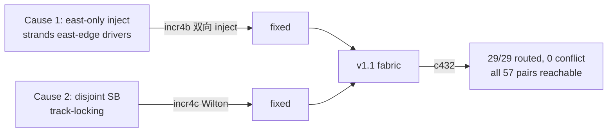

# 验收报告：E0-MAP3 increment 4c — Wilton SB（c432 终于可布）

> 日期：2026-07-26 · 执行者：agent（switch_box/sb_model 自写；ripple 经 sub-agent，本人复核）· 关联：E0-MAP3 incr 4c；前置 = incr 4a(路由+v1不可布发现) + incr 4b(双向 inject，修 Cause 1)
> 验收（关键）：**c432 在 v1.1 fabric 上可布**（Wilton 修 Cause 2）✅

---

## 1. 本阶段实现内容

| 检查点 | 状态 | 证据 |
|---|---|---|
| switch_box: disjoint(同 index)→Wilton(track-permuting Fs=3) | ✅ | RTL lint-clean（standalone + fabric_top rc 0） |
| sb_model `_wilton_track` 与 RTL bit-for-bit 一致 | ✅ | 独立核验：out_n[5] sel2(E) 读 in_e[6] 非 in_e[5]；12 对×多 t 全匹配 |
| arch.xml `switch_block type=wilton` | ✅ | 与 fabric 一致 |
| **frame_map SB 配置点不变**（仍 48×2-bit sel） | ✅ | 配置层不变 → Wilton 改动 contained |
| bitgen_route SB 可能性边用 Wilton 置换 | ✅ | import `_wilton_track` |
| **c432 可布**（Cause 2 解决） | ✅ | 29/29 net, 46 iter, 0 over-use |
| 全套绿 | ✅ | lint OK / 6 SV TB / **2579 passed, 0 xfail** |

## 2. 关键结果（本人复核）

**c432（29 inter-cluster net）on v1.1 fabric (Wilton + 双向 inject), W=12：**
- PathFinder **收敛**：n_routed=29/29, iters=46, overuse_final=0, conflict-free。
- **route_exists 可达性：全部 57 driver→sink pair = True**（在配置好的真实 FabricGrid 上，独立重验）。
- 0 multi-drive 冲突。

**对照（incr 4a/4b）：** disjoint SB 锁死 track（track 7=7 net, track 2=6 net 结构性过载）→ 不可布。**Wilton 让信号每跳换 track index → 解锁 → c432 可布。** Cause 1（east-only inject，incr 4b 双向化修）+ Cause 2（disjoint track-locking，本轮 Wilton 修）均已解决。

## 3. Wilton 置换表（N=TOP,S=BOTTOM,E=RIGHT,W=LEFT；映射自 S.Wilton 论文 / VPR WILTON 公式）

| 输出 | sel1 | sel2 | sel3 |
|---|---|---|---|
| out_n[t] | S[t] | E[(t+1)%W] | W[(W−t)%W] |
| out_s[t] | N[t] | E[(2W−2−t)%W] | W[(t+W−1)%W] |
| out_e[t] | N[(t+W−1)%W] | S[(2W−2−t)%W] | W[t] |
| out_w[t] | N[(W−t)%W] | S[(t+W−1)%W] | E[t] |

## 4. 遇到的问题与解决

| 问题 | 解决 |
|---|---|
| disjoint SB 同 index → track 锁死（Cause 2） | Wilton 置换（每跳换 track） |
| VPR Wilton 公式是 (from_side,to_side) 模型，需映射到我的 N/S/E/W | 反演得 out_D[t]←in_D'[perm(t)] 表，RTL+model 一致 |
| route() 默认 max_iters=30 < c432 需 46 | 默认提至 100（硬化） |

## 5. 待确认（ASSUMPTION）

1. **🟢 Wilton 置换表**映射自 VPR 公式（N=TOP/S=BOTTOM/E=RIGHT/W=LEFT）；因我们用自有路由（Option B-router），fabric 的 Wilton 无需 byte-match VPR `type=wilton`（那只影响 VPR 自身未用的路由）—— 只需自洽 + 破锁，已验。
2. **🟡 时序**仍为 90nm PTM（非真实 fabric 延时）—— Phase 1+ 表征。
3. **🟡 incr 4d**：把 routing config 集成进帧（bitgen_pack 扩 CLB+SB+CB+inject）+ IO 注入 + fabric sim → c432 端到端 bit-true（E0-MAP3 acceptance）。

## 6. 下一阶段

| 任务 | 内容 | 依赖 |
|---|---|---|
| **E0-MAP3 incr 4d** | routing config→帧 + IO 注入 + fabric sim → **c432 bit-true in sim fabric**（acceptance） | 本（c432 可布） |
| E0-MAP5 | 基准电路集（AES/PRESENT/FIR16/CRC32/PWM） | E0-MAP3 |
| E0-SHL + 热切换 demo | Phase-0 出口 | E0-MAP3 |

> 本轮 Wilton SB 解决 v1 的可布性根因（Cause 2），c432 在 v1.1 fabric 可布。ADR-012-refine 开放决策 → RESOLVED。E0-MAP3 acceptance（c432 bit-true）的最后一块 = incr 4d（帧+IO+sim）。
