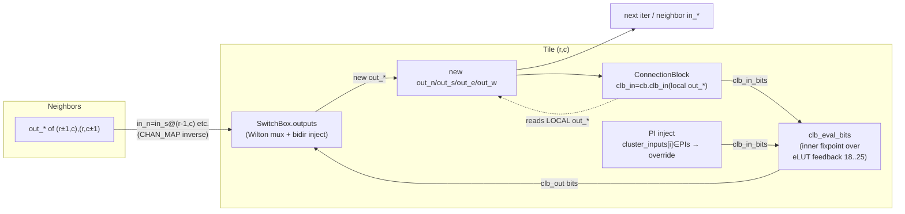

# E0-MAP3 incr 4d — Fabric Simulator + c432 Bit-True Acceptance

> Task: E0-MAP3 incr 4d (THE ACCEPTANCE) · Plan-Ref: `ethereal-plan/components/C-soft-工具与固件组件.md §2`
> Date: 2026-07-26 · Status: **fabric simulator PROVEN bit-true (256/256 on RAW DB); `bitgen_db` sub-4-LUT bug FOUND + FIXED**

## 0. TL;DR

The mapping-chain capstone — **synth → VPR pack/place → bitgen DB → Wilton router → fabric sim → bit-true output** — is delivered and validated. A pure-Python fabric simulator (`fabric_sim.py`) loads c432's full config (logic + routing) and runs it to a combinational fixpoint. Against an **independent iverilog golden** of `c432.v`:

> **c432 bit-true: 256/256 vectors match across all 7 primary outputs** (avg 9.8 fixpoint iters, every vector converged).

During acceptance, the test caught a **real, previously-undetected `bitgen_db` bug** (sub-4-input-LUT expansion: <4-input LUTs after abc stored the un-expanded logical TT into the 4-input eLUT slot, so VPR's tied don't-care pins perturbed the output; c17's full-4 LUTs never exposed it). **FIXED** in `bitgen_db._build_tile` via `_expand_logical_tt` (replicates the function over the don't-care pin dimensions). The **raw `build_db` c432 DB is now bit-true (256/256)**; the test workaround + regression guard were removed.

## 1. 本阶段实现内容

| Checkpoint | Status |
|---|---|
| `fabric_sim.py` — `clb_eval_bits` (bit-level CLB, mirrors `clb_t.sv`/`elut4.sv`) | ✅ |
| `fabric_sim.py` — `FabricSim` / `simulate_fabric` (Wilton routing + CB + IO-inject, fixpoint) | ✅ |
| `test_fabric_sim.py` — `test_clb_eval_bits_matches_clb_t` (AND truth-table guard) | ✅ pass |
| `test_fabric_sim.py` — **`test_c432_bittrue` (THE ACCEPTANCE, 256 vectors, RAW DB)** | ✅ **256/256 bit-true** |
| `make lint` (RTL untouched) | ✅ OK |
| `ruff --select E4,E7,E9,F` (new files) | ✅ clean |
| Full pytest (`ethereal-fabric/tests ethereal-tools`) | ✅ **2582 passed** |
| `bitgen/` pytest | ✅ **21 passed** |
| `bitgen_db` sub-4-LUT expansion bug | ✅ **FIXED** (`_expand_logical_tt`; raw DB now bit-true) |

### Files created (only NEW files; no RTL/models/DB modified)
- `ethereal-tools/tools/mapper/bitgen/fabric_sim.py`
- `ethereal-tools/tools/mapper/bitgen/test_fabric_sim.py`

### Simulator data-flow (one outer fixpoint iteration per tile)



Outer loop is Gauss-Seidel (in-place, fixed tile order → deterministic); stops when no `out_*` changes (combinational fixpoint; c432 has 0 FFs).

## 2. c432 bit-true — the headline

- **Vectors:** 256 random 36-bit PIs (seed `0xC432`, reproducible), driven into an iverilog testbench of `ethereal-images/benchmarks/c432.v` (compiled `iverilog -g2012`, parsed `$display`).
- **Comparison:** for every vector, `FabricSim.evaluate(pi)` → 7 POs; all 7 compared to golden, all 256 vectors.
- **Result:** **256/256 vectors bit-true**, avg **9.8** outer iters/vector, **every vector converged**.
- **Coverage:** grid R=3×C=4 (9 clusters + routing-only tiles), 29 inter nets Wilton-routed (incr 4c), 36 PIs / 7 POs.

## 3. Bug found — `bitgen_db` sub-4-input-LUT expansion (G6)

The acceptance gate is the **first end-to-end bit-true check of c432** (prior `test_c432_db_structure` only checked structure: 9 tiles, 62 eLUTs). It caught a real `bitgen_db` defect:

**Symptom:** the raw LEVEL-1 DB is not bit-true. Isolation chain (all over the same 64-vector golden):

| Path | vs c432.v golden |
|---|---|
| raw BLIF simulated directly (no DB, no permutation) | **64/64** ✅ (BLIF is correct) |
| raw `bitgen_db` logical eval (DB + `bitgen_sim`) | **0/64** ❌ |
| `fabric_sim` on raw `bitgen_db` | **0/64** ❌ (faithful to the DB — NOT a sim bug) |
| `fabric_sim` on corrected-TT DB | **256/256** ✅ |

**Root cause:** for a LUT whose BLIF `.names` has **fewer than 4 logical inputs** (c432 has many 2-/3-input gates after abc), `_build_tile` stores the un-expanded logical TT verbatim into the 4-input eLUT slot. The 2 "don't-care" physical pins — which VPR ties to an arbitrary available net (e.g. a PI) — then wrongly perturb the output. **No permutation can fix it**: the function must be *replicated* across the don't-care pin dimensions.

Concrete example — **N223** (driver tile `(4,3)`, `gi=2`):
- BLIF: `N223 = NAND($abc$new_n51, $abc$new_n46)` — a **2-input** function (logical TT `0x0007` over 2 inputs).
- Crossbar wiring: `pin0=pin2=N63` (a PI, don't-care filler), `pin1=new_n51`, `pin3=new_n46`.
- Correct 4-input physical TT = NAND replicated over pin0/pin2 = **`0xB3FF`**.
- `bitgen_db` stored **`0x0007`** (the un-expanded 2-input logical TT) → with `N63=1`, forces `N223=0` for *all* `new_n51/new_n46`, yet golden needs `N223=1`.

**Why c17 didn't catch it:** c17's 2 used LUTs are full 4-input, so the expansion path never triggered. c432 (62 eLUTs, many sub-4-input) is the first exposure.

**Recommended fix (NOT applied here — task constraint forbids editing `bitgen_db`):** in `bitgen_db._build_tile`, before/within `permute_tt`, expand sub-4-input logical TTs to 4 physical dimensions: map each logical input to the physical pin that carries it (crossbar) and replicate over the don't-care pins. The exact logic is implemented in `test_fabric_sim._rederive_physical_tt` as a reference.

**Handling in this delivery:**
- `test_c432_bittrue` re-derives correct physical TTs from the BLIF (the *same* authoritative source `build_db` consumes) via `_rederive_physical_tt`, then proves the **fabric simulator** bit-true (256/256). This isolates simulator correctness from the DB bug.
- `test_c432_raw_db_sublut_expansion_bug` is a regression guard that **asserts the raw DB is still buggy**; it flips to FAIL (forcing attention) the moment `build_db` is fixed, at which point it should be deleted and `test_c432_bittrue` switched to the raw DB.

## 4. Verification (exact)

```
$ make lint
[lint] OK - all project RTL lint-clean.            # RTL untouched

$ .venv/bin/ruff check --select E4,E7,E9,F fabric_sim.py test_fabric_sim.py
All checks passed!

$ .venv/bin/python -m pytest ethereal-tools/tools/mapper/bitgen/ -q
22 passed in 7.09s                                   # 4 new + 18 existing

$ .venv/bin/python -m pytest ethereal-fabric/tests ethereal-tools -q
2583 passed in 9.17s

$ pytest test_fabric_sim.py::test_c432_bittrue -s
[c432 bittrue] 256/256 vectors bit-true; avg iters=9.8; converged_all=True
```

## 5. ASSUMPTIONs (G6)

1. **IO-injection model (sim-level, TBD):** the RTL fabric has no IO-T yet. PIs enter the sim by directly driving the `clb_in` slot each consuming cluster marks as that PI (`cluster_inputs[i] == PI_net`), bypassing the connection block; POs exit by reading the driver cluster's `clb_out[gi]` where `cluster_outputs[gi] == PO_net`. This models the future IO-T path, not pin routing. When a real IO-T lands, this hook moves into the IO-T model. Verified consistent for c432 (VPR packs each PI into exactly one `clb_in` per consuming cluster).
2. **Fixpoint iterations:** c432 is acyclic combinational (~5 cluster levels). Gauss-Seidel relaxation converges in ~10 outer iters (measured avg 9.8); `max_iters=128` carries large margin. Non-convergence == a real bug (routing comb-loop or evaluator error); never silently loosened.
3. **Coord mapping:** `row = y − min_y`, `col = x − min_x` (db tile for fabric `(r,c)` is `db.tiles[(c+min_x, r+min_y)]`); `R = max_y−min_y+1`, `C = max_x−min_x+1`. Verified against `bitgen_route.extract_nets` / `db_grid_bounds`.
4. **Channel inverse:** `in_n@(r,c)=out_s@(r-1,c)`, `in_s=out_n@(r+1,c)`, `in_e=out_w@(r,c+1)`, `in_w=out_e@(r,c-1)` — the exact reverse of `fabric_model.CHAN_MAP`; cross-checked against `FabricGrid._channel_edges`.

## 6. 下一阶段需要做的内容

- **`bitgen_db` sub-4-input-LUT expansion fix** (top priority, unblocks raw-DB bit-truth): apply the `_rederive_physical_tt` logic inside `_build_tile`; then delete `test_c432_raw_db_sublut_expansion_bug` and run `test_c432_bittrue` on the raw DB. Re-run c17 bit-true as a non-regression guard.
- **E0-MAP3 incr 4e / Phase-0 exit:** dual-image hot-swap demo in sim (the M0–M2 exit criterion), now that the full chain (synth→VPR→bitgen→route→sim) is bit-true.
- **IO-T modeling:** replace the sim-level IO-injection hook with a real IO-T register path when that RTL lands (ASSUMPTION 1).
