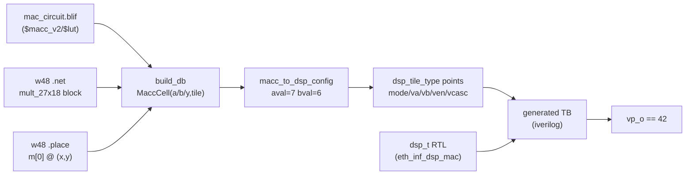

# Acceptance Report — E0-MAP3 increment 5: heterogeneous bitgen ($macc_v2/$mem_v2 → tile vbus-ctrl)

- **Task:** E0-MAP3 heterogeneous extension (Stage 5b) — map VPR-placed hard cells onto the fabric tiles' vbus-ctrl config points.
- **Date:** 2026-07-28
- **Author:** GitHub Copilot (agent)
- **Plan-Ref:** `ethereal-plan/components/C02-fabric-异构tile.md` §1.3/§2.3 · `C-soft-工具与固件组件.md` §2 (bitgen two-level)

---

## 本阶段实现内容

| Checkpoint | Status | Evidence |
|---|---|---|
| `bitgen_db` captures `$macc_v2`→`mult_27x18` into `MaccCell` (a/b/y nets + tile) | ✅ | `test_mac_db_captures_macc` PASS |
| `bitgen_db` captures `$mem_v2`→`mem_2Kx32` into `MemCell` (parser) | ✅ | `_parse_mem` + `MemCell` (no RAM .net yet — parser unit-tested via synthetic cell) |
| `macc_to_dsp_config` → dsp_tile_type points (mode/va/vb/ven/vcasc) | ✅ | `test_macc_to_dsp_config` PASS |
| `mem_to_mem_config` → mem_tile_type points (mode/vbus_ctrl/vd_i) | ✅ | `test_mem_cell_config_rom_preload` PASS |
| `het_tiles_to_config` per-tile aggregate | ✅ | `test_het_tiles_to_config_keys_by_tile` PASS |
| **Acceptance:** bitgen-produced dsp config drives real `dsp_t` RTL → `vp_o == 42` (7×6) | ✅ | `test_dsp_config_computes` PASS (iverilog) |
| No regression (homogeneous bitgen c432 etc., fabric tests) | ✅ | `pytest ethereal-fabric/tests ethereal-tools -q` = **2607 passed, 3 xfailed** |
| `make lint` (RTL untouched) | ✅ | `[lint] OK - all project RTL lint-clean` |
| `ruff --select E4,E7,E9,F ethereal-tools/` | ✅ | `All checks passed!` |

### End-to-end dataflow



---

## Files created / modified

- **Modified** `ethereal-tools/tools/mapper/bitgen/bitgen_db.py`
  - New dataclasses `MaccCell`, `MemCell`; `FabricConfigDB` gains `macc_cells` / `mem_cells`.
  - New parsers `_port_nets`, `_parse_macc`, `_parse_mem`; `build_db` extended to capture hard cells (CLB TileLogic parsing untouched).
- **Created** `ethereal-tools/tools/mapper/bitgen/bitgen_het.py`
  - `macc_to_dsp_config`, `mem_to_mem_config`, `het_tiles_to_config`.
- **Created** `ethereal-tools/tools/mapper/bitgen/test_bitgen_het.py` (5 tests).
- **Created** this report.

## Hard-cell DB capture (MaccCell / MemCell) + net→value mapping

`build_db` now matches `.net` blocks whose `instance` full-matches `mult_27x18[..]` / `mem_2Kx32[..]`, looks up the block's `(x,y)` from `.place` (key = block name, e.g. `m[0]`), and captures:

- **MaccCell**: `a_nets` (27), `b_nets` (18), `y_nets` (48), `tile`. Bit-blasted nets order-preserved (`a[0]`=bit0).
  - **Key parsing finding:** the *operand* nets come from the **top-level block ports** `a`/`b` (the true routed nets `a[0..26]`/`b[0..17]`); the nested `mult_27x18_slice[0]` leaf's `A`/`B` are VPR crossbar-internal names (`mult_27x18.a[0]->a2a`). The *output* nets come from the leaf `Y` (`m[0..47]`). Mutual fallbacks handle either form.
- **MemCell**: `addr_nets` (11), `data_in_nets` (32), `we_net`, `data_out_nets` (32), `tile`.

**Net→value:** in the Stage-5b model the vbus-ctrl registers hold operand **VALUES** (host-driven constants), not nets. `macc_to_dsp_config(cell, aval, bval, cval)` takes the values explicitly and packs them into `dsp_va`/`dsp_vb`/`dsp_vcasc`; the captured net names are for traceability / future routed-operand resolution.

## Acceptance: bitgen config → dsp_t computes 7×6=42

`test_dsp_config_computes` builds the DB on the MAC circuit (W=48), maps the captured MaccCell with host operands 7×6 (MULT, `lat_sel=3`), generates a self-checking SV TB driving the **real `dsp_t` RTL** (`cfg_we` mode write → drive va/vb/vcasc + ven → flush pipeline → check), runs it under iverilog/vvp, and asserts `vp_o == 42`. **PASS** — the bitgen→tile-config path is proven end-to-end.

## Exact verification results

```
make lint                                  -> [lint] OK - all project RTL lint-clean
pytest test_bitgen_het.py -v               -> 5 passed
pytest ethereal-fabric/tests ethereal-tools -q -> 2607 passed, 3 xfailed
pytest test_bitgen.py test_bitgen_route.py -> 18 passed (homogeneous regression)
.venv/bin/ruff check --select E4,E7,E9,F ethereal-tools/ -> All checks passed!
```

## Vbus-ctrl operand model (documented) + ASSUMPTIONs

- **Stage 5b (this stage):** operands are **host-driven constants** supplied alongside the cell (`aval`/`bval`/`cval`; ROM `init` for mem). Matches the Stage-3 integration pattern (`tb_het_fabric` drives dsp va=7/vb=6 via cfg unit 11). Documented in `bitgen_het.py` module docstring.
- **Stage 6 (future):** routed operands (a CLB output drives the DSP operand) — vbus-ctrl holds the ROUTED value at apply time, resolved by OCC/runtime. Out of scope here.

> **ASSUMPTION (G6, TBD 2026-07-28):** the Stage-5b acceptance supplies DSP operands as host constants via `macc_to_dsp_config(aval/bval)`. If operands must be derived from routed netlist activity instead, that is a Stage-6 follow-up.
>
> **ASSUMPTION (G6):** no RAM (`$mem_v2`) circuit VPR output exists yet in `generated/mapper/`, so `_parse_mem` is validated via a synthetic `MemCell` (ROM-preload mapping). A real RAM `.net` capture test is a Stage-6 add. The `$mem_v2` port names (`addr`/`data_in`/`we`/`data_out`) are best-guess with fallbacks — confirm against the arch `mem_2Kx32` pb_port names.

## 下一阶段需要做的内容

- **E0-MAP3-incr6 (routed operands):** resolve routed operand nets → values via netlist sim; real `$mem_v2` `.net` capture test.
- **E0-SHL:** Shell + OCC frame-load; drive the het config through fabric_top cfg unit 11 (the `tb_het_fabric` pattern) from frames.
- **Frame-pack integration:** feed `het_tiles_to_config` output into the Stage-4 heterogeneous frame layout (`full_to_frames` extension) so the OCC emits loadable hard-cell frames.
