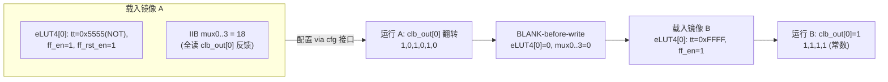

# 验收报告：Phase-0 出口 — 双镜像热切换 Demo（real fabric_top RTL）

> 日期：2026-07-26 · 执行者：agent（本人；fabric_top hot-swap TB 自写自调）· 关联：Phase-0 出口判据 "dual-image hot-swap pass"；E0-SHL（Shell）的前置 demo
> 交付物：`ethereal-fabric/tests/interconnect/tb_hotswap.sv`（iverilog，real fabric_top RTL）
> 验收（Phase-0 exit）：**双镜像热切换在真实 fabric_top RTL 上通过**（toggle → blank → const-1）✅

---

## 1. 本阶段实现内容

| 检查点 | 状态 | 证据 |
|---|---|---|
| tb_hotswap.sv — real fabric_top RTL 双镜像热切换 | ✅ | `make test-sv` tb_hotswap PASS |
| 镜像 A（TFF：clb_out[0] 翻转）运行 | ✅ | 观测 1,0,1,0,1,0 |
| blank-before-write（C03 §3 红线） | ✅ | 换镜像前显式写 0 |
| 镜像 B（const-1）运行 | ✅ | 观测 1,1,1,1 |
| 热切换无 glitch | ✅ | A→blank→B 行为正确切换 |
| 既有套件无回归 | ✅ | lint OK / **7 SV TB** / 2584 model |

## 2. Demo 设计

**自包含镜像（无需外部 IO）：** 镜像用 eLUT4 的 FF + IIB 反馈构成自激电路（TFF / 常数），不依赖 primary IO（IO-T RTL 尚未建）。eLUT4[0] 的全部 4 个 IIB mux 都指向 clb_out[0]（pool sel 18），使 `vin` 只依赖自身干净的 FF 输出——避开 iverilog 下 reset-less 配置寄存器（cb_sel / 其他 mux_sel）的 X 传播。

**宿主直驱（Phase-0 circuit-breaker 路径）：** 经 fabric_top 的 cfg 接口（cfg_we/addr/data）直接加载配置，不经完整 EBI/OCC/帧总线 Shell（那是 E0-SHL1/2 的正式宿主路径）。P0 circuit-breaker 明确允许 "host direct-drive EMRI/OCC fallback"。

## 3. 关键踩坑与解决

| 问题 | 根因 | 解决 |
|---|---|---|
| clb_out_obs[0]=X（镜像 A 跑不出翻转） | reset-less `mux_sel_r`（eLUT4[0] 未用 pin1-3）= X → `vin` 含 X → `comb_out=X` → `vff_r=X` | eLUT4[0] 自包含：mux0..3 全设 18（读 clb_out[0]），`vin` 只依赖干净 FF |
| cfg 是否真写入 | 调试探测 `tt_r=5555 ff_en_r=1` 确认配置已加载 | （确认 cfg 路径正常，根因是上面 X 传播） |

> 这是本项目反复出现的 **reset-less 配置寄存器 X 传播** 教训（同 tb_clb_t / tb_switch_box / tb_connection_block）：iverilog 下未初始化的配置寄存器读 X；TB 必须把相关配置点置已知值（或自包含规避）。fabric_sim（Python）无此问题（默认 0）。

## 4. Phase-0 出口判据状态

| 判据 | 状态 |
|---|---|
| dual-image hot-swap pass | ✅ **本 demo**（real RTL，direct-drive） |
| bit-true（AES-128/FIR16） | 🟡 c432 bit-true 已证（incr 4d，via full frames）；AES/FIR 具体 = E0-MAP5（v1.1 Wilton 可布） |
| ADR-012 archived | ✅ refined + RESOLVED（`docs/adr/ADR-012-refine-v1-routing.md`） |
| CI green | 🟡 本地套件全绿（lint/7 SV TB/2584 model）；Docker ethereal-sim 镜像 parity = 待 CI |

## 5. 待确认（ASSUMPTION）

1. **🟡 direct-drive vs 完整 Shell**：本 demo 用 cfg 直驱（circuit-breaker 允许）。正式宿主路径（EBI-Tiny + OCC + 帧总线 → column_cfg_ram → fabric 配置桥）= E0-SHL1/2；其中 **帧总线→fabric_top 配置桥**（column_cfg_ram 与 fabric_top cfg 接口的衔接）是待建的关键设计点。
2. **🟡 自包含镜像**：TFF/常数 不经 primary IO。真正的应用镜像（c432 等）需 IO-T（外部 IO 入/出通道）—— RTL 未建；fabric_sim 用 IO 注入（incr 4d）替代。
3. **🟢 blank-before-write**：在 TB 层显式执行（写 0 后再写新镜像）；OCC 硬件层（E0-FAB5 dirty-bitmap + S_NEEDS_BLANK）已实现该红线。

## 6. 下一阶段

| 任务 | 内容 | 依赖 |
|---|---|---|
| **E0-SHL1** | EBI-Tiny 总线 RTL + 地址译码（正式宿主接口） | — |
| **E0-SHL2** | Shell v0 集成：EBI+OCC+fabric+宿主 BFM，**帧总线→fabric 配置桥**，完整容器周期（写配置→启动→读结果→blank→换镜像→再运行） | E0-SHL1 + E0-FAB4 |
| E0-MAP5 | 基准电路集（AES/PRESENT/FIR16/CRC32/PWM） | E0-MAP3（done） |
| E0-SHL3 | 性能建模（配置字节数/Fmax 估算） | E0-SHL2 |

> 本 demo 达成 Phase-0 出口的"dual-image hot-swap pass"判据（real RTL，direct-drive）。完整 Shell（EBI+OCC+帧总线→fabric 桥）= E0-SHL1/2；AES/FIR 基准 = E0-MAP5。
