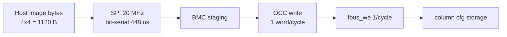

# 验收报告：E0-SHL3 — 性能建模（配置字节数 / 时延模型 / 虚拟 Fmax 初值）

> 日期：2026-09-01 · 执行者：agent（PerfModel；脚本自写，数字全部脚本复算）· 关联：E0-SHL3（deps E0-SHL2）；Plan-Ref ethereal-plan/subsystems/S02（OCC）
> 交付物：`docs/performance-model.md` + `ethereal-tools/tools/perf_model.py`
> 验收标准（ethereal-tasks.yaml E0-SHL3）：**给出 4x4 fabric 配置字节数与 Fmax 估算并归档** ✅

---

## 1. 本阶段实现内容

| 检查点 | 状态 | 证据 |
|---|---|---|
| 配置尺寸模型（bits/tile、words/frame、image 字节数）脚本复算 | ✅ | `perf_model.py`：v1.1 tile = CLB 320 + SB 120 + CB 108 = **548 bit** |
| 4x4 同构 image 字节数 | ✅ | 2192 bit/col → 69 data + 1 CRC = 70 words/frame × 4 帧 = 280 words = **1120 B** |
| 2x2 同构 / 2x2-het image 字节数 | ✅ | 288 B / 228 B（het：col0 27+1、col1 28+1 words） |
| 与冻结 artifact 交叉核对 | ✅ | het `frame_map.json` 的 `per_column_data_words=[27,28]`、`tile_width_bits=548` 脚本断言通过 |
| OCC 时延模型（自 `occ_top.sv` FSM） | ✅ | WRITE/BLANK = N+2 cyc、READBACK = N+3 cyc；4x4 全镜像写 288 cyc |
| 配置时间公式 + 50/100 MHz 具体值 | ✅ | T = Σ(N_col+2)/f_occ；4x4 全写 5.76 µs @50 MHz、2.88 µs @100 MHz |
| 热替换预算 vs Phase-1 目标 | ✅ | blank+write+readback @50 MHz = 17.36 µs（目标 <10 ms BMC+DMA，~500× 余量）；SPI@20 MHz = 448 µs（目标 <100 ms，>200× 余量） |
| 虚拟 Fmax 初值归档 | ✅ | c432 CPD 5.111 ns / **Fmax 195.66 MHz**（report-E0-MAP2-20260725）；含 v1.1 Wilton 未重表征 caveat |
| `docs/performance-model.md`（英文 + 表格 + Mermaid 预算图） | ✅ | 见交付物 |
| `perf_model.py` 质量门禁 | ✅ | `py_compile` OK、`ruff check` 0 错误、脚本运行 rc 0 |

## 2. 关键结果（perf_model.py 输出，本人复核）

| 模型项 | 数值 |
|---|---|
| bits/tile（v1.1） | 320 + 120 + 108 = **548** |
| 4x4 words/frame | ⌈2192/32⌉ = 69 data + 1 CRC tail = **70** |
| 4x4 image | 4 帧 × 70 words × 4 B = **1120 B** |
| 2x2 同构 image | 2 × 36 words = 288 B |
| 2x2-het image | 28 + 29 words = **228 B** |
| OCC 全写（4x4） | 4×(70+2) = 288 cyc → 5.76 µs @50 MHz |
| OCC 验证热替换 | 868 cyc → 17.36 µs @50 MHz |
| SPI @20 MHz | 1120 B × 8 / 20 MHz = 448 µs |
| 虚拟 Fmax（c432, VPR） | 195.66 MHz（CPD 5.111 ns） |

**结论**：4x4 镜像配置时间由**传输链路主导而非写引擎**——OCC 引擎仅 µs 级，Phase-1 两条目标路径（<10 ms BMC+DMA / <100 ms host SPI）余量 >100×，Phase-1 无需扩写引擎带宽。

## 3. 遇到的问题与解决

| 问题 | 根因 | 解决 |
|---|---|---|
| 三个历史 frame_map JSON 数值不一致（416 / 532 / 548 bit/tile） | `generated/frame_map_4x4.json`（416）为 v1.0 disjoint-SB 时代产物；`generated/fabric_4x4/frame_map.json`（532）为 incr4b 单向 inject 时代（无 inj_dir、SB=96+8+108） | 以当前 `frame_map.py`（bidir inject 后 SB=120）为 SoT 复算 548；交叉核对以最新 het JSON 为准；在模型文档中只引用可复算值 |
| OCC `word_count_i` 是否含 CRC16 尾字 | frame_map 的尾字是镜像侧帧几何；OCC 写引擎只认 `word_count_i` 流式字 | 建模为宿主把尾字作普通字流式写入（N = words_per_frame），OCC 自身另算 CRC32；doc 中注明假设 |

## 4. 待确认清单（ASSUMPTION）

1. **🟡 虚拟 Fmax 基于 v1.0 VPR arch（subset/disjoint SB）**；v1.1 Wilton mux 延时**未在 VPR 重表征**（arch 已改 `type=wilton` 但 c432 时序未重跑）——Fmax delta 未知，预计小（Fs 仍 3、单级 mux）但未证。开放项：Wilton arch 重跑 c432。
2. **🟡 时序值为 90 nm PTM**（继承 k4_N4 模板），非真实 fabric 延时——Phase-1+ 硅/表征后替换。
3. **🟡 dsp_t MAC 流水线延时**：镜像可选 `lat_sel[1:0]` = 0–3 拍（eth_inf_dsp_mac）；级联链 Fmax 压力取决于 EDA 对行为级 MAC 的推断（ADR-017）。
4. **🟡 SPI 建模仅 bit-serial 传输成本**，未含 BMC 侧每字解析/缓冲开销（目标余量 100×+，非关键路径）。

## 5. 本阶段实现内容（交付物清单）

- `docs/performance-model.md` — 英文模型文档：§1 配置尺寸（含逐 bit 算术）/ §2 OCC 时延公式 / §3 预算 vs 目标 / §4 虚拟 Fmax + caveat / §5 开放项。
- `ethereal-tools/tools/perf_model.py` — 全部数字的复算脚本（`python3 ethereal-tools/tools/perf_model.py`，rc 0，含对 het JSON 的断言核对）。

## 6. 下一阶段需要做的内容

| 任务 | 内容 | 依赖 |
|---|---|---|
| E0-MAP 后续 | Wilton VPR arch 重跑 c432 → Fmax delta 报告（关闭 ASSUMPTION #1） | 本（caveat 已归档） |
| E1-PLT1 | GW5 hal 映射后 post-P&R 虚拟 Fmax，替换 90 nm PTM 估算 | E1-PLT1 物理开销结果 |
| E1-PLT4 / S02 后续 | Phase-1 用本模型 1120 B 预算校验 SPI/DMA 通道选型 | 本（预算表） |
| Phase-1 Stage 6 | dsp_t 级联（fir16）实测吞吐，校核 lat_sel 建模 | Stage 5/6 |

> 本阶段把配置尺寸（4x4 = 1120 B）、OCC 时延公式与虚拟 Fmax 初值（195.66 MHz）归档为可复算模型（perf_model.py 单一入口），Phase-1 通道/调度设计可直接引用预算表。
