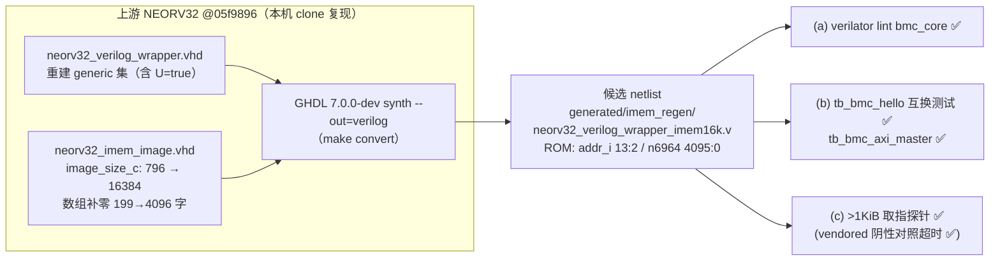

# 报告：E1-BMC1 IMEM 重生成 spike — vendored NEORV32 netlist 物理 1 KiB ROM 的根因、复现与 16 KiB 候选

> 日期：2026-09-01 ｜ 类型：调查 spike + 候选产物（**未集成**）｜ 解决
> `report-E1-RUN2-daemon-20260901.md` 待确认 #1（🔴 硬件负载级发现）。
> 产物：`generated/imem_regen/neorv32_verilog_wrapper_imem16k.v`（候选 netlist，
> 位于 gitignored 的 generated/ scratch，非 vendored 替换）。

## 背景

E1-RUN2 发现：vendored `neorv32_verilog_wrapper.v` 的 IMEM ROM 物理深度仅
**1 KiB**（`imem_rom` 读 `addr_i[9:2]`、数组 `n6964[255:0]`），与
`bmc_core.sv`/README 标注的"16 KiB"不符；~8 KiB daemon 固件无法 ROM 启动，
sim 暂以 DMEM-exec bootstrap 规避。本 spike 回答四个问题：netlist 出处、
要改哪些 generic、本机能否重生成、重生成后是否等价。

## 出处与根因（provenance）

- vendored netlist 头部标注：上游 NEORV32 **v1.13.3.2 / commit `05f9896`**，
  `cd rtl/verilog && make convert`（GHDL `synth --out=verilog`），
  GHDL 7.0.0-dev（LLVM，OSS-CAD Suite），2026-08-08 为开 XBUS 重新生成。
- **本机完整复现了该流程**（见下"配置复现"），证明头部标注属实。
- 根因（上游源码 `rtl/core/neorv32_imem_rom.vhd:36` 实证）：

  ```vhdl
  constant awidth_c : natural := index_size_f(image_size_c); -- 物理字节地址宽
  ...
  rdata <= image_data_c(to_integer(unsigned(addr_i(awidth_c-1 downto 2))));
  ```

  **ROM 的物理深度由 `neorv32_imem_image.vhd` 里的 `image_size_c`（烧录镜像
  字节数）决定，而不是由 top-level generic `IMEM_SIZE` 决定。** `IMEM_SIZE`
  （经 `neorv32_imem.vhd` → `AWIDTH=14` 传入）只决定地址译码窗口并做一次
  `image_size_c <= 2**AWIDTH` 的溢出断言。2026-08-08 生成时用了上游默认镜像
  （199 字 = `image_size_c=796` B → `index_size_f(796)=10` → 物理 2^10 = 1 KiB），
  于是窗口是 16 KiB、物理 ROM 是 1 KiB：超出 0x3FF 的取指在同一 1 KiB 内回绕
  （alias），由本 spike 的阴性对照实验实证（见"测试证据"§4）。

## 配置复现（精确到 bit）

GHDL 把每个 module 的 generic 值 mangle 进 module 名（自然数直列 + 布尔向量
SHA-1 hash），因此**重生成 netlist 与 vendored 的 module 名集合相等 ⟺ 配置
逐位相等**。方法：按 README/`bmc_core.sv` 标注重建 wrapper generic 集，重生成后
diff module 名；仅 `neorv32_cpu`/`neorv32_cpu_control`/`neorv32_top` 的 hash 不符，
逐个翻转 CPU 控制相关布尔后锁定唯一差异为 **`RISCV_ISA_U=true`**（README 未记录
该项）。最终：

- 26 个 module 名（含全部 generic hash）与 vendored **完全一致**；
- 用默认 796 B 镜像重生成的 netlist 与 vendored **逐字节相同**（diff = 0 行，
  唯一差别是 wrapper module 名与人工 provenance 头）。

由此锁定 vendored 配置的完整 generic 集（重建 wrapper：
`generated/imem_regen/wrapper_src/neorv32_verilog_wrapper_imem16k.vhd`）：

| 项 | 值 | 项 | 值 |
|---|---|---|---|
| CLOCK_FREQUENCY | 100 MHz | CPU_FAST_MUL_EN / CPU_FAST_SHIFT_EN | false / false |
| BOOT_MODE_SELECT | 2（IMEM 镜像 ROM 启动） | PMP_NUM_REGIONS / HPM_NUM_CNTS | 0 / 0（HPM_CNT_WIDTH=40）|
| RISCV_ISA | C+M+**U**（其余全 false） | IMEM_EN / IMEM_SIZE / IMEM_OUTREG_EN | true / 16 KiB / false |
| OCD_EN | false | DMEM_EN / DMEM_SIZE / DMEM_OUTREG_EN | true / 16 KiB / false |
| ICACHE_EN / DCACHE_EN / SMC_EN | false | XBUS_EN / XBUS_REGSTAGE_EN / XBUS_TIMEOUT | true / false / 2048 |
| IO_UART0_EN（RX/TX FIFO=1） | true | 其余全部 IO（CLINT/SPI/TWI/DMA/TRNG/…） | false |

## 要改什么（IMEM generics / 镜像）

- `IMEM_SIZE => 16*1024` **本来就已经是 16 KiB**（窗口）。物理 ROM 深度要改的是
  **`rtl/core/neorv32_imem_image.vhd`**：`image_size_c := 16384` 并把
  `image_data_c` 数组补零到 4096 字（本 spike 保留原 199 字默认镜像作前缀）。
  其它 generic 一律不动（FAST_MUL 保持 false —— ADR-017 禁 vendor DSP 的推论不变）。
- 期望结构（已实证）：`imem_rom` 读 **`addr_i[13:2]`**（不是 [15:2]——16 KiB
  字节地址 → 字地址 12 bit），数组 `n6964[4095:0]`。
- **好消息：ROM 数组节点名不变（仍为 `n6964`）**，`tb_bmc_hello`/`tb_bmc_fw`/
  `tb_bmc_daemon` 等全部后门预载路径无需修改。



## 本阶段实现内容

1. 读完 README/`bmc_core.sv`/netlist 头/`bmc-fw/{link.ld,boot/crt0.S}`/RUN2 待确认 #1，
   实证 vendored ROM 物理 1 KiB 并定位上游根因（`image_size_c` 定深度）。
2. 工具链核查：本机 `~/oss-cad-suite` **自带 GHDL 7.0.0-dev（LLVM）**，与原始生成
   同族版本；yosys 侧有 `ghdl.so` 插件但本流程不需要（`make convert` 只用
   `ghdl synth --out=verilog`）。NEORV32 源码不在 repo / oss-cad-suite，已按
   头部 commit `05f9896` clone 到 scratch（用后已删，runbook 可复现）。
3. **重建 wrapper 配置并经 module-hash + 逐字节 diff 双重验证**（发现 README 漏记
   `RISCV_ISA_U=true`）。
4. 生成 16 KiB 候选 netlist `generated/imem_regen/neorv32_verilog_wrapper_imem16k.v`
   （module 名保持 `neorv32_verilog_wrapper`，可直接 drop-in），与 vendored 的
   结构差异**仅 3 行**（`n6952` 位宽 8→12、`addr_i[9:2]`→`[13:2]`、
   `n6964[255:0]`→`[4095:0]`）外加 3840 行 ROM 初始化补零。
5. 三级验证（下节）+ README.md 追加 Notes（append-only）+ 本报告。
   未触碰 vendored netlist / `bmc_core.sv` / bmc-fw / tests / Makefile。

## 测试证据

| # | 验证 | 命令（要点） | 结果 |
|---|---|---|---|
| 1 | 配置复现 | 重建 wrapper + 默认镜像 `make convert` → diff vendored | module 名集合+hash 全同；**netlist 逐字节相同** |
| 2 | (a) lint | `verilator --lint-only -Wall`（Makefile bmc_core waiver 集）`bmc_core.sv + eth_wb2axi.sv + 候选` | **PASS**（0 新警告路径） |
| 3 | (b) 互换测试 | 未修改的 `tb_bmc_hello`（iverilog）分别对 vendored / 候选 | 两侧均 `TEST PASSED`，UART 字节 `H I \n` 相同、`$finish` 时刻相同（2645000 ps）；附 `tb_bmc_axi_master`（XBUS 路径）对候选 **PASS** |
| 4 | (c) ROM 结构 | grep 候选 `imem_rom` | `addr_i[13:2]`、`n6964[4095:0]` ✅；功能探针 `generated/imem_regen/tb_bmc_imem16k_probe.sv`：代码放 0x400（1 KiB 之外）→ 候选打印 'X' **PASS**；同一 TB 对 vendored → 取指回绕、看门狗超时 **FAIL（阴性对照，证明探针有效）** |

> 慢 gate 说明：本 slice 未改 bmc-fw / emri RTL / vendored netlist，按约束不重跑
> 两个慢固件 TB（tb_bmc_fw / tb_bmc_daemon）。候选替换 vendored 属于后续集成
> 决策，集成时须重跑全量 `make test-sv`。

## 待确认 / ASSUMPTION 汇总（G6）

1. 🟡 候选 netlist 的烧录镜像 = 原 199 字默认镜像 + 补零（内容无意义：sim 里各 TB
   `$readmemh` 覆写 ROM；真机镜像本就在构建期由 image_gen 重新烧录）。若 maintainer
   希望默认镜像非零可换——不影响本结论。
2. 🟡 候选尚未做 FPGA/synth 资源评估（16 KiB ROM = BRAM 推断变化），属集成时检查项。
3. 🟢 README "IMEM 16 KB" 标注与本发现的关系已在 README Notes 节追加说明（append-only，
   未改原表）。

## 下一阶段需要做的内容

1. **集成决策（maintainer）**：若采纳候选，流程 = 用
   `generated/imem_regen/neorv32_verilog_wrapper_imem16k.v` 替换
   `ethereal-shell/rtl/bmc/neorv32_verilog_wrapper.v`，刷新 provenance 头
   （日期/镜像说明），**无需**改任何 TB 后门路径（数组仍 `n6964`）；重跑
   `make lint` + 全量 `make test-sv`（含两个慢固件 TB）。
2. **去 DMEM-exec bootstrap（E1-BMC1 收尾）**：候选到位后，`bmc-fw/link.ld` 可改回
   ROM 常驻布局（.text 进 IMEM，16 KiB ≥ ~8 KiB daemon），`crt0.S` 恢复
   ROM→RAM .data copy，TB 去掉 4 条 dmem lane 预载，解除 RUN2 待确认 #1。
3. **Maintainer 重生成 runbook**（如需自行复现而非采用候选）：

   ```bash
   export PATH=$PATH:$HOME/oss-cad-suite/bin   # GHDL 7.0.0-dev (LLVM)
   git clone https://github.com/stnolting/neorv32 && cd neorv32
   git checkout 05f9896f53f041a7f9fd041cde9f069f3f591986
   # wrapper：用 generated/imem_regen/wrapper_src/neorv32_verilog_wrapper_imem16k.vhd
   #   覆盖 rtl/verilog/neorv32_verilog_wrapper.vhd（entity 名须保持 neorv32_verilog_wrapper）
   # 镜像：用 generated/imem_regen/wrapper_src/neorv32_imem_image_16k.vhd
   #   覆盖 rtl/core/neorv32_imem_image.vhd（image_size_c=16384，4096 字）
   cd rtl/verilog && make convert              # ~15 s
   # 检查：imem_rom 读 addr_i[13:2]、数组 [4095:0]、module 名集合与现 vendored 一致、
   # 数组节点名（本次为 n6964）→ 若变则同步更新各 TB 后门路径注释。
   ```
