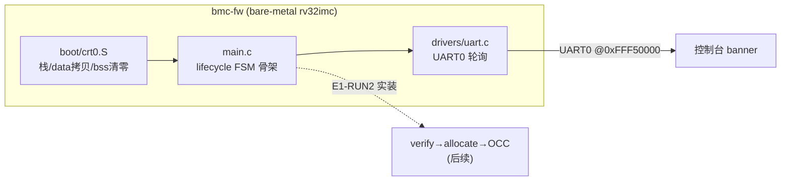

# 报告：E1-BMC2 bmc-fw 固件框架骨架（首个 C 固件跑通 BMC）+ riscv 工具链就绪

> 任务：E1-BMC2 — 固件框架（boot 双分区 + 驱动层 + lifecycle 骨架），Phase-1 BMC 第 5 步
> 检查点（S05 §3 Phase-1 #2）：UART 启动；状态机空转；FW 自更新演示
> 日期：2026-08-30
> Plan-Ref：`ethereal-plan/subsystems/S05-BMC与EMRI-mFSM.md` §2.2（固件模块）；`ethereal-plan/components/C05-BMC组件.md` §4.2（lifecycle FSM）

## 本阶段实现内容

### ✅ 解除工具链阻塞（关键前置）

- 报告 `report-P1-bmc-neorv32-sim` 注明"本机无 riscv-gcc → 手汇编 rv32i 不可持续"。本机有网络 + apt 有裸机 `gcc-riscv64-unknown-elf`（+ binutils + picolibc），但**无 sudo**。
- 解法：`apt-get download` + `dpkg -x` **用户态本地解包**到 `~/tools/riscv/`（不改系统、无 sudo、可逆）→ 得到可用的 `riscv64-unknown-elf-gcc`，验证 `-march=rv32imc -mabi=ilp32 -nostdlib` 编译通过。**手汇编时代结束，可写真实 C 固件。**

### ✅ bmc-fw 框架骨架（`ethereal-runtime/bmc-fw/`）

- **`link.ld`**：NEORV32 存储映射——IMEM(ROM 启动) @0x0、DMEM @0x80000000、UART0 @0xFFF50000、mtvec=0x0；`.text/.rodata` 在 ROM，`.data` LMA 在 ROM/VMA 在 RAM（crt0 拷贝），`.bss` 清零。与 `bmc_core.sv` 一致。
- **`boot/crt0.S`**：`.text.crt0` 最先（`_start` 落在 0x0）；设栈顶=DMEM 顶、拷贝 .data、清 .bss、`call main`、返回后 `wfi` 停机。
- **`drivers/uart.c/.h`**：NEORV32 UART0 最轮询驱动（CTRL 使能 + TX_NFULL 轮询 + DATA 写；puthex32 助手）。无动态内存。
- **`main.c`**：lifecycle 骨架——region 状态机（EMPTY→LOADED→RUNNING→EMPTY）静态表 + 转换函数，boot 打印 banner、对 region0 空转一轮、打印终态。**无动态内存**（G1 合规）。
- **`Makefile` + `bin2hex.py`**：编译→链接→objcopy→bin→hex（每行一个 32 位字，供 `$readmemh` 后门预载 IMEM ROM）；hex 补齐到 ROM 深度 256 字（消 "not enough words" 警告，对齐 gen_bmc_hello 约定）。工具链解析顺序 `$RISCV` → `~/tools/riscv` → PATH。

### ✅ 验证 TB（`ethereal-fabric/tests/bmc/tb_bmc_fw.sv`）

- 预载 `bmc_fw.hex` 进 IMEM ROM，**精确匹配全部 104 字节** UART 输出（boot banner + lifecycle `LRS` + 终态 + idle spin），证明真实 C 固件在 BMC 上完整启动+运行。
- 固件只碰 UART0（无 XBUS），AXI 主口良性栓定（对齐 tb_bmc_hello）。
- 已接入主 `make test-sv` 回归（先 `make -C ethereal-runtime/bmc-fw` 建镜像）。

## 验证结果

| 检查 | 结果 |
| --- | --- |
| bmc-fw 构建（rv32imc/ilp32） | ✅ crt0+main+uart 编译/链接/hex 全过 |
| `tb_bmc_fw`（iverilog/vvp） | ✅ TEST PASSED（C 固件启动 + lifecycle 空转 + 104 字节精确匹配） |
| `make test-sv` | ✅ **28 个自测 TB 全过**（27 + tb_bmc_fw） |
| `make lint` | ✅ OK — 全项目 RTL lint-clean |
| `make test-model` | ✅ 2639 passed（无回归） |
| `make formal` | ✅ 4/4 证明全过 |

## 结构图（bmc-fw v0 骨架）

## 待确认 / ASSUMPTION 清单（G6）

- **工具链为用户态本地解包**（`~/tools/riscv`），非系统安装。维护者若要系统级/CI 安装或固定特定版本，请指定——本解包只是解除本地阻塞。
- v0 骨架**未做 FW 自更新演示**（需 flash 双分区 + 镜像落存，属 E1-BMC2 后半 + E1-IO 存储通道）。故 E1-BMC2 标 **in_progress**（骨架过，自更新待）。
- lifecycle 骨架 v0 无硬件副作用（纯状态机）；verify/allocate/OCC 实装入 E1-RUN2。
- 裸机用 picolibc 的头文件但未链接 libc 函数（全部自实现驱动）——若后续要用 libc，需在 link.ld/启动补齐。

## 下一阶段需要做的内容

- **E1-RUN2 daemon**：在本骨架上实装 verify（Ed25519）→region 分配→OCC(DMA) 加载→生命周期，run/stop/ps/restart 全通。
- **E1-BMC3 调试通道**：UART 控制台 + JTAG + OpenOCD（GDB 断点，零付费工具）。
- **E1-IO1**：EFP-SPI 帧协议（daemon 的主控通道）。
- **bmc-fw FW 自更新**：flash 双分区（E1-BMC2 后半，依赖存储通道）。
