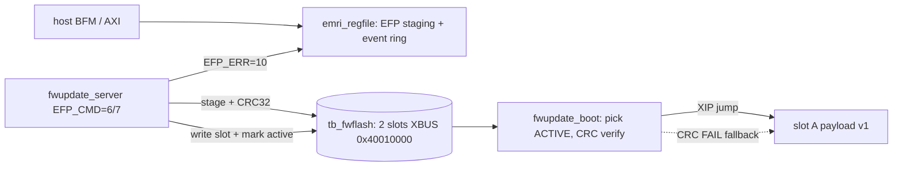

# E1-BMC2 增量 — 双分区 FW 自更新演示（sim 范围）

- **Date**: 2026-09-11 (work executed 2026-09-08, fixed + verified 2026-09-11) · **Status**: ✅ PASS (sim scope)
- **Plan-Ref**: `ethereal-spec/control/emri-v0.md` §3.6 (v0.4); `ethereal-plan/subsystems/S05-BMC与EMRI-mFSM.md`
- **Scope**: `ethereal-runtime/bmc-fw/fwupdate/**`, `ethereal-fabric/tests/bmc/tb_bmc_fwupdate.sv`, bmc-fw/Makefile + root Makefile test-sv line. 无 RTL 改动（EMRI 寄存器面复用 v0.4 的 staging + event ring）。

## 1. 本阶段实现内容

| 检查点 | 状态 | 证据 |
|---|---|---|
| 双 slot 布局（magic/version/len/crc32/flags + XIP payload，512 B flash 窗） | ✅ | `fwupdate/fwupdate.h` 常量；TB `tb_fwflash` 模型 |
| Boot stub：ACTIVE 选择 → CRC32 校验 → XIP 跳转；损坏回退 last-known-good | ✅ | TB 场景 1/4：`boot: slot A v1 crc ok`、`boot: slot B v2 crc FAIL` + `boot: fallback to last-known-good` |
| `fw_update`（EFP_CMD=6）：staging → CRC32 → 写 slot → 置 active → 事件 → 重入 boot | ✅ | TB 场景 2：`fw: crc ok` → `fw: slot B active, reboot` → `payload: 2`；flash flags/CRC 断言 |
| CRC 篡改拒绝（EFP_ERR=10 `fwupdate`，零 flash 写入） | ✅ | TB 场景 3：`fw: crc BAD (no flash write)` + slot A 头未动 + active 未变 |
| 事件环记录 slot_change（code 3，region=slot，stamp=version） | ✅ | TB 场景 5：4 条事件（A, B-update, B-boot, A-fallback）+ W1C 清空 |
| `reboot`（EFP_CMD=7）重入 boot stub | ✅ | TB 场景 4：`fw: reboot` |
| 生产 daemon 对 6/7 应答 `bad_cmd`（demo 为独立固件变体，spec §3.6 约定） | ✅ | `daemon.c` 默认分支（既有行为） |
| `-Wall -Wextra -Werror` + 无动态内存 | ✅ | bmc-fw Makefile 交叉编译通过（rv32imc/ilp32） |

## 2. 验证结果

`tb_bmc_fwupdate`（Verilator `--binary --timing`，5 场景，30 检查，真实 C 固件 + 真实 slot payload RV32IMC 镜像）：

```
[1] boot slot A (v1)      ok: slot A selected + CRC ok / payload: 1
[2] fw_update -> slot B   ok: ×8（含 flash: B active=1, A active=0, B header CRC）
[3] tampered CRC trailer  ok: ×6（EFP_ERR=10, 零写入）
[4] corrupt B + reboot    ok: ×5（CRC FAIL → fallback → payload: 1）
[5] event ring            ok: ×6（count=4, 顺序/内容, W1C clear）
TEST PASSED: 30 ok / 0 fail  ($finish at 979us)
```

回归（2026-09-11，本波次）：`test_demo_images` 6/6 · `test_bitgen` 16/16 · `test_bench_flow` 10 pass + 2 xfail · 其余模型 **2651 passed** · `ruff` clean · `make lint` OK（RTL 未改动）。

## 3. 示意图



## 4. 遇到的问题与解决

| 问题 | 根因 | 解决方案 | 搜索关键词 |
|---|---|---|---|
| TB 三项 `wait_uart_contains` 超时（`boot: slot A v1 crc ok` 等永不出现），sim 拖到 6 s；功能面全部 ok | boot stub 的 ok/FAIL 分支只打印 `" crc ok\n"` / `" crc FAIL\n"`（行首空格即缺失前缀的证据），未打印 slot/版本选择行 | 新增 `boot_print_selection()`（`boot: slot <A\|B> v<version>`，版本取 header word 1）供 ok/FAIL 两分支共用；重跑 30/30，sim 979 µs | `neorv32 bare-metal uart puts` |

## 5. 待确认清单（ASSUMPTION）

- reboot 为**模拟**（重入 boot stub）：vendored NEORV32 netlist 无可达核内软复位（ASSUMPTION TBD 2026-09-08，写入 `fwupdate.h`）。
- 本固件为 **sim-only 演示变体**：生产 daemon 对 6/7 应答 `bad_cmd`；真实 SPI flash、Boot-ROM 锚定、防回滚属 E2-SEC1/E2-BMC 范围。
- flash 由 TB 模型提供（非易失：无 reset 清零）。
- 版本打印为 1 位十进制（demo 版本 1–9 由构造保证）。

## 6. 下一阶段需要做的内容

| 任务 ID | 内容 | 依赖 |
|---|---|---|
| E1-BMC2 | 本增量闭合：三条验收（UART 启动 / region 生命周期 / FW 双分区自更新）证据齐 → 置 `done`（sim 范围） | — |
| E2-SEC1 | 真实密钥管理 + 防回滚 + 强制验签 | E1-RUN2 |
| E2-BMC2 | VexRiscv 备选核 wrapper 验证（同 ABI 换核） | E1-BMC2 |
