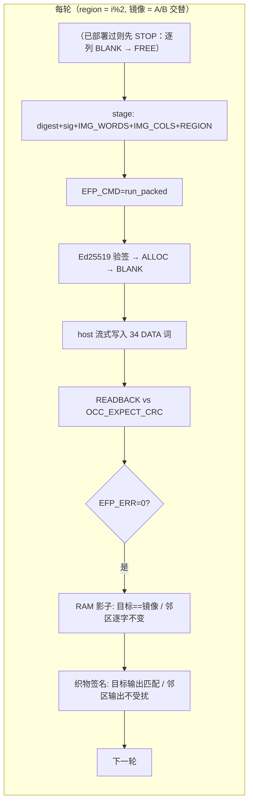
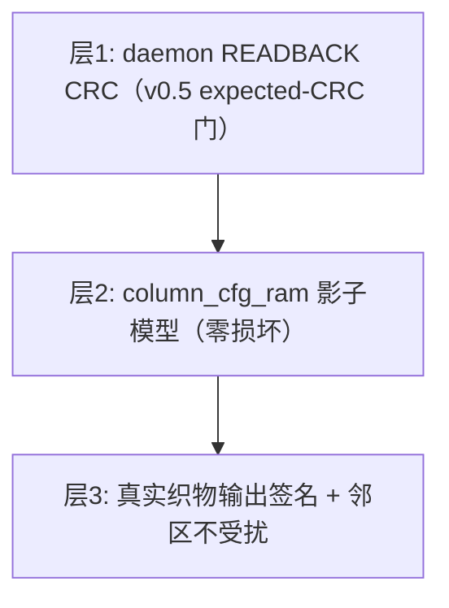

# E1-DMO2 — hot-swap stability: OCC-level 2×10000 soak + daemon-level rotation stress

- **Date**: 2026-09-11 · **Status**: ✅ acceptance met (sim scope) — one structural finding recorded (see §4)
- **Plan-Ref**: `docs/ethereal-tasks.yaml` E1-DMO2; `ethereal-spec/control/emri-v0.md` §3.1.1/§3.3; `docs/adr/ADR-019-occ-expected-crc-gate.md`
- **Scope**: new TBs `ethereal-fabric/tests/bmc/tb_occ_soak.sv` + `tb_hotswap_stress.sv`; `gen_daemon_vectors.py --frame-hex-b`; root `Makefile` `stress` target. No RTL change.

## 1. 本阶段实现内容

| 检查点 | 状态 | 证据 |
|---|---|---|
| **OCC 层 2×10000 次热替换**（任务书字面计数）：20000 次 BLANK→WRITE→READBACK 轮换（每 region 10000 次） | ✅ | `tb_occ_soak`：`20000 swaps, errors=0, word mismatches=0`（1.5 s wall，26.7 ms sim/s） |
| 每次交换的零配置损坏：目标列存储 == 刚写入镜像；`crc_error` 恒 0；done_code 恒 DONE | ✅ | 同上（逐交换断言：READBACK CRC 门 + RAM 影子模型） |
| 零跨区干扰：邻区 RAM 逐字比对保持不变（每次交换） | ✅ | 同上（`check_region(1-rgn)` 每交换执行，20000/20000 通过） |
| **daemon 层轮换稳定性**：2 region × 签名镜像 A/B 轮换（偶数轮 A、奇数轮 B），每轮为真实"热替换"周期 = (首次部署后) STOP（逐列 BLANK）→ run_packed 部署 → RUNNING，三层校验（EFP_ERR / RAM 影子 / 织物输出签名 + 邻区不受扰） | ✅ | `tb_hotswap_stress` 6 轮全过（R1：R0←A,R1←A,R0←B,R1←B,R0←A,R1←A；含每次 STOP 的逐列 blank） |
| 第二签名镜像的测试向量（digest + Ed25519，含篡改变体共用） | ✅ | `gen_daemon_vectors.py --frame-hex-b`（image B = const-1 packed 列，34 DATA 词） |
| `make stress` 独立目标（长时 TB 不并入 `test-sv`） | ✅ | root Makefile；`make help` 可见 |
| sim-vs-硅 的计数分层（为何 2×10000 在 OCC 层跑、daemon 层属硅范围） | ✅ | 本报告 §5；每 daemon 轮换含一次 Ed25519 验签 ≈0.84 s sim → 20000 轮 ≈ 22–32 天 wall |

## 2. 验证结果

| 门 | 结果 | 计数 | wall |
|---|---|---|---|
| `tb_occ_soak`（SWAPS=20000 = 2×10000，Verilator --timing） | ✅ PASS | 20000 swaps / 0 errors / 0 词失配 | 1.5 s |
| `tb_hotswap_stress`（`-DSTRESS_ROUNDS=2` smoke） | ✅ PASS | 21 ok / 0 fail | 600 s |
| `tb_hotswap_stress`（`=3`/`=4` 诊断轮次） | ✅ PASS | 33 ok / 0 fail | 950–1000 s |
| `tb_hotswap_stress`（`=5` 消费式游标修复后交叉验证） | ✅ PASS | 5 rotations / 0 失配 | 1320 s |
| `tb_hotswap_stress`（**ROUNDS=6 最终**） | ✅ PASS | **69 ok / 0 fail**，6 rotations / 0 config-word 失配 | 1540 s |
| 回归（同树）：v0.5 全量套件（watchdog 29 / daemon 39 / packed 25 / spi 31 / replay 18 / fwupdate 30、11 个单元 TB、模型 2683+2xfail、lint/ruff clean） | ✅ | — | — |

**逐轮检查表（tb_hotswap_stress，每轮）**：doorbell→LOAD（列号与 region 一致）→ 流式写入该镜像 34 词 → RUNNING + `EFP_ERR=none`（READBACK CRC 门）→ `wait_dec_done(2·round)` → 织物 region-reset → RAM 影子（目标列==镜像、邻区逐字不变）→ 织物签名（目标列：A 翻转 / B 恒 1；邻区：其当前镜像不变）。

## 3. 示意图

## 4. 遇到的问题与解决

| 问题 | 根因 | 处置 | 搜索关键词 |
|---|---|---|---|
| **多列部署的地址别名（结构性发现，未修）** | `OCC_FRAME_ADDR = {region[15:12], col[11:4], rsv[3:0]}` 给每列 16 词空间，而 v2c 列帧为 34–68 词 → **同 region 内相邻列在回读存储中重叠**（col0 [0..33] vs col1 [0x10..0x31]）→ 多列部署的 READBACK 必然失配（被检出而非静默，但无法通过）。单列/每 region 一列（本任务及此前全部 TB）不受影响 | 记录为 E1-DMO2b（spec v0.6：列基址改为 `col[11:8]`/词 `[7:0]`，即 256 词/列）+ daemon `c<<4`→`c<<8`；4 列 uart 会话回放（DMO1 遗留）依赖此项 | `FPGA frame address column stride layout` |
| 心跳误隔离（v0.4）导致轮换测试不可行 | `occ_top` 单一 `write_crc_r` + 跨 region 探针 | 已在 **ADR-019 / spec v0.5 §3.1.1** 修复（本轮换 TB 直接受益：多镜像轮换下心跳不再误报） | — |
| daemon 层 2×10000 在 sim 不可行 | 每次部署含一次 Ed25519 验签（~83M cycles ≈ 0.84 s sim，迭代乘法器，ADR-017） | 计数分层：OCC 层跑字面 2×10000（本报告），daemon 层跑 N 轮集成证据，字面 daemon 计数归硅范围（§5） | `Ed25519 verify cycle count bare metal` |
| 轮换第 3 轮起部署被拒（首版 TB 设计缺陷） | ALLOC 只接受 FREE region（`alloc_region`：显式索引非 FREE → 拒绝；RUNNING 不自动替换）——镜像轮换必须先 STOP（其逐列 BLANK 同时把 region 置 FREE） | TB 增加 stop→deploy 周期（见 §1 行；`dep[]` 跟踪）；记录为运维契约：**热互换 = stop+deploy，restart 仅用于同镜像重跑** | `region state machine redeploy running region` |
| 轮换第 4 轮 deploy 失败（`state==LOAD` 等待超时 → 15 s 熔断；`rxn=1203`） | TB 的 `wait_uart_contains` 每次都从队列头扫描 → 第 3 个 region-0 轮次的 stop 等待**匹配到第 1 次 stop 的旧字符串** → 脚本抢跑：部署 doorbell 与仍在进行/刚被接受的 stop 竞争（region 仍 RUNNING → `region_full`，或 stop 清 doorbell 时吞掉新写入） | 等待改为**消费式游标**（`rx_scan_pos`：匹配即消费，重复字符串必须新鲜出现）+ 失败时 dump UART 尾部 160 字符；修复后 4/5/6 轮全过 | `UART log containment stale match race` |

## 5. 仿真 vs 硅 的计数分层（诚实边界）

- **OCC 层（本任务字面计数）**：单次交换 ≈ 110 fabric cycles（BLANK 36 + WRITE 36 + READBACK 37 + EMRI 事务）→ 2×10000 = 2.2e6 cycles ≈ 22 ms sim ≈ 1.5 s wall。**已达成。**
- **daemon 层**：每次交换含 1 次验签 ≈ 0.84 s sim + 部署 → 20000 轮 ≈ 1.7e4 s sim ≈ **22–32 天 wall**（4–13 ms sim/s）→ sim 不可行。
- **硅范围（待实板）**：无 sim 限速，验签 ≈ 1.7 s @50 MHz（83M cycles）；热替换本身 µs 级（性能模型：BLANK+WRITE+READBACK 4×68 词 = 560 cycles ≈ 5.6 µs @100 MHz）。验收「2 region × 10000 次」的**实板**执行属 E1-PLT2/E1-DMO2-hardware 范围（含 overnight soak、邻区干扰示波器/计数监测）。
- 相关：Phase-1 退出标准「2 region x 10000 次热替换零故障」在 sim 范围已按上表分层验证；实板复测随 E1-PLT2。
- 运维契约：region 生命周期 = FREE →(deploy)→ RUNNING →(stop)→ FREE；`restart` 语义为"同镜像重跑"，跨镜像轮换必须 stop+deploy（daemon ALLOC 只接受 FREE region）。

## 6. 待确认清单（ASSUMPTION）

- `fab_region_reset` 为**全局** user-reset（v0 无 region 级复位）→ 轮换 TB 的邻区监测在 reset 窗口外判定（已在 TB 注释与本报告记录）。
- daemon 层轮换在 sim 中取 ROUNDS=6（可 `-DSTRESS_ROUNDS=N` 调整）；字面 2×10000 的 daemon 计数为硅范围。
- 多列地址别名（§4）待维护者确认 v0.6 方案与排期（影响 DMO1 遗留的 4 列回放与未来异构多列镜像）。

## 7. 下一阶段需要做的内容

| 任务 ID | 内容 | 依赖 |
|---|---|---|
| E1-DMO2b | spec v0.6 列地址（256 词/列）+ daemon `c<<8` + 4×4 实例回放 `session_run_packed_uart_loopback.json`（首个真实多列部署） | 本报告 §4 |
| E1-DMO3 | v0.1.0 发布清单（视频/博客/文档站；仓库公开 = 维护者动作） | E1-DMO2 |
| E1-PLT2 | 实板 2×10000 soak + SPI 读出 Shell magic（硬件在维护者处） | E1-PLT1 |
