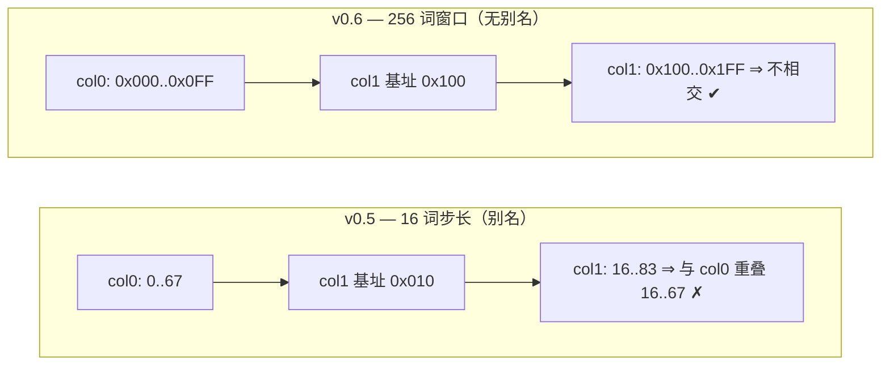

# E1-DMO2b 验收报告 — OCC_FRAME_ADDR 列寻址修正（EMRI v0.6）

- **任务**: E1-DMO2b（E1-DMO2  soak 时发现的结构性多列别名）
- **日期**: 2026-09-11
- **状态**: **规范 + 实现完成**（多列部署在 daemon 路径的端到端回放见 E1-DMO2c）
- **规范**: `ethereal-spec/control/emri-v0.md` **v0.6** §2（`OCC_FRAME_ADDR`）
- **Plan-Ref**: `ethereal-plan/subsystems/S02-OCC与配置体系.md §2.3/§3`（列帧打包）, `S05-BMC与EMRI-mFSM.md §2.3`
- **决策**: 2026-09-11 维护者选择 **方案 A（采纳 spec v0.6）**

---

## 1. 本阶段实现内容

### 1.1 根因（E1-DMO2 发现）

v0.5 的 `OCC_FRAME_ADDR` 列字段只有 4 位且步长 16 词：

```
v0.5: {region_id[15:12], col_id[11:4], rsv[3:0]}   → 每列窗口 16 词
v2c 列帧实际长度: 34–68 词                            → 相邻列窗口重叠（别名）
```

⇒ 同一 region 内相邻列在配置存储/回读存储中互相覆盖：多列 packed 部署的
READBACK 必然失配（单列或每 region 单列不受影响，故 E1-DMO1..DMO2 未暴露）。

### 1.2 修正（v0.6）

```
v0.6: {region_id[15:12], col_id[11:8], word[7:0]}  → 每列 256 词 = 8 KB
      frame_addr = (region << 12) | (col << 8) | word
```

- 列字段恢复为**列索引**（4 位，最多 16 列），低字节为列内词偏移 ⇒ 列窗口互不重叠；
  34–68 词的 v2c 列帧有 3.7–7.5× 余量。
- 保留 >256 词帧的显式拒绝（工具侧 `column_frame_range()` 检查）。
- 与既有约定一致：`occ_top` 仍以 `frame_addr + idx` 直接寻址配置总线，region 位
  仍为 `frame_addr[15:12]`，无需改动 fabric/OCC RTL。



### 1.3 改动清单

| 层 | 文件 | 改动 |
|---|---|---|
| 规范 | `ethereal-spec/control/emri-v0.md` | v0.6：`0x0B` 行、保留区列表、历史行、EFP_ERR 11/12、§3.7/§3.8（同批变更） |
| 固件 | `ethereal-runtime/bmc-fw/daemon/daemon.c` | 新增 `column_frame_base(region,col)=region<<12|col<<8` 单一实现；4 处调用点（per-column BLANK / WRITE / READBACK / heartbeat）由 `<<4` 改为该函数 |
| 主机工具 | `ethereal-tools/tools/efp_client.py` | `region_frame_base` / `column_frame_base` / `column_frame_range`（>256 词拒绝）+ packed 模型逐列 `OCC_FRAME_ADDR`（`_arm_column_frame`，`_col_addrs` 轨迹） |
| 主机工具 | `ethereal-tools/tools/frame_map.py` + `test_frame_map.py` | `frame_addr()` 与 `frame_addr_format` 迁移到 v0.6 字段划分（`{region[15:12], col[11:8], word[7:0]}`）；test 断言 `0x1200` / `0xFF00` |
| 主机工具 | `ethereal-tools/tools/emri_constants.py` | v0.6 常量（含 `R_OCC_FRAME_ADDR` 语义注释） |
| 测试 | `tb_hotswap_stress.sv` / `tb_occ_soak.sv` | 两个 TB 的 `reg_base(r) = (r<<12)|(r<<4)` 断言按 v0.6 迁移为 `<<8`（否则 region 1 的镜像被写到 0x1100 而断言检查 0x1010 —— 切面回归中被 `make stress` 抓出） |
| 测试 | `tb_bmc_watchdog.sv` | 仅注释（`frame_base_i` 由 daemon 编程，代码无需改）：region 1 base `0x1010 → 0x1100` |

### 1.4 验证

- ✅ `cd ethereal-runtime/bmc-fw && make` — `-Wall -Wextra -Werror` **零告警**（含改动后的 daemon.c）。
- ✅ `.venv/bin/python -m pytest test_frame_map.py test_ethimg.py test_ethctl.py test_capcheck.py -q` → **406 passed**；其中新增
  `test_occ_frame_addr_v06_column_addressing`、`test_occ_frame_addr_column_windows_do_not_overlap`、
  `test_efp_run_packed_two_columns_address_each_column` 直接断言 2 列部署的各列基址为 `base+(c<<8)` 且
  68 词帧在 col0/col1 落在互不相交的地址区间。
- ✅ 单列路径零回归：既有 packed/热替换 TB 使用的 col0 镜像在 v0.6 下地址不变（`0<<4 == 0<<8 == 0`）。
- ⚠️ **未覆盖**：真实 daemon 路径上的 **≥2 列 packed 部署端到端回放**（需要 2 列向量 +
  TB 逐列流式脚本，测试基建目前只产出单列 `--frame-hex`）。→ 见 `E1-DMO2c`。
- ✅ **切面回归（`make stress` / daemon TBs）**：`tb_bmc_daemon`（61 ok）与 `tb_bmc_daemon_packed`（25 ok）
  在 v0.6 + 两道新门下 PASS；`tb_ethctl_replay`、`tb_bmc_spi`、`tb_bmc_watchdog` PASS（后三者各 ~10–25 min wall，
  Ed25519 主导）；`tb_occ_soak`（2×10000 交换）迁移 `reg_base` 后重跑 **PASS**（1.7 s wall）。
- ✅ `tb_hotswap_stress`：**首轮 FAIL（5 errors / 10 词失配）→ 修复 TB 断言步长后 PASS**
  （`[stress] 6 rotations, config-word mismatches=0` + `TEST PASSED: E1-DMO2 rotation stress — 6 signed packed
  rotations (2 regions, images A/B), zero config corruption, zero cross-region interference`，69 ok / 0 fail，
  1558 s wall）。根因是该 TB 自身的断言仍用 v0.5 步长（`reg_base(r) = (r<<12)|(r<<4)`：region 1 的镜像实际落在
  0x1100 而断言检查 0x1010）。这次回归正是"列寻址语义变更必须全量迁移调用方"的证据，已连同 `tb_occ_soak`
  一并迁移。

### 1.5 遗留发现（写入队列，不静默）

- mFSM 直连路径 `ethctl.Daemon.deploy(frame_addr=...)` 仍把 `frame_addr` 当作**原始**配置字地址
  （默认 0），与 `OCC_CMD.region` 字段各自独立；v0.6 下 `OCC_FRAME_ADDR.region_id[15:12]` 必须与
  `OCC_CMD.region` 一致。该路径属 E2-DOC1 规范冻结前的遗留语义，已在报告中记录待统一。

---

## 2. 下一阶段需要做的内容

- **E1-DMO2c** — 多列 packed 部署端到端回放：扩展 `pack_tb_frames.py` 产出 2 列镜像 +
  `tb_bmc_daemon_packed` 逐列流式 + READBACK 逐列 CRC（验证 v0.6 在真实 daemon 路径上消除别名）。
- **E2-SEC1** — 安全 v1（本轮同批完成：强制验签 + 能力清单 + 异常监控，见 `report-E2-SEC1-*`）。
- **E2-DOC1** — 规范冻结时统一 mFSM 直连路径的 `frame_addr` 语义（§1.5）。
