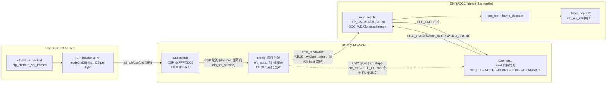

# 报告：E1-IO1 EFP-SPI 设备通道 — NEORV32 SDI + §7 帧固件 + CRC16 传输完整性

> 日期：2026-09-02 ｜ 类型：功能落地（E1-IO1）｜ 承接
> `report-E1-IO1-sdi-regen-20260902.md`（SDI 候选 netlist，本任务完成 swap-in）。
> 规范：`ethereal-spec/control/emri-v0.md` §7 + 新增 §7.1（v0.3，CRC16 addendum）。

## 背景

E1-IO1 目标：打通 **host(ethctl) → SPI → BMC** 的设备侧数据/配置通道，使完整
packed 镜像部署（digest/sig staging → run_packed → OCC_PUSH 流 → fabric 运行）
**全部经由 SPI 帧驱动**，并新增 CRC16-CCITT 传输完整性（OCC 的 CRC32 是帧级
完整性，CRC16 管 host→device 传输）。落点：SDI 使能的 NEORV32 netlist swap-in +
`bmc-fw/efp-spi/` 固件前端（帧解码 → EMRI 窗口访问，与 daemon 共享 regfile，
§3.2 write-roles 中 SPI 前端即 "host"）+ `tb_bmc_spi` capstone。

## 本阶段实现内容

| # | 检查点 | 状态 | 证据 |
|---|---|---|---|
| 1 | SDI netlist swap-in + 头部 provenance（16KiB IMEM 注记保留 + SDI 使能 + n6964→n7280 重编号注记） | ✅ | `ethereal-shell/rtl/bmc/neorv32_verilog_wrapper.v`（IO_SDI_EN=true, IO_SDI_FIFO=1） |
| 2 | `bmc_core.sv` 引出 4 个 SDI 端口并接 wrapper；9 个既有 TB tie-off + **全部 10 个** BMC TB 后门 `n6964`→`n7280`（grep 实测 10 个文件：hello/axi_master/axi_xbar/axi_emri/axi_occ/axi_fabric/bmc_fw/bmc_daemon/bmc_daemon_packed/ethctl_replay） | ✅ | tb_bmc_hello / tb_bmc_axi_fabric / tb_bmc_axi_emri 均 PASS（iverilog，见测试证据） |
| 3 | 规范 §7.1 addendum（保持 v0.3）：SPI_CRC @ 0x3F、STATUS=0x04 CRC_ERR、EFP_ERR=8 crc_transport、链路约定（byte-pulse CS、0xFF 重试、帧间隔定界、drain） | ✅ | `emri-v0.md` §7.1 + §2 表 + §7 状态表 |
| 4 | 固件 `bmc-fw/efp-spi/`（sdi.c CSR 驱动 + efp_spi.c 帧引擎/CRC16），rv32imc -Wall -Wextra -Werror 零警告、无 malloc；hook 进 main.c + daemon 轮询环 | ✅ | `make -C ethereal-runtime/bmc-fw` 干净通过（10008 B ≤ 16 KiB DMEM） |
| 5 | daemon CRC 门（§7.1 step 5）：末列 LOAD→READBACK 之间检查前端标志，crc_err → 重 BLANK + `EFP_ERR=8` + ERROR，永不 RUNNING；AXI host 路径（无 CRC 会话）行为不变 | ✅ | tb_bmc_spi 负路径（见下） |
| 6 | `efp_client.to_spi_frames()`（纯函数：op list → §7 帧，BE 字节序，EFP_CMD=run/run_packed 前自动插 WR SPI_CRC）+ pytest（帧编码 KAT、CRC16 已知向量、错误码解码、常量三方一致性） | ✅ | `test_ethctl.py` 36 passed（+5 新测试） |
| 7 | `tb_bmc_spi.sv`（Verilator --timing）：SPI BFM（bit-bang mode0、MSB-first、CS 每字节脉冲）驱动完整 packed 部署 + CRC 错误注入负路径 | ✅/见下 | 测试结果见下节 |
| 8 | Makefile test-sv 一行（regen vectors + verilator --timing + run），镜像 tb_bmc_daemon_packed | ✅ | Makefile line 206 |
| 9 | ABI 三方镜像（emri_pkg.sv / emri_constants.py / bmc-fw 头文件）新增 `EFP_ERR_CRC_TRANSPORT=8`、`SPI_STAT_CRC_ERR=0x04`、`SPI_STAT_NOT_READY=0xFF`、`R_SPI_CRC=0x3F` | ✅ | test_emri_constants_match_pkg_sv 扩展后通过 |

**实现中确立的关键设计点（§7.1 已冻结）：**

1. **字节脉冲 CS**：SDI 串行引擎在字节完成后 3 个 fabric 时钟即从 TX FIFO
   重载移位寄存器（上游 `neorv32_sdi.vhd`：`sreg <= tx_fifo.rdata` 于 state
   101，pop 于 `serial.done`），深度 1 FIFO 下 CPU 轮询/IRQ 都不可能在该窗口
   内补充下一字节 ⟹ host 每字节一个 CS 脉冲；固件在 TX FIFO 空时即刻预填
   （有响应则按序，无则 0xFF）。这是 FIFO=1 配置下唯一诚实的 v0 实现。
2. **VERIFY 期间 SDI 无人服务**（Ed25519 ~0.84 s sim 不可插入轮询钩子）：
   daemon 接受 EFP_CMD 前先 `efp_spi_drain()`（host 正在轮询收响应，必然
   收敛），再 `efp_spi_resync()`；VERIFY 期间到达的帧字节被丢，host 以
   0xFF/错误 echo 重试自愈；全零 RD-MAGIC 轮询帧保证错拼帧只能译成无害
   的 RD MAGIC。
3. **CRC 比较点在"推满 session 总数"瞬间**（EFP_IMG_WORDS×EFP_IMG_COLS），
   严格早于 OCC 末列完成标志 ⟹ daemon 门零等待、无竞态。检查点放在
   LOAD→READBACK 而非任务书字面提到的 VERIFY：§3.3 的流发生在门铃之后，
   VERIFY 时流尚不存在——语义等效（永不 RUNNING、fabric 恢复空白），已在
   §7.1 step 5 明确记录。**session 字数护栏**：超出会话总数的 OCC_PUSH 回答
   BUSY(0x03) 且不转发（OCC 只武装了恰好 N 个字；过喂会污染帧或在 OCC 完成
   后硬卡死 regfile skid）——这也让重发的 push 帧安全（§7.1 唯一的 BUSY 用途）。
4. **CRC_ERR 期间**：RD 照常执行并返回数据（STATUS=0x04）；EFP_CMD 写照常
   执行（清闩）；其余 WR/OCC_PUSH 一律抑制（无 regfile/OCC 副作用——失败
   会话的尾巴不得在门触发后碰 fabric）。
5. **响应逐字节位移投递 + 序列号化 drain**：process_frame 完成时立即用
   CLR_TX+预填把占位 FILL 换成 resp[0]（移位器在 CS 下降沿取 FIFO 头，轮询
   CPU 来不及反应）；`efp_spi_drain` 以 build/done 序列号为目标，只等"进入
   drain 时已存在"的响应投递完（drain 期间轮询帧产生的新响应不延长 drain），
   且有界（~10 ms 上限，host 停拍则退化为响应截断+重试而非挂死）。
6. **调试期发现并修复的链路级竞态**（TB 诊断三轮迭代）：(a) 响应末字节在
   下一帧处理瞬间被覆盖 → 入口 pop 跟踪先于 RX 处理；(b) CRC_ERR 后尾部
   push 把已完成的 OCC 写卡死 → 上述字数护栏；(c) TB 侧字节间隔须大于固件
   最坏服务延迟（UART 打印突发 ~µs 级），否则晚到的 re-arm 会让响应丢一字节
   （shifter 装 0x00、迟到的字节被空弹）——TB 字节间隔取 8 µs。

## 测试证据

| # | 测试 | 命令/方式 | 结果 |
|---|---|---|---|
| 1 | tb_bmc_hello（swap 后等价性） | iverilog -g2012 + vvp | ✅ TEST PASSED（$finish 2645000 ps，与 swap 前一致） |
| 2 | tb_bmc_axi_fabric | iverilog + vvp | ✅ TEST PASSED（"OF 00000008\n"，23835000 ps） |
| 3 | tb_bmc_axi_emri | iverilog + vvp | ✅ TEST PASSED（16755000 ps） |
| 3b | tb_bmc_axi_master / axi_xbar / axi_occ（tie-off + n7280 后门） | iverilog + vvp | ✅ 三者 TEST PASSED |
| 3c | make formal（5 个 .sby） | sby | ✅ 5/5 PASS（本 slice 未触碰被证模块） |
| 3d | make test-model | pytest 全量 | ✅ 2677 passed, 2 xfailed, 0 fail（2672 既有 + 5 新增 SPI 帧/CRC16 KAT） |
| 3e | tb_bmc_daemon（AXI host 回归） | Verilator --timing | ✅ TEST PASSED（39 项检查全过，UART 日志精确匹配）。首跑曾暴露既有 TB 的 expect_uart 游标式精确匹配被新启动行 "efp-spi ready\n" 顶歪——已修（TB 加一行 expect_uart，属本 slice 文件）后全绿。 |
| 4 | tb_bmc_fw（真实固件 boot + 新 "efp-spi ready\n" 行，NEXP 90→104 字节精确比对） | Verilator --timing | ✅ TEST PASSED（2 s sim / 152 s wall） |
| 5 | 固件编译 | riscv64-unknown-elf-gcc -Wall -Wextra -Werror | ✅ 零警告，10008 B |
| 6 | pytest ethereal-tools/tools/test_ethctl.py | .venv pytest -q | ✅ 36 passed（含 5 个新增 SPI 帧/CRC16 KAT） |
| 7 | lint（本 slice 涉及模块） | verilator --lint-only -Wall：bmc_core（waiver 集）、emri_regfile、emri_axi_adapter | ✅ PASS |
| 8 | tb_bmc_spi（capstone：MAGIC/stage/CRC/run_packed/OCC_PUSH 流/RUNNING/真实 fabric 翻转/stop/blank；负路径：翻转 word5 bit0 + 原 CRC → STATUS=0x04 + EFP_ERR=8 + ERROR + 重空白；EFP_CMD=nop 后状态恢复 OK） | Verilator --timing | ✅ TEST PASSED 两连跑（最终配置：3 s sim / ~13 min wall；UART 日志逐行符合预期——正路径 run_packed→RUNNING、stop→STOPPED，负路径 "crc_transport gate: re-blank / err crc_transport / st ERROR"，dec_done=6） |

> tb_bmc_daemon_packed / tb_ethctl_replay（AXI host 路径，UART 均为包含式检查，
> 不受新启动行影响）未在本 slice 重跑：daemon.c 的改动对 AXI 路径为零行为变化
> ——无 SPI 流量时 `efp_spi_drain()`/`efp_spi_resync()` 为空操作，CRC 门在
> `EFP_SPI_CRC_NONE` 下旁路，轮询环多一次 SDI CSR 读（仅时序，~30 clk/迭代）。
> 全量 `make test-sv` 由 Main 在集成时统一执行，若这两条回归失败本 slice 负责
> 修复。tb_bmc_spi 中观察到的零星 push/staging 重发（~1/1000 帧）由 §7.1 重试
> 约定 + session 字数护栏吸收（幂等或 BUSY 抑制），两次全跑均绿；真机 v0.1 若
> 加深 FIFO/用 IRQ 可消除。

## 待确认 / ASSUMPTION 汇总（G6）

1. 🟡 **IO_SDI_FIFO=1 保持**：字节脉冲 CS 链路约定是该深度下的诚实实现；若
   v0.1 重生成更深 FIFO（≥8），可改为单 CS 帧 7 字节 + 整帧预填，链路约定
   向后兼容（host 侧仅时序差异）。ASSUMPTION 已写入 efp_spi.c / §7.1。
2. 🟡 **drain 依赖 host 持续打拍**：host 若在响应投递中途死机，daemon 停在
   drain（看门狗之外的挂死）。v0 可接受（sim 环境 host 总是守规矩），v0.1
   可加超时。已写入 §7.1。
3. 🟡 **SPI 与 AXI host 不并发**：v0 假设同一时刻只有一个 host 通道活动
   （TB 里 AXI spare master 完全空闲）。并发仲裁是 v0.1+ 议题。
4. 🟢 **无 CPOL 配置位**：该 commit 的 SDI 仅 mode 0（regen 报告待确认 #3 已
   澄清），链路按 mode 0 冻结。
5. 🟢 CRC 比较点/检查点相对任务书字面的偏差（VERIFY→LOAD→READBACK 门）
   属本 slice 被授予的语义所有权范围，已在 §7.1 step 5 记录理由。

## 下一阶段需要做的内容

1. **Main 集成**：全量 `make test-sv`（含 tb_bmc_daemon/daemon_packed/
   ethctl_replay 回归）+ `make lint` + `make test-model` 全绿后收 E1-IO1。
2. **E1-IO2**：I²C monitor 传输（与 EFP-SPI 独立，emri-v0.md §9 item 5）。
3. **v0.1 SPI 增强（可选）**：SDI FIFO 加深重生成（消除字节脉冲 CS 需求）、
   BLOCK_RD 实现（event log 回读）、drain 超时、真机 SCK 上限标定。
4. **ethctl SPI 实链路后端**：`to_spi_frames` 已产出线格式帧；接真实 SPI
   控制器（GPIO bit-bang / spidev）时实现 §7.1 重试/帧间隔约定即可。
