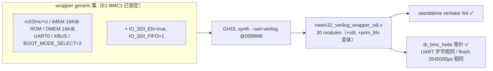

# 报告：E1-IO1 SDI 重生成 spike — NEORV32 SDI（SPI device）候选 netlist

> 日期：2026-09-02 ｜ 类型：重生成候选（**未集成**）｜ 承接
> `report-E1-BMC1-imem-regen-20260901.md`（同一再生流程，配置已 bit 级复现）。
> 产物：`generated/imem_regen/neorv32_verilog_wrapper_sdi.v`（gitignored scratch；
> module 名保持 `neorv32_verilog_wrapper`，drop-in 形态）。

## 背景

E1-IO1（EFP-SPI device 通道）需要 NEORV32 的 SDI 外设（device 侧 SPI），当前
vendored netlist 未含（rv32imc + IMEM + DMEM + UART0 + XBUS）。本 spike 在
E1-BMC1 已验证的再生流程上，以**完全相同的配置**（物理 16 KiB IMEM ROM —
`image_size_c` 修复 + DMEM 16 KiB + UART0 + XBUS_EN）**仅新增 `IO_SDI_EN=true`**
（`IO_SDI_FIFO=1`，上游默认）重生成候选。

## 与 imem16k 候选的 module 级 diff（配置纯度证据）

GHDL generic-hash 对比（相对 E1-BMC1 的 16 KiB 候选）：

- **新增**：`neorv32_sdi`（`Lneorv32_1` = IO_SDI_FIFO=1）+ 一个 SDI RTX FIFO 用的
  `neorv32_prim_fifo` 变体；
- **hash 变化仅 3 处**：`bus_io_switch` / `sysinfo` / `top`（三者编码 IO 使能布尔
  向量，含新置位的 SDI 位）；
- **CPU/IMEM/DMEM/UART0/XBUS/ALU/… 全部 module hash 不变** ⟹ 除 SDI 外配置逐位相同。

## 本阶段实现内容

1. 重 clone 上游 @`05f9896`（ pinned commit ），复用 E1-BMC1 锁定的 wrapper 配置 +
   16 KiB 镜像包，仅加 `IO_SDI_EN=true / IO_SDI_FIFO=1` 与 4 个 SDI 端口 →
   `generated/imem_regen/wrapper_src/neorv32_verilog_wrapper_sdi.vhd`。
2. `make convert` 生成候选 `generated/imem_regen/neorv32_verilog_wrapper_sdi.v`；
   GHDL 配置摘要确认 `CPU (single-core) IMEM-ROM DMEM XBUS UART0 SDI SYSINFO`。
3. 验证（下节）。未触碰 vendored netlist / `bmc_core.sv` / 任何 tracked 文件。

## 测试证据

| # | 验证 | 结果 |
|---|---|---|
| 1 | module 级 diff vs imem16k 候选 | 仅 +sdi/+prim_fifo 变体 + 3 个 IO-bool hash（见上）✅ |
| 2 | ROM 结构 | `imem_rom` 仍读 `addr_i[13:2]`、数组 `[4095:0]`（16 KiB 物理保持）✅ |
| 3 | standalone lint | `verilator --lint-only -Wall`（bmc waiver 集），top=`neorv32_verilog_wrapper`：**PASS**（`bmc_core.sv` 需加 SDI 端口，按指示未改，故仅 lint netlist 本体）✅ |
| 4 | tb_bmc_hello 等价 | scratch TB 副本（仅把后门数组名 `n6964`→`n7280`）对候选：**TEST PASSED**，UART 收到 `H I \n` 与 vendored 完全一致，`$finish` 时刻同为 **2645000 ps** ✅ |

> ⚠️ **集成注意**：加 SDI 使 GHDL 节点重编号 —— ROM 数组 `n6964` → **`n7280`**，
> DMEM lane spram 路径不变（`ram_gen[i]_ram_inst.spram`，模块级编号未动）。
> 集成时须同步更新 8 个 BMC TB 的 `$readmemh` 后门路径（同 2026-08-08
> n6830→n6964 先例），并给 `bmc_core.sv` 引出 4 个 SDI 端口。

## SDI 端口与 CSR 寄存器映射（E1-IO1 固件接口）

候选 netlist wrapper 新增端口（= `neorv32_top` SDI 端口，方向相对 NEORV32）：

| 端口 | 方向 | 说明（SPI device 视角） |
|---|---|---|
| `sdi_clk_i` | in | SPI 串行时钟（由外部 host/controller 驱动） |
| `sdi_csn_i` | in | 片选，低有效（`csn` 提前释放 <8bit 则该字节丢弃） |
| `sdi_dat_i` | in | 串行数据入（= SPI MOSI） |
| `sdi_dat_o` | out | 串行数据出（= SPI MISO） |

寄存器映射（datasheet `docs/datasheet/soc_sdi.adoc` §"Serial Data Interface
Controller (SDI)"，基址 **0xFFF7_0000**；byte 级收发，MSB-first；中断 = 处理器
fast IRQ channel 11）：

| 地址 | 寄存器 | 位 | 名称 | R/W | 功能 |
|---|---|---|---|---|---|
| 0xFFF70000 | CTRL | 0 | `SDI_CTRL_EN` | r/w | 模块使能 |
| | | 1 | `SDI_CTRL_CLR_RX` | -/w | 清 RX FIFO（自清零） |
| | | 2 | `SDI_CTRL_CLR_TX` | -/w | 清 TX FIFO（自清零） |
| | | 7:4 | `SDI_CTRL_FIFO_*` | r/- | FIFO 深度 = log2(IO_SDI_FIFO)（本配置=0→深度1） |
| | | 16 | `SDI_CTRL_IRQ_RX_NEMPTY` | r/w | RX 非空中断使能 |
| | | 17 | `SDI_CTRL_IRQ_RX_FULL` | r/w | RX 满中断使能 |
| | | 18 | `SDI_CTRL_IRQ_TX_EMPTY` | r/w | TX 空中断使能 |
| | | 24 | `SDI_CTRL_RX_EMPTY` | r/- | RX FIFO 空 |
| | | 25 | `SDI_CTRL_RX_FULL` | r/- | RX FIFO 满 |
| | | 26 | `SDI_CTRL_TX_EMPTY` | r/- | TX FIFO 空 |
| | | 27 | `SDI_CTRL_TX_FULL` | r/- | TX FIFO 满 |
| | | 31 | `SDI_CTRL_CS_ACTIVE` | r/- | 片选有效中 |
| 0xFFF70004 | DATA | 7:0 | `SDI_DATA_*` | r/w | RX/TX FIFO 数据口 |

行为要点（datasheet §SDI）：写 `DATA` 推入 TX FIFO，SPI 传输时回送 host；TX 空时
回送 `0x00`；读 `DATA` 弹 RX FIFO；仅 `sdi_csn_i` 有效期间移位/入出队；
时钟极性可编程（见 CTRL/上游驱动 `neorv32_sdi.h`）。

## 待确认 / ASSUMPTION 汇总（G6）

1. 🟡 `IO_SDI_FIFO=1`（上游默认）：EFP-SPI 若需更深的 RX/TX FIFO，改此 generic 重跑
   即可（module hash 仅 sdi/prim_fifo/sysinfo/top 变化）。
2. 🟡 未做 SDI 功能级 sim（无 SPI host TB）；本 spike 只证"加 SDI 不回归现有路径"。
   E1-IO1 落地时需新 TB 驱动 sdi_* 四线。
3. 🟢 该 commit 的 `neorv32_sdi.vhd` 无 CPOL 配置位（CTRL 位段与上表完全一致，
   bit 3 保留）——datasheet 特征表的 "Programmable SPI clock polarity" 为过时条目，
   以上表 + RTL 为准。

## 下一阶段需要做的内容

1. **Main 集成决策**：EFP-SPI 固件 slice 落地后，候选 swap-in + `bmc_core.sv` 引
   SDI 端口 + 8 个 TB 后门路径 `n6964`→`n7280` + 全量 `make test-sv`。
2. **E1-IO1 固件**：按上表 CSR map 实现 EFP-SDI 驱动（基址 0xFFF70000）。
3. **SDI 功能 TB**：四线 SPI host 激励 → EFP 帧收发闭环。
