# 报告：E1-PLT4 — Apicula/nextpnr Aurora V 备选构建链评估（GW5AST-138 真实 fabric spike）

> 任务：E1-PLT4（phase-1）· 日期：2026-09-01 · 执行者：Kimi K3（NextpnrSpike 子代理）
> Plan-Ref：`ethereal-plan/subsystems/S12-平台Bring-up.md` §3（步骤 4：Apicula 备选链评估）；
> `docs/ethereal-tasks.yaml` E1-PLT4（acceptance：可行性结论 —— CI 构建通道是否可用）
> 性质：spike 一次性评估；**未修改任何 tracked 源文件**；全部 scratch 产物在 `generated/nextpnr_spike/`（gitignored）

## 结论（TL;DR）

**✅ 可行（feasible）**：以 yosys 0.67 + nextpnr-himbaechel 0.10 + Apicula(gowin_pack) 组成的
全开源链，今日即可对 GW5AST-138 跑通 **SystemVerilog RTL → 综合 → P&R → 时序 → 比特流** 全流程，
且本次 spike 直接以**真实的 4×4 overlay fabric（fabric_top，默认 R=4 C=4 全 CLB）**验证，
端到端产出 `spike_top.fs`（34,668,145 B 比特流），布线后 Fmax = **115.61 MHz**（目标 50 MHz PASS）。
配套烧写工具 openFPGALoader 亦原生支持 tangmega138k（FT2232 通道）。
唯一需要工程决策的缺口是 **yosys 内建 SV 前端不支持函数内 `return`**（fabric RTL 有 2 处），
spike 中以 scratch 单行改写绕过（不触碰 tracked RTL）。

## 环境

- oss-cad-suite（2026-07 构建）：yosys `0.67+40 (45ea2b8d6-dirty)`、nextpnr-himbaechel `0.10-88-g7c667eeb`、
  捆绑 apycula（`gowin_pack`/`gowin_pll`/`gowin_unpack`）、openFPGALoader、openocd。
- chipdb：`share/nextpnr/himbaechel/gowin/chipdb-GW5AST-138C.bin`（64 MB，2026-07-18）——
  **GW5AST-138 芯片数据库已随发行版内置**，无需自行 fuzz。
- 系统 Python 3.12 无 apycula（`ModuleNotFoundError: No module named 'apycula'`）；
  但 oss-cad-suite 自带 Python 3.11 site-packages 内 apycula 完整可用（见 gowin_pack 实测）。
- 目标板：Tang Mega 138K = `GW5AST-LV138PG484AC1/I0`（138,240 LUT4，Sipeed Wiki / Gowin 官方页证实）。

## 尝试的工具链（Mermaid）

```mermaid
flowchart LR
    RTL["fabric RTL<br/>fabric_top.sv + 8 依赖模块<br/>(SystemVerilog)"] -->|"① read_verilog -sv"| Y["yosys 0.67<br/>synth_gowin -family gw5a"]
    RTL -.->|"⚠️ 函数内 return 不支持<br/>(scratch 单行改写)"| Y
    Y -->|"-json"| NJ["*.json 网表<br/>(LUT/DFF/MUX2_LUT5...)"]
    NJ -->|"② nextpnr-himbaechel 0.10<br/>--device GW5AST-LV138PG484AC1/I0<br/>--vopt cst=spike_top.cst"| PNR["chipdb-GW5AST-138C<br/>pack + place + route<br/>+ STA (experimental timing)"]
    PNR -->|"③ --write"| PJ["spike_top-pnr.json"]
    PJ -->|"④ gowin_pack (apycula)<br/>-d GW5AST-138C"| FS["spike_top.fs 比特流<br/>34.7 MB ✅"]
    FS -->|"⑤ openFPGALoader<br/>--board tangmega138k"| HW["Tang Mega 138K<br/>(未上板，E1-PLT1/2 范围)"]
    style FS fill:#c8f7c5
    style PNR fill:#c8f7c5
```



## 实测过程（命令 + 关键输出）

### ① yosys 解析 / 综合

```bash
export PATH=$HOME/oss-cad-suite/bin:$PATH
yosys -p 'help synth_gowin'        # → families: 'gw1n', 'gw2a', 'gw5a'；选项含 -json/-vout/-family/-noiopads 等
yosys -p 'read_verilog -sv <9 个 RTL 文件>; synth_gowin -top fabric_top -family gw5a -json out.json'
```

- **解析失败点（精确记录）**：`fabric_top.sv:92: ERROR: syntax error, unexpected TOK_ID`
  —— 即自动函数体内的 SystemVerilog `return` 语句：
  ```systemverilog
  function automatic logic [7:0] tile_type_at(input int idx);
      return TILE_TYPE[idx*8 +: 8];   // yosys 内建前端仅支持经典 Verilog 风格（向函数名赋值）
  endfunction
  ```
  最小复现：`function automatic logic [7:0] f(input int idx); return 8'h00; endfunction` 即报错。
  **全库仅 2 处**该写法：`fabric_top.sv:92`、`occ/occ_top.sv:129`。
- **scratch 变通（不触碰 tracked RTL）**：`generated/nextpnr_spike/fabric_top_yosys.sv` 单行改写为
  `tile_type_at = TILE_TYPE[idx*8 +: 8];` → 解析通过。其余 8 个模块原样通过。
  备选路线：sv2v / yosys-slang 前端（oss-cad-suite 内有 `slang` 二进制，但无 yosys 插件；未深入，留给决策）。
- 其余 SV 特性（2D unpacked wire array `wire [W-1:0] sb_in_n [R][C]`、`parameter logic [R*C*8-1:0]` 打包参数、
  generate/`localparam`/`$clog2`、分维参数数组）**均被 yosys 0.67 原生接受**（spike 中逐一最小化验证）。

### ② fabric_top 直跑综合（R=4 C=4 默认全 CLB）

```bash
yosys -l yosys_synth_noiopads.log -s synth_noiopads.ys   # 71s，峰值内存 1.69 GB，0 ERROR
# 警告：9320 条 "found logic loop in module fabric_top"（跨 tile 的 Wilton SB 组合环，配置相关，
#       与 verilator UNOPTFLAT 同源；P&R 需 --ignore-loops 做 STA）
```

### ③ nextpnr-himbaechel（两次碰壁 + 解法）

1. **设备名格式**：裸 chipdb 名无效；必须 `完整料号+速度等级`：
   `nextpnr-himbaechel --device GW5AST-LV138PG484A` → `ERROR: No package for partnumber ...`
   `--device GW5AST-LV138PG484AC1/I0` → `Info: Using uarch 'gowin' ... Program finished normally.` ✅
2. **裸 fabric_top 无法直接 P&R**：1408 个 obs 输出远超 PG484 封装（324 IOB）；
   带 IO pad 时 `ERROR: Unconstrained IO:unit[1]_IBUF_O`（gowin uarch 要求所有 top IO 都有 .cst 约束）；
   `-noiopads` 时 `ERROR: Top-level port 'rst_ni' driving illegal port ... LUT4_I3.I0`
   （gowin uarch 要求所有顶层端口必须经 IOB）。**生产构建本就需要 Shell 层 top（E1-PLT1/2），属预期行为。**
3. **spike 封装**（scratch-only `spike_top.sv`，counter+LFSR 每周期驱动 cfg 端口，XOR 归约 obs → 16 LED，
   引脚取 apicula 官方 `examples/gw5a/tangmega138k.cst`：clk=V22、reset=Y12、led0..15=LED 位）：
   - 坑：nextpnr JSON 前端把总线端口 `led[N]`（N>0）错命名为 `led[N][N]`，.cst 查不到 → 改用标量端口名规避。
4. **P&R 实跑**（命令与结果）：
   ```bash
   nextpnr-himbaechel --json spike_top-synth.json --write spike_top-pnr.json \
       --device GW5AST-LV138PG484AC1/I0 --vopt cst=spike_top.cst \
       --freq 50 --ignore-loops --report pnr_report.json
   # exit=0；墙钟 14m50s（user 24m52s）；Routing 167,116 arcs complete
   ```

### ④ 比特流 + 烧写链

```bash
gowin_pack --cpu_as_gpio -d GW5AST-138C -o spike_top.fs spike_top-pnr.json
# exit=0；7m56s；spike_top.fs = 34,668,145 字节 ✅
openFPGALoader --list-boards | grep 138    # → tangmega138k  ft2232  ✅（烧写通道现成）
```

## LUT 统计表

虚拟基准：4×4 fabric = 16 tile × 8 eLUT4 = **128 virtual LUT**。

| 阶段 | LUT1 | LUT2 | LUT3 | LUT4 | MUX2_LUT5/6/7/8 | DFF | ALU | IOB |
|---|---|---|---|---|---|---|---|---|
| yosys 直跑 fabric_top（-noiopads） | 2,932 | 2,648 | 23,597 | 10,297 | 4,641 / 297 / 82 / 0 | 8,896 (128 DFF + 8,768 DFFRE) | 76 | 0 |
| yosys 直跑 fabric_top（含 IO pad） | 4,734 | 2,743 | 23,499 | 10,452 | 5,660 / 1,017 / 178 / 1 | 8,896 | 76 | 51 IBUF + 1,408 OBUF |
| nextpnr pack 后（spike_top 含探针外壳） | — | — | — | **39,460 / 138,240 = 28%** | 5,489/69,120 · 359/34,560 · 64/17,280 · 0 | 8,960 / 138,240 = 6% | 98/103,680 | 18/324 |

**物理/虚拟 LUT 开销比**（small-LUT 细胞计）：

$$\frac{2932+2648+23597+10297}{128} = \frac{39\,474}{128} \approx \textcolor{red}{308\times}$$

（若把宽复用器 bel 一并计入：44,494/128 ≈ 348×。）开销几乎全部来自 **W=12 通道的 Wilton SB 复用树 +
每 tile 的 CB/SB/cfg 配置寄存器**，而非 16 个 CLB 本体 —— 128 个虚拟 LUT 的逻辑体量只占零头。
时序（GW5A chipdb 时序数据，实验性）：预布线估计 72.18 MHz → **布线后 115.61 MHz（50 MHz 目标 PASS）**，
关键路径位于 tile(3,0) SB 配置寄存器 → obs 归约链（与 SB sel_r 驱动大扇出一致）。

## Apicula / Project-YosysAPY 补充面

- **Apicula 本包（pip apycula）**：系统 Python 未安装；oss-cad-suite 已捆绑（gowin_pack/gowin_unpack/gowin_pll）。
  其作用 = 芯片数据库 fuzz 脚本 + `gowin_pack` 比特流生成 + JTAG/SRAM 烧写辅助。
- **GW5A 支持现状（web 核实）**：nextpnr 发布说明明确 *"gowin: initial GW5AST-138C support, GW5 DSP support,
  router2 support"*（NLnet 资助的 nextpnr-GW-5 项目）；apicula `examples/gw5a/Makefile` 已含
  `tangmega138k` 目标（与本 spike 完全相同的 `--device GW5AST-LV138PG484AC1/I0` + `gowin_pack -d GW5AST-138C` 命令）。
  Apicula issue #204（GW5A family support）仍开着跟踪零散原语，但**主链路已可用**。
- **chipdb 缺口**：不存在 —— GW5AST-138C chipdb 已内置发行版；GW5A 时序数据为"实验性"（来自逆向 +
  NLnet 项目），数值需以上板实测校准。
- Project-YosysAPY 类胶水不再需要：yosys 主线的 `synth_gowin -family gw5a` 已直接产出 nextpnr 可吃的 JSON。

## 判定：CI 构建通道是否可用

| 环节 | 状态 | 备注 |
|---|---|---|
| 综合（yosys synth_gowin -family gw5a） | ✅ | 真实 fabric RTL 通过；需绕过 2 处 `return` 写法 |
| P&R（nextpnr-himbaechel GW5AST-138C） | ✅ | chipdb 内置；4×4 fabric 布通，Fmax 115.61 MHz @50 MHz |
| 比特流（gowin_pack -d GW5AST-138C） | ✅ | 34.7 MB .fs 产出 |
| 烧写（openFPGALoader tangmega138k） | ✅（未上板实测） | 板卡支持内建；实物验证属 E1-PLT1/2 |
| 时序可信度 | ⚠️ | GW5A chipdb 时序为实验性逆向数据 |
| 组合环 STA | ⚠️ | 9320 条逻辑环警告；STA 需 `--ignore-loops`（与 ADR-012 Wilton SB 已知特性一致） |
| CI 资源开销 | ✅ | 综合 ~75s / P&R ~15min / pack ~8min、峰值内存 ~1.7GB —— nightly/门控 CI 完全可承受 |

**总体判定：可行（CI 通道可用）**。开源链可作为 Gowin EDA 主链（E1-PLT2）的**备选/对照通道**直接进入 CI，
推荐先做"综合+P&R（不上板）"级 CI 门禁，上板烧写验证随 E1-PLT1/2 合并。

## 本阶段实现内容

| 检查点 | 状态 | 证据 |
|---|---|---|
| yosys 解析真实 fabric RTL | ⚠️ | 8/9 文件原生通过；fabric_top 因函数内 `return` 报错（fabric_top.sv:92，已精确记录），scratch 单行改写绕过 |
| `yosys stat` LUT 统计 + 虚拟/物理比 | ✅ | 上表；128 virtual LUT → 39,474 small-LUT 细胞 ≈ 308× |
| nextpnr-himbaechel GW5A P&R | ✅ | 4×4 fabric + 探针外壳布通；LUT4 28%、DFF 6%；Fmax 115.61 MHz（50 MHz PASS）；runtime 14m50s |
| Apicula 比特流 | ✅ | `gowin_pack -d GW5AST-138C` → spike_top.fs 34,668,145 B |
| Apicula/GW5A 支持现状核实 | ✅ | nextpnr release notes + apicula examples/gw5a + NLnet 项目页；系统 pip 无 apycula 但 oss-cad-suite 已捆绑 |
| 可行性结论（E1-PLT4 acceptance） | ✅ | "判定"表：CI 通道可用（可行），三条 ⚠️ 限制条件已列明 |
| 不改动 tracked 源文件 | ✅ | 全部产物位于 `generated/nextpnr_spike/`（.gitignore:247）；`git status` 干净 |

## 遗留问题（G6）

1. **yosys `return` 写法**：建议后续把 `fabric_top.sv:92`、`occ_top.sv:129` 两处改为函数名赋值风格
   （spec-first 小改动），或 CI 侧引入 sv2v/slang 前端 —— 二选一需维护者拍板（本 spike 未触碰 RTL）。
2. **GW5A 时序数据实验性**：115.61 MHz 仅供容量/可行性参考，首次上板需以厂商工具或实测校准。
3. **组合环**：fabric 的 Wilton SB 跨 tile 组合环使 STA 依赖 `--ignore-loops`；物理上配置可产生真环，
   属 fabric v1.1 已知特性（lint UNOPTFLAT 同源），建议 E2-FAB4/互联 v2 一并评估。

## 下一阶段需要做的内容

| 任务 ID | 内容 | 依赖 |
|---|---|---|
| E1-PLT1 | GW5A 平台决策正式记录本结论（开源链=备选通道可行） | 本报告 |
| E1-PLT2 | Gowin EDA 主链模板 + 脚本化；并把本 spike 的 spike_top 探针作为首个双链对照镜像 | E1-PLT1 |
| E1-PLT4 收尾 | tasks.yaml 状态 → done（由主 Agent 更新） | 本报告 |
| （新）CI 门禁 | 将 `yosys synth_gowin -family gw5a` + `nextpnr --freq 50` 纳入 nightly CI（不含上板） | E0-INF2（GitHub 推送） |
| E2-FAB4 / 互联 v2 | 组合环与 STA 的结构性处理；W≥48 时 LUT 开销随 W 线性外推预警 | ADR-012-refine |
| （新）`return` 风格 | 决定 RTL 风格收敛或 sv2v 前端引入（G6 决策） | 维护者 |
