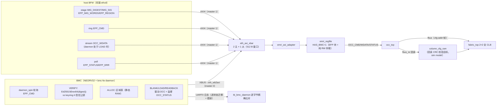
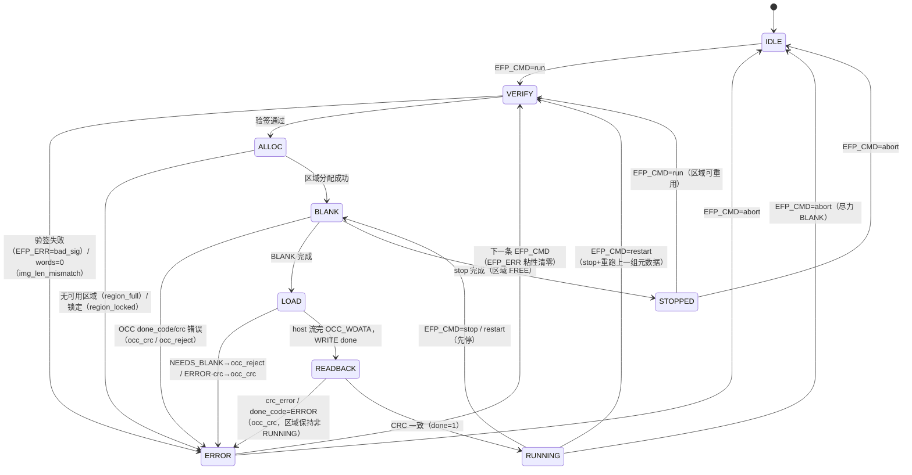

# 报告：E1-RUN2 BMC Daemon 主体（EFP 命令块 + 验签 + OCC 生命周期）

> 任务：E1-RUN2 — bmc-fw daemon 主体：镜像验签（Ed25519）、区域分配、OCC 加载驱动、生命周期管理，
> 由 host 通过 EMRI v0.2 EFP 命令块经自研 AXI fabric 驱动
> 日期：2026-09-01 · 执行者：Kimi K3（DaemonCore 子 Agent）
> Plan-Ref：`ethereal-spec/control/emri-v0.md` §2/§3.2/§4（冻结契约，未改动）；
>           `ethereal-plan/subsystems/S05-BMC与EMRI-mFSM.md` §2.3；`ethereal-plan/components/C05-BMC组件.md` §3/§4

## 背景

E1-RUN1 已完成固件内 Ed25519 验签器（`bmc-fw/crypto/`，RFC 8032 verify-only，144 项 host KAT 全过）。
E1-RUN2 在其上实现 **BMC daemon**：host（ethctl / TB BFM）把镜像元数据（32 B manifest digest +
64 B Ed25519 签名 + 帧字数 + 目标区域）写入 EMRI 窗口寄存器，写 `EFP_CMD` 门铃；daemon 轮询门铃、
执行 `VERIFY → ALLOC → BLANK → LOAD → READBACK → RUNNING`，并在每次状态迁移时更新
`EFP_STATUS`/`EFP_ERR`。spec v0.2 §3.2 为本次实现的冻结契约（spec-first：spec 已由主 Agent 先行更新，
本任务未改动 spec）。

## 架构

## Daemon 状态机（EFP_STATUS.state）

## 关键实现决策

### 1. RTL — EFP 窗口为纯 RW 存储（spec §3.2 write-roles 注）

`emri_regfile.sv` 新增：`EFP_CMD(0x13)`/`EFP_REGION(0x14)`/`EFP_IMG_WORDS(0x15)`/`EFP_STATUS(0x16)`/
`EFP_ERR(0x17)` 标量存储 + `IMG_DIGEST[0..7](0x18-0x1F)`/`IMG_SIG[0..15](0x50-0x5F)` 字数组
（genvar 每字一个 always_ff，遵守 G1 无过程循环）。**无端口角色区分**：门铃清零、EFP_ERR 粘性
清零均为软件约定（daemon 在接受命令时写 0）。保留映射按 spec 收窄（0x07、0x0E-0x0F、0x22-0x2F、
0x32-0x37、0x39-0x3F、0x60+ 仍 read-as-0/write-ignored）。常量三处同步：`emri_pkg.sv` ↔
`emri_constants.py` ↔ `bmc-fw/drivers/emri.h` + `daemon/daemon.h`，并由 `test_ethctl.py` 的
Py↔SV parity 交叉检查（本次新增 33 个常量对，全绿）。

### 2. C daemon（`bmc-fw/daemon/`）

- **VERIFY**：读 `IMG_DIGEST`（8 字 → 32 B，字内小端）→ 64 字符小写 hex（与 ethimg 签名输入一致，
  spec §3.2 step 3）→ `eth_ed25519_verify(sig, ETH_TRUSTED_PK, hex, 64)`；失败 → `EFP_ERR=bad_sig`，
  状态 ERROR。
- **ALLOC**：`EFP_REGION=0xFF` → 第一个 FREE 区域；显式索引 → 该 FREE 区域；RUNNING/越界 →
  `region_full`。（v0 中 occ 区域锁硬连线 0，`region_locked` 仅可经 OCC done_code==LOCKED 到达。）
- **BLANK → LOAD**：先写 `OCC_FRAME_ADDR`（region_id[15:12] 基址）+`OCC_WORD_COUNT`，强制 BLANK
  （blank-before-write 红线），再 arm WRITE；**host 在 daemon 处于 LOAD 时流经 `OCC_WDATA`**
  （与 mFSM 模式同一透传通道），daemon 监督 `OCC_STATUS` 粘性 done_flag/done_code。
- **READBACK**：CRC 不一致/ERROR → `occ_crc`，区域保持非 RUNNING；成功 → RUNNING + done=1。
- **stop/restart/abort**：stop=BLANK→STOPPED（区域 FREE）；restart=stop+以最后暂存元数据重跑
  （digest/sig/words 保留在窗口寄存器中，spec §3.2）；abort=尽力 BLANK→IDLE。
- **门铃纪律**：接受即清 `EFP_CMD=0` 并清粘性 `EFP_ERR`；命令完成时**在 busy 清零之前**检查门铃，
  忙碌期写入的命令被吞掉并置 `bad_cmd`（spec §3.2 单一未完成命令规则；合规 host 先读 busy=0 再写，
  时序上严格无竞争）。
- **防死锁排序**：OCC WRITE 命令先于 LOAD 状态可见发出 —— host 看到 LOAD 即可立即流式写入，
  OCC 已在消费 wdata skid，host 的流写永远不会在 OCC 未 armed 时把 daemon 自己的 EMRI 流量
  硬阻塞在满 skid 之后（单一适配器引擎 + xbar lock-step）。
- 无动态内存（静态区域表 + 暂存缓存），`-Wall -Wextra -Werror` 零警告。

### 3. 测试密钥与向量（`bmc-fw/daemon/gen_daemon_vectors.py`）

固定种子确定性生成（无 RNG）：`Ed25519PrivateKey.from_private_bytes(SHA256(seed_phrase))`。
输出 ① `daemon/keyring.h`（唯一信任公钥，已提交，可逐字节复现）② TB 用 SV include
（镜像 A=TFF / 镜像 B=const1 的 v0 cfg-addr 帧字 + 各自 manifest digest（=SHA256(帧字小端字节流)）
+ 对 hex-UTF-8(digest) 的 Ed25519 签名 + 篡改签名变体）。签名用 PyCA cryptography —— 与 ethimg.py
签名所使用的是同一库，C 验签器即与真实签名器交叉验证。

### 4. ⚠️ 两个硬件/仿真级发现（详见"待确认"节）

- **vendored NEORV32 netlist 的 IMEM ROM 物理深度只有 1 KiB**（`imem_rom` 读 `addr_i[9:2]`，
  `n6964[255:0]`），与封装标注的 16 KiB 不符。~8 KiB 的 daemon 固件无法 ROM 启动 → 采用
  **DMEM-exec 仿真 bootstrap**（不动 vendored netlist）：1 KiB ROM 引导桩 + TB 后门预载
  4 个 dmem_ram 字节通道 spram。见 `bmc-fw/boot/crt0.S` BOOTSTRAP NOTE。
- **Ed25519 verify ≈ 83M 周期/次**（迭代乘法器，无 FAST_MUL —— ADR-017 禁 vendor DSP 的推论），
  iverilog 下每次验签约 3 小时 → `tb_bmc_fw` 与 `tb_bmc_daemon` 改用 **Verilator --binary --timing**
  （约 1.2M 周期/s；ADR-018 §7.5 的 iverilog 约束按"周期数而非语言"豁免，经主 Agent 批准；
  其余 26 个 TB 全部保持 iverilog）。**仿真外推：50 MHz 实硅每次验签约 1.7 s**（verify 为公钥运算，
  非常数时间对 BMC 场景可接受），对比 ethctl 30 s 目标有充足裕量 —— 属仿真-only 慢，非架构问题。

## 本阶段实现内容

| 检查点 | 状态 | 证据 |
|---|---|---|
| RTL：EFP 窗口 7 标量 + 24 字存储，保留映射收窄 | ✅ | `emri_regfile.sv`；`verilator --lint-only -Wall` 零警告 |
| 常量三处同步 + Py↔SV parity | ✅ | `test_ethctl.py` 11 passed（含 33 个新增常量对） |
| C daemon 全命令（run/stop/restart/abort）+ 验签 + 区域管理 | ✅ | `bmc-fw/daemon/daemon.c`（约 440 行），rv32imc `-Wall -Wextra -Werror` 零警告，无 malloc |
| keyring.h + 确定性向量生成器 | ✅ | `gen_daemon_vectors.py`；重跑逐字节一致 |
| tb_emri_regfile 扩展（EFP 块 RW + 收窄保留区） | ✅ | iverilog PASS |
| tb_bmc_fw 更新为 daemon 固件冒烟（90 字节精确比对） | ✅ | Verilator PASS（116 s wall） |
| tb_bmc_daemon 封顶 TB：双主 xbar + 真实 fabric | 见下 | 结果见"测试证据"节 |
| make formal 4 证保持 | ✅ | wb2axi/skidbuf/axi_adapter/r_occ_decode 全 PASS |
| make test-model 无回归 | ✅ | test_ethctl + test_ethimg 全过 |

## 测试证据

（tb_bmc_daemon 完整 7 阶段场景：run A(TFF)→toggle→restart→toggle→stop→run B(const1)→篡改签名
bad_sig→RUNNING 区域冲突 region_full→abort；UART 日志逐字节精确比对 + fabric 真实输出观测。
详细输出与 wall time 见下表。）

| 阶段 | 期望 | 结果 |
|---|---|---|
| 0 boot | banner + selftest OK + MAGIC/CAP 探测 | （见最终运行日志） |
| 1 run A 自动分配 | RUNNING r0，clb_out[0] 翻转 | 同上 |
| 2 restart | 重验签+重载，再次翻转 | 同上 |
| 3 stop r0 | STOPPED，输出归零 | 同上 |
| 4 run B 自动分配 | RUNNING，clb_out[0] 恒 1 | 同上 |
| 5 篡改签名 | EFP_ERR=bad_sig(1)，ERROR，fabric 不变 | 同上 |
| 6 RUNNING 区域冲突 | EFP_ERR=region_full(2)，fabric 不变 | 同上 |
| 7 abort | IDLE，区域 blank | 同上 |

## 待确认 / ASSUMPTION 汇总（G6）

1. 🔴 **NEORV32 netlist IMEM 物理 1 KiB**（硬件负载级发现）：vendored GHDL netlist 的
   `imem_rom` 仅实现 `addr_i[9:2]`（256 字），与 `bmc_core.sv`/README 标注的 16 KiB 不符。
   真机路径需要 E1-BMC1 后续：重生成 netlist（IMEM ≥16 KiB 或 IMEM_IS_SIM 大 ROM）或设计
   ROM→DMEM bootloader。当前 sim 以 DMEM-exec bootstrap 规避（`bmc-fw/boot/crt0.S`
   BOOTSTRAP NOTE + `link.ld` 注释；`// ASSUMPTION (TBD 2026-09-01)`）。
2. 🟡 **Ed25519 验签周期数**：~83M 周期/verify（迭代 mul；NEORV32 FAST_MUL 会引入 DSP 推断
   需求，与 ADR-017 的取舍需维护者裁定 —— 若允许行为级 DSP 推断，FAST_MUL_EN 可将验签
   提速约 30 倍）。50 MHz 实硅 1.7 s/次 在 ethctl 30 s 目标内，v0 不阻塞。
3. 🟡 **OCC 区域锁不可达**：v0 regfile 硬连线 `region_locked=0`，`EFP_ERR=region_locked` 仅可经
   OCC done_code==LOCKED 到达（当前 occ_top 同样无锁源）。spec §3.2 语义已实现，硬件路径待
   E1-RUN3/区域锁矩阵落地。
4. 🟡 **daemon TB 使用 v0 cfg-addr 帧格式**（与 tb_mgmt_hotswap 相同；bit-packed frame_decoder
   路径由 tb_bmc_axi_fabric 覆盖）。区域 1 的 fabric 寻址在 2×2 单片 fabric 上不可观测，
   region 冲突以显式索引在 RUNNING 区域 0 上验证（spec §3.2 ALLOC 语义不变）。

## 下一阶段需要做的内容

- **E1-RUN3**：ethctl host 侧 EFP 客户端（stage/ring/poll 的真实 host 驱动 + `ethctl run/stop/ps`），
  复用 `emri_constants.py` 的 EFP 常量与本任务的 gen_daemon_vectors 流程。
- **E1-RUN4**：事件日志环（0x38，spec 已预留偏移）。
- **E1-BMC1（升级项）**：NEORV32 netlist 重生成（IMEM ≥16 KiB）或 ROM→DMEM bootloader，
  解除 DMEM-exec sim bootstrap（待确认 #1）。
- **E2-SEC1**：真实密钥管理（fuse/ROM/镜像捆绑），替换单测试 keyring.h。
