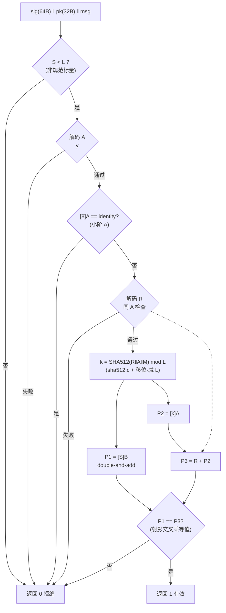

# 报告：E1-RUN2 bmc-fw 密码学底座 — 自研 Ed25519 验签（RFC 8032）+ 自立 SHA-512

> 任务：E1-RUN2 BMC daemon 密码学底座 — Ed25519 签名验证（verify-only），无 libc 裸机 C
> 日期：2026-09-01
> Plan-Ref：`ethereal-plan/subsystems/S05-BMC与EMRI-mFSM.md`（E1-RUN2 daemon verify 路径）；`ethereal-tools/tools/ethimg.py` §signature（验签对象：manifest_digest hex UTF-8 字节）

## 本阶段实现内容

### ✅ 自研 SHA-512（`ethereal-runtime/bmc-fw/crypto/sha512.c/.h`）

- FIPS 180-4 直译实现，C99、**无 libc、无动态内存**（G1 合规）；一次性 + 流式 API（`eth_sha512_init/update/final`），状态全在调用方栈上的 ctx（304 字节）。
- 修法记录：padding 缓冲 `zeros[112]` 在 `block_len ≥ 112` 时 pad 长度可达 128 → 越界（host 栈保护抓到），已修正为 `zeros[128]`。

### ✅ 自研 Ed25519 验签（`ethereal-runtime/bmc-fw/crypto/ed25519.c/.h`）

- 按 RFC 8032 §5.1.7 从规范实现（in-house，MIT）。对外接口严格为合同头：
  `int eth_ed25519_verify(const uint8_t sig[64], const uint8_t pk[32], const uint8_t *msg, uint32_t msg_len)`（1=有效 0=无效），另加可选 `eth_ed25519_selftest()`（内嵌 RFC TEST 1 KAT，供目标板冒烟）。
- **域运算** GF(2²⁵⁵−19)：8×32-bit 小端 limb，每次运算后全规约（< p）。乘法 = 8×8 教科书乘（64-bit 累加器精确不溢出：max = (2³²−1)² + 2(2³²−1) = 2⁶⁴−1）+ 折叠规约（2²⁵⁶ ≡ 38 mod p，严格递减保证终止）+ 条件减 p。
- **群运算**：扩展扭 Edwards 坐标 (X:Y:Z:T)，完备加法/倍点公式（RFC 8032 附录移植）；标量乘 = 朴素 double-and-add（253 bit）。**非常数时间**（BMC 上验签输入全公开，简单+正确优先；最终比较用域等值而非 memcmp）。
- **解码与拒绝检查**（全部实测覆盖）：
  - `S ≥ L`（含 S == L、S == L+1、S 全 0xFF）→ 拒绝；
  - 非规范域编码 `y ≥ p`（A 与 R 同查，含 y == p、y == p+1）→ 拒绝；
  - 无效 x 恢复（v·x² ∉ {u, −u}）、`x == 0 且 sign=1` → 拒绝；
  - **小阶 A**（单位元、阶 2 的 (0,−1) 等）：`[8]A == identity` → 拒绝（阶整除 8 全覆盖，仅 3 次倍点开销）。
- 验签方程：`[S]B == R + [k]A`，`k = SHA512(R‖A‖M) mod L`（512-bit 移位-减 L 规约，253 次循环，明显正确优先）。

### ✅ Host 验证（验收核心）

- `test_host.c`（native gcc）+ `gen_vectors.py`（PyCA `cryptography` 参考实现，与 ethimg.py 同库交叉验证）+ 独立 `Makefile`（不挂根 Makefile）+ 生成的 `test_vectors.h`（固定种子 0xE12026，已入库，无 PyCA 也可复跑）。
- **144 项检查全过**（见验证结果表）。RFC 8032 §7.1 TEST 1/2/3 + 64 组随机（key, msg, sig）（msg 长度 0–512 随机）+ 64 组篡改（sig/msg/pk 翻转 1 bit，必须验签=0）+ 9 组边界拒绝 + 3 组 SHA-512 KAT + 内嵌 selftest。

### ✅ 目标交叉编译 + 足迹

- `riscv64-unknown-elf-gcc 13.2.0 -march=rv32imc -mabi=ilp32 -nostdlib -ffreestanding -Os -Wall -Wextra -Werror` 编译 `.o` 干净通过（链接留给 daemon 波次）。
- 代码体积：`ed25519.rv32.o` text **3387 B** + `sha512.rv32.o` text **2438 B** ≈ **5.7 KiB**，data/bss = 0（常量全在 .rodata/text 侧，无静态可写状态）。
- 周期估算（**估计值**，基于实测 op 计数 + 指令推理）：单次验签实测 **≈ 7.47k 次域乘法**（`ETH_ED25519_PROFILE` 计数，53 字节消息有效验签）；每次域乘法 = 64 次 32×32→64 乘（rv32imc 下 mul+mulhu）+ 规约。单周期 mul 核 ≈ 8M 周期/验签；NEORV32 Zmmul 迭代乘法器（~33 周期/mul）≈ 3×10⁷–4×10⁷ 周期/验签。**量级 10⁷–10⁸ 周期，50 MHz 下约 0.2–0.8 s/次验签**（估计）。参考：host（i9-13900H）实测 ≈ 1.5 ms/次。栈占用 < 2 KB，无堆。

## 验证结果

| 套件 | 内容 | 结果 |
| --- | --- | --- |
| SHA-512 KAT | FIPS 180-4 空串 / "abc" / 200×'a' 跨块流式（对齐 python hashlib） | ✅ 3/3 |
| RFC 8032 §7.1 KAT | TEST 1（空消息）/ TEST 2（1B）/ TEST 3（2B） | ✅ 3/3 |
| 内嵌 selftest | `eth_ed25519_selftest()`（TEST 1 + 篡改拒绝） | ✅ 1/1 |
| PyCA 交叉向量 | 64 组随机 (key, msg, sig)，msg 长度 0–512 随机 | ✅ 64/64 验签=1 |
| 篡改向量 | sig/msg/pk 各翻 1 bit（64 组） | ✅ 64/64 验签=0 |
| 边界拒绝 | S==L / S==L+1 / S=0xFF… / A=单位元 / A=阶2 / A:y==p / A:y==p+1 / R:y==p+1 / R:x=0&sign=1 | ✅ 9/9 验签=0 |
| host 构建 | `gcc -Wall -Wextra -Werror -std=c99 -O2` | ✅ 零警告 |
| 目标交叉编译 | `riscv64-unknown-elf-gcc -march=rv32imc -mabi=ilp32 -nostdlib -ffreestanding -Os -Wall -Wextra -Werror` | ✅ 零警告（.o） |
| G1 合规 | 无 malloc/calloc/realloc/free，无 libc 依赖（grep 证实） | ✅ |

复跑：`make -C ethereal-runtime/bmc-fw/crypto run`（host 全量）、`make ... profile`（op 计数）、`make ... target`（riscv 编译+size）、`make ... vectors`（重新生成向量）。

## 验签流水线（`eth_ed25519_verify`）

## 设计取舍与待确认（G6）

- **非常数时间**：BMC 验签输入全公开（签名/公钥/消息），简单优先；若未来同代码复用做密钥侧操作（不会，verify-only），须重写为常数时间。
- 严格采用**无辅因子**方程 `[S]B == R + [k]A` + 小阶 A 拒绝（对齐 ref10/libsodium 严格语义），比 RFC 8032 的 `[8]` 版本更严；与 PyCA（验签侧宽松）交叉的 128 组向量全部一致。
- 标量乘为朴素 253-bit double-and-add（无预计算表/滑窗）——正确性与体积优先；daemon 若对验签延迟敏感可后续加固定基预计算表（B 固定，可砍约一半域乘法）。
- `test_vectors.h` 为生成物但**固定种子入库**，保证无 PyCA 环境可复跑 host 测试；重生成需 `cryptography`。

## 下一阶段需要做的内容

- **E1-RUN2 daemon 实装**：消费本合同头，验签对象为 ethimg `manifest_digest` 的 **hex UTF-8 字节**（`ethimg.py _sign_digest`：`sig = sk.sign(digest_hex.encode("utf-8"))`）→ region 分配 → OCC 加载 → lifecycle。目标板上用 `eth_ed25519_selftest()` 做上电冒烟。
- 根 Makefile 的 bmc-fw 构建在 daemon 波次把 `crypto/*.o` 链入 `bmc_fw.elf`。
- 可选优化：固定基 B 预计算表（验签提速 ~2×）或滑窗；如 flash/RAM 紧张可再 -Os 调优。
- FW 自更新（E1-BMC2 后半）复用本验签做固件镜像签名校验。
