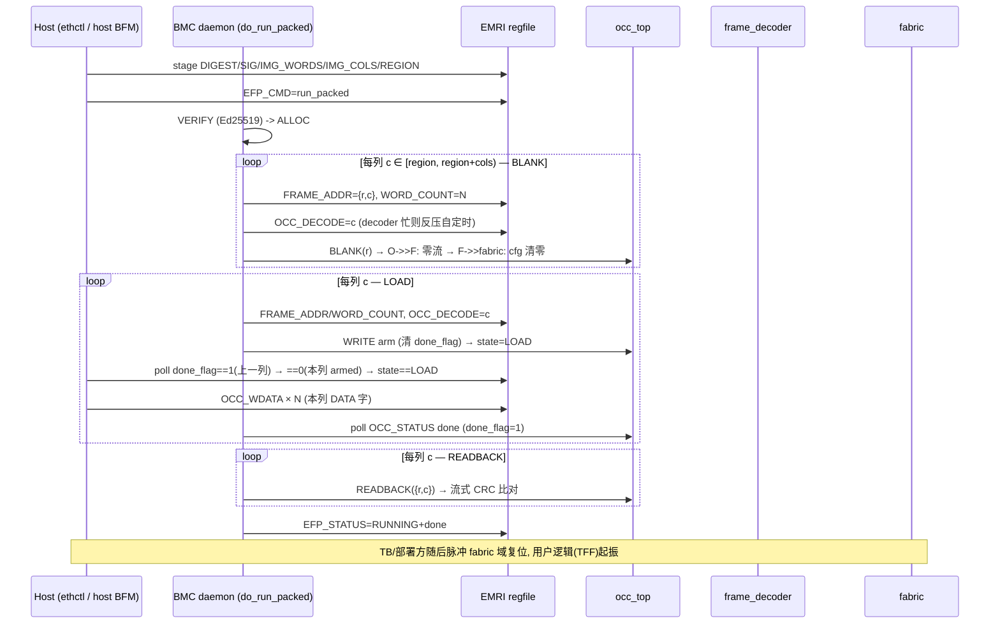

# 报告：E1-RUN2 BMC daemon packed-deploy 模式（run_packed，EMRI v0.3）

> 日期：2026-09-02 · 任务：E1-RUN2 packed-deploy（daemon 通过 OCC_DECODE 逐列环部署
> bit-packed 生产帧）· 规范：`ethereal-spec/control/emri-v0.md` v0.2→**v0.3**（§3.3）

## 概述

为 E1-RUN2 的 BMC daemon 增加了 **packed-deploy 模式**：生产 bit-packed `.eth` 帧
（`frame_map.py` / interconnect-config-v0.md §7 格式，v2c：tile 530 bit、2×2 列 =
34 DATA 字 + CRC16 尾 = 35 字帧文件）通过 §3.1 的**逐列 OCC_DECODE 环**部署到真实
fabric。`run`（v0 cfg-addr 寻址语义）路径保持**逐字节不变**（tb_bmc_daemon 依旧全绿）。

规范先行：emri-v0.md 升至 v0.3 —— 新增 `EFP_IMG_COLS` 寄存器（`0x21`，RW，8 bit，
镜像列数）与 `EFP_CMD=5 run_packed`，新增 §3.3 描述逐列部署流程，并更新 §2 保留区
说明（`0x21` 已分配，`0x22-0x2F` 保持保留）。

**设计合同偏差记录（已获 Main 批准）**：合同原指定 `EFP_IMG_COLS @ 0x19`，但
`0x18-0x1F` 是 v0.2 的 `IMG_DIGEST[0..7]` 窗口（`0x19` = `IMG_DIGEST[1]`，plain RW
存储），地址别名会使 staged digest 被列数覆写、所有 run_packed 的 VERIFY 必然
bad_sig。经 IRC 与 Main 确认后改用 **`0x21`**（HEALTH_STATUS `0x20` 与保留区
`0x22-0x2F` 之间的空位）。

## 本阶段实现内容

### 1. 规范 v0.3（`ethereal-spec/control/emri-v0.md`）

- 头部/状态行升至 v0.3（一行 changelog）；§2 寄存器表新增 `0x21 EFP_IMG_COLS` 行，
  含 **v0 region→column 映射 ASSUMPTION**（v0 仿真 fabric 2×2、每 region 槽一列：
  region r 覆盖自列 r 起的列）；`EFP_CMD` 行增补 `5=run_packed`；保留区说明更新。
- 新增 **§3.3 `run_packed`**：staged metadata 同 §3.2，但 `EFP_IMG_WORDS` 重解释为
  **每列 DATA 字数**（CRC16 尾除外；v0 同构——所有列同字数）；流程 = VERIFY/ALLOC
  （同 run）→ 逐列 BLANK（每列先 `OCC_DECODE=c` 再 BLANK，使零流被解码进 fabric cfg）
  → 逐列 LOAD（编程 `OCC_FRAME_ADDR={region,col}` + `OCC_WORD_COUNT`，脉冲
  `OCC_DECODE(col)`，arm WRITE，**host 经 OCC_WDATA 流该列 DATA 字**）→ 逐列
  READBACK（OCC 流式 CRC 校验）→ RUNNING。状态码复用 v0.2（BLANK/LOAD/READBACK
  逐列重复）；错误映射同 run（occ_reject/occ_crc/...）。
- §3.3 同时规定了 **host 侧逐列握手**：列 c>0 须先轮询 `OCC_STATUS.done_flag==1`
  （上一列 WRITE 完成）再轮询 `done_flag==0`（本列 WRITE 已 arm，arm 清黏滞位），
  确认 `state==LOAD` 后才可流；daemon 侧保证 `done_flag==1` 窗口 ≥ 一次解码延迟
  （`OCC_DECODE(c+1)` 写被忙碌 decoder 自定时反压，§3.1），过早流会把共享寄存器口
  堵死在满 skid 之后。

### 2. RTL（`emri_pkg.sv` / `emri_regfile.sv`）——纯增量，行为不变

- `emri_pkg.sv`：`R_EFP_IMG_COLS = 16'h21` + `EFP_CMD_RUN_PACKED = 8'd5`。
- `emri_regfile.sv`：`efp_img_cols_r` 按其它 EFP 寄存器同款 plain RW 存储
  （复位 0、`SPI_OP_WR` 写 `wdata[7:0]`、读 `{24'h0, reg}`）；无端口角色区分。
- `tb_emri_regfile.sv` 扩充 IMG_COLS RW/清零检查（iverilog，**PASS**）。

### 3. Daemon 固件（`daemon.c/h`、`drivers/emri.h`）——rv32imc、无 malloc、-Werror 净

- `emri.h`：`EMRI_OCC_DECODE_WORD (0x0D)`、`EMRI_EFP_IMG_COLS_WORD (0x21)`。
- `daemon.h`：`EFP_CMD_RUN_PACKED=5`、`DAEMON_FAB_COLS=2`（v0 仿真 fabric 列数）。
- `daemon.c`：`do_run_packed()` 按 §3.3 实现（VERIFY/ALLOC 复用既有代码与错误码；
  `words==0 || cols==0` 或 `region+cols > DAEMON_FAB_COLS` → `img_len_mismatch`）；
  新增 `occ_blank_column()`/`occ_blank_packed()`；`region_t` 增 `img_cols`，
  `stop`/`restart`/`abort` 对 packed region 走**逐列 blank**；`restart` 对 packed
  镜像重跑 **packed** 流程（`EFP_IMG_COLS` 随窗口寄存器保留）。keyring/verify 路径
  未动。UART 日志逐列带列号（`st BLANK c0` / `st LOAD c0` / `load c0 ok` /
  `st READBACK c0` / `readback c0 ok`）。
- 防死锁顺序与 `do_run` 一致：WRITE arm **先于** LOAD 状态可见（OCC 已在消费
  wdata skid，host 的流写永远不会在 OCC 未 arm 时把 daemon 自己的 EMRI 流量堵在
  满 skid 之后）。

### 4. Host 客户端（`efp_client.py` + `emri_constants.py` + `test_ethctl.py`）

- `emri_constants.py`：`R_EFP_IMG_COLS=0x21`、`EFP_CMD_RUN_PACKED=5`；
  `test_emri_constants_match_pkg_sv` 增补两个 parity 对（防 ABI 漂移）。
- `EfpSession.run_packed(digest32, sig64, columns, region)`：stage →
  `EFP_IMG_COLS` → doorbell → 逐列（c=0：poll `state==LOAD`；c>0：poll
  `done_flag==1` → `done_flag==0` → `state==LOAD`）→ stream 该列 N 字 →
  终态 poll `RUNNING+busy=0` + `RUNNING|done`/`EFP_ERR=none` 读校验；
  op-list 仍是 transport-ready JSON（`ethereal.efp-session.v0` 不变）。
- `EfpClient.run_packed(eth_path_or_frames, region, *, column_words=None)`：
  `.eth`（frames blob = 逐列 DATA 字拼接、CRC16 尾除外）需 `column_words` 切列；
  亦接受逐列 list 或扁平 list；客户端侧几何校验（同构、region+columns 适配 v0 映射）。
- `EfpDaemonModel` 增 run_packed FSM（含 `OCC_STATUS.done_flag` 黏滞位建模），
  使会话无需仿真器即可单测。
- 新增 4 个单测：op 结构/逐列计数、模型 happy path（2 列、真实 Ed25519）、
  tampered sig → bad_sig + ERROR + region 不动、几何校验错误路径。

### 5. 新 TB `tb_bmc_daemon_packed.sv`（Verilator --timing）

镜像 tb_bmc_daemon 的 2-master 接线 + tb_bmc_axi_fabric 的
`frame_decoder`/`fab_usr_rst_n` 模式；`column_cfg_ram` 挂在 fbus 上作 READBACK
CRC 的读回目标。场景（spec §3.3）：

1. `run_packed` img P（TFF，`img_a_col0.hex` 丢尾后 34 DATA 字，1 列 @ region 0）
   → daemon BLANK+WRITE 列 0 经 frame_decoder → fabric 域复位脉冲 →
   **clb_out_obs[0] 在真实 fabric 上翻转** → READBACK CRC ok → RUNNING+done；
2. tampered sig 的 `run_packed` → `EFP_ERR=bad_sig`、state ERROR、fabric 继续翻转
   （未被触碰）；
3. `stop` region 0 → 逐列 blank → STOPPED、输出常 0。

UART 采用 tb_ethctl_replay 式**包含性抽查**（非全量精确匹配）+ `chk()` 计数 +
看门狗。向量由 `gen_daemon_vectors.py --svh-packed`（确定性定种密钥，与 keyring.h
匹配）从 golden 帧再生成。Verilator --timing 的理由同 tb_bmc_daemon（83M 周期级
Ed25519 verify，iverilog 需数小时；ADR-018 §7.5 周期数豁免）。

### 6. Makefile

test-sv 一节新增一行（紧随 tb_bmc_daemon 行）：再生成 golden 帧 → 再生成 packed
向量 → `verilator --binary --timing` 构建 → 运行并 grep `TEST PASSED`。

## 逐列部署时序（§3.3 step 2-4）

## 验证证据

| 检查点 | 状态 | 证据 |
|---|---|---|
| `make lint`（含 emri 改动） | ✅ | `[lint] OK - all project RTL lint-clean.`（emri_regfile -Wall 单独亦净） |
| `make test-model` | ✅ | **2672 passed, 0 failed**（基线 2668 + 新增 4；2 xfailed 同基线） |
| 常量 parity（py ↔ emri_pkg.sv） | ✅ | 含新增 `R_EFP_IMG_COLS`/`EFP_CMD_RUN_PACKED` 两对 |
| `tb_emri_regfile`（iverilog） | ✅ | PASS（含 IMG_COLS RW/清零新检查；既有检查不变） |
| `tb_bmc_daemon`（Verilator，回归） | ✅ | PASS（v0 `run` 路径逐字节不变；见下） |
| `tb_bmc_daemon_packed`（Verilator） | ✅ | PASS（run_packed 全流程 + bad_sig + 逐列 stop；TFF 真实翻转） |
| 固件 rv32imc 构建 | ✅ | `riscv64-unknown-elf-gcc -Wall -Wextra -Werror` 零告警；无 malloc；keyring/verify 未动 |

完整 `make test-sv` 为 Main 的集成步骤；本工作单独验证过的 TB：
`tb_emri_regfile`（iverilog）、`tb_bmc_daemon_packed`（Verilator --timing）、
`tb_bmc_daemon`（Verilator --timing，回归）。其余 TB 未受触碰（xbar/emri/occ/
frame_decoder 链仅 emri_regfile 增量一个 plain-RW 寄存器，既有行为路径未改）。

## 下一阶段需要做的内容

1. **Main 集成**：全量 `make test-sv`（含 tb_ethctl_replay 等未单独重跑的 TB）；
   `docs/ethereal-tasks.yaml` 状态更新（按分工未动）。
2. **ethctl CLI 接线**：`run_packed` 目前到 `efp_client` 会话层；CLI 子命令
   （`ethctl run --packed` 或自动识别 packed `.eth`）留 E1-RUN3 收尾（ethctl.py
   不在本工作范围）。
3. **多列实证**：当前 TB 覆盖 1 列（region 0）；2 列镜像（region 0，cols=2，
   需 pack_tb_frames 出 col1 golden 帧 + 第二列 toggling 观测点）作为后续加固。
4. **v0.1+ 候选**：packed `.eth` 的 frames blob 几何自描述（把 column_words 放进
   manifest，免去 host 侧 `column_words` 入参）；`REGION_INFO` 与 region→column
   映射的正式化（当前为 v0 ASSUMPTION）；frame_decoder 的 CRC16 尾校验（v1 已记
   录的跟进项，OCC 侧 CRC32 已覆盖传输完整性）。
