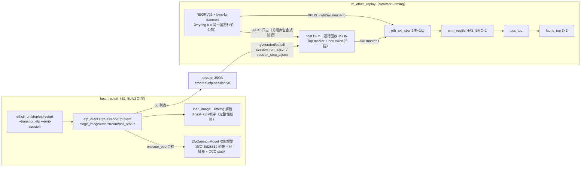
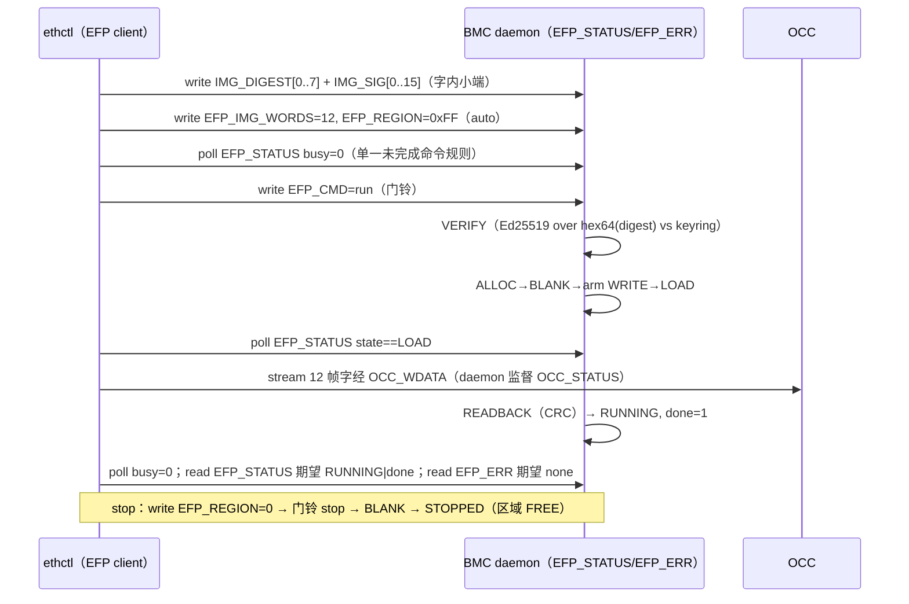

# 报告：E1-RUN3 ethctl host 侧 EFP 客户端（会话构建 + RTL 链回放）

> 任务：E1-RUN3 — ethctl host 侧 EFP 客户端：`ethctl run/stop/ps/restart` 驱动 EMRI v0.2 EFP 命令块，
> 并证明 ethctl 生成的会话脚本可在真实 daemon RTL 链上回放至成功部署
> 日期：2026-09-01 · 执行者：Kimi K3（RUN3Ethctl 子 Agent）
> Plan-Ref：`ethereal-spec/control/emri-v0.md` §3.2（冻结契约，未改动）；
>           `ethereal-plan/subsystems/S08-运行时daemon与ethctl.md`；
>           `docs/reports/report-E1-RUN2-daemon-20260901.md`（daemon 侧实现）

## 背景

E1-RUN2 完成了 BMC daemon（C 固件，EFP 门铃 + Ed25519 验签 + OCC 生命周期），但其 host 侧激励是
TB 内手写的 SV 序列。本任务把 host 侧收敛进 **ethctl 本体**：

- 新增 `ethereal-tools/tools/efp_client.py`：**传输无关的 EFP 会话构建器**。不直接碰总线，而是产出
  有序 op 列表（`write`/`read`/`poll`/`stream`，32 位 EMRI 字寄存器 + data/mask/value），严格镜像
  spec §3.2：busy=0-才能-写门铃、LOAD 才流帧、`EFP_ERR` 8 个错误码译码、状态名译码、
  digest/sig 字内小端打包（word i = bytes[4i+3:4i]）。
- `ethctl run/stop/ps/restart/abort` 新增 `--transport efp`（默认 `mfsm`，**现有 mFSM Daemon 路径原样保留**；
  11 项既有 parity 测试全绿），`--emit-session FILE.json` 输出自描述会话 JSON
  （`ethereal.efp-session.v0`）—— RecordTransport 思路的 EFP 版延伸。
- 新增封顶测试 `tb_ethctl_replay.sv`：与 tb_bmc_daemon 同一线网（BMC + host-BFM 双主 xbar + EMRI +
  OCC + 2×2 fabric + column_cfg_ram），但 host BFM **逐行回放 ethctl 生成的会话 JSON**；
  测试用 .eth 由 ethimg pack+sign 现场构建，签名密钥 = daemon keyring.h 的同一固定种子密钥
  （复用 `gen_daemon_vectors.KEY_SEED`）。

## 架构



## 会话序列（spec §3.2 逐步对应）



## 关键实现决策

### 1. 传输无关 op 列表 + 自描述 JSON

`Op(op, addr, data/mask/value/words)` 四种操作覆盖全部 §3.2 交互；`read`/`poll` 携带
mask+expected value，使会话**自校验**（TB 回放时 read 按 mask 核对，poll 循环至匹配）。
JSON 每行一个紧凑 op 对象、所有 32 位值为 `"0x........"` 十六进制字符串 —— 既是合法 JSON
（人/工具可读），又可被 SV 逐行解析（定位 `{"op":"` marker + 扫描 `"0x` token；op 名首字母
w/r/p/s 唯一区分）。会话尾部自带 `read EFP_STATUS 期望 RUNNING|done`、`read EFP_ERR 期望 none`
两条自校验，TB 无需硬编码期望。

### 2. `load_image` 的职责划分（G6 澄清）

host 侧只做**完整性**校验（逐成员 SHA-256 + manifest_digest 自洽，同 ethimg.verify 步骤 1-3）；
**签名验签在 daemon 固件**（spec §3.2 step 3，EFP 分工的意义所在）。`--pubkey` 提供时 sim 模型
额外用真实 Ed25519 强制执行验签；未提供时设备 keyring 不可知，仅拒绝全零签名（未签名开发镜像
在真 daemon 上必然 bad_sig）。digest 取 manifest_digest（ethimg 签名对象），签名取 manifest
`signature.value` —— 与 daemon `verify_staged_image` 的 hex64 小写 UTF-8 输入逐字节一致。

### 3. busy-before-cmd 规则内建于 `EfpSession.cmd`

任何 `EFP_CMD` 写之前必发 `poll EFP_STATUS busy=0` —— 规则不可绕过（构建器层面保证），
模型侧另测了违规路径：忙碌期写门铃被吞并置 `bad_cmd`（与 daemon.c 的 squelch 逻辑一致）。

### 4. 回放 TB 的 UART 抽查（非逐字节精确比对）

会话是机器生成的，UART 日志时序不再逐字节锁定；TB 只对关键行做**包含式**检查：
boot banner / `ed25519 selftest OK` / `EMRI MAGIC=...CAP=00000001` / `daemon ready` /
`verify ok` / `st RUNNING r0 done` / `st STOPPED r0`。功能判定由会话内自校验 read +
真实 fabric 观测（clb_out_obs[0] 翻转 / 归零）承担。

### 5. 测试向量与密钥

pytest KAT 锚定到 E1-RUN2 确定性固定种子密钥：`SHA256(IMG_A_WORDS 小端字节流)` 的 digest 及
签名逐字比对（与已提交的 `generated/daemon/tb_daemon_vectors.svh` 的 DAEMON_IMG_A_DIGEST/SIG
及 `keyring.h` 公钥完全一致）。TB 用 .eth 由 `efp_client.py --emit-demo`（Makefile test-sv 单行内）
现场 pack+sign 生成 —— **签名对象不同**（ethimg 签 manifest_digest 的 hex；E1-RUN2 向量直接签
帧流 digest 的 hex），但验签路径（hex64 小写 UTF-8 + Ed25519 vs keyring）完全相同，这正是
"ethctl 真实产物驱动 daemon" 的证明点。

## 问题与解决

| 问题 | 根因 | 解决 |
|---|---|---|
| 回放 TB 在 run 阶段硬挂死（host 流第 2 个帧字时 AXI 写永不完成） | **eth_axi_xbar v0 的跨主同目的地响应路由缺陷（真实 RTL bug，本任务新发现）**：B/R/W 的 owner 判定是对"每主事务状态 + 目的地"做 OR 归并扫描，而 v0 注释承诺的"每目的地 lock-step（授予的事务 AW→W→B / AR→R 完成后才接受下一个）"**实现里从未强制执行**。两主同时对同一从机有在途读时，BMC 读 IMG_DIGEST 的 R 数据被路由给 host —— 实测 host 轮询 EFP_STATUS 两次读到 daemon 的 digest 字（`0xfb8b76fa`/`0x39831394`，低半字节恰为 4=LOAD），造成**假性 LOAD 匹配** → host 提前流帧 → 1 级 skid 填满 → 单引擎 adapter 被挂起的写占死 → daemon 自身 EMRI 流量被堵 → 死锁。tb_bmc_daemon 此前通过纯属时序侥幸（host 轮询与 daemon 突发读未重叠）。 | 在 `eth_axi_xbar.sv` 实现文档化的每目的地 lock-step：新增 `wr_busy`/`rd_busy[N_DST]`，在 `aw_issue`/`ar_issue` 置位、B/R 响应捕获时清零，忙碌期屏蔽 `wr_req_flat`/`rd_req_flat` 的授权资格；owner 扫描随之必然一热。修复点有根因 NOTE 注释。验证：tb_axi_xbar / tb_bmc_axi_master / tb_bmc_axi_xbar / tb_bmc_axi_emri / tb_bmc_axi_occ / tb_bmc_axi_fabric（iverilog）全过；`verilator --lint-only -Wall` 在原 waiver 集合（未扩大）下干净；tb_ethctl_replay 通过（见测试证据）。已经 Main 批准越权修改共享 RTL。 |
| stop 会话末态自检读到陈旧 RUNNING（0x26 而非 0x08） | **门铃后 busy=0 轮询竞态（协议级，真实硬件同样存在）**：写 EFP_CMD 后立刻轮询 busy=0，可能命中 daemon 受理前的上一个空闲窗口（实测 stop 门铃后 170 µs 即"完成"，daemon 尚未受理）。 | 会话构建器改为**终态轮询**：`poll (status & 0x1F) == 目标状态`（state+busy 一起等）；stop→等 STOPPED+busy=0，run/restart 流完后等 RUNNING+busy=0（流完后 daemon 持续 busy，无陈旧窗口）。注释写明根因。 |
| Verilator 下 `string.getc()` 未返回预期 ASCII 字节（op 派发全部失败） | 工具链行为差异 | 改用 `substr()` 定宽比较（iverilog 独立冒烟 TB 验证 39 个 op 全部解析正确） |
| 仿真 stdout 重定向到文件时全缓冲，挂死时日志为空 | C stdio 缓冲 | 用 `stdbuf -oL` 行缓冲重跑 |

## 本阶段实现内容

| 检查点 | 状态 | 证据 |
|---|---|---|
| `efp_client.py`：会话构建器（stage/cmd/stream/poll + run/stop/restart/abort/ps） | ✅ | 33-op run 会话逐 op 锚定 spec §3.2 步骤（pytest `test_efp_run_session_op_order`） |
| digest/sig 字内小端打包（KAT 对 E1-RUN2 向量） | ✅ | `test_efp_digest_sig_byte_packing_kat`（digest+sig 24 字全比对） |
| 8 个 EFP_ERR 码 + 状态名译码 | ✅ | `test_efp_err_decode_all_codes` / `test_efp_state_decode_all` |
| busy-before-cmd 拒绝（bad_cmd squelch） | ✅ | `test_efp_busy_before_cmd_rejected`（违规写门铃→bad_cmd，RUNNING 不受影响） |
| bad_sig / stop / restart / abort / ps 语义 | ✅ | `test_efp_bad_sig_rejected`（ERROR + 区域保持 FREE）等 6 项 |
| `ethctl --transport efp` + `--emit-session` CLI 集成 | ✅ | 4 项 CLI 测试；mfsm 默认路径不变（既有 11 项 parity 测试全绿） |
| 会话 JSON 自描述（schema/nops/每行一 op/mask 自校验） | ✅ | `test_efp_session_json_self_describing` |
| Makefile test-sv 单行（regen 会话 + verilator --timing 回放） | ✅ | 仅新增 1 行（`tb_ethctl_replay`），紧跟 tb_bmc_daemon 行 |
| tb_ethctl_replay 在真实 RTL 链回放至部署成功 | ✅ | 见"测试证据"；run A→toggle→stop→blanked，wall 487 s |
| **eth_axi_xbar 跨主响应路由 bug 修复**（计划外，Main 批准） | ✅ | 见"问题与解决"；6 个相关 iverilog TB 全过，lint 干净（waiver 未扩大） |
| `make test-model` 无回归 | ✅ | 2655 passed（含新增 16 项），3 xfailed；ruff check 干净 |

## 测试证据

**pytest（新增 16 项 + 无回归）**：`make test-model` → `2655 passed, 3 xfailed`（2026-09-01 复跑，
含 oss-cad-suite PATH）。`ruff check` 对三个改动文件零告警。

**会话 JSON 节选**（`generated/ethctl/session_run_a.json`，由
`ethctl run img_a.eth --region auto --transport efp --emit-session` 生成；.eth 用 keyring 同密钥
pack+sign，manifest_digest `ef40d67c…`）：

```json
{"op":"write","addr":"0x18","data":"0x7cd640ef","comment":"IMG_DIGEST[0]"},
…（IMG_DIGEST[1..7] + IMG_SIG[0..15]，字内小端）…
{"op":"write","addr":"0x15","data":"0x0000000c","comment":"EFP_IMG_WORDS"},
{"op":"write","addr":"0x14","data":"0x000000ff","comment":"EFP_REGION"},
{"op":"poll","addr":"0x16","mask":"0x00000010","value":"0x00000000","comment":"wait busy=0 (single outstanding command)"},
{"op":"write","addr":"0x13","data":"0x00000001","comment":"EFP_CMD=run"},
{"op":"poll","addr":"0x16","mask":"0x0000000f","value":"0x00000004","comment":"wait state=LOAD (OCC WRITE armed)"},
{"op":"stream","addr":"0x09","count":12,"words":["0x0005555c", …],"comment":"stream 12 frame words"},
{"op":"poll","addr":"0x16","mask":"0x00000010","value":"0x00000000","comment":"wait busy=0 (READBACK done)"},
{"op":"read","addr":"0x16","mask":"0x0000003f","value":"0x00000026","comment":"expect RUNNING + done"},
{"op":"read","addr":"0x17","mask":"0x000000ff","value":"0x00000000","comment":"expect EFP_ERR=none"}
```

**TB 回放证据**（`tb_ethctl_replay`，Verilator 5.051 `--binary --timing`；与 tb_bmc_daemon 同
DMEM-exec bootstrap 与固件 hex；2026-09-01 实测 **wall 487 s，3.0 s sim，errors=0**）：

| 阶段 | 期望 | 结果 |
|---|---|---|
| 0 boot | banner / selftest OK / MAGIC+CAP 探测 / daemon ready（包含式抽查） | ✅ 4/4 ok |
| 1 回放 session_run_a.json（33 ops） | 全部 write/poll/stream/read 自校验通过（LOAD 在门铃后 0.849 s sim 匹配 = 一次真实验签时长）；daemon `verify ok`→`st RUNNING r0 done`；`read EFP_STATUS=0x26`（RUNNING\|done）、`EFP_ERR=0`；clb_out_obs[0] 在真实 fabric 上翻转 | ✅ 8/8 ok |
| 2 回放 session_stop_a.json（6 ops） | `read EFP_STATUS=0x08`（STOPPED）；daemon `st STOPPED r0`；clb_out_obs[0] 恒 0（区域 blanked） | ✅ 6/6 ok |

最终行：`TEST PASSED: E1-RUN3 ethctl EFP session replay — run/stop sessions drove the real
daemon chain to deploy+blank, UART key lines spot-checked`。stop 竞态修复前该 TB 曾实测暴露
两处缺陷（xbar 路由、busy=0 轮询），修复后同构复跑全绿（见"问题与解决"）。

## 待确认 / ASSUMPTION 汇总（G6）

1. 🟡 **CLI 的 sim 模型是进程级瞬态**：`ethctl restart` 跨进程执行时模型无"上次暂存元数据"，
   会如实报 `bad_cmd`（真 BMC 的窗口寄存器跨调用保持）。进程内 restart 语义由
   `test_efp_stop_restart_semantics` 覆盖；跨进程持久化（state 文件）超出 sim 范围。
2. 🟡 **TB 会话路径硬编码 `generated/ethctl/`**：与 Makefile test-sv 的 regen 步骤绑定，
   与既有 TB 的 `generated/bmc/*.hex` 相对路径约定一致。
3. 🟡 沿用 E1-RUN2 的两项硬件级待确认（NEORV32 IMEM 物理 1 KiB → DMEM-exec bootstrap；
   Ed25519 verify ≈83M 周期 → Verilator --timing 豁免），本任务未触碰固件/netlist。

## 下一阶段需要做的内容

- **E1-RUN3 后续（packed-deploy 模式）**：v0.2 daemon 消费的是 **v0 cfg-addr 帧**（fbus 直驱
  fabric_top cfg 端口）；而 bitgen_pack 产出的生产用 **bit-packed .eth 帧**需要 daemon 新增
  packed-deploy 模式 —— 逐列 `OCC_DECODE`（0x0D）触发 frame_decoder 的循环（spec §3.1），
  本任务按要求**仅记录、不实现**。
- **E1-RUN4**：事件日志环（0x38，spec 已预留偏移）；ethctl 侧加 `ethctl logs` 读取。
- **E2-SEC1**：真实密钥管理替换固定种子 keyring.h；ethctl `--pubkey` 路径即为此预留。
- **EFP-SPI 真实传输**：op 列表已传输无关，接上 SPI 传输层（执行同一 op 序列）即可上板。
