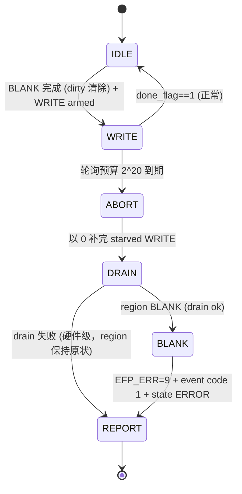
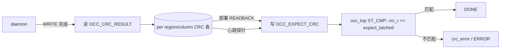

# E1-RUN4 — region watchdog v1 (op watchdog + region heartbeat + event log) + EMRI v0.5 expected-CRC gate

- **Date**: 2026-09-11 (implementation 2026-09-08; root-cause fixes + full re-verification 2026-09-11) · **Status**: ✅ PASS (sim scope)
- **Plan-Ref**: `ethereal-spec/control/emri-v0.md` §3.4/§3.5 (v0.4) + §3.1.1 (v0.5); `docs/adr/ADR-019-occ-expected-crc-gate.md`; `ethereal-plan/subsystems/S05-BMC与EMRI-mFSM.md`
- **Scope**: `ethereal-runtime/bmc-fw/daemon/**`, `ethereal-fabric/rtl/occ/occ_top.sv` (v0.5), `ethereal-shell/rtl/emri/**`, `ethereal-fabric/tests/{bmc,occ,emri}/**`, spec v0.4→v0.5

## 1. 本阶段实现内容

| 检查点 | 状态 | 证据 |
|---|---|---|
| OCC op watchdog：每个 `occ_wait_done` 在 `2^20` 次轮询预算下运行；超时按"drain-complete→BLANK→报错"收尾 | ✅ | `tb_bmc_watchdog` 场景 2：`wdt: occ op timeout` → `wdt: drain ok` → `blank c0 ok` → `err watchdog_timeout` → `st ERROR` |
| 死锁镜像超时自动 blank，相邻 region 无损 | ✅ | 场景 2/4：region 0 ERROR + column 0 恒 0；region 1（列 1）持续翻转（v0.5 修复后 `clb_out_obs[8]` 全程 toggle） |
| region 心跳：空闲期周期性 READBACK 校验 RUNNING region；不误伤健康 region | ✅ | 场景 5：`hb r1` → `hb r1 ok`（v0.5 显式 expected-CRC；v0.4 隐式比较会误隔离） |
| 事件环（§3.4）：push-W / pop-R / W1C clear，深度 16，满环覆盖最旧 | ✅ | 场景 3：count=1 → 读取 code=1/region=0 → drain 后 count=0；`tb_emri_regfile` 扩展检查 |
| 预算与 spec 一致（2^20） | ✅ | `daemon.h` `OCC_WDT_POLL_BUDGET (1u << 20)`（原 1000000u 与 §3.5 文本/注释不一致，已修正） |
| **v0.5 expected-CRC gate（ADR-019）**：READBACK 与软件供给值比较；多列部署与心跳在架构上可成立 | ✅ | §3.1.1 + `OCC_EXPECT_CRC@0x0E`/`OCC_CRC_RESULT@0x0F`；daemon 在每列 WRITE 后取 CRC、READBACK/心跳前写回 |
| `frame_decoder.frame_base_i` 集成陷阱修复 | ✅ | `tb_bmc_watchdog` 首个 region-1 部署暴露：全系统 TB 硬接 0 → non-zero base 部署错解；已按 op frame base 驱动 |

## 2. 验证结果

**修正后的全量重跑（2026-09-11，全部本人复跑）：**

| 门 | 结果 | 检查数 | wall |
|---|---|---|---|
| `tb_bmc_watchdog`（E1-RUN4 端到端 capstone） | ✅ PASS | 29 ok / 0 fail | 1241 s |
| `tb_bmc_daemon`（legacy 部署 + 门） | ✅ PASS | 39 ok / 0 fail | 974 s |
| `tb_bmc_daemon_packed`（packed 部署 + 门） | ✅ PASS | 25 ok / 0 fail | 600 s |
| `tb_bmc_spi`（EFP-SPI 全链 + 门） | ✅ PASS | 31 ok / 0 fail | 722 s |
| `tb_ethctl_replay`（ethctl 会话回放 + 门） | ✅ PASS | 18 ok / 0 fail | 531 s |
| `tb_bmc_fwupdate`（E1-BMC2 demo，端口重连后） | ✅ PASS | 30 ok / 0 fail | 23 s |
| 单元/iverilog：`tb_occ` `tb_blank` `tb_emri_regfile` `tb_emri_occ_loop` `tb_bmc_axi_emri` `tb_bmc_axi_occ` `tb_bmc_axi_fabric` `tb_mgmt_hotswap` `shell_tb_mgmt_packed` `shell_tb_het_packed` `tb_frame_decoder` | ✅ PASS ×11 | — | 秒级 |
| 模型套件（pytest 全量） | ✅ 2683 passed / 2 xfail | — | 103 s |
| `make lint`（Verilator -Wall） | ✅ clean | — | 3 s |
| 固件构建（riscv rv32imc, `-Wall -Wextra -Werror`，无 malloc） | ✅ clean | fw 11624 B | — |
| `ruff`（改动文件） | ✅ clean | — | — |

## 3. 示意图

## 4. 遇到的问题与解决

| 问题 | 根因 | 解决方案 | 搜索关键词 |
|---|---|---|---|
| region-1 部署后 `clb_out_obs[8]` 恒不翻转 | `frame_decoder` 用 `widx = fbus_addr - frame_base_i`，而全部系统 TB 硬接 `frame_base_i=0` → non-zero base 部署错解（v2c 之前从未部署过 region>0） | TB 改为按 op frame base 驱动（`occ_frame_addr`）；报告记录该集成要求 | `Verilog named port unconnected default` |
| 心跳对健康 region-1 误报（`hb r1 crc err` → BLANK+FREE+ERROR） | `occ_top` 单一 `write_crc_r`（"最后写赢"）+ 跨 region 探针 → 必然失配；同时 `cols>1` 的 packed 部署第 4 步永远无法通过（tb_bmc_daemon_packed 只部署 1 列，从未暴露） | **ADR-019 / spec v0.5 §3.1.1**：READBACK 改为与软件供给的 `OCC_EXPECT_CRC` 比较，`OCC_CRC_RESULT` 暴露运行 CRC；daemon 每列捕获+回填 | `sticky CRC compare last write wins FPGA readback verify` |
| 看门狗预算与 spec 不一致 | `daemon.h` 宏 `1000000u` vs spec/注释 `2^20` | 宏改为 `(1u << 20)` | — |
| 端口新增导致 16 个 TB 需要重连 | 新 ABI 寄存器需要 regfile↔occ 通路 | 脚本化插入 + 单元 TB 语义更新（`tb_occ`/`tb_emri_occ_loop` 显式 arm；`tb_blank` 无 READBACK 直接 tie-off） | — |

## 5. 待确认清单（ASSUMPTION）

- 心跳为 **v0 软件简化**（READBACK CRC 代替硬件心跳 tap）；HW tap 属 E2 范围（spec §3.5 已注明）。
- **mFSM 主机流（E2-BMC1）必须在每次 READBACK 前写 `OCC_EXPECT_CRC`**（§3.1.1 显式契约）；`ethctl` 的 EFP/daemon 会话不受影响（daemon 自己维护）。
- 其余系统 TB 的 `frame_base_i` 仍硬接 0（今日只部署 base-0；已在本报告记录，DMO2 4 列回放将一并修正）。
- `DAEMON_NUM_REGIONS=2`/`DAEMON_FAB_COLS=2`（v0 build-time）；>2 region/column 需 daemon.h 参数 + emri_regfile `REGIONn_INFO` 扩展（DMO2 范围）。

## 6. 下一阶段需要做的内容

| 任务 ID | 内容 | 依赖 |
|---|---|---|
| E1-DMO2 | 4×4 fabric 回放 `session_run_packed_uart_loopback.json`（2–4 列部署现在**架构上可达**，v0.5 已解除多列阻塞）；2 region 轮换稳定性 + 干扰监测 | E1-DMO1, E1-RUN4 |
| E1-DMO3 | v0.1.0 发布清单（视频/博客/文档站） | E1-DMO2 |
| E2-BMC1 | mFSM 主机流补 `OCC_EXPECT_CRC` arm 步骤（§3.1.1） | E1-BMC4 |
| E2-SEC1 | 真实密钥管理 + 防回滚 | E1-RUN2 |
