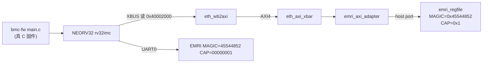

# 报告：bmc-fw 经 AXI fabric 读 EMRI（E1-RUN2 daemon 地基）— C 固件驱动管理面

> 任务：E1-RUN2 前置 — 让 C bmc-fw 经自研 AXI fabric 端到端读 EMRI 管理寄存器（daemon 的地基）
> 日期：2026-08-30
> Plan-Ref：`ethereal-plan/subsystems/S08-运行时daemon与ethctl.md` Phase-1 #2（E1-RUN2）；`ethereal-spec/control/emri-v0.md` §2；`docs/adr/ADR-018-axi-noc-riscv-cluster.md`

## 本阶段实现内容

### ✅ C 固件经 AXI fabric 读 EMRI（`ethereal-runtime/bmc-fw/`）

- **`drivers/emri.h`**（新）：EMRI 管理寄存器的 C 侧访问。`EMRI_WIN_BASE = 0x40002000`（xbar 从机窗）；字偏移宏 + `emri_read()`。**字偏移注释明确必须与 `emri_pkg.sv` / `emri_constants.py` 一致**（单一 ABI，防漂移）。
- **`main.c`**：boot 后经 AXI 读 EMRI `MAGIC`（期望 0x45544852）+ `CAPABILITIES`（期望 0x1，has_bmc）并打印真实值——证明 C 固件**经 `NEORV32 → XBUS → eth_wb2axi → xbar → emri_axi_adapter → emri_regfile` 全链端到端驱动管理面**（非仿真手写镜像，而是真 C 代码）。

### ✅ TB 升级（`tb_bmc_fw.sv`）

- 从"AXI 良性栓定"改为**实接 EMRI 链**（xbar 1×1 + emri_axi_adapter + emri_regfile，HAS_BMC=1，OCC 口栓空、dec_busy_i=0）。固件读 EMRI 触发真实 XBUS→AXI 事务。
- 精确匹配全部 115 字节（boot banner + 真实 MAGIC/CAP 回读 + lifecycle + idle spin）。

### ✅ 修复 Makefile 依赖缺口（自捕）

- 升级 TB 后，`tb_bmc_fw` 的编译行漏了 EMRI 链依赖（eth_axi_xbar/emri_axi_adapter/emri_regfile/emri_pkg）——`make test-sv` 报 "Unknown module"。已补齐并回归验证。

## 验证结果

| 检查 | 结果 |
| --- | --- |
| bmc-fw 构建（rv32imc/ilp32） | ✅ 编译/链接/hex 全过 |
| `tb_bmc_fw`（iverilog/vvp） | ✅ TEST PASSED（C 固件经 AXI 读 EMRI MAGIC+CAP，115 字节精确匹配） |
| `make test-sv` | ✅ **28 个自测 TB 全过**（tb_bmc_fw 实接 EMRI 链后回归通过） |
| `make lint` / `make formal` / `make test-model` | ✅ lint-clean / 4 证全过 / 2639 passed（无回归） |

## 链路图（C 固件 → EMRI over AXI）

## 待确认 / 下一阶段

- 本步只读 EMRI 身份/能力寄存器（只读路径）。daemon 的 **verify→allocate→OCC→lifecycle**（E1-RUN2 主体）在 bmc-fw 骨架上继续实装。
- EMRI 写路径（OCC_CMD/OCC_WDATA，BMC 经 AXI 触发区域配置）已由 `tb_bmc_axi_occ`/`tb_bmc_axi_fabric` 用手写镜像证明；迁到 C 固件属 E1-RUN2。
- E1-BMC3 调试通道（UART 控制台 + JTAG + OpenOCD）。

## 下一阶段需要做的内容

- **E1-RUN2 daemon 主体**：在 bmc-fw 骨架上实装 Ed25519 验签 + region 分配 + OCC 加载 + 生命周期，经 EFP 命令集 run/stop/ps/restart 全通，坏签名/满 region/写冲突优雅报错。
- **EFP 命令端点**（bmc-fw 侧 EFP-SPI/UART 承载）：daemon 的主控通道。
- **E1-BMC3 调试通道**、**E1-IO1 EFP-SPI**。
