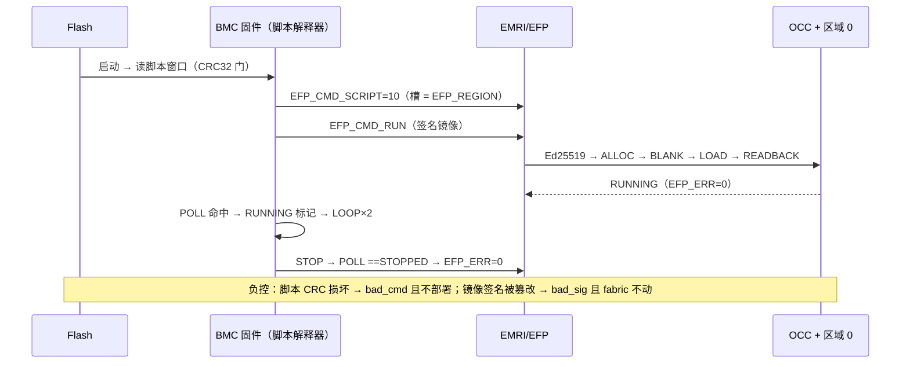

# E2-AST1 阶段报告 — MCU 脚本部署（Astral 聚合降级路径）

- **任务**：`E2-AST1`（Astral 聚合 v1）——按 `ethereal-plan/phases/phase-2-异构与双平台.md` §3 熔断条款先行交付**降级演示**（WASM 组件验收仍待环境）。
- **日期**：2026-09-12
- **提交**：（本报告同批）
- **Plan-Ref**：`ethereal-plan/subsystems/S13-astral-os与容器运行时.md` §Astral 聚合 / `phases/phase-2-异构与双平台.md` §3（熔断条款）
- **动机**：本机无 Zephyr/west/WAMR/wasmtime（已核实）⇒ 走"**MCU 脚本部署**"路径：由 BMC 固件解释一份**Flash 常驻部署脚本**，经既有 EFP/EMRI/OCC 机制把签名逻辑镜像部署到区域 —— 即"Type-F 容器由固件侧脚本部署与驱动"的完整故事，不需要 WASM 运行时。

## 本阶段实现内容

### ✅ 脚本格式（`ethereal-runtime/bmc-fw/script/script.h`）

| 部分 | 约定 |
|---|---|
| 头部 | 4 字：magic `0x53435231`（'SCR1'）/ version 1 / 长度 / CRC32 |
| 指令 | 1 字：`opcode[31:24]`、`operand[23:0]` |
| 操作码 | `END` / `DEPLOY(region)` / `STOP(region)` / `POLL(word + {mask,value} 立即数)` / `CHECK_ERR(expected)` / `UART(n + 打包 ASCII 字)` / `WAIT(iters)` / `LOOP(n)` / `LOOPEND` |
| 边界（硬性） | 循环深度 ≤4、指令预算 4096、轮询预算 2²⁰、UART ≤64 B、WAIT ≤65536；12 个类型化状态码 |
| 存放 | 槽 64 字，窗口 128 字 @ `0x40010000` |

### ✅ 固件（无 malloc、静态存储、`-Wall -Wextra -Werror`）

- `script/script.c`：逐字经 XBUS 取指的解释器；`script/main_script.c`（sim-demo 入口）、`script/spi_none.c`（AXI-only 变体的 EFP-SPI 空实现）。
- **接线方式**：新 daemon 扩展钩子 —— `daemon.h/.c` 增加 `EFP_CMD_SCRIPT=10`、`daemon_dispatch()`（原 `daemon_spin` 的 switch 体**逐字搬移**）、`daemon_ext_fn` + `daemon_set_ext_handler()`；**生产固件对 10 仍回 `bad_cmd`**（§3.6 sim-demo 约定），故**无需 spec 变更**（本路径为演示专用，已在代码注释与本报告中标注）。
- 脚本的 `DEPLOY/STOP` 复用 daemon **自身的** `EFP_CMD_RUN/STOP` 处理器（Ed25519 → ALLOC → BLANK → LOAD → READBACK → RUNNING）。

### ✅ 演示脚本与 TB

- `script/gen_deploy_scripts.py`：确定性生成 128 字窗口 —— 槽 0 = 37 字部署脚本（起点标记、WAIT 沉降、DEPLOY r0、POLL `EFP_STATUS==RUNNING`、CHECK_ERR 0、RUNNING 标记、WAIT 保持、LOOP×2、STOP r0、POLL `==STOPPED`、CHECK_ERR 0、STOPPED 标记、END；CRC32 `0xd55a4764`）；槽 1 = 16 字拒绝脚本（DEPLOY、CHECK_ERR 1 `bad_sig`、标记、END；CRC32 `0x5685c0b3`）。生成器 ruff + `mypy --strict` 干净，且其 CRC32 与固件算法的 C 实现**逐位交叉验证**（这一交叉验证在仿真前就抓到一个真实生成器缺陷）。
- `ethereal-fabric/tests/bmc/tb_bmc_script.sv`（新，自检）：真实链路 —— NEORV32 DMEM-exec 固件 + `emri_regfile` + `occ_top` + 2×2 `fabric_top` + TB 内 Flash 模型；AXI 主机 BFM 为 master 1。

### ✅ 验证（本人在本机复跑）

| 检查 | 结果 |
|---|---|
| 固件构建（生产） | `make -C ethereal-runtime/bmc-fw -B` 干净（`-Werror`）；lane0 12288 B |
| 固件构建（脚本变体） | `make -C ethereal-runtime/bmc-fw script scripts` 干净；`script_*` 十六进制生成 |
| `tb_bmc_fw`（生产固件回归） | **TEST PASSED**（daemon.c 重构后无行为变化） |
| `tb_bmc_script` | **TEST PASSED，0 FAIL**（`$finish at 967ms`，walltime 192 s）：启动 → CRC 门 → DEPLOY → **Ed25519 验签**镜像部署到区域 0 → `EFP_ERR=0` + RUNNING → fabric 翻动 + 帧入 `column_cfg_ram` → LOOP×2 标记 → STOPPED → `MON_RECFG_COUNT=1`；**外加两条拒绝路径**（脚本 CRC 损坏 → `bad_cmd` 不部署；签名被篡改 → `bad_sig`、fabric 未动） |
| 生成器 | ruff + `mypy --strict` 干净；CRC32 与 C 实现逐位一致 |
| Makefile | 新增 `test-sv` 行（置于 `tb_bmc_daemon` 之后、其余 TB 之前）：构建脚本变体 → 拷贝 `script_*` 十六进制 → 运行 → **恢复生产固件十六进制**（防止后续 TB 读到脚本变体） |

### ⚠️ 重要发现（移交 E2-BMC）

脚本变体的 DMEM 镜像（14456 B / 16 KiB）只剩 **1808 B 栈**，而 Ed25519 验签帧链需 ~2.0 KiB+ ⇒ 首次运行在 `eth_ed25519_verify` 内**硬故障**（trap 到 mtvec → 重启）；经 TB 的 UART dump + `-fstack-usage` 定位（非猜测），改为链接空实现 EFP-SPI 前端（镜像 13344 B → 栈 2980 B）。**结论：DMEM-exec daemon 固件的任何 DMEM 增长都在吃 Ed25519 验签栈** —— 已列为 E2-BMC 关注项。

### ❌ 未做（边界）

- **WASM 组件验收未做**（无 Zephyr/west/WAMR/wasmtime）——本报告是降级路径，不冒充 E2-AST1 的完整验收。
- 脚本格式的"生产化"（Flash 驱动、脚本签名、多脚本调度）不在本任务范围。

## 下一阶段需要做的内容

- `E2-BMC2`：DMEM 预算与 Ed25519 验签栈的冲突评估（本报告发现）+ VexRiscv 备选核心（无源码，阻塞）。
- `E2-AST1`（完整验收）：需 Zephyr/WAMR 环境 → 维护者决策（自建容器镜像或改用 wasm3 等更小运行时）。
- `E2-RV1`：RV-B 尾（缓存/BTB、中断与特权切换）→ RV-C（FPU + Sv39 → Linux 启动）。
- `E1-DMO3` / `E0-INF2`：外部动作（发布、首次真实 CI 运行）。
