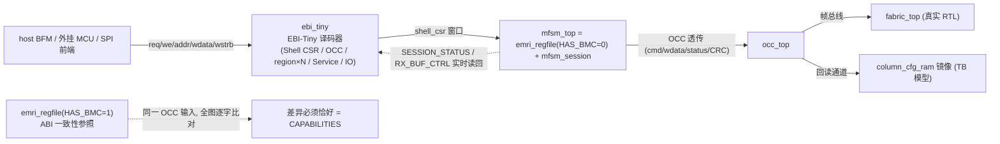
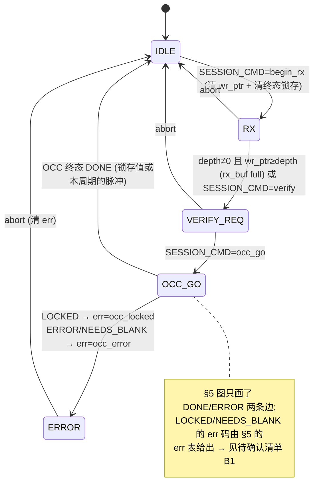

# E2-BMC1 / E0-SHL1 验收报告 — mFSM（无 CPU 寄存器式管理单元）与 EBI-Tiny

> **日期**：2026-09-13 · **执行者**：Agent（worker `MFsmEbiTiny`）
> **任务**：`E2-BMC1`（mFSM 精简管理单元，Profile-E）**并** `E0-SHL1`（EBI-Tiny 总线 RTL + 地址映射 decoder —— 计划已注明随 E2-BMC1 落地）
> **Plan-Ref**：`ethereal-plan/subsystems/S05-BMC与EMRI-mFSM.md §2.3/§4`、`ethereal-plan/components/C05-BMC组件.md §3/§4.1/§4.2`、`ethereal-plan/subsystems/S04-EBI总线与Mailbox-NoC集成.md §2/§4`、`docs/Ethereal-平台实施蓝图-v2.md §4.1/§4.2`、`ethereal-spec/control/emri-v0.md §1/§2/§4/§5/§8`、`docs/adr/ADR-006/ADR-014/ADR-015/ADR-018/ADR-019`
> **范围**：新增 `ethereal-shell/rtl/ebi/**`、`ethereal-shell/rtl/mfsm/**`、`ethereal-fabric/tests/{ebi,mfsm}/**`；**未改动**任何既有 RTL、Makefile、spec、`ethereal-tools/**`、`memory/**`

## 本阶段实现内容

| 检查点（计划/规范） | 状态 | 证据 |
|---|---|---|
| `rtl/ebi/ebi_tiny.sv`（32 位寄存器总线 valid/ready，单主）+ §4.2 地址映射 decoder | ✅ | `ebi_tiny.sv`（组合译码，6 窗口，未映射/不存在的 region 页 → ready+err 不挂死） |
| E0-SHL1 验收：**BFM 随机读写一致性测试通过** | ✅ | `tb_ebi_tiny.sv`：**10 000** 次随机读写（rd=4985/wr=5015），**13 944** 项检查全过，逐窗口 commit 计数与 BFM 写计数**逐一相等** |
| mFSM 寄存器面暴露与 BMC **相同的 EMRI ABI**（ADR-015：`ethctl` 无感） | ✅ | `mfsm_top` 直接复用 `emri_regfile #(HAS_BMC=0)`（不重写 ABI）；`tb_mfsm_ebi_deploy.sv` 对 **0x00–0x3F + 0x50–0x5F 全图**与 BMC 模式实例逐字比对：**差异恰好 1 处 = `CAPABILITIES`**（`has_bmc` 0/1），即 spec §1 原则 1 的原话 |
| mFSM 由上位机经 EMRI 驱动**完整部署流程**（E2-BMC1 验收原文） | ✅ | `tb_mfsm_ebi_deploy.sv`（320 检查）：BLANK → `begin_rx` → arm WRITE → 推 12 字（rx_buf 计数 → `VERIFY_REQ`）→ verify → `occ_go` → OCC DONE → **ADR-019 要求的 `OCC_EXPECT_CRC` 门控 READBACK** → 真实 `fabric_top` 上 TFF 翻转 → BLANK → 镜像 B（const1）热替换 → 常 1 |
| §5 会话 FSM + 5 状态覆盖（C05 §4.3「5 状态覆盖」） | ✅ | `mfsm_session.sv`（typedef enum 两段式）；TB 监视器统计 **state 0..4 各访问 534/91/23/50/24 次**（`OCC_GO` 仅 1–2 周期，轮询会漏，故用监视器） |
| 每项能力可追溯到 `emri-v0.md`；歧义只有报告、不发明（G6） | ✅ | §「待确认清单」共 8 条，均标注 `// ASSUMPTION: … (TBD, 2026-09-13)` 或明确列为**规范缺陷/实现差异** |
| G1 lint（`verilator --lint-only -Wall` 零告警） | ✅ | 见「验证结果」三条命令，均 `OK`（无 `-Wno-*` 豁免） |
| ADR-017：不实例化厂商原语，行为级 | ✅ | 新增 RTL 只有组合译码 + FSM/计数器；无 RAM/DSP 原语（`column_cfg_ram` 仅 TB 模型） |

### 交付物（新增文件）

| 文件 | 内容 |
|---|---|
| `ethereal-shell/rtl/ebi/ebi_pkg.sv` | ADR-006 三档 profile 枚举；§4.2 窗口基址（Shell CSR / OCC / region×N / Service / IO）、64 KiB 页粒度、窗口索引序（与 fan-out 端口索引对齐）、`EBI_MAX_REGIONS=16` |
| `ethereal-shell/rtl/ebi/ebi_tiny.sv` | EBI-Tiny：单主 valid/ready 总线 + 组合译码器。`win_valid_o/win_idx_o/win_we_o/win_addr_o/win_wdata_o/win_wstrb_o` 扇出 + 索引对齐的 `win_rdata_i/win_ready_i/win_err_i`；未映射地址与「region 页 ≥ NUM_REGIONS」→ `ready_o+err_o`（有定义地报错，绝不挂死）；头文件写明 **从设备提交规则** 与 **窗口必须被集成方终止** |
| `ethereal-shell/rtl/mfsm/mfsm_pkg.sv` | SESSION_CMD 码、§5 状态/err 码、OCC 终态类别（DONE/ERROR/NEEDS_BLANK/LOCKED）、SESSION_STATUS 位布局、RX_BUF_CTRL 字段与 16 KiB 上限 |
| `ethereal-shell/rtl/mfsm/mfsm_session.sv` | §5 五状态会话 FSM（两段式）+ 终态锁存 + v0 rx 记账（`wr_ptr`/`depth`/full） |
| `ethereal-shell/rtl/mfsm/mfsm_top.sv` | **mFSM 本体**：`emri_regfile(HAS_BMC=0)`（EMRI 寄存器面，原样复用）+ `mfsm_session`；EBI-Tiny Shell-CSR 从口形状（字节偏移 + 字节选通）；劫持 `SESSION_STATUS`/`RX_BUF_CTRL` 读回为会话实时值；OCC/decoder/ctx/lock 端口与寄存器面同形 |
| `ethereal-fabric/tests/ebi/tb_ebi_tiny.sv` | E0-SHL1 验收 TB（6 个行为级窗口从设备 + 固定种子 xorshift BFM） |
| `ethereal-fabric/tests/mfsm/tb_mfsm_ebi_deploy.sv` | E2-BMC1 验收 TB（host → EBI-Tiny → mFSM → OCC → 真实 fabric，含 ABI 全图一致性 + 会话角例） |
| `ethereal-fabric/tests/ebi/ebi_tiny_model.py` + `test_ebi_tiny_model.py` | 纯 Python 黄金模型（地址译码 / EMRI 寄存器图 / §5 FSM）+ pytest 45 项，含**与 SV 包常量逐项交叉校验**的漂移守卫 |

### 关键设计取舍

1. **mFSM 不重写 ABI**：`mfsm_top` 实例化现成的 `emri_regfile #(.HAS_BMC(1'b0))`，只增加三件事 —— EBI-Tiny 从口形状、两个「会话自有」寄存器的读回、OCC 终态译码。这样 BMC/mFSM 在整张寄存器图上**结构上不可能漂移**（同一份 RTL），也避免了「第二套 ABI 实现」。
2. **EBI-Tiny 无 op 字段**：`emri_regfile` 已把「写 `OCC_WDATA`(0x09)」直接当 push（`addr_is_occ_wdata_push`），而 §7 的 `OCC_PUSH(0x03)` 只是**传输层**的省帧捷径、其 CRC16 由 SPI 前端拦截（§7.1）。因此总线只带 `req/we/addr/wdata/wstrb`，前端把 `OCC_PUSH` 帧解析为「写 0x09」即可 —— 语义零损失，且总线不必耦合管理 ABI。
3. **会话 FSM 是「记账器」而非门禁**：§1/§8 明确 v0 mFSM「上位机逐步直驱 OCC」，故会话状态**不阻塞**任何 EMRI 访问；它跟踪 `begin_rx → RX → VERIFY_REQ → OCC_GO → 终态` 并输出 §5 状态字。
4. **终态锁存**：§4 自己解释过 `occ_top` 的 DONE/ERROR/LOCKED/NEEDS_BLANK 只持续 **1 个周期**、轮询不到；正常部署里 OCC WRITE 往往**在主机写 `occ_go` 之前**就完成，FSM 若不锁存就会永远停在 `OCC_GO`。故「会话期内观测到的第一个终态」被锁存、在 `OCC_GO` 消费（与寄存器面锁存 sticky `done_flag` 同一理由）。两条时序路径都有 TB 覆盖。
5. **v0 无片内 rx_buf**：§1 明确把「器件侧 rx_buf + 5 状态 FSM」列为 v0.1；本实现按 §1 的 v0 语义 —— 「rx_buf」就是主机推送流，`RX_BUF_CTRL` 的 `wr_ptr` 由硬件按被接受的 push 递增、由主机写入重定基（RW 语义），full = `depth≠0 && wr_ptr ≥ depth`。`emri_regfile` 自身把 `wr_ptr` 读回硬接 0（它没有 rx_buf），mFSM 面把读回**覆盖为实时 `{wr_ptr, depth}`** —— 该差异见「待确认清单」B2。





## 验证结果

工具：OSS-CAD Suite（`verilator 5.051`、`iverilog 14.0`）+ 仓库 `.venv`（pytest 9.1.1 / ruff / mypy）。

1) **G1 lint（新增 RTL，零豁免）**
```
$ export PATH=$HOME/oss-cad-suite/bin:$PATH
$ verilator --lint-only -Wall -Mdir /tmp/lint_final/ebi --top-module ebi_tiny \
    ethereal-shell/rtl/ebi/ebi_pkg.sv ethereal-shell/rtl/ebi/ebi_tiny.sv
OK ebi_tiny
$ verilator --lint-only -Wall -Mdir /tmp/lint_final/sess --top-module mfsm_session \
    ethereal-shell/rtl/mfsm/mfsm_pkg.sv ethereal-shell/rtl/mfsm/mfsm_session.sv
OK mfsm_session
$ verilator --lint-only -Wall -Mdir /tmp/lint_final/mfsm --top-module mfsm_top \
    ethereal-shell/rtl/emri/emri_pkg.sv ethereal-shell/rtl/emri/emri_regfile.sv \
    ethereal-shell/rtl/mfsm/mfsm_pkg.sv ethereal-shell/rtl/mfsm/mfsm_session.sv \
    ethereal-shell/rtl/mfsm/mfsm_top.sv
OK mfsm_top
```
实测退出码（不加任何 `-Wno-*`）：
```
--top-module ebi_tiny      -> verilator rc=0 (warnings/errors: 0)
--top-module mfsm_session  -> verilator rc=0 (warnings/errors: 0)
--top-module mfsm_top      -> verilator rc=0 (warnings/errors: 0)
```
（`mfsm_top` 是以 `emri_regfile` 为依赖的完整面。按 `make lint` 的口径，本任务需登记的 lint 目标即这三个模块，包文件作 deps；两个 TB 按仓库既有惯例由 iverilog 运行、不进 `make lint` —— 与既有 TB 的 `-Wall` 告警画像一致。）

2) **E0-SHL1 验收：BFM 随机读写一致性（10 000 次）**
```
$ iverilog -g2012 -o /tmp/tb_ebi ethereal-shell/rtl/ebi/ebi_pkg.sv \
    ethereal-shell/rtl/ebi/ebi_tiny.sv ethereal-fabric/tests/ebi/tb_ebi_tiny.sv && vvp /tmp/tb_ebi
[ebi_tiny] 1. directed window decode + isolation
[ebi_tiny] 2. map boundaries / unimplemented pages
[ebi_tiny] 3. slave error propagation
[ebi_tiny] 4. hold-until-ready (OCC window accepts every 3rd cycle)
[ebi_tiny] 5. BFM random sweep (10000 ops)
[ebi_tiny] 6. per-window commit accounting + coverage
[ebi_tiny]    commits/bfm: shell=640/640 occ=614/614 r0=588/588 r1=756/756 svc=0 io=0 (read-only windows must stay 0)
TEST PASSED: EBI-Tiny decode + BFM random consistency (13944 checks, 10000 ops, rd=4985 wr=5015)
```
附加种子复跑（`+SEED=<hex>`，默认种子已足够作为验收）：`deadbeef` / `1` / `7fffffff` / `c0ffee` / `2a5f` / `0`（=xorshift 不动点，TB 回落到默认种子）**全部 TEST PASSED**。
**交叉仿真**：同一 TB 在 Verilator 下（`--binary --timing`）同样 `TEST PASSED (13944 checks)` —— 两个仿真器结果一致。

3) **E2-BMC1 验收：mFSM 经 EBI-Tiny 的完整部署 + ABI 一致性**
```
$ iverilog -g2012 -o /tmp/tb_mfsm -Iethereal-fabric/rtl/inf \
    <emri_pkg/emri_regfile/ebi_pkg/ebi_tiny/mfsm_pkg/mfsm_session/mfsm_top> \
    ethereal-fabric/rtl/occ/occ_top.sv ethereal-fabric/tests/occ/column_cfg_ram.sv \
    <clb/interconnect/inf/tile 依赖 + fabric_top> \
    ethereal-fabric/tests/mfsm/tb_mfsm_ebi_deploy.sv && vvp /tmp/tb_mfsm
[mfsm] A. EMRI identity (mFSM mode)
[mfsm] B. ABI parity sweep vs a BMC-mode register face
[mfsm]    parity sweep: 1 differing offsets (expect 1 = CAPABILITIES)
[mfsm] C. deploy image A through EBI-Tiny -> mFSM -> OCC -> fabric
[mfsm]    image A deployed: 12 words, CRC-gated readback OK
[mfsm] D. hot-swap to image B (terminal arrives while in OCC_GO)
[mfsm]    image B deployed: hot-swap verified
[mfsm] E. session corner cases
[mfsm] F. session FSM state coverage
[mfsm]    state 0 visited 534 times / state 1: 91 / state 2: 23 / state 3: 50 / state 4: 24
TEST PASSED: mFSM EMRI ABI parity + full deploy flow on EBI-Tiny (320 checks)
```
同 TB 在 Verilator 下同样 `TEST PASSED (320 checks)`。覆盖到的角例：`abort` 自 RX/VERIFY_REQ/ERROR、错误状态下的 `verify`/`occ_go` 为 no-op、`OCC_GO` 无 abort 边（§5 图无此边）、**LOCKED → err=occ_locked**（真 `occ_top` 锁门，`done_code=3`）、**READBACK CRC 不符 → err=occ_error**（`done_code=1`）、**脏 region WRITE（NEEDS_BLANK）→ err=occ_error**、`err=bad_crc` **从未产生**。

4) **Python 黄金模型（`make test-model` 自动发现，无需改 Makefile）**
```
$ .venv/bin/pytest -q ethereal-fabric/tests/ebi/test_ebi_tiny_model.py
45 passed in 0.08s
$ .venv/bin/ruff check ethereal-fabric/tests/ebi/        # All checks passed!
$ .venv/bin/mypy --strict ethereal-fabric/tests/ebi/ebi_tiny_model.py \
      ethereal-fabric/tests/ebi/test_ebi_tiny_model.py   # Success: no issues found in 2 source files
```
其中 5 000 条随机地址与**独立区间 oracle** 互校（窗口不重叠、命中唯一），另含与 `ebi_pkg.sv`/`emri_pkg.sv`/`mfsm_pkg.sv` 常量的**逐项交叉校验**（任一侧偏移漂移即失败）。

## 遇到的问题与解决

| 问题 | 根因 | 解决 |
|---|---|---|
| TB 在 Verilator 下报「Too many arguments in call to task」 | Verilator 对**任务体内 `disable <自身名>`** 解析异常（已用最小复现确认；iverilog 正常） | 把超时路径改为打印 FAIL + `$finish`（超时本就是致命失败）；顺带两个 TB 都可在 Verilator 下跑通，成为双仿真器证据 |
| BFM 早期漏测「从设备报错时不应提交」 | 初始 `acc_*` 只看 `valid+we+ready`，而被拒的写仍被 TB 从设备计为一次 commit | 提交条件加入 `&& !win_err_i[w]`，并把该规则写进 `ebi_tiny.sv` 头（从设备提交规则）；修改后逐窗口计数**完全一致**才算过 |
| `RV_BUF_CTRL` 全图一致性首轮出现第 2 处差异（0x0F） | 参照 BMC 实例的 OCC 输入被 TB 接 0，而 mFSM 侧接真 `occ_top` 的 CRC 种子 `0xFFFFFFFF` | 参照面与 mFSM 面**接同一组 OCC 输入**（status/crc_error/crc_result）—— 这才是「同输入比输出」的 ABI 一致性测试 |
| 种子 0 时随机扫描退化（xorshift32 不动点） | xorshift32 在 0 处自锁 | 保留默认种子并检测 0 回落；同时**覆盖率检查**（每个窗口命中数、读写计数）正好抓到了这次退化 |

## 待确认清单（ASSUMPTION 汇总，G6）

**A. 假设（代码内已标 `// ASSUMPTION: … (TBD, 2026-09-13)`）**

| # | 内容 | 位置 | 备选 | 建议 |
|---|---|---|---|---|
| A1 | **窗口粒度 64 KiB + 窗口索引序**：蓝图 §4.2 只给了基址（`0x0000_0000` Shell CSR / `0x0001_xxxx` OCC / `0x0010_0000+` region 每区 64 KB / `0x0020_0000+` Service / `0x0030_0000+` IO），未给窗口尺寸与索引编码 | `ebi_pkg.sv` | (A) 按蓝图自带的「每 region 64KB」统一为 64 KiB 页 [已实现]；(B) 各窗口独立尺寸 | 建议 A，待 RFC-002（S04）冻结完整映射后回填 |
| A2 | `RX_BUF_CTRL.wr_ptr` 由**硬件按被接受的 push 递增**、主机写入为重定基（§2 只说 RW；§1 说 v0 无片内缓冲） | `mfsm_session.sv` | (A) 硬件递增 [已实现]；(B) 纯主机维护（则 full 只能由主机信号触发） | 建议 A（v0.1 若上片内 rx_buf，wr_ptr 归 DMA/流控所有） |
| A3 | `NEEDS_BLANK`（E0-FAB5 脏门）映射为 `err=3 occ_error`：§5 的 err 表**没有**该码 | `mfsm_session.sv` | (A) 归入 occ_error [已实现]；(B) 新增 `err=4 needs_blank`（需 spec 升级）；(C) 停在 OCC_GO（=挂死，不可接受） | 建议 A 先行；若上位机需要区分「脏」与「硬件错」，走 B 并升 spec |
| A4 | `RX_BUF_CTRL.depth > 0x4000`（§2 的 v0 上限）**按写值原样保存**，不截断、不报错 | `mfsm_session.sv` | (A) 原样保存 [已实现]；(B) 截断到 16 KiB；(C) 报错 | 建议 A（§2 是主机契约，B/C 都会静默改变主机可见状态或发明错误码） |
| A5 | 字节选通非全字（`wstrb != 4'hF`）的写 → `err`，且**不转发**（EMRI 是 32 位字寄存器） | `mfsm_top.sv` | 与 `emri_axi_adapter` 既有约定一致（SLVERR + 无副作用） | 建议照旧；EBI-Tiny 层只转发 strobe，由端点判定 |
| A6 | 未终止/未实现窗口必须由集成方以 `ready+err` 终止（decoder 无法察觉悬空窗口） | `ebi_tiny.sv` 头 | (A) 写死契约 [已实现]；(B) decoder 增加「未终止检测」（需超时计数器） | 建议 A（v0 无时钟，加超时是另一条总线语义，应单独评审） |
| A7 | 会话 FSM **不是门禁**：不阻塞任何 EMRI 访问（§1/§8 v0 mFSM = 上位机直驱） | `mfsm_session.sv`/`mfsm_top.sv` | (A) 纯记账 [已实现]；(B) 以会话状态门禁 OCC 命令（v0.1 片内缓冲落地后再议） | 建议 A |
| A8 | 会话终态「第一个为准」锁存（OCC 终态是 1 周期脉冲，且常在 `occ_go` 之前就发生） | `mfsm_session.sv` | (A) 锁存 [已实现]；(B) 只在 `OCC_GO` 采样本周期脉冲（会在正常时序下挂死） | 建议 A（§4 自己就为同样理由加了 sticky 位） |

**B. 规范 vs 实现的差异（本任务发现并上报，未擅自发明）**

| # | 差异 | 事实 | 备选与建议 |
|---|---|---|---|
| B1 | **`SESSION_STATUS` 字段重叠（规范缺陷）**：§2 表写 `{state[3:0], done[4], err[7:4]}` —— `done` 落在 bit 4，正是 `err[7:4]` 的 bit 0（4+1+4=9 bit 塞进 8 bit 寄存器），而 §5 正文只定义 `state` 与 `err[7:4]`、**从未定义 `done` 语义**（且 err=1/3 按定义就置位 bit 4，`done` 不可能是独立位） | 实现按 §5 正文：`{err[7:4], state[3:0]}`，bit 4 归 err | (A) 删去 `done`（**已实现**，§5 正文即权威）；(B) 改为 `state[2:0]+done[3]+err[7:4]`；(C) v0.9 里把 `done` 挪到保留位。建议 A 或 C —— 注意：**目前会话成功只能用「state 回到 IDLE 且 err=0」+ OCC 自身 `done_code` 观察**，主机无法直接轮询「本次会话成功」；若上位机脚本需要，建议 C |
| B2 | **`RX_BUF_CTRL.wr_ptr` 在寄存器面被硬接 0**：`emri_regfile.sv` 读回 `{16'h0, rx_buf_depth_w}`（它没有 rx_buf，§1 把片内缓冲推到 v0.1），而 §2 该寄存器声明为 RW `{wr_ptr[31:16], depth[15:0]}` | mFSM 面把读回覆盖为实时 `{wr_ptr, depth}`（BMC 面维持原样）—— 这正是「ABI 全图一致性」测试里**不**把 `RX_BUF_CTRL` 算作差异的原因（复位后两者同为 `0x0000_4000`） | (A) 维持现状并在 spec 注明「v0 的 wr_ptr 在 BMC 模式读 0」；(B) 让 `emri_regfile` 也维护 wr_ptr（需 spec 明确谁递增）。建议 A（本任务已在 pytest 里加了防漂移守卫：若寄存器面将来长出 rx_buf，测试立即失败提醒重审覆盖） |
| B3 | **§5 状态图不完整**：图只有 `OCC_GO→IDLE(DONE)` 与 `OCC_GO→ERROR(ERROR)`，但 §5 的 err 表里有 `occ_locked`，重定该边必须存在；`NEEDS_BLANK` 两个都没有 | 实现按 err 表补全（见 A3/A8） | (A) 接受本实现的补全（**已实现**，TB 用真实 `occ_top` 覆盖了两条补全边）；(B) 修 §5 图与 err 表。建议 B（文档一致性） |
| B4 | **`err=bad_crc` 无 v0 生产者**：§5 的 G6 结论是「上位机算 Ed25519+CRC32（mFSM 无 CPU）」，则器件侧不可能产生 CRC 失败；主机校验失败时应写 `abort` 而非 `occ_go` | 该码保留不用；TB 断言「任何激励序列下 err 均不为 1」 | (A) 保留为 reserved（**已实现**）；(B) v0.1 片内缓冲+前端 CRC16 落地后由前端置位（§7.1 的 `crc_transport` 是另一语义，勿混用）。建议 A 并请 spec 注明 |
| B5 | **会话多操作粒度**：§5 是「收镜像→验签→发射」的会话，`OCC_GO` 遇到**第一个**终态即回 IDLE；因此一次 `BLANK+WRITE+READBACK` 的部署会在 BLANK 的 DONE 处结束会话（`occ_done_flag` 在 `OCC_CMD.start` 写时清零，故随后的操作属于新周期） | TB 的两条镜像部署流程据此排序（BLANK 先于 `begin_rx`；镜像 B 用「先 verify/occ_go、再补最后一个字」以在 `OCC_GO` 观察活终态，避免竞态） | (A) 维持 §5 语义（**已实现**）；(B) v0.1 引入「会话作用域的操作计数」。建议 A，且上位机脚本按 TB 的排序编写 |

## 下一阶段需要做的内容

| 任务 ID | 内容 | 依赖 |
|---|---|---|
| `E1-BMC4` | `ethctl` 侧无感切换收口：把本报告的 ABI 一致性比对（全图差异 = `CAPABILITIES`）接到 `ethctl inspect` 的逐字节一致性套件 | 本任务 + E1-RUN3 |
| spec 修补 | 依 B1/B2/B3/B4 出 `emri-v0.md` 小版本（`SESSION_STATUS` 去 `done` 或移位、`RX_BUF_CTRL` v0 读回语义、§5 图/err 表补全、`bad_crc` 标注 reserved） | 维护者确认 |
| `E2-BMC1` 后续（v0.1） | 片内 rx_buf（16 KiB）+ 器件侧流式 `OCC_GO` + 前端 CRC16 门（把 `bad_crc` 落到实处），届时重审 A2/A7/B4 | 本任务 |
| `E2-BMC2` | VexRiscv 备选核 wrapper 验证（与 mFSM 无关，仅计划并行） | E1-BMC2 |
| RFC-002（S04） | 用冻结的 EBI 映射替换 A1 的假设（窗口尺寸/索引/终止规则进规范） | S04 |
| 集成 | 若 Profile-E Shell 集成需要，新增 `mfsm_ebi_top`（`ebi_tiny` + `mfsm_top` 连线）作为顶层接线点（本任务未建：TB 已按同一接线方式验证，`ebi_tiny` 与 `mfsm_top` 端口可直接对接） | E1-IO1/E2-PLT |

### 需要维护者/Main 应用的改动（本任务**未**改动 Makefile 与 `ethereal-tasks.yaml`）

`Makefile`（三处，均为新增行）：

1. `RTL_CLEAN` 追加：
   `ethereal-shell/rtl/ebi/ebi_tiny.sv ethereal-shell/rtl/mfsm/mfsm_session.sv ethereal-shell/rtl/mfsm/mfsm_top.sv`
   （**不要**把 `ebi_pkg.sv`/`mfsm_pkg.sv` 加进 `RTL_CLEAN`：包不是可 lint 的 top，作 deps 即可 —— 与 `emri_pkg` 的处理一致。）
2. `lint` 循环的 `case $$m in` 内追加：
```make
	    ebi_tiny)            deps="ethereal-shell/rtl/ebi/ebi_pkg.sv" ;; \
	    mfsm_session)        deps="ethereal-shell/rtl/mfsm/mfsm_pkg.sv" ;; \
	    mfsm_top)            deps="ethereal-shell/rtl/mfsm/mfsm_pkg.sv ethereal-shell/rtl/mfsm/mfsm_session.sv ethereal-shell/rtl/emri/emri_pkg.sv ethereal-shell/rtl/emri/emri_regfile.sv" ;; \
```
3. `test-sv` 追加两条（放在 `OK - all SystemVerilog testbenches passed.` 之前；`test-model` 无需改，`find … -name 'test_*_model.py'` 已覆盖新文件）：
```make
	@echo "[test-sv] tb_ebi_tiny";  $(IVERILOG) -g2012 -o /tmp/tb_ebi ethereal-shell/rtl/ebi/ebi_pkg.sv ethereal-shell/rtl/ebi/ebi_tiny.sv ethereal-fabric/tests/ebi/tb_ebi_tiny.sv 2>/dev/null && vvp /tmp/tb_ebi | grep -q "TEST PASSED" && echo "  PASS"
	@echo "[test-sv] tb_mfsm_ebi_deploy"; $(IVERILOG) -g2012 -o /tmp/tb_mfsm -Iethereal-fabric/rtl/inf ethereal-shell/rtl/emri/emri_pkg.sv ethereal-shell/rtl/emri/emri_regfile.sv ethereal-shell/rtl/ebi/ebi_pkg.sv ethereal-shell/rtl/ebi/ebi_tiny.sv ethereal-shell/rtl/mfsm/mfsm_pkg.sv ethereal-shell/rtl/mfsm/mfsm_session.sv ethereal-shell/rtl/mfsm/mfsm_top.sv ethereal-fabric/rtl/occ/occ_top.sv ethereal-fabric/tests/occ/column_cfg_ram.sv ethereal-fabric/rtl/clb/elut4.sv ethereal-fabric/rtl/clb/clb_t.sv ethereal-fabric/rtl/interconnect/switch_box.sv ethereal-fabric/rtl/interconnect/connection_block.sv ethereal-fabric/rtl/inf/eth_inf_ram.sv ethereal-fabric/rtl/inf/eth_inf_dsp_mac.sv ethereal-fabric/rtl/tile/mem_t.sv ethereal-fabric/rtl/tile/dsp_t.sv ethereal-fabric/rtl/interconnect/fabric_top.sv ethereal-fabric/tests/mfsm/tb_mfsm_ebi_deploy.sv 2>/dev/null && vvp /tmp/tb_mfsm | grep -q "TEST PASSED" && echo "  PASS"
```

`docs/ethereal-tasks.yaml`（状态行，建议由 Main 统一落）：
```yaml
  # E0-SHL1
    status: done   # 2026-09-13: ebi_tiny 随 E2-BMC1 落地；验收 = tb_ebi_tiny 10k 次随机读写一致（13944 检查，双仿真器通过）
  # E2-BMC1
    status: done   # 2026-09-13: rtl/mfsm/（emri_regfile HAS_BMC=0 复用 + §5 会话 FSM）+ rtl/ebi/ebi_tiny.sv；
                   # 验收证据 tb_mfsm_ebi_deploy（320 检查：EMRI 全图一致性差异恰为 CAPABILITIES、完整部署+双镜像热替换、
                   # ADR-019 CRC 门控 READBACK、LOCKED/CRC/NEEDS_BLANK 角例、5 状态覆盖）；ethctl 无感收口归 E1-BMC4；
                   # 规范歧义 5 项（SESSION_STATUS done 重叠等）待维护者确认 —— 见 report-E2-BMC1-mfsm-ebi-tiny-20260913
```
