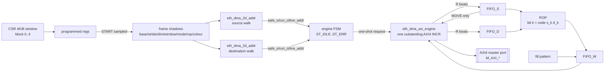
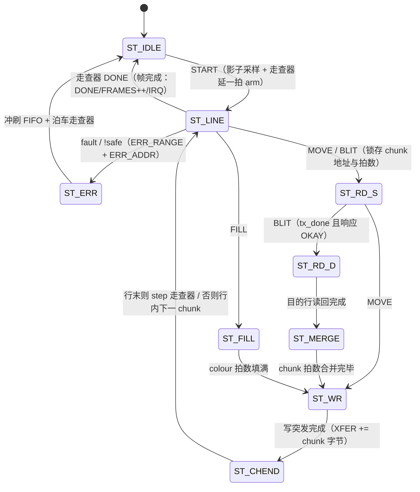
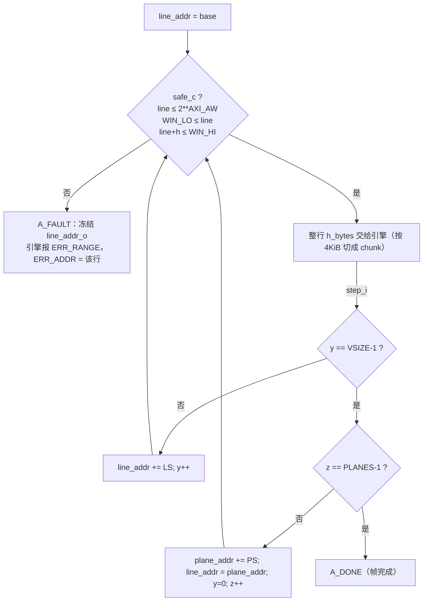

# E2-DMA2 验收报告 — eth_dma_2d 2D 图形 DMA（ND-strided + blit/fill/ROP）

- **任务**: E2-DMA2（2D 图形 DMA `eth_dma_2d`；Service-Tile 级，S15 §3）
- **日期**: 2026-09-13
- **状态**: **完成**（垂直切片；非目标见 §3、待确认清单见 §5）
- **Plan-Ref**: `ethereal-plan/subsystems/S15-应用处理器子系统.md §3`（"2D 图形 DMA `eth_dma_2d`：自研 ND-strided 地址引擎 + 自研 SV blit/fill/ROP 级；HSIZE/VSIZE/STRIDE（VDMA 兼容）"，~3-8K + 1-3K LUT）、`docs/adr/ADR-018-axi-noc-riscv-cluster.md §7`、`ethereal-spec/control/eth-axi-v0.md §2 §7 §9`
- **上游**: E2-DMA1（`eth_dma_mc` 1D SG DMA，green；本任务复用其 `eth_dma_axi_engine`/`eth_dma_fifo`/`eth_dma_pkg`）、E2-DRAM1（`eth_dram_ctrl`+`eth_dram_stub`，本 TB 的真实内存目标）
- **验收判据**（plan 原文）: "2D block move + blit/fill TB 通过（VDMA 风格寄存器模型）"

---

## 1. 本阶段实现内容

| 文件 | 内容 |
|---|---|
| `ethereal-shell/rtl/dma/eth_dma_2d_addr.sv` | **ND-strided 地址走查器**（N ≤ 3）：`addr(z,y)=base+z*plane_stride+y*line_stride`，x 为行内连续字节；增量式走查（无乘法器）；**窗口护栏** `safe_o`（65 bit 比较，含 64 位进位检测）；A_RUN 内越窗/进位即冻结于 A_FAULT；`abort_i` 从任意态回到 A_IDLE |
| `ethereal-shell/rtl/dma/eth_dma_2d.sv` | 2D 图形 DMA 顶层：VDMA 风格 CSR + 帧参数影子寄存器 + 引擎 FSM（9 态两段式）+ 3 个 FWFT 拍缓冲（源/目的/写）+ 复用 `eth_dma_axi_engine` 单未完成 AXI4 主口；MOVE/FILL/BLIT 三种操作与 ROP |
| `ethereal-shell/rtl/dma/eth_dma_pkg.sv` | **仅新增**（1D 用户逐位不变）：`DMA_ERR_CFG=5`、`DMA_ERR_RANGE=6`、`CSR2D_*` 寄存器映射常量、`DMA2D_*` 位域与 `DMA2D_VERSION` |
| `ethereal-fabric/tests/dma/tb_eth_dma_2d.sv` | 自检 TB（DUT=顶层；内存=真实 DRAM 插座；LFSR 背压 + 连续 AXI 协议/窗口监视器）；覆盖 T0–T8，含 4 类错误路径与 2 类"检查器必须能失败"的负向对照 |
| `ethereal-shell/formal/eth_dma_2d_addr.sby` | SymbiYosys（prove + cover，top = 走查器）：W1–W7 地址安全性质，k-induction 无界深度 |
| `docs/reports/report-E2-DMA2-dma-2d-20260913.md` | 本报告 |

### 1.1 三种操作（`DMA_MODE`）

一条行（line）被切成 chunk（`min(行内剩余拍, FIFO_DEPTH, 任一操作数的 4 KiB 边界拍数)`），每 chunk 的 AXI 事务严格串行（复用 `eth_dma_axi_engine` 的单未完成契约，与 `eth_dma_channel` 同构）：

| MODE | 数据通路（每 chunk） | 说明 |
|---|---|---|
| `0 MOVE` | RD src → FIFO_S → WR dst | 2D 块搬运（纯 strided copy） |
| `1 FILL` | colour 拍 → FIFO_W → WR dst | **完全不读总线**（TB 断言一次 FILL 帧的 AR 计数为 0） |
| `2 BLIT` | RD src → FIFO_S；RD dst → FIFO_D;MERGE(ROP) → FIFO_W；WR dst | 读-改-写；`dst = rop(src, dst)` |
| `3 RSVD` | — | 非法 → `ERROR + ERRCODE=5 (CFG)`，不产生任何总线活动 |

### 1.2 寄存器映射（VDMA 风格；4 KiB 窗口，`{block[11:6], offset[5:0]}`，与 `eth_dma_mc` 同一寻址纪律）

| BLOCK | 偏移 | 名称 | 属性 | 说明（VDMA 对应） |
|---|---|---|---|---|
| 0 (0x000) | +0x00 | `DMA_CTRL` | RW/W1P | [0] EN（RW，"run"，= VDMA RS）；W1P [1] START（一帧）、[2] ABORT、[3] IRQ_CLR |
| | +0x04 | `DMA_STATUS` | RO | [0] BUSY、[1] DONE、[2] ERROR、[6:4] ERRCODE、[15:8] LINES_DONE[7:0]、[16] IRQ |
| | +0x08 | `DMA_MODE` | RW | [1:0] MOVE/FILL/BLIT |
| | +0x0C | `DMA_ROP` | RW | [3:0] ROP 码（见 §1.3） |
| | +0x10 | `DMA_COLOUR` | RW | [31:0] FILL 颜色/图案（一拍内重复 2 次） |
| | +0x14 | `DMA_CFG` | RW | [0] IRQ_EN（帧完成中断）、[1] ERR_IRQ_EN |
| | +0x18 | `DMA_VERSION` | RO | `0x0001_0000` |
| 1 (0x040) | +0x00/+0x04 | `SRC_BASE_LO/HI` | RW | 源矩形基址（= VDMA `MM2S_START_ADDRESS`） |
| | +0x08 | `SRC_LINE_STRIDE` | RW [31:0] | 行跨距（字节）（= VDMA `STRIDE`） |
| | +0x0C | `SRC_PLANE_STRIDE` | RW [31:0] | 面跨距（字节）（VDMA 无；ND 扩展） |
| | +0x10/+0x14 | `SRC_CUR_LO/HI` | RO | 当前行地址 |
| 2 (0x080) | 同上 | `DST_*` | | 目的矩形（= VDMA `S2MM` 侧） |
| 3 (0x0C0) | +0x00/+0x04/+0x08 | `DIM_HSIZE/VSIZE/PLANES` | RW [15:0] | 行字节数 / 每面行数 / 面数（= VDMA `HSIZE`/`VSIZE`） |
| | +0x0C…+0x18 | `WIN_LO_LO/HI`、`WIN_HI_LO/HI` | RW | **窗口护栏** `[WIN_LO, WIN_HI)`（本设计新增，见 §1.4） |
| 4 (0x100) | +0x00 | `XFER_BYTES` | RO | 自 START 起已写字节数（32 位回绕） |
| | +0x04 | `LINES_DONE` | RO [15:0] | 本帧已完成行数（fault/abort 时给出部分进度） |
| | +0x08/+0x0C | `ERR_ADDR_LO/HI` | RO | 故障地址 |
| | +0x10 | `FRAMES_DONE` | RO [15:0] | 复位以来完成帧数 |
| 5…63 | — | 保留 | RO 0 | 写入忽略 |

错误码（`eth_dma_pkg`）：`0` 无 / `1` DECERR / `2` SLVERR / `4` ABORT / `5` CFG（几何或跨距非法、MODE 非法）/ `6` RANGE（行越出声明窗口）。
`ERR_ADDR` 语义：RANGE = 第一条非法行的地址；DECERR/SLVERR = 出错突发地址；CFG/ABORT = 0。
`ABORT`（或 busy 中掉 EN）在当前 AXI 突发边界生效，`ERROR + ERRCODE=4`，`XFER/LINES_DONE` 保留已完成部分。

**START 语义（与 `eth_dma_mc` 同纪律）**：仅 idle 且 EN=1（或同一次写把 EN 置 1）时受理；EN=0 时的 START、busy 时的 START 均**静默忽略**（无错误、无总线活动）。几何非法时**不启动**而是 `ERROR + ERRCODE=5`，并把帧状态（DONE/XFER/LINES）清零后上报，软件读到的永远是它刚编程的那一帧的状态。`IRQ_CLR` 清 DONE/ERROR/ERRCODE/ERR_ADDR/IRQ，**不清** LINES_DONE/FRAMES_DONE（与 1D `DESC_DONE` 策略一致）。

**影子寄存器（VDMA 式双缓冲）**：`MODE/ROP/COLOUR`、两侧 `BASE/STRIDE`、`DIM_*`、`WIN_*` 都在 START 采样进影子寄存器，帧内 CSR 写只影响下一帧。这既是 VDMA 惯例，也把"帧内几何稳定"从软件承诺变成硬件保证（`ifdef FORMAL` 内 S1 断言），并消除一个真实竞态（帧内改 HSIZE 会撕裂行走查）。

### 1.3 ROP 定义（plan 未定义集合 → 假设，见 §5）

`ROP[3:0]` 是两操作数布尔函数的**真值表**，按拍逐位求值：bit k = f(S, D)，其中 S = k>>1、D = k&1（MSB 起写为 `f(1,1) f(1,0) f(0,1) f(0,0)`）。这正是 BitBlt ROP3 中**与图案操作数无关**的低半字节：`0x0` 全黑、`0x1` NOTSRCERASE、`0x2` D∧¬S、`0x3` NOTSRCCOPY、`0x4` SRCERASE、`0x5` DSTINVERT、`0x6` SRCINVERT、`0x7` NAND、`0x8` SRCAND、`0x9` XNOR、`0xA` DSTCOPY、`0xB` MERGEPAINT、`0xC` SRCCOPY（复位默认）、`0xD` S∨¬D、`0xE` SRCPAINT、`0xF` 全白。
TB 的黄金模型**不复制 RTL 的 case 表**，而是直接按 `code[{s[i],d[i]}]` 逐位求值（真值表定义），因此 16 码 sweep 是独立比对，不是同义反复。

### 1.4 窗口护栏（本设计的安全边界）

每一条被提供的行在**发出该行第一个拍之前**就用 65 位比较核对：

```
safe_c = (line_addr + h_bytes) ≤ 2**AXI_AW   &&   line_addr ≥ WIN_LO   &&   (line_addr + h_bytes) ≤ WIN_HI
```

越界或 64 位进位 → 走查器冻结在 `A_FAULT`（`line_addr_o` 保留第一条非法行地址），引擎上报 `ERROR + ERRCODE=6` 并以 `ERR_ADDR` 给出该行地址；已完成的整行保留、后续行不被触碰（TB NC4 逐步验证）。**每帧必须声明窗口**（没有"关闭护栏"模式）：VDMA 的 `VSIZE/HSIZE/STRIDE` 无法在不做乘法的情况下给出上界，而 3D 走查的矩形上界是 `base+(z*PS+y*LS)`，作为安全网让软件显式声明"这块 framebuffer 就是我能碰的全部"，与 SoC 的分区隔离目标一致。

---

## 2. 验证结果（本人独立复跑，命令与结果原样粘贴）

### 2.1 lint（`verilator --lint-only -Wall`，零告警）

```
$ verilator --lint-only -Wall ethereal-shell/rtl/dma/eth_dma_pkg.sv \
    ethereal-shell/rtl/dma/eth_dma_fifo.sv ethereal-shell/rtl/dma/eth_dma_2d_addr.sv \
    ethereal-shell/rtl/dma/eth_dma_axi_engine.sv ethereal-shell/rtl/dma/eth_dma_2d.sv
  lint OK (2D)                      # 6 modules, 0 warning
$ verilator --lint-only -Wall <eth_dma_pkg,fifo,arb,axi_engine,channel,mc>.sv
  lint OK (1D)                      # 回归：1D 栈仍零告警
```
无 waiver（不需要 `-Wno-*`）。`iverilog -g2012` 编译期只打印 `sorry: constant selects in always_*` 提示（iverilog 对常量位选的灵敏度保守报法，非错误，也不影响行为）。

### 2.2 TB（`iverilog`/`vvp`，与既有 DMA TB 同款）

```
$ iverilog -g2012 -o /tmp/tb_dma_2d ethereal-shell/rtl/dma/eth_dma_pkg.sv \
    ethereal-shell/rtl/dma/eth_dma_fifo.sv ethereal-shell/rtl/dma/eth_dma_axi_engine.sv \
    ethereal-shell/rtl/dma/eth_dma_2d_addr.sv ethereal-shell/rtl/dma/eth_dma_2d.sv \
    ethereal-shell/rtl/dram/eth_dram_stub.sv ethereal-shell/rtl/dram/eth_dram_ctrl.sv \
    ethereal-fabric/tests/dma/tb_eth_dma_2d.sv && vvp /tmp/tb_dma_2d
=== checks=159 errors=0 ===
TEST PASSED
  AXI stats: rd_bursts=780 wr_bursts=564 r_beats=6240 w_beats=4500
  partial bursts=3  4KiB-split bursts=3  backpressure(LFSR) active
```

TB 覆盖（DUT = 顶层，内存 = 真实 `eth_dram_ctrl`+`eth_dram_stub` 插座）：

| 段 | 内容 | 关键断言 |
|---|---|---|
| T0 | VDMA 风格寄存器模型 | 复位值（CTRL/STATUS/MODE/ROP=SRCCOPY/COLOUR/CFG/PLANES/VERSION=0x0001_0000）、保留块读 0、**EN=0 时 START 被忽略且零总线活动**、读回、IRQ 粘滞与 IRQ_CLR（保 LINES 计数） |
| T1 | 2D 块搬运（h=256B, v=6, 行跨距 512B） | 逐字比对 + 行间缝隙/尾部保持 POISON + DONE/ERROR/LINES=6/XFER=1536/FRAMES=1/SRC_CUR=DST_CUR=末行地址 + 窗口监视器 0 逃逸 |
| T2 | BLIT 2 平面（plane stride 0x800） | **全部 16 个 ROP 码**逐字比对（独立真值表黄金模型）+ 突变对照（XOR 结果 ≠ SRCCOPY 结果，证明 ROP 字段真的驱动数据通路）+ LINES=10 |
| T3 | FILL 3 平面（h=192B, v=4, plane stride 0x600） | 颜色图案逐字比对 + 缝隙/尾部 POISON + **一次 FILL 帧的 AR 突发数不变（不读总线）** |
| T4 | 宽行 FILL（6144B，首 chunk 地址距 4 KiB 边界 60B） | 多 chunk 行 + **AXI4 4 KiB 规则强制切分**（监视器观察到 end==4 KiB 且 len<FIFO_DEPTH-1 的突发）+ 无突发跨 4 KiB |
| T5 | 错误路径 | NC1 `HSIZE=12`（非拍整数倍）→ `ERR_CFG` 且 W 拍数不变、XFER=0；NC2 `SRC_LINE_STRIDE=4 < HSIZE` → `ERR_CFG`；NC3 跨距 260（未对齐）→ `ERR_CFG`；NC4 窗口裁剪目的矩形第 3 行 → `ERR_RANGE`、`ERR_ADDR=第一条非法行(目的侧)`、LINES=3、XFER=3 行、前 3 行数据正确、未搬部分保持 POISON；DECERR（声明窗口大于 DRAM 插座内存，第 2 行写出插座）→ `ERROR/ERRCODE=1`、`ERR_ADDR=出错突发`、LINES=1 |
| T6 | busy 中 ABORT | 突前 BUSY=1；ABORT 后 `ERROR/ERRCODE=4`、DONE=0、不挂死、`XFER>0` 且为整拍数 |
| T7 | **检查器灵敏度对照** | 干净区 → 0 失配；注入 1 个错字 → 恰好 1 处失配（证明检查器非空洞）；恢复后回到 0 |
| T8 | 连续 AXI 协议/窗口监视器 | VALID 不撤回 + 载荷稳定、WLAST 位置、AW/AR 单未完成、每拍计数、无 4 KiB 跨界、**每个突发完整落在软件声明窗口内** |

### 2.3 变异测试（"每项检查都必须能失败"）

对 RTL 做定点变异、TB 与命令完全不变：

| 变异体 | 内容 | 结果 |
|---|---|---|
| M1 | 走查器窗口护栏失效（`safe_c = 1'b1`） | **TEST FAILED，10 errors**；其中 2 处为监视器的 "burst escaped the declared window"（**独立的第二道检查**也能抓到） |
| M2 | ROP 字段被忽略（case 选择子恒 `0xC`） | **TEST FAILED，26 errors**（T2 全 16 码 sweep 失配） |
| M3 | START 时几何校验失效 | **TEST FAILED，18 errors**（NC1/NC2/NC3 全 FAIL） |
| — | 原始 RTL | `checks=159 errors=0 / TEST PASSED` |

### 2.4 形式化（`sby`，`make formal` 自动拾取）

```
$ sby -f ethereal-shell/formal/eth_dma_2d_addr.sby      # rc=0
  eth_dma_2d_addr_prove: basecase pass, **temporal induction pass**（depth 24，无界）
  eth_dma_2d_addr_cover: pass（3/3 cover：A_RUN+safe、A_DONE、A_FAULT 均可达 → 安全性证明非空洞）
```
性质（W1–W7，全部为 (状态, 输入, 次态) 一元关系或冻结输出检查）：**W1** 被提供为可传输的行整体落在 `[WIN_LO, WIN_HI)` 内且不越 AXI 地址空间（⇒ 该行每一拍都在窗口内）；**W2** y/z 恒在矩形内；**W3** 地址只按声明跨距移动、且任何会 64 位进位的步进被**拒绝而非截断**；**W4** A_DONE 只能来自最后一面最后一行、且每个被受理的步进都不会被静默吞掉；**W5** DONE/FAULT 直到下次 start 都是终态；**W6** 运行中不被重新装载（start 在 A_RUN 被忽略）；**W7** `abort_i` 从任意态泊车到 A_IDLE（引擎据此保证帧间不留残余走查）。环境假设即调用方契约：合法矩形（HSIZE/VSIZE/PLANES 非零、行跨距非零、窗口非空且不越 AXI 空间）+ **帧内几何/窗口稳定**——后者由引擎影子寄存器硬件保证，并在 `eth_dma_2d` 的 `ifdef FORMAL` 内以 S1 断言。

**设备级（整机）形式化尝试（诚实记录，未收敛、未削弱）**：另做过一版 top = `eth_dma_2d`（`chparam FIFO_DEPTH=2, AXI_AW=16`）的 harness，断言"每个发出的突发都在声明窗口内"（S3）加上耦合不变式 S2a/S2b/S5 与 S1/S4。结果：**basecase 通过**（24 步内无可达反例），但 **k-induction 不收敛**（失败于 S3 的 `tx_addr ≥ WIN_LO`）。根因是 k-induction 的语义限制：同一步内不能用"同一组断言在上一周期的成立"来证明本周期，而 `tx_req_c`（寄存的请求位）到走查器 `gen_safe_c`（组合函数）之间、以及最小 chunk 的字节算术之间缺少可一元闭合的关系；要机械收敛需要把护栏结果与请求一起锁存（新增冗余寄存器）或手写算术引理。按任务要求**没有把性质削弱**（没有退化成带深度上界的 BMC 通过），而是**删除了该 harness**（避免 `make formal` 出现 FAIL），把结论记录在此：行级窗口安全由 `eth_dma_2d_addr.sby` 无界证明，整机端到端窗口性质由 TB 的独立 AXI 监视器在仿真中逐步核对（并经 M1 证明其对护栏失效敏感）。这是本任务留下的唯一形式化缺口，见 §6。

### 2.5 1D 回归（`eth_dma_pkg.sv` 只增不改的效果）

```
$ vvp /tmp/tb_dma_mc | tail -2      → TEST PASSED   （60 checks / 0 errors，与 E2-DMA1 一致）
$ sby -f ethereal-shell/formal/eth_dma_mc.sby       → eth_dma_mc_prove PASS（basecase+induction）+ cover PASS
```

---

## 3. 示意图

模块结构与数据通路：



引擎 FSM（9 态两段式；每 chunk 串行）：



地址走查与窗口护栏（`addr(z,y) = base + z*PS + y*LS`，x 行内连续；本图 N=2 的 1 面 3 行矩形，`WIN = [WIN_LO, WIN_HI)`）：



---

## 4. 遇到的问题与解决

| 问题（症状） | 根因 | 解决方案 | 搜索关键词 |
|---|---|---|---|
| 首帧立即 `ERR_RANGE`，`ERR_ADDR=0`（走查器行地址为 0） | 走查器与影子寄存器在**同一时钟沿**装载：START 周期 arm 走查器时采样到的是*上一帧*的影子 base，而下一周期它看到的窗口已是新值 → 旧 base 落在新窗口之外 | START 采样影子寄存器，**走查器延一拍 arm**（`start_d_r`）；并在 `START` 受理条件里加 `!start_d_r` 防重入 | DMA shadow register double buffering arm timing race |
| 帧永不结束、卡在 ST_WR（引擎不再受理） | 请求由**状态派生**：`tx_done` 当拍引擎已回 E_IDLE，而 FSM 仍在 ST_RD_S 且请求仍为 1 → 引擎把它当成**第二个突发**受理 | 改成 `eth_dma_channel` 的**一次性请求寄存器**：进入事务态时 arm、被受理当拍撤销（`req_valid_r`） | AXI master spurious second burst tx_done same cycle |
| 引擎级故障/ABORT 后，**下一帧**立即 `ERR_RANGE`，且 `ERR_ADDR` 是上一帧的行地址 | 走查器被遗留在 `A_RUN`，而 `start_i` 在 A_RUN 被忽略 → 新帧沿用了旧帧的行走查 | 走查器新增 `abort_i`（任意态 → A_IDLE）；引擎在 **ST_ERR 当拍泊车**两部走查器（所有提前结束帧的路径都经 ST_ERR）；`eth_dma_2d_addr.sby` W7 证明泊车语义 | DMA state machine stale walk across frames restart |
| 帧末从 ST_LINE 误报 `ERR_RANGE` 而非 DONE | ST_LINE 判序错误：完成的走查器 `safe_o = 0`，被"不安全"分支先捕获 | ST_LINE 判定顺序改为 **fault → done → run/safe → 发 chunk**（并在注释里写明原因） | FSM state ordering completion vs fault guard |
| T2 的 ROP sweep 全错（如 `0x1` 应为 NOR 却实现成 AND） | 4 位 ROP 真值表手工推导时把 bit 序写反（`n_k` 与 `(S,D)` 的对应） | 按 `bit k = f(S = k>>1, D = k&1)` 重推全部 16 项，并在头注释给出"MSB 起写"的书写形式与 BitBlt 名称对照；TB 用独立真值表黄金模型交叉验证 | BitBlt ROP3 low nibble truth table bit order |

另有两处 TB 自身问题（非 RTL）：检查器结果变量被复用而覆盖了总线计数快照（改用专用 `rdb0/wb0`）、以及注入对照的 64 位字被 32 位变量截断（改用 `word_save`）——两者都在 T7/T3 的负向对照中暴露并修正。

---

## 5. 待确认清单（ASSUMPTION 汇总，代码内均为 `// ASSUMPTION: ... (TBD, 2026-09-13)`）

| # | 假设 | 位置 | 理由 / 影响 |
|---|---|---|---|
| A1 | **ROP 集合** = 两操作数布尔函数全 16 项（= BitBlt ROP3 与图案无关的低半字节），按**整拍逐位**施加 | `eth_dma_2d.sv` 头 + `rop_apply` | plan 只说 "ROP/blend/rotation 构建开关"。三元/图案 ROP（PATCOPY/PATPAINT…）需第三操作数与 256 项 LUT，v0 不做；像素宽度不影响布尔运算 |
| A2 | **颜色寄存器** = 32 位图案，在一拍内重复 `AXI_DW/32` 次；DMA **不解释像素格式**（窄于 32 bit 的像素由软件预复制，如 RGB565 0xA53C→0xA53C_A53C） | 同上（`fill_beat_c`，elaboration 检查 `AXI_DW % 32 == 0`） | 与"DRAM 无内存映射、DMA 不拥有格式表"的一贯立场一致；色彩转换/alpha 属 S11 像素流水线，非地址/DMA 特性 |
| A3 | **跨距字段 32 位**（VDMA 兼容宽度）；≥ 4 GiB 行/面跨距超出 v0 范围 | `eth_dma_2d.sv` 头 | VDMA `STRIDE` 亦为 32 位；硬件内部零扩展成 64 位 |
| A4 | **影子（双缓冲）语义**：帧参数在 START 采样，帧内 CSR 写只影响下一帧；无帧内实时更新入口 | `eth_dma_2d.sv` 头 + `eth_dma_2d_addr.sv` 头 | VDMA 惯例；帧内改几何会撕裂走查（真竞态），故显式不提供 |
| A5 | **HSIZE 必须是拍整数倍**，无亚拍矩形边（WSTRB 恒全 1） | 同上 | 与 1D "v0 无数据重对齐"一致；亚拍需要 head/tail 读-改-写，等于 ROP 复杂度 |
| A6 | **源/目的矩形重叠行为未定义**（每 chunk 先读两操作数再写） | `eth_dma_2d.sv` 头 | 别名 blit 无定义顺序；v0 要求不重叠 |
| A7 | **N ≤ 3 维**（x 行内 / y 行跨距 / z 面跨距） | `eth_dma_2d_addr.sv` 头 | 平面视频（Y/U/V）恰为 3D；再增维只增累积寄存器与 CSR 字段，无对应用例；>3D 由软件拆成多帧 |
| A8 | AXI 事务 ID 恒 0（单主，不做事务区分） | `eth_dma_2d.sv`（`TX_ID`） | 2D DMA 只有一个引擎；多主区分由下游 xbar 负责 |
| A9 | **每帧必须声明窗口**（无"关闭护栏"模式；`WIN_HI ≤ 2**AXI_AW`、`WIN_LO < WIN_HI`） | `eth_dma_2d.sv` 头 + START 校验 | 不引入乘法即可给出矩形上界；安全默认（fail-closed），符合分区隔离目标 |
| A10 | 继承 E2-DMA1：DMA **无自身内存映射**；越出所连从机窗口由从机 DECERR 上报（本设计在"声明窗口"内、DRAM 插座外时正是此路径，TB 已覆盖） | 两个模块头 | SoC 拥有内存映射 |

**规范冻结建议（属于 `ethereal-spec/`，本任务不改 spec）**：建议新增 `ethereal-spec/control/eth-dma-2d-v0.md` 冻结 §1.2 的 CSR 表（含 block/offset、位域、W1P/RO 语义）、§1.3 的 ROP 真值表定义、错误码 0/1/2/4/5/6、START 校验规则（HSIZE 拍整数倍、STRIDE ≥ HSIZE 且拍对齐、窗口非空且不越 AXI 空间、MODE≠3）、窗口护栏语义（fail-closed，ERR_ADDR = 首条非法行）与影子寄存器双缓冲语义；并在 `eth_dma_pkg.sv` 的 `CSR2D_*`/`DMA2D_*` 常量处引用该文档版本。这五张表即软件可见 ABI 的全部。

---

## 6. 下一阶段需要做的内容

| 任务 ID / 条目 | 内容 | 依赖 |
|---|---|---|
| **Makefile 接入（待 Main 应用）** | 见 §7 的三处行 | 本任务 |
| **E2-DMA2-F1** | 设备级端到端形式化：把护栏结果与一次性请求一起锁存（或手写 min16/字节偏移算术引理），使 `tx_req ⇒ 突发在窗口内` 可 k-induction 收敛；本任务已证 basecase 无可达反例，仅 induction 未收敛 | `eth_dma_2d_addr.sby`（已就绪） |
| **E2-AXI2**（已在别处进行） | xbar 突发扩展落地后，`eth_dma_2d`/`eth_dma_mc` 与 DRAM 同挂 xbar 的多主拓扑 | E2-AXI1/E2-AXI2 |
| **E2-DMA2-F2** | 像素流水线扩展（alpha blend / 色彩转换 / 旋转）归入 **S11 Service-Tile**；DMA 侧只保留地址与布尔 op | S11 |
| **E2-DMA2-F3** | AXI4-Lite 外壳（CSR 适配器，与 `eth_dma_mc` 共用） | 集成层 |
| **E2-DMA2-F4** | v0.1 候选：读+写流水（多未完成事务、credit 计数）、亚拍矩形边（WSTRB 掩码 + head/tail RMW）、描述符触发的多矩形链 | 本任务 |
| **E2-RV1**（应用核） | 2D DMA 的第一个真实软件驱动方（framebuffer blit / CSC 前处理 / 面拷贝） | E2-RV1 |

---

## 7. 需要的 Makefile 行（**未应用**，交由 Main）

1) `RTL_CLEAN` 内，在 `ethereal-shell/rtl/dma/eth_dma_mc.sv` 之后追加：

```make
 ethereal-shell/rtl/dma/eth_dma_2d_addr.sv ethereal-shell/rtl/dma/eth_dma_2d.sv
```

2) `lint` 目标的依赖映射 `case` 内，在 `eth_dma_mc)` 行之后追加（`eth_dma_2d_addr` 无包依赖，可选；列出以保持 dma 家族条目一致）：

```make
	    eth_dma_2d_addr)     deps="ethereal-shell/rtl/dma/eth_dma_pkg.sv" ;; \
	    eth_dma_2d)          deps="ethereal-shell/rtl/dma/eth_dma_pkg.sv ethereal-shell/rtl/dma/eth_dma_fifo.sv ethereal-shell/rtl/dma/eth_dma_2d_addr.sv ethereal-shell/rtl/dma/eth_dma_axi_engine.sv" ;; \
```

3) `test-sv` 目标内，在 `tb_eth_dma_mc` 行（Makefile 第 208 行）之后追加：

```make
	@echo "[test-sv] tb_eth_dma_2d"; $(IVERILOG) -g2012 -o /tmp/tb_dma_2d ethereal-shell/rtl/dma/eth_dma_pkg.sv ethereal-shell/rtl/dma/eth_dma_fifo.sv ethereal-shell/rtl/dma/eth_dma_axi_engine.sv ethereal-shell/rtl/dma/eth_dma_2d_addr.sv ethereal-shell/rtl/dma/eth_dma_2d.sv ethereal-shell/rtl/dram/eth_dram_stub.sv ethereal-shell/rtl/dram/eth_dram_ctrl.sv ethereal-fabric/tests/dma/tb_eth_dma_2d.sv 2>/dev/null && vvp /tmp/tb_dma_2d | grep -q "TEST PASSED" && echo "  PASS"
```

4) **`formal` 目标无需改动**：它 `find ethereal-shell/formal -maxdepth 1 -name '*.sby'`，会各自动拾取 `eth_dma_2d_addr.sby`（本人复跑 `rc=0`）。

5) `ethereal-tasks.yaml` 的 `E2-DMA2.status` 建议置 `done`（简述：`eth_dma_2d_addr` ND-strided 走查器 + 窗口护栏、`eth_dma_2d` VDMA 风格 CSR/MOVE-FILL-BLIT-ROP/复用 AXI 引擎、TB 159 checks/0 errors + 4 项错误路径 + 3 项变异对照、走查器形式化 prove+cover PASS；设备级端到端形式化 induction 未收敛已如实记录）。**本任务按约定未改该文件。**
