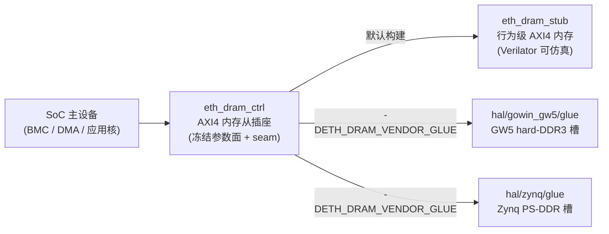

# E2-DRAM1 验收报告 — eth_dram_ctrl 封装式 DRAM 组件（AXI4 从插座 + 行为 stub + 每目标 glue）

- **任务**: E2-DRAM1（`eth_dram_ctrl` 封装件）
- **日期**: 2026-09-12
- **状态**: **完成**（sim 范围；真实 DDR PHY 属硬件 bring-up，见 §3）
- **规范**: `ethereal-spec/control/eth-axi-v0.md` **§10（新增，v0.1 草案）** = 本实现的契约
- **Plan-Ref**: `ethereal-plan/subsystems/S15-应用处理器子系统.md §4`、`docs/adr/ADR-018-axi-noc-riscv-cluster.md §4`、ADR-017（推断优先 / 厂商原语只进 `hal/<vendor>/glue/` 且必附 Verilator stub）

---

## 1. 本阶段实现内容

| 文件 | 内容 |
|---|---|
| `ethereal-shell/rtl/dram/eth_dram_ctrl.sv` | SoC 侧 **AXI4 内存从插座**：冻结参数面（`AXI_AW/AXI_DW/AXI_IDW/MEM_BASE/MEM_BYTES/RD_LATENCY/WR_LATENCY`）+ 完整 AXI4 从通道 + 文档化 **seam**（构建期后端选择：默认 `eth_dram_stub`，`-DETH_DRAM_VENDOR_GLUE` → `eth_dram_glue`）。零附加状态 —— 插座的时间/响应契约即其后端实现 |
| `ethereal-shell/rtl/dram/eth_dram_stub.sv` | **完整行为级 AXI4 内存从机**（ADR-017 的 Verilator stub）：INCR 突发（len 0..255）、AxSIZE 解码、逐字节 WSTRB、WLAST/RLAST、每突发统一 OKAY/SLVERR/DECERR、可参数化窗口/延迟、握手全部寄存（无组合输入→输出路径） |
| `ethereal-fabric/hal/gowin_gw5/glue/eth_dram_glue.sv` | GW5 hard-DDR3 后端槽（共享 `hal/gowin_gw5/` 既有根，按父裁决 B）；真实 PHY 分支为"文档即代码 + 显式 time-0 `$error`" |
| `ethereal-fabric/hal/zynq/glue/eth_dram_glue.sv` + `hal/zynq/README.md` | Zynq US+ PS-DDR 后端槽（真实绑定属 Vivado block-design 任务）+ 新 vendor HAL README |
| `ethereal-fabric/tests/axi/tb_eth_dram_ctrl.sv` | 自检 TB：单拍读写 + 4 组手工核对的 WSTRB（断言在 **DUT 自己的回读**上）、INCR 突发 len{0,1,2,3,7,15}×size{0,1,2,3}（含非对齐起始与对齐规则）、W-before-AW、混合背靠背、写流中插入读突发、双向背压（含 64 周期 RREADY 停顿 + VALID 稳定性）、完整错误策略（越界→DECERR、跨边界写不落盘、16 拍 DECERR 写全部吞掉 W 拍、WRAP/FIXED/超宽/lock/4KiB 跨界→SLVERR）、有界随机 soak（30000 周期 / 800 笔，逐拍对比 TB 内参考模型） |

## 2. 验证

- ✅ **lint**：6× `verilator --lint-only -Wall` 零告警（stub；ctrl+stub；两个 glue 各自独立；ctrl 绑定 GW5 glue；ctrl 绑定 Zynq glue）；已纳入 `make lint` 的 `RTL_CLEAN`（父侧）→ **`make lint` OK**。
- ✅ **TB（本人独立复跑）**：`13854 checks, 0 errors, 800 soak tx, 13568 cycles` + `TEST PASSED`；
  Verilator `--binary --timing` 同 TB：`13492 checks, 0 errors`（差异仅 `$random` 停顿序列）。
- ✅ **seam 证明**：`-DETH_DRAM_VENDOR_GLUE` 下经 GW5 与 Zynq 两个 provider 各跑同一 TB → 同结果（插座对目标不透明）；
  两个 provider 同时加入文件清单 → 编译期报 `eth_dram_glue` 重复声明（"每构建仅一个实现"由机制而非约定保证）。
- ✅ **变异证据（4 项，全部 FAIL）**：丢首写拍（76 errors，被手工 WSTRB 回读直接抓住）、重复读拍（1228 errors）、
  忽略 WSTRB（223 errors）、禁用 DECERR（65 errors）；未变异基线 0 errors。

## 3. 明确边界

- ⚠️ **无真实 PHY**：GW5 hard-DDR3 与 Zynq PS-DDR 的真实绑定均为硬件 bring-up 任务（S15 §4 / ADR-018 §4）；
  在此之前 GW5 应用集群跑无 DDR 配置（BootROM + 片上 SRAM + 可选 SPI-flash/PSRAM rootfs）✔ 已由插座支持（`MEM_BYTES` 可配）。
- ⚠️ **`MEM_BASE = 0x8000_0000` 为 ASSUMPTION**（SoC 内存映射未冻结；两模块头与 Zynq README 均已标注，参数可配）。
- ⚠️ **v0.1 单拍/单未完成事务模型**：每方向单 outstanding（与 v0 xbar 模型一致）；多 outstanding/ID 重排随 E2-AXI2 讨论。

## 4. 下一阶段需要做的内容

- **E2-AXI2** — `eth_axi_xbar` v0.1 突发扩展（AxLEN/AxSIZE/AxBURST/WLAST/RLAST 贯通 + spec §5.2 修订）：
  当前 DRAM 插座可直连主设备，但**接不到 v0 xbar 之后**（本次新暴露的集成缺口）。
- **E2-DMA1** — `eth_dma_mc` 多通道 SG DMA（DRAM 的第一个真实主设备，与本节 socket 直连）。
- 队列后续：E2-RV0/E2-RV1（DiffTest 载体 → RV-B 核）、E3-REP1、E1-DMO2c。
