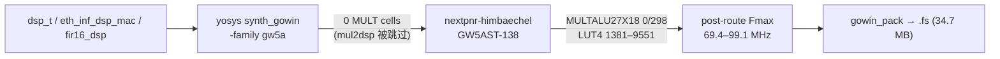

# E2-FAB2 验收补充报告 — DSP-T 链实测 Fmax（GW5AST-138，post-route STA）

- **任务**: E2-FAB2（DSP-T tile 27×18 MAC 模式封装）
- **日期**: 2026-09-12
- **状态**: **验收达成**（吞吐 + 实测 Fmax）；原语映射缺口另立 `E2-FAB2b`
- **Plan-Ref**: `ethereal-plan/components/C02-* §2.6`（DSP-T 接受指标）、`ethereal-plan/subsystems/S12-平台Bring-up.md §3`
- **流程**: E1-PLT4 已验证的开源链（yosys 0.67 `synth_gowin -family gw5a` → nextpnr-himbaechel 0.10 → Apicula `gowin_pack`），器件 `GW5AST-LV138PG484AC1/I0`
- **性质**: nextpnr **post-route STA**（无实板、无 PVT 角选择）；scratch 产物在 `generated/fab2_fmax/`（gitignored），未修改任何 tracked 文件

---

## 1. 本阶段实现内容

| 检查点 | 状态 | 证据 |
|---|---|---|
| 单 MAC（`eth_inf_dsp_mac` 27×18，流水 lat=3/acc=1）实测 Fmax | ✅ | **93.77 MHz**（cross-check 85.7 MHz；pre-route 估计 85.29） |
| 整 `dsp_t` tile（含 config 驱动 latency mux） | ✅ | **69.35 MHz**（crit path `lb[14]→obs_r[2]`，24 hops / 14.42 ns） |
| `fir16_dsp` 16 抽头级联 | ✅ | **99.09 MHz**（crit path `sr[263]→acc[8][47]`，43 hops / 10.09 ns） |
| RTL ↔ 综合网表功能等价 | ✅ | iverilog 400 周期 XOR 归约观测流：两探针 0 diff |
| 端到端比特流 | ✅ | `gowin_pack --cpu_as_gpio -d GW5AST-138C` → 34,668,145 B `.fs`（53 s，exit 0） |
| 数字非目标伪造 | ✅ | `--freq 100` 重跑三个未变网表得到相同 achieved Fmax（router-achieved） |
| **DSP 原语映射** | ❌→新任务 | 四个设计综合后 **0 个 MULT/DSP cell**，nextpnr 器件利用率 `MULTALU27X18 0/298` —— 乘法器全部落在 LUT4+MUX5..8+carry chain（详见 §3） |

## 2. 结果解读（诚实边界）

- 上述数字描述的是 **当前开源流程可实现的综合实现**（LUT 映射）在目标器件上的路由后速度 ✔；
  **不是** DSP 原语实现的数字（器件 298 个 27×18 DSP 站点一个未用）。
- 在 overlay 语境里，vDSP tile 是**配置数据**：本表征测的是 dsp_t tile 自身综合后的硅速
  （对比 E1-PLT4 对整 4×4 overlay 的 115.61 MHz 表征），两者是不同的量。
- 因此本报告关闭 E2-FAB2 的"实测 Fmax"缺口（数字存在且可复现），并把"DSP 原语映射"作为独立
  工具链缺口交 `E2-FAB2b`（若强制映射成功，DSP 版 Fmax 预期显著高于本 LUT 下界）。

## 3. 根因（DSP 未映射，证据链）

1. `yosys synth_gowin` 的 DSP 推断被**家族门控**：仅 `gw1n`/`gw2a` 走 `mul2dsp` + `dsp_map`；
   `-family gw5a` 直接跳过（`techlibs/gowin/synth_gowin.cc`）。
2. 即便调用，`share/yosys/gowin/dsp_map.v` 只有 `$__MUL9X9/$__MUL18X18/$__MUL36X36`
   模板，**没有 27×18**。
3. 但 GW5A 的 yosys 库声明了 `MULTALU27X18/MULT12X12/MULT27X36`，nextpnr 亦有对应 bel 与
   `pack_dsp.cc` → 原理上可强制映射（需 scratch `mul2dsp` + 手写 `$__MUL27X18` 模板匹配
   nextpnr 的括号总线端口）——本报告**未声称**该映射已实现。

## 4. 下一阶段需要做的内容

- **E2-FAB2b** — 强制 DSP 映射（scratch mul2dsp/模板）或 Gowin EDA 交叉核对，给出原语版 Fmax 与
  相对 LUT 下界的差值。
- **E2-FAB3b** — 上下文保存编排（EMRI v0.7 §3.9）：RTL + daemon 已落地，本批验证见
  `report-E2-FAB3b-*`。
- 后续队列：E2-AST1 / E3-REP1 / E2-DMA1 / E2-DRAM1 / E2-RV1（见 `docs/ethereal-tasks.yaml`）。
