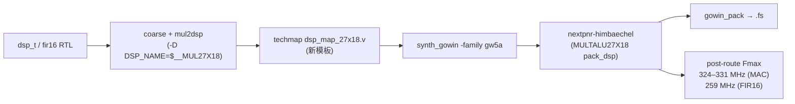

# E2-FAB2b 验收报告 — GW5A DSP 原语强制映射（27×18 → MULTALU27X18）

- **任务**: E2-FAB2b（GW5A DSP 原语映射缺口）
- **日期**: 2026-09-12
- **状态**: **完成** —— 强制映射成功，DSP 原语版 Fmax 已实测
- **Plan-Ref**: `ethereal-plan/components/C02-* §2.6`（DSP-T 指标）、`E2-FAB2` 报告（LUT 映射下界）
- **性质**: scratch spike（产物全部在 `generated/fab2b_dsp/`，gitignored；**未改任何 tracked 文件**）
- **流程**: yosys 0.67 + nextpnr-himbaechel 0.10 + Apicula（GW5AST-138，E1-PLT4 流程）+ **新增的 scratch `dsp_map_27x18.v` 模板**

---

## 1. 本阶段实现内容

### 1.1 缺口（E2-FAB2 实测暴露）

`synth_gowin` 把 `mul2dsp` + `dsp_map` 门控在 `gw1n|gw2a`；`share/yosys/gowin/dsp_map.v`
只有 `$__MUL9X9/18X18/36X36` 模板 ⇒ `-family gw5a` 下 298 个 `MULTALU27X18` 一个不用。
但 GW5A 技术库声明了该 cell，nextpnr 亦有 `pack_dsp` 分支与对应 bel ⇒ **缺的只是一条 techmap 模板**。

### 1.2 做法

1. 复刻 `synth_gowin` 的 coarse 段 + `techmap -map +/mul2dsp.v -D DSP_A_MAXWIDTH=27
   -D DSP_B_MAXWIDTH=18 -D DSP_NAME=$__MUL27X18` + `chtype`；
2. `techmap -map dsp_map_27x18.v`（新模板：A/B 直连乘法器，C/D/CASI/SIA=0，动态选择=0，
   CLK/CE/RESET=0（techlib 寄存默认 BYPASS），DOUT→Y）；
3. 对预映射 RTLIL 跑完整 `synth_gowin -family gw5a` → nextpnr-himbaechel → `gowin_pack`；
4. 与 RTL 做 iverilog 逐位等价（XOR 归约观测流）。

### 1.3 结果（post-route，GW5AST-138）

| 设计 | DSP 原语 | DSP 版 Fmax | LUT 版下界（E2-FAB2） | 提升 | LUT4 用量 |
|---|---|---|---|---|---|
| 单 27×18 MAC（`probe_mac2`） | **1/298 MULTALU27X18** | **324.57 / 331.02 MHz** | 93.77 | **3.5×** | 2244 → **276** |
| `fir16_dsp` 16 抽头级联 | **16/298 (5%)** | **259.34 / 258.33 MHz** | 99.09 | **2.6×** | 9042 → **867** |
| **`dsp_t` 整 tile**（config 驱动 latency/acc，观测锥含操作数 FF） | **2/298** | **173.55 MHz** | 69.35 | **2.5×** | 5506 → **284** |

- 功能等价：MAC 400 周期逐位一致；FIR16 387 个 RTL 有定义周期逐位一致（`fir16_dsp` 的 acc 无复位，
  RTL 前 14 周期为 X）。
- 端到端：`gowin_pack --cpu_as_gpio -d GW5AST-138C` → `probe_mac2_dsp.fs` 34,668,145 B（exit 0）。
- `MUX2_LUT5..8` 全部归零（LUT 版为 582/170/57/18 与 2801/956/294/112）。



## 2. 可复现配方（durable）

模板要点（完整文件见 scratch `generated/fab2b_dsp/dsp_map_27x18.v`，以下为其语义）：

```verilog
// $__MUL27X18 -> MULTALU27X18（有符号 A[26:0] x B[17:0]）
module \$__MUL27X18 (input [26:0] A, input [17:0] B, output [44:0] Y);
  MULTALU27X18 #() u (.A0(A[0]), ... .A26(A[26]),
                      .B0(B[0]), ... .B17(B[17]),
                      .C0(1'b0), ... .D0(1'b0), .CASI(1'b0), .SIA(1'b0),
                      .CLK(1'b0), .CE(1'b0), .RESET(1'b0), .Y0(Y[0]), ...);
endmodule
```

- 端口命名可用：nextpnr 前端把 yosys 总线转成 `A[0..26]`，`pack_dsp` 的 `remove_brackets`
  再映射到 bel 的 `A0..A26`。
- **不要**写出 techlib 的默认参数字符串（`BYPASS`/`CE0`/`RESET0`）：apycula 的
  `attrids.dsp_5a_attrvals` 无这些值，会写成 `UNKNOWN` 而**劣化比特流** —— 模板保持无参数，
  与既有 gw1n/gw2a 模板一致。
- 坑：用 `synth_gowin -run map_ram:` 续跑会跳过厂商库读取并误报
  `Module \`ALU' is used with parameters but is not parametric!`；应改为在读入 RTLIL 后
  重读 `cells_sim.v`/`cells_xtra_gw5a.v`，或直接对预映射 RTLIL 跑完整 `synth_gowin`。

## 3. 关键约束与诚实边界

- ⚠️ **符号性红线**：UG305E §2 明确 GW5A DSP 的算术操作数**全为有符号**，primitive/比特流
  无符号控制位（区别于 GW2A 的 `ASIGN/BSIGN`），且 `C=D=CASI=SIA=0` 的 16 种模式均退化为 `A×B`。
  ⇒ 有符号 27×18 `$mul` 可安全映射；**全宽无符号 `$mul` 不得走本模板**（把零扩展当有符号会出错，
  反例：同一网表对无符号 primitive 模型在 3 周期后即发散）。
- ⚠️ 两个 Fmax 都是**受测试台限制的下界**：关键路径已不在乘法器（MAC 为 `sc[0]→sc[46]` 的 48 位计数进位链；
  FIR16 为抽头累加 ALU 进位链）。真实"乘法器极限"需专用探针。
- ⚠️ 无实板验证；GW5A 的 nextpnr 时序数据仍为实验性；DSP 配置依赖 Apicula DB 默认值。
- ✅ `dsp_t` **整 tile** 已补测：**2/298 MULTALU27X18，post-route 173.55 MHz**（LUT 基线 69.35 → 2.5×；
  LUT4 5506→284、ALU 190→144、DFF 267 不变）。2 个 DSP 是正确的：tile 暴露运行期 latency/acc，
  **registered multiply 与 `p0=a*b+c` bypass 两套逻辑都存活**。
- ⚠️ 等价性细节（不隐藏数字）：原始 tile 探针 RTL↔网表有 356/401 周期不一致，但**与 DSP 映射无关且先于本任务存在** ——
  DSP 网表 vs E2-FAB2 的 LUT 网表 **0/401**（逐位一致），RTL vs LUT 网表同样是那 356/401 同周期。
  根因（已验证）：`dsp_t.mode_r` 无复位 → RTL 仿真从 x 开始，而 GW5A 仿真模型带 `initial Q = INIT`（=0）；
  首字配置为 0 时 RTL 的 `case(x)` 走 `default`(p3) 而网表选 p0。用**配置自周期 0 即有定义**的 scratch 探针
  （`probe_dsp_t2`，配置在 0x0007/0x0000 间翻转，同时激励 latency mux 与 acc 选择）→ RTL vs DSP 网表 **0/401**。
  ⇒ 观测锥**不**妨碍干净测量；早前的差异是未复位配置寄存器，不是 DSP 映射。
- 📌 用量/Fmax 已统一取自同一权威来源（nextpnr P&R 日志表；`--report` JSON 在另一时点采样、LUT4 略高），
  基线数字校正为 MAC 2327 / FIR16 9551，与 E2-FAB2 报告的 1381–9551 区间一致。

## 4. 下一阶段需要做的内容

- **E2-FAB2c（候选）** — 把 `dsp_map_27x18.v` 纳入平台映射流程（`synth_ethereal.py`/E2-PLT1 的
  Apicula 链），并加"无符号 $mul 不得映射"的检查钩子；收益：DSP 基准的 Fmax/LUT 双改善落地到产品路径。
- **E2-AST1 / E3-REP1 / E2-DMA1 / E2-DRAM1 / E2-RV1** — 队列后续。
