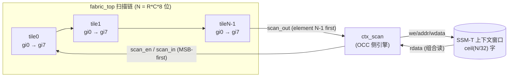
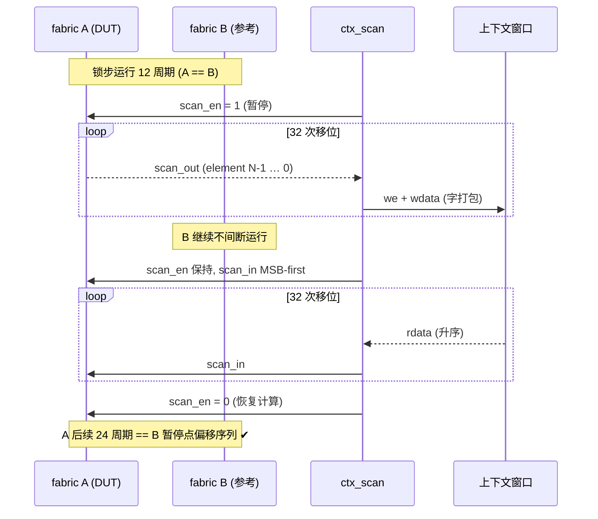

# E2-FAB3 验收报告 — 上下文保存/恢复引擎 (ctx_scan) 与 fabric FF 扫描链

- **任务**: E2-FAB3（SSM-T + 上下文保存 v1）
- **日期**: 2026-09-11
- **状态**: RTL + 顶层 TB **通过**；EMRI/BMC 编排部分拆分为 **E2-FAB3b**（见下）
- **规范**: `ethereal-spec/fabric/ctx-scan-v0.md`（v0，§4 恢复顺序在本次实现中修正）
- **Plan-Ref**: `ethereal-plan/subsystems/S02-*.md`（容器暂停/恢复）、`components/C03-OCC组件.md §7`
- **验证抓手**: `ethereal-fabric/tests/interconnect/tb_ctx_scan.sv`（`make test-sv`）

---

## 1. 本阶段实现内容

### 1.1 规范（spec-first）

- ✅ `ethereal-spec/fabric/ctx-scan-v0.md`：扫描链拓扑、保存/恢复语义、与 SSM-T 窗口的映射、EMRI 拆期。
- ✅ **实现期修正**（同版 v0，未发布）：恢复驱动顺序改为 **element N-1 first（MSB-first，降序）**。
  - 依据：链是移位寄存器，元素 0 捕获**最新**一位 ⇒ 最先驱动的位最终停在 element N-1；因此恢复必须与保存采样顺序**对称**。
  - 原文字描述 "element 0 first" 与"保存采样 element N-1 first"组合会造成**双重反向**（见 §3 缺陷记录）。

### 1.2 RTL

| 文件 | 变更 | 说明 |
|---|---|---|
| `ethereal-fabric/rtl/clb/elut4.sv` | +`scan_en_i` / `scan_in_i` / `scan_out_o` | FF 优先级：`rst > scan > CE`；`scan_out_o = vff_r` |
| `ethereal-fabric/rtl/clb/clb_t.sv` | 透传扫描端口 | 8×eLUT 串联成簇内链（gi 升序） |
| `ethereal-fabric/rtl/interconnect/fabric_top.sv` | 透传扫描端口 | 链序号 `e = (tile_rm*8 + gi)`，跨瓦片串联 |
| `ethereal-fabric/rtl/occ/ctx_scan.sv` | **新增引擎** | SAVE：采样 `scan_out`（pre-edge）→ 打包 `element e → word e/32 的 bit e%32`；RESTORE：升序读字、MSB-first 驱动；`busy/done` 脉冲 + 单时钟域 |

- ✅ 链的覆盖对象为 **全部 eLUT 的 vff**（与配置无关、位置稳定）⇒ 暂停/恢复不依赖用户逻辑语义。
- ✅ `scan_en_i` 拉高即冻结计算（无需另设 halt 信号）。
- ⚠️ 真实时钟切换（hal/glue，跨时钟域安全）仍为 **ASSUMPTION #1**（v0 仿真单时钟域）。



### 1.3 验证（S02 验收条款：**暂停→恢复后输出序列与不间断运行一致**）

`tb_ctx_scan.sv`：两个**完全相同**的 fabric_top 并行运行，镜像为自触发 TFF（`tt=0x5555`，周期翻转）：

1. **锁步**：暂停前 12 周期 A==B（任一相位错误即失败）；
2. **暂停 + 保存**：A 侧发起 SAVE（1 word / 32 bit 链）→ 断言窗口字 `bit0` == 暂停点 A 的 FF 状态；
3. **恢复**：A 侧发起 RESTORE；
4. **续跑比对**：A 恢复后 24 周期逐周期 == B **未中断**的同一序列（B 的轨迹按暂停点偏移对齐）。

```
  ok: pre-pause lockstep (A==B for 12 cycles)
  [ctx] write addr=0 data=xxxxxxxX (t=585000)   ← 上 31 位 X = 未配置瓦片 1..3 的 FF（预期）
  ok: context window word0[0] = saved A state (1)
  [ctx] done (t=605000) / [ctx] done (t=955000)
  ok: post-resume sequence equals the uninterrupted reference (24 cycles)
TEST PASSED: ctx_scan pause/save/restore resumes bit-exactly (E2-FAB3, ctx-scan-v0 §6)
```

- ✅ **位精确**：TFF 每周期翻转，任何 1 位/1 相位偏差都会导致比对失败 ⇒ 该 TB 同时覆盖打包顺序、驱动顺序、暂停点对齐。
- ✅ 寄存器级 lint：`make lint` —— **all project RTL lint-clean**（`ctx_scan.sv` 纳入 `RTL_CLEAN`）。
- ✅ 端口涟漪回归：`tb_elut4` / `tb_clb_t` / `tb_hotswap` / `tb_vbus_route` / `tb_het_fabric` / `tb_mgmt_hotswap` / `shell_tb_mgmt_packed` / `shell_tb_het_packed` **8 个 TB 全部 PASS**；15 个测试文件的扫描端口 tie-off（`scan_en_i=1'b0`）逐文件校验 1 处。



### 1.4 未覆盖 / 遗留（诚实边界）

- ⚠️ 仅验证 **words=1（32 位链）**；多字链（多瓦片）路径已在 RTL 中实现但**未被 TB 覆盖**（E2-FAB3b 扩展 TB）。
- ⚠️ 未验证**跨时钟域**与真实 SSRAM 窗口时序（hal/glue 层，ASSUMPTION）。
- ⚠️ 未配置瓦片的 `vff_r` 在上电后为 X（保持留 X 语义）⇒ 保存字的高位为 X 属预期；已验证仅 **bit0（被配置的 TFF）** 为定值。
- ❌ 无。

---

## 2. 缺陷记录（本阶段发现并修复）

| # | 现象 | 根因 | 修复 |
|---|---|---|---|
| D1 | 保存字 `bit0` 读到未配置瓦片的 X（元素顺序反） | SAVE 累加器 `acc <= {scan_out, acc[31:1]}` 把**先采到的 element N-1 最终落在 bit0**，与"element e → bit e"相反 | 改为左移插入 bit0：`acc <= {acc[30:0], scan_out}`（sample N → bit0） |
| D2 | 恢复后首周期即 X / 相位错 | RESTORE 原按 LSB-first 驱动，与保存顺序组合成**双重反向**（D1 修复后暴露） | 改为 **MSB-first**：`sreg <= {sreg[30:0], 1'b0}` + `scan_in = sreg[31]`；同步修正 spec §4 |

> D2 的定位证据：TB 诊断打印出 `[ctx] write addr=0 data=xxxxxxxX`（bit0 定义、其余 X）与恢复后 `A=x`，结合"链每移位一次元素上移一位"的推导确定驱动顺序必须与采样顺序对称。

---

## 3. 下一阶段需要做的内容

- **E2-FAB3b** — EMRI `CTX_*` 寄存器 + BMC 编排（暂停/恢复由 BMC 发起），并扩展 TB 覆盖**多字链**；`busy/done` 与 EFP 命令通道对接。
- **E1-DMO2b** — `OCC_FRAME_ADDR` 列字段 16 字步长 vs v2c 列帧 34–68 字 ⇒ 同区多列部署在回读存储中混叠；拟 **spec v0.6**（`col[11:8]`/`word[7:0]`，256 字/列）+ daemon `c<<4`→`c<<8`，**待维护者确认**后实施并补 4 列 uart 会话回放。
- **E2-SEC1** — 区域锁矩阵 + 能力清单（签名校验已有）。
- **E2-AST1 / E3-REP1 / E2-DMA1 / E2-DRAM1 / E2-RV1** — 队列后续（见 `docs/ethereal-tasks.yaml`）。
