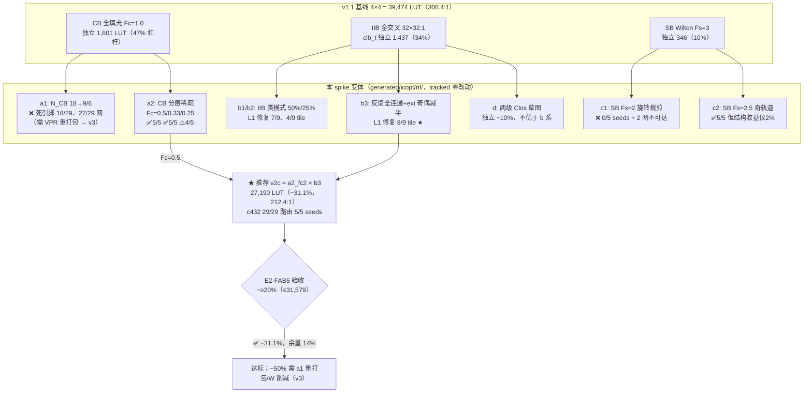

# 验收报告：E2-FAB5 — 互联 v2 选项量化 spike（308:1 物理 LUT 开销削减）

> 日期：2026-09-01 · 执行者：Kimi K3（InterconnectOpt 子代理）
> Plan-Ref：`ethereal-plan/components/C01-fabric-核心单元.md` §2.5（Landy/Stitt）·
> `docs/ethereal-tasks.yaml` E2-FAB5（验收：同尺寸 fabric 物理 LUT −≥20%）
> 输入：`docs/reports/report-E1-PLT1-hal-gowin-20260901.md`（成本归属：CB 47% / IIB 34% / SB 10%，
> cfg 存储 556 DFF/tile，4×4 基线 39,474 LUT = 308.4:1）
> Scratch（全部交付物，untracked）：`generated/icopt/`
> **未修改任何 tracked 文件**（本报告除外）；`git status` 确认 `ethereal-fabric/rtl/` 零改动。

## 结论（TL;DR）

- ✅ **E2-FAB5 验收达成（有合格候选）**：推荐配置 **v2c = CB Fc=0.5 分层稀疏化 × fbfull IIB**
  （反馈全连通 + 外部输入按奇偶减半），4×4 物理 LUT **39,474 → 27,190（−31.1%，212.4:1）**，
  与基线同方法（`yosys synth_gowin -family gw5a`）同尺寸测量，**且 c432 实布 29/29 收敛
  （PathFinder 5/5 seeds）**。−20% 阈值（≤31,579 LUT）有 14% 余量。
- ✅ 全部 15 个 4×4 变体 + 12 个独立模块综合数字可复现（`generated/icopt/synth/run_synth.sh`，
  基线行逐数复现 E1-PLT1 的 39,474 / 8,896 DFF）；可布线性结论全部来自**真实路由器运行**
  （复用 repo `bitgen_route` 的 PathFinder 核心，仅重建变体可能性图），非估算。
- ⚠️ **否决项同样有量化结论**：a1（N_CB 18→9/6 簇输入削减）在现有 VPR 布局上 18/29、27/29
  网直接死亡（需重打包，超 spike 范围）；c1（SB Fs=2 旋转裁剪）**5 seeds 全不收敛 + 2 网结构性
  不可达** —— 省 LUT 但杀死可布线性，不是收益；SB 杠杆本身只有 ~5% 结构量，建议 v2 保持
  Wilton Fs=3 不动。
- ⚠️ **测量方法论发现（影响所有后续开销任务）**：`synth_gowin` 的 abc 映射对本网表族
  （含结构性组合环的路由 mux 网络）是混沌的 —— 同一变体 c1 映射后 **+19.0%**，但其映射前
  通用单元数实为 **−5.3%**（方向都反了）。本报告因此同时给出映射后（验收口径）与映射前
  （结构口径）两列；凡 |Δ| < ±10% 的映射后差异不应作为决策依据。

## 1. 本阶段实现内容

| 检查点 | 状态 | 证据 |
|---|---|---|
| 读齐输入文档（E1-PLT1 报告 / synth_stat.sh / CB/SB/clb_t RTL / interconnect-config-v0 / memory/04 Landy-Stitt 注记） | ✅ | 本报告方法与之逐项对齐 |
| 变体原型 RTL（scratch 副本，tracked RTL 零改动） | ✅ | `generated/icopt/rtl/`：`connection_block_dep.sv`（DIV 参数，DIV=1 与基线逐比特等价）、`clb_t_iibdep.sv`（IIB_DIV=1/2/4）、`clb_t_fbfull.sv`（b3，纯位切片编码）、`switch_box_fs2.sv`（FS=3/2/25）、`clb_t_clos.sv`（d 选项，两级 Clos 草图） |
| 变体功能正确性冒烟 TB | ✅ | `rtl/tb_icopt_variants.sv` + `run_tb.sh`：**930 checks / 0 errors**（DIV=1/FS=3 与 tracked 模块逐比特等价 + 各稀疏模式公式 + 反馈路径定向检查） |
| (a) fc_in 削减：N_CB 18→9/6（a1，纯 chparam）+ 每输入轨道子集 48→24/16/12（a2，Fc 0.5/0.33/0.25） | ✅ | 综合 §2.2/§2.3；路由 §2.4 |
| (b) IIB 稀疏化：50%/25% 类模式（b1/b2）+ 反馈优先奇偶减半（b3，spike 中新增的最优模式） | ✅ | 同上 |
| (c) SB 源裁剪：Wilton Fs=3→Fs=2 旋转裁剪（c1）/ 奇轨道 Fs=2.5（c2） | ✅ | 同上 |
| (d) 两级 Clos IIB 草图（26→16→32 结构，独立综合成本点） | ✅ | `clb_t_clos.sv`：1,293 LUT（−10%，不优于 b 系，且无重排连通性分析 —— 仅作成本参照） |
| 可布线性守卫：c432 真实 PathFinder（变体可能性图 + 5-seed 扫描） | ✅ | `route/route_check.py` + `route_seedsweep.py` → `results/route_icopt.json` / `route_seeds_icopt.json` |
| IIB 簇内可行性（L0 朴素违例计数 + L1 mapper 引脚旋转/簇引脚置换修复，net 级回溯精确求解） | ✅ | `route/iib_check.py` → `results/iib_icopt.json` |
| 选项表 + 组合投影 | ✅ | §2.3/§2.5（`results/make_options_table.py` 生成 `options_table.md`） |
| 不改 tracked RTL / tasks.yaml / Makefile；不重跑慢门禁 | ✅ | `git status` 确认；本 slice 不触及 bmc-fw/emri，两个慢固件 TB 与 make lint/test-model/formal/sim 均未受影响（按 wave 约定留待主 Agent 统一验证） |

## 2. 验证结果

### 2.1 基线复现

`run_synth.sh` 的 `fab_base` 行：LUT1-4 = **39,474**（LUT1/2/3/4 = 2,932/2,648/23,597/10,297）、
DFF = 8,896 —— 与 E1-PLT1/E1-PLT4 逐数吻合，测量环境一致。

### 2.2 独立模块成本（归属清晰，无跨边界混沌）

| 模块变体 | LUT1-4 | vs 基线 | 说明 |
|---|---|---|---|
| connection_block（Fc=1.0，基线） | 1,601 | — | 18 mux × 48:1 |
| cb_fc2 / cb_fc3 / cb_fc4 | **633 / 403 / 261** | −60% / −75% / −84% | 每输入 24/16/12 轨道分层子集；mux 树超线性塌缩 |
| clb_t（全交叉 IIB，基线） | 1,437 | — | 32 mux × 32:1 + 数据通路 280 |
| clb_iib2 / clb_iib4（50%/25% 类模式） | 1,087 / 787 | −24% / −45% | IIB 部分 1,157→807→507 |
| **clb_fbfull（b3：反馈全连通 + 外部奇偶减半）** | 1,300 | −9.5% | 17 项 mux（16 ext 类 + 8 fb 两段式），无加法器（§4 教训） |
| clb_clos（两级 Clos 草图，选项 d） | 1,293 | −10% | 16×13:1 + 32×16:1；不优于 b 系且无连通性分析，仅成本参照 |
| switch_box（Wilton Fs=3，基线） | 346 | — | |
| sb_fs2 / sb_fs25 | 298 / 322 | −14% / −7% | 杠杆本来就小（10% 归属） |

### 2.3 4×4 fabric 选项表（`results/options_table.md`，实跑生成）

映射后 = E1-PLT1 同方法（验收口径）；映射前 = abc 之前的通用单元数（结构口径，抗混沌）。
可布线性 = c432 实跑（网数/种子收敛率）；IIB 变体对簇间路由器不可见，其判据为
簇内 L0（保持 VPR 引脚分配不动的违例率）/ L1（mapper 两个真实自由度修复后的可行 tile 数）。

| 变体 | 4×4 LUT（映射后） | 比率 | Δ映射后 | Δ映射前 | c432 可布线性判定 |
|---|---|---|---|---|---|
| fab_base（v1.1 基线） | 39,474 | 308.4:1 | — | — | 29/29，5/5 seeds（23–55 iter） |
| a1_cb9（N_CB=9） | 30,151 | 235.6:1 | −23.6% | −18.0% | ❌ 18/29 网含死引脚（pin≥9），仅剩 11 网可布 |
| a1_cb6（N_CB=6） | 20,943 | 163.6:1 | −46.9% | −31.8% | ❌ 27/29 网死引脚，仅剩 2 网 |
| a2_fc2（CB Fc=0.5） | 32,970 | 257.6:1 | −16.5% | −11.9% | ✅ 29/29，**5/5 seeds**（31–152 iter） |
| a2_fc3（CB Fc=0.33） | 35,719 | 279.1:1 | −9.5% | **+12.9%** | ✅ 29/29，5/5（103–191 iter）；但 ×3 索引加法器实付 2,184 ALU（§4） |
| a2_fc4（CB Fc=0.25） | 26,049 | 203.5:1 | −34.0% | −17.8% | ⚠️ 4/5 seeds 收敛（335–532 iter），1 seed 12 节点过占 —— 边际 |
| b1_iib2（IIB 50%） | 29,600 | 231.2:1 | −25.0% | −15.9% | ⚠️ 簇内 L0 137/248 违例；L1 修复 **7/9** tile（2 tile 需重打包） |
| b2_iib4（IIB 25%） | 27,208 | 212.6:1 | −31.1% | −24.5% | ❌ L1 仅 4/9 tile —— 对 c432 过激进 |
| **b3_fbfull（反馈全连通+ext 减半）** | 34,157 | 266.9:1 | −13.5% | +4.4% | ⚠️ L1 修复 **8/9** tile（仅 (4,3) 需重打包/换 fle 布局自由度） |
| c1_fs2（SB Fs=2 全轨道） | 46,979* | 367.0:1 | +19.0%* | −5.3% | ❌ **0/5 seeds + 2 网结构性不可达**（SB 边 1728→1152）——否决 |
| c2_fs25（SB Fs=2.5 奇轨道） | 39,766* | 310.7:1 | +0.7%* | −2.1% | ✅ 29/29，5/5（30–44 iter）但结构收益仅 ~2% —— 不值得动 SB |
| **combo_v2c = a2_fc2 × b3**（推荐） | **27,190** | **212.4:1** | **−31.1%** | −7.5% | ✅ 路由侧 = a2_fc2 29/29 5/5；IIB 侧 8/9 tile —— **达标** |
| combo_v2d = a2_fc4 × b3 | 27,335 | 213.6:1 | −30.8% | −13.4% | ⚠️ 路由侧 4/5 seeds 边际 |
| combo_v2a = a2_fc2 × b3 × c2 | 29,453 | 230.1:1 | −25.4% | −9.6% | ⚠️ 2/5 seeds（171–510 iter）—— CB×SB 联合裁剪拥塞边际 |
| combo_v2b = a2_fc4 × b3 × c2 | 36,376* | 284.2:1 | −7.8%* | −15.6% | ❌ 0/5 seeds —— 否决 |

\* = 映射后数字被 abc 混沌反转/放大（c1/c2/v2b 的结构口径均为负收益即减小，见 §2.6）；这些行同时被可布线性否决，数字仅供存档。

### 2.4 可布线性守卫细节（全部为实跑，非估算）

- **路由器守卫**（`route_check.py`）：复用 repo `bitgen_route` 的 `_route_net` / `_run_pathfinder`
  / `_dijkstra` 原函数，仅按变体重建可能性图（CB 边按 `(DIR*W+t) % DIV == i % DIV` 裁剪，
  SB 边按旋转丢弃裁剪，a1 裁剪 i≥N_CB 的死引脚汇）。基线行逐数复现 repo 头牌结果
  （29 网 / 46 iter / 0 过占），证明 harness 等价。
- **种子扫描**（`route_seedsweep.py`，5 seeds × ≤600 iter）见上表；单 seed 通过不构成证据，
  故全部引用种子收敛率。
- **IIB 簇内可行性**（`iib_check.py`）：c432 DB 的 248 个真实 LUT 输入源。L1 修复使用 mapper
  真实拥有的两个自由度 —— LUT 引脚旋转（bitgen_db 已证的 port_rotation/TT 置换机制）+
  簇输入引脚置换（全填充 CB 下任一网可落任意引脚）；反馈池类锁定视为固定（换 fle 位置 =
  重打包，超范围，列为未动用的第三自由度）。net 级（非 pin 级）回溯精确求解 —— 初版按 pin
  计数的 max-flow 模型有假阴性（同一 net 多扇出可共享一个引脚），已修正并复核。
- **a1 的死引脚统计**：c432 九簇全部用到 pin≥9（VPR 按 I=18 打包），N_CB=9 → 18/29 网
  （33 个汇）死亡；N_CB=6 → 27/29（47 汇）。公平评估 a1 需要改 VPR arch（I=9/6）重打包 +
  簇数膨胀的副作用计价，超本 spike 范围 → 列为 v3 方向（§6）。

### 2.5 组合投影（−20%？−50%？）

- **a×b 是否到 −20%：是，富余。** v2c 实测 −31.1%（独立杠杆映射后近似可加：
  fc2 −16.5% + fbfull −13.5% ≈ −30% ≈ 实测 −31.1%）。
- **是否到 −50%（≤19,737）：本 spike 内没有可布通的组合能达到。** 最激进的死配置
  a1_cb6（−46.9%）也已不足 −50%，且需重打包。路径在 §6（W 削减 / 簇输入重定标 /
  配置 LUTRAM 化回收 556 DFF/tile —— 不降 LUT 比但降 CFU 占用）。
- SB 裁剪在所有组合里都是净负（单杠杆 −2% 结构 vs 可布线性风险），**v2 不动 SB**。

### 2.6 测量方法论警示（给后续所有开销任务的输入）

| 现象 | 数据 | 结论 |
|---|---|---|
| c1_fs2 映射后 +19.0%，映射前 −5.3%（方向反转） | `synth_icopt.csv` vs `premap_icopt.csv`；映射前 55,120 vs 58,175 cells（少 1,359 个 `$_MUX_`） | `synth_gowin` 的 abc 在含结构性组合环的路由 mux 网络上对微小结构变化混沌敏感 |
| a2_fc3 映射后 −9.5% 但映射前 +12.9% | DIV=3 的 `sel*3` 非移位 → 288 个加法器 → 2,184 ALU | **稀疏除数必须取 2 的幂**（DIV=2/4 索引纯位拼接，零加法器） |
| fbfull 首版（`(sel-8)*2` 算术编码）独立 1,415（仅 −1.5%） | 改为纯位切片编码后 1,300（−9.5%） | 稀疏化的索引运算是真逻辑；编码必须 slice-only |
| E1-PLT1 已记的 ±15% 跨网格噪声在同尺寸变体间同样存在 | 本表 | 决策看结构口径 + 独立模块口径；验收口径（映射后）仅在差异大时有意义 |

## 3. 示意图



## 4. 遇到的问题与解决

| 问题 | 根因 | 解决方案 | 搜索关键词（供后人） |
|---|---|---|---|
| 首个 fabric 矩阵跑 300 s 超时被杀 | bash 后台默认超时 < 11×75 s 矩阵 | 显式 `timeout` 参数重跑；矩阵行写入 stat/ 逐行落盘可断点续看 | bash background timeout yosys synth matrix |
| fbfull 首版几乎无收益（独立 1,415） | `(sel-N)*EXT_DIV` 索引算术 = 32 个小减法器吃掉 mux 节省 | 纯位切片重编码（pool 重排 fb 至 [24..31]，sel={1,k}→`pool[{k,parity}]`、`{0,x,j}`→`pool[{2'b11,j}]`）；教训写入 §2.6 | sparse mux index arithmetic adder overhead |
| 修编码后 fbfull 反馈路径仿真 X | `{3'b110, j}` 是 6 bit（=48+j），32 项 pool 索引越界 → X | 正确字面量 `{2'b11, j}`（24..31）；TB 930 checks 全绿 | iverilog concat bit-select index width |
| IIB L1 可行性初版 9 tile 只过 1 个 | 按 pin 计数的 max-flow 模型错误 —— 同 net 多扇出共享一个簇引脚 | 改 net 级回溯（最少可选类优先），7/9（DIV=2）/8/9（fbfull） | net fanout shared cluster pin max-flow false negative |
| c1/c2 映射后 LUT 反而增大 | abc 对组合环网表的映射混沌（映射前证实结构变小） | 新增 `run_premap.sh` 双口径；报告 ±10% 以内映射后差异不用于决策 | yosys abc mapping chaos combinational loop |
| CB DIV=3 比 DIV=2 更贵 | `sel*3` 非移位 → 每 mux 一个加法器（2,184 ALU） | 除数取 2 的幂；fc 1/3 档用 DIV=4（Fc=0.25）替代 | non-power-of-2 constant multiply adder |
| 环境 sed 不支持 `\b`（shell builtin sed 0.1.1） | TB 构建的重命名 sed 静默不生效 | `run_tb.sh` 内用 `/usr/bin/sed`（支持 `\b`）；直接命令行与脚本内 sed 不是同一个实现 | sed builtin word boundary no-op |
| route JSON 被部分运行覆盖 | 初次设计为整体重写 | route_check/route_seedsweep 改 merge 模式 | — |

## 5. 待确认清单（ASSUMPTION 汇总，G6）

1. **v2c 作为互联 v2 候选配置的签核**：CB Fc=0.5 分层（`pool[(i%2)+2k]`）+ fbfull IIB
   （反馈全连通、ext 奇偶减半、sel 5 bit 位切片编码）+ SB 保持 Wilton Fs=3。
   配置位变化：CB 108→90 bit/tile（548→530，IIB/SB 不变）——frame_map / bitgen_pack /
   VPR arch（fc_in 1.0→0.5）需随之改（落地任务再做）。
2. **b3 的 1/9 未决 tile (4,3)**：L1 两自由度修不好，需动用第三自由度（VPR 簇内 fle 位置
   重排 = 重新 pack/place）或接受 c432 需重打包验证。b1（−25%，7/9）vs b3（−13.5%，8/9 +
   反馈无类锁定）的取舍建议签核 b3（反馈是簇内关键连通性，且 v2c 组合后两者差距被 CB
   摊薄）。
3. **a2_fc4（Fc=0.25）边际收敛（4/5 seeds）**：若 v2d 被选（−30.8%），需在 VPR 侧做
   更大基准集的可布线性表征（单 c432 不足以定 fc 下限）。
4. **Clos 草图未做重排连通性分析**（spike 声明的边界）：若维护者仍倾向 Clos 方向，
   需要正式的 rearrangeability 论证或 VPR 实验。
5. **映射混沌的根治**：建议后续开销任务把 `run_premap.sh` 口径（或 nextpnr 后 LUT 数）
   纳入辅助判据；本 spike 未做 nextpnr 复测（每点 ~15 min，超出 spike 预算）。

## 6. 下一阶段需要做的内容

| 任务 | 内容 | 依赖 |
|---|---|---|
| E2-FAB5 落地 | 按签核结果把 v2c 写入 tracked RTL（`connection_block`/`clb_t` 参数化 DIV/编码）+ cb_model/clb_t_model/frame_map/bitgen_pack/VPR arch 同步 + tb_switch_box/tb_connection_block/tb_clb_t 适配 + c432 全流程 bit-true 回归 | 本报告 + §5.1 签核 |
| （新）mapper 引脚类感知 | bitgen_db 的 IIB sel 推导加类约束求解（本 spike 的 L1 回溯可直接移植为实现）+ port_rotation 扩展到类合法排列 | E2-FAB5 落地 |
| （新）v3 方向：−50% 路径 | a1 重打包实验（VPR arch I=9/6 → 簇数膨胀计价）+ W=12→8 探索 + C13 §2.3 eth_inf_lutram 配置存储 LUTRAM 化（回收 556 DFF/tile） | §5.3 + 维护者排期 |
| E2-FAB5 收尾 | tasks.yaml 状态更新（主 Agent/维护者）；本报告数字进性能看板（S14） | 本报告 |

### 复现索引（全部在 generated/icopt/）

```bash
export PATH=$HOME/oss-cad-suite/bin:$PATH
generated/icopt/synth/run_synth.sh all        # 12 独立 + 15 个 4×4 映射后普查 → results/synth_icopt.{csv,md}
generated/icopt/synth/run_premap.sh           # 15 个 4×4 映射前结构普查 → results/premap_icopt.{csv,md}
generated/icopt/rtl/run_tb.sh                 # 变体功能冒烟：930 checks PASS
source .venv/bin/activate
python3 generated/icopt/route/route_check.py          # 12 变体 c432 路由 → results/route_icopt.json
python3 generated/icopt/route/route_seedsweep.py      # 8 变体 × 5 seeds → results/route_seeds_icopt.json
python3 generated/icopt/route/iib_check.py            # IIB 簇内 L0/L1 → results/iib_icopt.json
python3 generated/icopt/results/make_options_table.py # 汇总选项表 → results/options_table.md
```
