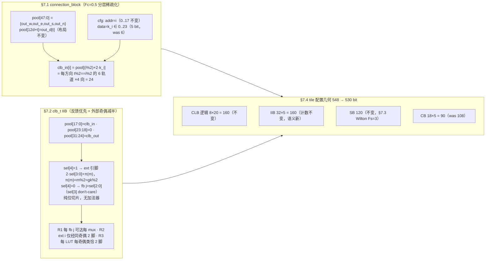

# 验收报告：E2-FAB5 v2c — 互联 v2c tracked RTL 落地（CB 分层稀疏化 + 反馈优先 IIB）

> 日期：2026-09-02 · 执行者：Kimi K3（RTLv2c 子代理）
> Plan-Ref：`ethereal-spec/fabric/interconnect-config-v0.md` **§7（v2c FROZEN，2026-09-01）** ·
> `ethereal-plan/components/C01-fabric-核心单元.md` §2 §3 §5
> 输入：`docs/reports/report-E2-FAB5-interconnect-opt-20260901.md`（spike 证据：4×4 物理 LUT
> 39,474 → 27,190，−31.1%；c432 5/5 seeds 收敛）；已验证原型
> `generated/icopt/rtl/connection_block_dep.sv` + `clb_t_fbfull.sv`（930-check TB）。
> 工作流边界（§7.8 双工作流契约）：本报告仅覆盖 **RTL 工作流**
> （`ethereal-fabric/rtl/**` + 自有 SV 测试台）；Python 黄金模型 / frame_map / bitgen /
> VPR arch / perf model 属 ModelsTools 工作流；emri/bmc TB 与全仓集成验证由主 Agent 收尾。

## 结论（TL;DR）

- ✅ **§7 v2c 已按冻结规范逐字落地到 tracked RTL**：`connection_block.sv`（§7.1，新增
  `CB_DIV=2` 参数 + 5-bit 子集索引 `cfg_data_i`）、`clb_t.sv`（§7.2，池重排 + 纯位切片
  5-bit sel 译码 + 反馈全连通 + 外部输入奇偶减半）、`fabric_top.sv`（§7.4，CB cfg 数据
  切片 6→5 bit，`cfg_data_i[4:0]`）。SB（§7.3）与 cfg 寻址 `{tile_idx, unit, intra}`
  完全未动。
- ✅ **`CB_DIV=1` 与 v1.1 逐比特等价**：结构上 `(i%1)+sel*1 = sel` 退化为 v1.1 绝对轨道
  索引、端口宽度退化为 `$clog2(4*W)=6`；并用一次性等价 TB 穷举实证（18 输入 × 全部
  64 个 6-bit sel × 2 池图形 = **2,304 检查，含 sel≥48 的 X 类，0 错误**）。
- ✅ **`make lint` 全绿**（verilator 5.051，strict `-Wall`；fabric 环模块按既定约定
  `-Wno-UNOPTFLAT`）。
- ✅ **自有 9 个 SV 测试台全部 PASS**（iverilog 14.0，逐条镜像根 Makefile `test-sv`
  命令行；**未运行全量 `make test-sv`** —— emri/bmc TB 依赖 ModelsTools 尚未落地的
  工具链再生成，属主 Agent 集成范围，见 §4）。
- ✅ **规范偏差：无**。§7.1/§7.2/§7.4 全部按 FROZEN 文本实现；唯一的实现观察
  （reserved 编码在仿真中的读值）与规范文字一致并已在 TB 中标注 MUST-NOT-PROGRAM。

## 本阶段实现内容

| 检查点 | 状态 | 证据 |
|---|---|---|
| 通读冻结规范 §7 + tracked RTL + 已验证原型 | ✅ | 本报告编码表与 §7.1/§7.2/§7.4 逐条对齐 |
| `connection_block.sv` v2c（CB_DIV + 5-bit k + §7.1 mux 语义） | ✅ | `tb_connection_block` PASS（约 1,000 检查，含奇偶类证明与 18×24×2 穷举） |
| `clb_t.sv` IIB v2c（§7.2 池重排 + 纯位切片译码；eLUT4 部分不变；UNOPTFLAT 豁免保留） | ✅ | `tb_clb_t` PASS（R1 256 + R2 576 + 定向/保留项检查） |
| `fabric_top.sv` CB cfg 数据窄化 `[5:0]→[4:0]`（§7.4），其余不变 | ✅ | `make lint` OK；`tb_hotswap`/`tb_het_fabric`/`tb_vbus_route` PASS |
| 异构 tile 路径（mem_t/dsp_t）仍可 elaborate（不触及 CB/IIB 编码） | ✅ | `tb_het_fabric`（TILE_TYPE={MEM,DSP,CLB,CLB}）+ `tb_vbus_route`（1×2 MEM+CLB）PASS |
| 自有 TB 更新到新编码（连接性穷举 + 奇偶类 + 保留 k/sel 注记） | ✅ | §2 测试台证据矩阵 |
| `CB_DIV=1` ≡ v1.1 逐比特等价的声明与验证方法 | ✅ | §3.3（结构推导 + 2,304 检查穷举 TB） |
| 不越界：未触碰 tasks.yaml / Makefile / spec / emri/bmc TB / runtime / shell / Python 模型 | ✅ | `git status --porcelain` 核对：本代理改动恰为下表 8 文件 + 本报告 |

### 改动文件清单（每文件改了什么）

| 文件 | 改动 |
|---|---|
| `ethereal-fabric/rtl/interconnect/connection_block.sv` | 新增 `CB_DIV` 参数（默认 2，§7.1）；`cfg_data_i` 收窄为 `$clog2(4*W/CB_DIV)`=5 bit；`sel_r` 5-bit；mux 语义 `clb_in_o[i] = pool[(i%CB_DIV) + sel_r[i]*CB_DIV]`；头部 Details/Plan-Ref 指向 §7.1（G2） |
| `ethereal-fabric/rtl/clb/clb_t.sv` | IIB 池重排为 `pool[17:0]=clb_in / pool[23:18]=0 填充 / pool[31:24]=clb_out`；sel 译码改纯位切片 `sel[4] ? pool[{sel[3:0],π(m)}] : pool[{2'b11,sel[2:0]}]`（无加法器）；cfg 寻址/计数不变；模块级 + 反馈区 UNOPTFLAT 豁免原样保留；eLUT4 实例化部分零改动 |
| `ethereal-fabric/rtl/interconnect/fabric_top.sv` | `TW_CB` 由 `$clog2(4*W)`=6 改为 `$clog2(4*W/CB_DIV)`=5（新增 `localparam CB_DIV=2`），CB 实例透传 `cfg_data_i[4:0]` + `.CB_DIV(CB_DIV)`；其余（SB/CLB/vbus/het）逐行未动 |
| `tests/interconnect/tb_connection_block.sv` | 重写为 v2c：5-bit k 写任务；k=0 空白默认读 `out_n[i%2]` 定向检查；四方向可达性 + 负检查；**奇偶类证明**（对立奇偶轨道对全部 24 个合法 k 均不可达）；18×24×2 全穷举对 §7.1 公式；隔离扫描；保留 k=24 的 X 注记（§7.1"simulation reads X"） |
| `tests/clb/tb_clb_t.sv` | 重写为 v2c：初始化改 FF 保持 const-0 + 复位脉冲（v2c 空白 sel=0 自读 fb0 的 X 收容类，§7.7）；toggle FF 用 sel=0=fb0；组合 buffer/inverter 改奇偶感知 sel=16 + tt 选 `vin[0]`；**新增 R1 穷举**（32 mux × 8 fb = 256，FF 常数 PAT=0xA5 下分层探测 `dut.lut_in`）；**新增 R2/R3 穷举**（32 mux × 9 合法 ext k × 2 互补图形 = 576）；保留编码观察（sel[3:0]=9..15 读填充/fb，MUST-NOT-PROGRAM） |
| `tests/interconnect/tb_hotswap.sv` | 镜像字按 §7.2 注记翻译：IIB mux sel 18→0（fb p=18+j → sel=j）；注释说明 v2c 下空白 sel=0 即 fb0，TFF 自含镜像成为硬件默认（§7.7） |
| `tests/interconnect/tb_het_fabric.sv` | tile2 CLB 自含翻转镜像的 IIB sel 18→0（同上翻译）；mem_t/dsp_t/vbus 配置序列不变 |
| `tests/interconnect/tb_vbus_route.sv` | TEST A：CB 绝对轨道 24..27 → 子集索引 k=12,12,13,13；IIB "4 脚同接 clb_in[k]" 在 v2c 奇偶类下不可表达，改为主动脚接 `clb_in[k]`（sel=16+k/2）+ 对立奇偶脚停在同奇偶已定义 ext（sel=16）+ tt=0xAAAA/0xCCCC 选主动脚；TEST B：CB k=12..15（`clb_in[i]←out_e[i]`，k=12+i/2）；SB inject 不变 |
| `docs/reports/report-E2-FAB5-v2c-rtl-20260902.md` | 本报告 |

**未改动但核对过的自有文件**：`tb_switch_box.sv`（SB v2c 不变，§7.3）、`tb_het_tiles.sv`
（独立 mem_t/dsp_t 功能 TB，不含 CB/IIB 编码）、`tests/occ/tb_occ.sv` / `tb_blank.sv` /
`column_cfg_ram.sv`（OCC 帧总线级，不编码 tile 配置点语义）——均 PASS。

### v2c 编码落地（Mermaid，G4）



### v1.1 → v2c 值翻译表（TB 翻译依据）

| 单元 | v1.1 | v2c | 合法性 / 备注 |
|---|---|---|---|
| CB sel | 绝对轨道 p（6 bit） | k = ⌊p/2⌋（5 bit） | 仅当 `p%2 == i%2` 可表示；`clb_in[i]←out_e[i]` → k=12+i/2 |
| CB 空白 | sel=0 → `out_n[0]` | k=0 → `out_n[i%2]` | 仍是真实轨道，非断开 |
| CB 保留 | —（6 bit 全合法到 47） | k=24..31 → `pool[≥48]`，仿真读 X | MUST NOT be programmed（§7.1） |
| IIB fb | p = 18+j | sel = j（sel[4]=0） | 全部 8 条 fb 对每个 mux 可见（R1） |
| IIB ext | p ∈ 0..17 | sel = 16 + ⌊p/2⌋ | 仅当 `p%2 == π(m)`；sel[3:0]=0..8 合法 |
| IIB 空白 | sel=0 → `clb_in[0]` | sel=0 → fb j=0 | 空白 LUT 自读 fb0，X 收容类同 v1.1（§7.7） |
| IIB 保留 | sel=26..31 | sel[4]=1 且 sel[3:0]=9..15 → 读填充/fb | MUST NOT be programmed（§7.2） |

## 2. 验证结果

### 2.1 门禁

```
$ make lint        # verilator 5.051 devel
[lint] clean modules (strict -Wall): … connection_block.sv …
[lint] fabric modules (-Wall -Wno-UNOPTFLAT; intended loops per C01 sec2.4): clb_t, fabric_top
[lint] OK - all project RTL lint-clean.
```

`connection_block` 在 strict `-Wall` 组（无环），`clb_t`/`fabric_top` 走既定
`-Wno-UNOPTFLAT` 环豁免通道 —— v2c 只删除 mux 边、不新增任何边（§7.7），组合环分析
（规范 §5）原样继承。

### 2.2 自有 SV 测试台证据矩阵（iverilog 14.0，镜像根 Makefile test-sv 命令行）

| TB | 结果 | 覆盖要点 |
|---|---|---|
| `tb_connection_block` | ✅ TEST PASSED | 空白默认 `out_n[i%2]`（18 检查）；四方向定向 + 负检查；奇偶类证明（2×24 k 扫描，对立奇偶永不可达）；**全穷举 18 输入 × 24 k × 2 池图形 = 864**；隔离扫描（17 检查）；保留 k=24 → X 注记 |
| `tb_clb_t` | ✅ TEST PASSED | 初始化 X-free（FF 常数 + 复位）；toggle FF（fb0，5 检查）；组合 buffer/inverter（奇偶感知 ext sel，4 检查）；**R1：32 mux × 8 fb = 256**；**R2/R3：32 mux × 9 ext × 2 图形 = 576**；保留 sel 观察（4 检查） |
| `tb_hotswap` | ✅ TEST PASSED | 2×2 fabric_top 上 TFF 镜像 A（sel=0=fb0 自含）→ blank → 常 1 镜像 B；双镜像热切换行为不变 |
| `tb_het_fabric` | ✅ TEST PASSED | 2×2 异构（MEM_T+DSP_T+2×CLB）：mem 写读 CAFEBABE、dsp MULT 42、CLB tile2 翻转 —— 异构 cfg 路径与互联在 v2c 下完好 |
| `tb_vbus_route` | ✅ TEST PASSED | vbus-OUT（mem vd_o→SB inject→CB(k=12..13)→奇偶感知 IIB buffer→clb_obs=1110）+ vbus-IN（CLB 常量 00000101→inject→CB(k=12..15)→va_i=5→读 CAFEBABE；回退寄存器路径读 0 作反证） |
| `tb_switch_box` | ✅ TEST PASSED | SB v2c 不变（§7.3），原样通过 |
| `tb_elut4` | ✅ TEST PASSED | eLUT4 部分零改动 |
| `tb_het_tiles` | ✅ TEST PASSED | 独立 mem_t/dsp_t，无 CB/IIB 编码 |
| `tb_occ` / `tb_blank` | ✅ TEST PASSED ×2 | OCC 帧总线级，不涉及 tile 配置点编码 |

### 2.3 `CB_DIV=1` ≡ v1.1 逐比特等价（验收声明 + 验证方法）

**声明**：`connection_block #(.CB_DIV(1))` 与 v1.1 `connection_block` 逐比特等价。
**结构依据**：`CB_DIV=1` 时 mux 指数 `(i%1) + sel_r[i]*1 = sel_r[i]`（绝对轨道索引），
端口宽 `$clog2(4*W/1) = 6` 与 v1.1 完全相同 —— 退化为 v1.1 原表达式（原型
`connection_block_dep.sv` 的 930-check TB 已含此等价行）。
**实证（本阶段新增）**：一次性等价 TB `/tmp/tb_cb_div1.sv`（非交付物）对
`CB_DIV(1)` 实例穷举 **18 输入 × 全部 64 个 6-bit sel × 2 池图形 = 2,304 检查**，
期望值按 v1.1 语义 `pool[sel]`（sel≥48 → X）计算：**0 错误**（"DIV1-EQUIV PASSED"）。

### 2.4 规范偏差声明

**无偏差。** §7.1（CB 参数/池布局/mux 语义/写配置/保留值/空白默认）、§7.2（池重排/
mux 类/sel 编码/写配置/R1–R3）、§7.3（SB 不动）、§7.4（fabric_top 仅 CB 数据切片
6→5 bit，寻址不变）均按 FROZEN 文本实现。两处 reserved 编码（CB k=24..31、IIB
sel[3:0]=9..15）在 TB 中的检查为**实现观察**（越界读 X / 读填充·fb），与规范
"simulation reads X / reads padding/fb — MUST NOT be programmed" 的文字一致，
不构成行为契约扩张。

## 3. 已知边界（非偏差）

- **未运行全量 `make test-sv`**：emri/bmc/shell 系列 TB 的 golden 帧与镜像由
  `ethereal-tools` 的 `pack_tb_frames.py` / `gen_bmc_hello.py` 生成，需 ModelsTools
  工作流的 frame_map v0.2（tile 530 bit、67+1 字/帧）落地后重新生成方能通过 ——
  按任务分工属主 Agent 集成阶段统一验证。本代理已逐条运行全部**自有** TB（§2.2）。
- `tb_clb_t` 的分层探测受 iverilog 限制（层级引用/局部 2D packed 均不允许变量下标），
  采用整向量层级采样 + 扁平位选（`lut_in_flat[m]`）实现，TB 内已注释。
- v2c 空白态 X 收容（§7.7）：`tb_clb_t` 的初始化相应改为 FF 保持 const-0 + 复位脉冲
  （OCC configure-before-run 约定的 TB 化身），而非 v1.1 的裸零写。

## 下一阶段需要做的内容

- **主 Agent 集成**：待 ModelsTools 的 `frame_map.py`（§7.5：tile 530 bit / 67 数据字
  +1 CRC / `CB_DIV: 2` / version "0.2"）与 bitgen/fabric_sim 落地后，再生成
  `generated/tb_frames*`、`blank.hex`、BMC 镜像并跑全量 `make test-sv` +
  c432 bit-true 回归（§7.8 验收交叉检查）。
- **E0-SHL3（perf model 常数）**：tile 548→530 bit、4×4 帧 70→68 字、镜像
  1,120→1,088 B、OCC/热切换周期数重算（ModelsTools 工作流，§7.7）。
- **v3 候选项（不在 v2c）**：N_CB 簇输入削减（需 VPR I 削减 + 重打包）、IIB 精确
  arch 建模（`I_EVEN/I_ODD` 端口拆分 + 奇偶 `<complete>` 块，需 bitgen_db 端口重映射，
  §7.6 明确列为非 v2c 范围）。
