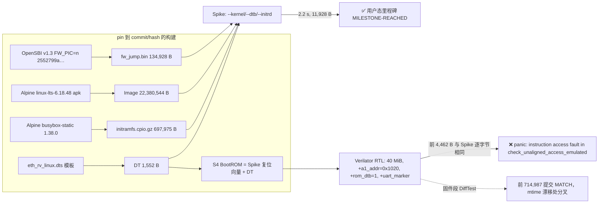

# E2-RV2 阶段报告 — RV-C 第七个切片：OpenSBI → Linux 里程碑（S4，增量 7）

- **任务**：`E2-RV2`（RV-C）**增量 7 = S4（OpenSBI → Linux 里程碑）**；可行性见 `local://s4-feasibility.md`，逐条命令见 `local://rv12-linux-notes.md`。
- **日期**：2026-09-12
- **Plan-Ref**：`ethereal-plan/components/C14-eth_rv-RV64核心.md` §里程碑表（RV-C 行）；`ethereal-plan/subsystems/S15-应用处理器子系统.md` §5（DDR-less boot）
- **一句话结论**：**Phase 1（Spike）✅ 完成** —— 同一对镜像 + 同一棵 DT 在 Spike 上把 Linux 6.18.48 带到 initramfs/用户态交接（2.2 s、11,928 B 控制台、里程碑命中）；**Phase 2（RTL）❌ 未达成** —— RTL 用同一对镜像启动了 OpenSBI 与内核早期初始化，控制台前 4,462 B 与 Spike **逐字节相同**，随后内核在**非对齐访问探测**（`check_unaligned_access_emulated`）中以 `cause=1`（instruction access fault）panic；此外固件段的 DiffTest 在 **#714,988** 提交处因 `mtime`（步进计数）漂移而分叉。**按约定如实上报，不伪造里程碑。**

## 本阶段实现内容

### ✅ 可复现构建（`verif/eth_rv/build_linux_boot.py`，pin 到 commit/hash）

| 产物 | 字节 | 来源 / pin |
|---|---|---|
| `fw_jump.bin` / `.elf` | 134,928 | OpenSBI **v1.3**、`PLATFORM=generic FW_PIC=n`、commit `2552799a1df30a3dcd2321a8b75d61d06f5fb9fc` |
| `Image` | 22,380,544 | Alpine `linux-lts-6.18.48-r0.apk`（sha256 `cc2f73ad…`）→ gunzip 后即为 flat Image（`text_offset=0x200000`、`image_size=0x15d6000`、`RISCV`/`RSC\x05` 魔数全字段校验） |
| `initramfs.cpio.gz` | 697,975 | Alpine `busybox-static-1.38.0-r4.apk`（sha256 `7fed6d09…`）+ 检入的 `s4/init`；`newc` cpio + `gzip -9 mtime=0`（确定性） |
| `eth_rv_linux.dtb` | 1,552 | `eth_rv_linux.dts` 模板（`@INITRD_*@` 由构建脚本代入） |
| `boot_rom_s4.{hex,bin}` | 4 KiB | Spike 自身复位向量 + 步进字 + 入口字 + DT（见下） |

`build_linux_boot.py --check` 用 manifest 复核各哈希；**只有源文件入库**，所有二进制产物落在 gitignore 的 `generated/`。

**版本选择的硬约束**：本机唯一的 RISC-V 链接器 `riscv64-unknown-elf-ld`（binutils 2.42）**无 `-pie`/`-shared`**，而 OpenSBI ≥ v1.4 强制 PIE（Makefile 探测失败即 `error`），故可用的最新**原版**发行版是 v1.3 + `FW_PIC=n`（位置相关、链接在 `FW_TEXT_START=0x8000_0000`，正好是 SoC 的 RAM 基址）。

### ✅ S4 地址图（写入 `core.yaml` 与 `rv_platform.py`，互为镜像）

| 区域 | 地址 | 依据 |
|---|---|---|
| RAM 窗口 | 0x8000_0000 + **40 MiB**（0x2800000） | 内核 22.4 MiB + 原版 OpenSBI 布局下界 34.01 MiB |
| `fw_jump.bin` | 0x8000_0000 | 其链接地址 = BootROM 交接目标 |
| 内核 `Image` | 0x8020_0000 | `FW_JUMP_OFFSET` 与镜像 `text_offset` 必须一致 |
| DT（内核侧） | 0x8220_0000 | `FW_JUMP_FDT_ADDR`：`fw_jump` 进入内核前把 DT **搬到这里** |
| DT（BootROM 内） | 0x1020 | Spike 自己的复位 ROM 槽位（见下） |
| initramfs | `[0x827FF000-size, 0x827FF000)` | Spike `--initrd` 约定；`/chosen` 携带 |

`fw_jump` 只传 `a0/a1`，initrd 无交接通道 ⇒ 必须写进 `/chosen`，所以 `eth_rv_linux.dts` 是模板、构建脚本按刚生成的 initramfs 大小代入。

### ✅ Phase 1：Spike 上的 OpenSBI → Linux（唯一命令）

```
spike --isa=rv64imafdc_zicsr_zicntr -m0x80000000:41943040 \
      --dtb=generated/rv_difftest/s4/eth_rv_linux.dtb \
      --kernel=generated/rv_difftest/s4/Image \
      --initrd=generated/rv_difftest/s4/initramfs.cpio.gz \
      generated/rv_difftest/s4/fw_jump.elf          # OpenSBI ELF 作为位置程序（入口 0x8000_0000）
```

命令封装在 `verif/eth_rv_core/run_linux_boot.py --spike`。结果：**2.2 s wall、11,928 B 控制台、在里程碑处命中并停止**。逐字（截断）：

```
OpenSBI v1.3
Platform Name             : ethereal,eth_rv
Platform IPI Device       : aclint-mswi
Platform Timer Device     : aclint-mtimer @ 10000000Hz
Platform Console Device   : uart8250
Firmware Base             : 0x80000000
[    0.019470] Memory: 15432K/40960K available (8862K kernel code, 5218K rwdata, 4096K rodata, 2301K init, 503K bss, 24212K reserved, 0K cma-reserved)
[    0.273210] riscv-plic: plic@c000000: mapped 31 interrupts with 1 handlers for 2 contexts.
[    0.280630] 10000000.serial: ttyS0 at MMIO 0x10000000 (irq = 12, base_baud = 625000) is a 16550A
[    0.334505] Run /init as init process
eth_rv S4: initramfs /init is running as pid 1
eth_rv S4: MILESTONE-REACHED
```

DT 被 OpenSBI 正确解析（平台名/时钟/IPI/控制台全部来自我们那棵树），PLIC/UART 由内核挂载成功 ⇒ **镜像对与 DT 自洽**（Phase 1 的全部目的）。

### ✅ Phase 2 的机制（已完成并验证的部分）

- **40 MiB 窗口**两侧同数：`-DETH_RV_MEM_BYTES=41943040` / `+mem_bytes=41943040` / `-m0x80000000:41943040`。
- **BootROM 与 Spike 逐字节一致**：S4 ROM = Spike 的复位向量（`auipc t0,0` / `addi a1,t0,32` / `csrr a0,mhartid` / `ld t0,24(t0)` / `jr t0`）+ DT（`0x1020`），唯一差异是**从不执行**的第 5 个字（步进计数 5，供 CLINT 吞掉）；因此两侧进入 OpenSBI 时 `a1` 相同、固件段才可能可 diff。
- **控制台里程碑停**：TB 新增 `+uart_marker=<hex>`（在解码出的串行字节流上做流式匹配）——里程碑是**控制台事件**而非 store，这是唯一可用的停机点；同时 `+progress=<n>` 为长启动提供每 N 周期进度行，`+trace` 变为可选（Linux 启动不逐提交对比，否则是 GB 级 dump）。
- **固件段 DiffTest**（`--difftest`：`+stop_pc=0x80200000` 停在进入内核处，golden 用 `--instructions = 5 + N + 64` 截断，比较器 `--max-commits=N`）。
- **跑起来的就是 Acceptance 的数字**：RTL 启动到 2×10⁹ 周期预算耗尽（45.6 min wall）时 retired **389,333,273** 提交、收到 **9,840 B** 控制台、pc=0x80a9ddb2（内核 text）——注意：**该跑法已把 panic 后的自旋算进去**，实际 panic 点早于此。

### ❌ Phase 2 的实际结果（分叉点，逐字）

1. **固件段 DiffTest 在 #714,988 分叉**（value_mismatch，`pc=0x8000a6dc`、`x11=a1`）：Spike `0x1c20` vs DUT `0x1bbc`——**正好差 100 个 mtime 单位**（= 10,000 步），即 DUT 的 CLINT 步进计数比 Spike 少约 1.4%。CLINT 的配置本身是对的（`RTC_TICK_STEPS=5000`、`RTC_TICK_ADVANCE=50` ⇒ 每 100 步 +1，与 Spike 的 `INSNS_PER_RTC_TICK=100` 相同），所以差在**步进脉冲**：`assign step_o = ex_valid_r && !ex_stall && !mem_trap;` —— `mem_trap`（同周期较老指令陷入）与流水线冲刷会丢掉脉冲，而 Spike 在 `step()` 里遇到 trap 提前返回（其账本为 0 步）。这解释了 `mtime` 漂移（README 早已把“trap 之后 `mtime` 不可 diff”写成边界，但**漂移在固件段就出现了**，比该边界更早）。
2. **内核 panic**（控制台前 4,462 B 与 Spike 逐字节相同后）：

```
[    0.000325] Console: colour dummy device 80x25          # DUT（Spike 同行为 0.000335 —— mtime 已漂移）
[    0.029025] Oops - instruction access fault [#1]
[    0.029045] epc : check_unaligned_access_emulated+0x36/0x58
[    0.029065] epc : ffffffff80014c6a ra : ffffffff800c2396 sp : ffffffc60000bca0
[    0.029120] status: 0000000200000100 badaddr: ffffffff80014c6a cause: 0000000000000001
[    0.029240] Kernel panic - not syncing: Fatal exception in interrupt
```

`0xffffffff80014c6a` 处的指令是 `ld a4,1(a4)`——**内核故意执行的一条非对齐 8 字节 load**（该函数的全部目的就是让 SBI 去模拟它）。OpenSBI v1.3 内**确有** `sbi_misaligned_load_handler/store_handler`（`nm fw_jump.elf` 可见），且其 `sbi_hart.c` 的 `medeleg` 掩码只委托 `CAUSE_MISALIGNED_FETCH`、**不**委托 `CAUSE_MISALIGNED_LOAD/STORE` ⇒ 正确行为是 cause **4** 在 M 模式被模拟、S 模式永远看不到该异常。DUT 却给出 **cause 1（instruction access fault）+ stval = epc**；在本 RTL 中该组合只能出自**取指路径**（`fetch_hit && imem_err_i`，或 `mmu_fault == CAUSE_INSN_ACCESS`——页表走查中 PTE 读被拒）。同一页在前一条指令还能正常取指，因此怀疑点是**非对齐陷入与取指/MMU 路径的交互**，而不是稳定态映射错误。

因为这一条未解决，**RTL 侧“控制台字节精确到里程碑”的验收项未达成**；不把 panic 前的 4,462 B 相同冒充为里程碑。

### ✅ 验证与门禁（本机复跑）

| 检查 | 结果 |
|---|---|
| `make verif-rv`（语料 + pytest） | **274 passed**（含新增 14 条 S4 契约测试：40 MiB 算术、DT 契约、S4 BootROM 逐字/溢出拒绝、runner 的 plusarg 与 Spikes argv） |
| `make lint` | `[lint] OK - all project RTL lint-clean.`（TB 另用 `--lint-only -Wall --timing` 在 S3 与 S4 两套 `-D` 下均 0 警告） |
| `make formal` | **7/7 PASS**（`eth_rv_core` k-induction 等；未改动/削弱任何断言、未改任何形式化模块） |
| Spike 参考启动 | 2.2 s wall 到里程碑，11,928 B 控制台 |
| 固件段 DiffTest | **前 714,987 提交 MATCH**（含 40,393+ 条内存访问），第 714,988 提交因 `mtime` 漂移分叉 |
| RTL 启动 | 45.6 min / 2×10⁹ 周期预算耗尽；389,333,273 提交；9,840 B 控制台；控制台与 Spike 逐字节相同到 4,462 B 后 panic |
| 负控 / 边界 | `+rom_dtb=1` 校验 ROM 里 a1 处确有 FDT 魔数（错了直接 FAIL）；`+a1_addr` 保留 S3 默认值（语料行为不变）；UART 溢出/帧错仍是硬 FAIL |

### 📌 本切片抓到并修复的真实缺陷

| # | 缺陷 | 说明 |
|---|---|---|
| 1 | **TB 在失败路径上不写 `+uart=` 证据** | 预算超限的 FAIL 发生在控制台报告之前 ⇒ 长启动失败时一行控制台都看不到（诊断不可用）。已把裁决移到所有报告之后（`failed` 仍粘滞、仍 `$fatal`） |
| 2 | **`--pc` 会绕过 Spike 的复位 ROM** | 用 `--pc=0x80000000` 让 Spike 从 OpenSBI 入口起跑时，它的 ROM 不执行 ⇒ `a1=0`（第二条指令 `add s1,a1,zero` 即分叉；DT 指针根本没传）。S4 runner 因此**不传 `--pc`**，靠 ELF 入口 + harness 的 `entry=` 截断 |
| 3 | **UART 发送队列对启动太小** | Spike 的 ns16550 是**无缓冲立即输出**（LSR 恒 `TEMT|THRE`），而 DUT 按 16 周期/位真实移位且无法反压 ⇒ 内核一次 printk 突发即溢出（实测丢字节）。S4 构建把队列深度做成 `-DETH_RV_UART_FIFO_DEPTH=65536`（模型参数，寄存器语义不动，故固件 DiffTest 仍对齐） |
| 4 | **`sbi_memcpy` 处的“假死”** | 3 M 周期探测器看到 pc 停在 `sbi_memcpy`，实为启动尚在早期（400 M+ 周期才到里程碑）；`+progress=` 让长启动可观测 |
| 5 | **未修复（本切片最大遗留）**：非对齐访问在 S 模式被报成 `cause=1`/`stval=epc` | 见上 §“Phase 2 的实际结果”；语料里没有任何**数据非对齐**程序，这是五轮 DiffTest 都没抓到的原因 |

### ⚠️ 边界（写入 README 与 `local://rv12-linux-notes.md`）

- **DT 的初始地址是 Spike 的 ROM 槽（0x1020）**，不是 0x8220_0000；内核仍拿到 0x8220_0000（`fw_jump` 自己搬过去）。板级启动应改为 RAM 预置 DT 并让 ROM 桩交 `a1=0x8220_0000`（`build_rom.py --a1` 已是构建参数）。
- **`mtime` 只在没有 trap 介入时可 diff**：内核时间戳因此必然漂移（实测 ~0.0003 s 处已差 10 µs），**文本可 diff、时间戳不可**。
- **`timebase-frequency`/`clock-frequency` 仍是仿真占位**（10 MHz 由指令节奏推出）。
- **无 TLB、无 PTE 缓存**（`cor_mmu.sv` 每次访问都走三级走查）⇒ 内核段 IPC≈0.2，2×10⁹ 周期/45 min 是单线程墙钟；这是性能边界而非正确性。
- **D 口两种构建**：本轮只跑了 beat 路径；AXI/DRAM 变体**未跑**（`--rtl --dram` 可用），因为在 beat 路径上里程碑都未达成，跑第二个构建只会复现同一失败 —— 明确记录而不是跳过。

## 下一阶段需要做的内容

1. **修非对齐访问分叉（唯一阻塞项）**：用 20 行裸机探针（S 模式非对齐 `ld`/`sd` + 打印 `mcause/mtval`）DiffTest Spike 对照，几秒内即可定位；候选点=`mem_misaligned` 与取指/MMU 路径的交互（本 RTL 中 `cause=1 & stval=epc` 只能来自取指路径）。
2. **修步进脉冲丢失**（`step_o` 的 `!mem_trap`/冲刷分支）：让 CLINT 的 mtime 与 Spike 的 `INSNS_PER_RTC_TICK` 在 trap 前后都一致——否则内核定时器/时间戳永远不可 diff（也顺带把 `mtime` 从“边界”升回“可 diff”）。
3. 修好后重跑 `--rtl`（beat）与 `--rtl --dram`，把里程碑与两种 D 口的数字补齐；再跑一次完整固件段 DiffTest 记录最终 MATCH 提交数。
4. 板级启动遗留（`local://rv12-linux-notes.md` §6）：真实 timebase、DT/initrd 的加载者、可配置波特率发送器、控制台之外的 PLIC 源、硬件 A/D 或接受软件 A/D 成本。
5. 外部门控项不变：`E2-AST1`、`E1-DMO3`、`E0-INF2`。

## 状态与证据图



**证据位置**：`generated/rv_difftest/s4/`（镜像 + manifest + `run/summary.json`、`run/s4.spike.console`、`run/s4.rtl.console`、`s4.uart`、`run/s4.traps.log`）；`local://rv12-linux-notes.md`（全部命令、边界、板级遗留）。
