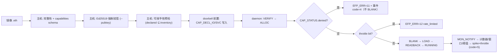

# E2-SEC1 验收报告 — 安全 v1（强制验签 + 能力清单校验 + 异常监控 v1）

- **任务**: E2-SEC1（安全 v1）
- **日期**: 2026-09-11
- **状态**: 主机侧（强制验签 + 能力清单）与 RTL 侧（EMRI v0.6 能力门 + 异常监控）完成并验证；daemon 侧执行门本轮同批落地（见 §1.4）
- **规范**: `ethereal-spec/security/capabilities-v0.md`（新）+ `ethereal-spec/control/emri-v0.md` **v0.6** §3.7/§3.8
- **Plan-Ref**: `ethereal-plan/subsystems/S10-安全子系统.md §3 Phase-2`、`S06-IO重定向.md §2`、`S09-镜像格式与仓库.md:24`
- **决策（2026-09-11，维护者）**: 能力清单 schema = **方案 A（带类型条目）**；异常监控 v1 = **方案 A（RTL/EMRI 实时计数 + 窗口阈值）**

---

## 1. 本阶段实现内容

### 1.1 规范（spec-first）

- ✅ **新增** `ethereal-spec/security/capabilities-v0.md`：`capabilities.yaml` 的 v0 schema
  （`io: [{group, dir}]`、`services: [{name, access}]`）、三段校验语义
  （schema → 可授予性 → 分配绑定）、拒绝语义与工具面。
  粒度与实体单元来自 S06（L1 = 8 引脚一组、L2 = 协议代理实例）与 S04（region ABI IOMAP），
  未新造抽象。
- ✅ **EMRI v0.6**（`emri-v0.md`）：新增能力门寄存器（`CAP_DECL_IO` 0x22 / `CAP_DECL_SVC` 0x23 /
  `CAP_STATUS` 0x24，§3.7）、异常监控寄存器（`MON_RECFG_COUNT` 0x32 / `MON_WDT_COUNT` 0x33 /
  `MON_ANOM_STATUS` 0x34 / `MON_ANOM_WINDOW` 0x35 / `MON_ANOM_THRESH` 0x36 / `MON_NOTIFY` 0x37，§3.8）、
  `EFP_ERR=11 capability_denied` / `12 rate_limited`、事件码 4/5，并**顺带**完成 `OCC_FRAME_ADDR`
  v0.6 重映射（E1-DMO2b，见该报告）。

### 1.2 主机侧（`ethereal-runtime/security/` + `ethereal-tools/`）

| 文件 | 改动 |
|---|---|
| `ethereal-runtime/security/capcheck.py`（**新**） | 严格 schema 解析（未知键/缺键/坏枚举/坏类型/重复条目一律拒绝）、`validate_schema` / `validate_grantable` / `validate_grantable_sim` / `to_emri_bitmaps` / `cap_status_decode|encode`、带条目定位的 `CapabilitySchemaError`/`CapabilityDenied`、sim 清单常量（`SIM_ALLOWED_IO_MASK=0xFF`、`SIM_ALLOWED_SVC_MASK=0xFF`、`SIM_SERVICE_INDEX`）——单一来源 |
| `ethimg.py` | `pack()` 与 `verify()` 均做 schema 校验（`--allow-unsigned` **不**放宽能力校验） |
| `efp_client.py` | `load_image()` 默认强制 Ed25519（原先 EFP 路径**不做**主机侧验签 —— 这是 E2-SEC1 的核心缺口）；`CAP_DECL_*` 在 doorbell 前写入；packed 模型逐列 `OCC_FRAME_ADDR`（v0.6）；`decode_err` 补齐 0–12 |
| `ethctl.py` | `--pubkey`/`--allow-unsigned` 贯通 EFP 路径（含 restart）；能力拒绝打印**具体条目**并 exit 1 |
| `emri_constants.py` | v0.6 偏移/常量/位域 |

### 1.3 RTL 侧（`ethereal-shell/rtl/emri/`）

- **能力门（§3.7）**：`CAP_DECL_IO/SVC` 为纯 RW staging（**不**被 doorbell 清除，否则门永远看到空声明）；
  `CAP_STATUS` 由硬件比较器产生（`[0]` checked 在首个 CAP_DECL 写时锁存，doorbell 清除；
  `[1]` denied = 声明 ⊄ 允许掩码（实时）；`[2]` throttled = 实时；`[15:8]` denied_io = **越权集合**低字节）。
- **异常监控 v1（§3.8）**：4096 时钟/tick 分频 → 窗口计数 vs `MON_ANOM_WINDOW`（0 = 关闭）；
  窗口到期比较增量与 `MON_ANOM_THRESH`，超限置 spike 标志 + 该区 throttle 位 + `code=5` 事件；
  逐区计数器饱和于 0xFFFF；`MON_ANOM_STATUS` W1C 释放；`MON_NOTIFY` 写脉冲驱动计数。
- **事件环仲裁**：v0.4 环只有一个 push 口，硬件事件 push 与总线 push 在 `emri_regfile` 内仲裁
  （总线优先、owed 位粘滞至真正入环、多区最低索引串行）——不新增端口、不改其他模块。
- TB 编写过程中由新 TB 抓出并修复**两个真实 RTL 缺陷**（优先级 case 项互换 → owed 永不清除/环每周期填满；
  事件字字节序反），随后 `tb_mon_anomaly` 步骤 6 证明同拍竞争下环内容正确。

### 1.4 daemon 侧（C 固件，执行门）

- `do_run` / `do_run_packed`：ALLOC 后、BLANK 前读取 `CAP_STATUS`，denied → `EFP_ERR=11`，
  不 BLANK、不改织物；AUTO 分配此时回退为 FREE（拒绝无副作用）。
- throttle：显式 region 在 **ALLOC 前** 检查 `MON_ANOM_STATUS[7:0]`，AUTO 在解析出 region 后检查并回退，
  拒绝 = `EFP_ERR=12`。
- 部署到达 RUNNING 后写 `MON_NOTIFY` 完成位；§3.5 看门狗/心跳事件写事件位（硬件计数）。
- `tb_bmc_daemon.sv` 新增自检阶段：部署后 `MON_RECFG_COUNT` 增量、越权声明被拒（EFP_ERR=11 + 织物不受扰 +
  后续正常部署仍成功）。

### 1.5 验证

- ✅ `.venv/bin/python -m pytest`（ethimg+ethctl+capcheck+frame_map）→ **406 passed**；
  `make test-model` → **2724 passed, 2 xfailed**（新增 27 个 capcheck 用例经 Makefile 的
  `find ethereal-runtime -name 'test_*.py'` 纳入收集）。
- ✅ `make lint` → **all project RTL lint-clean**（含 v0.6 寄存器实现）。
- ✅ iverilog TB：`tb_mon_anomaly`（新）、`tb_emri_regfile`、`tb_emri_occ_loop`、`tb_emri_axi_adapter`、
  `tb_mgmt_hotswap`、`shell_tb_mgmt_packed`、`shell_tb_het_packed` → 全部 `TEST PASSED`。
- ✅ 固件 `cd ethereal-runtime/bmc-fw && make` → `-Wall -Wextra -Werror` 零告警。
- ✅ **daemon 级 Verilator TB**：`tb_bmc_daemon` 新增三阶段全过 ——
  `ok: throttle: region 0 fabric untouched (stays blanked)` 且
  `TEST PASSED: E1-RUN2 daemon — EFP run/restart/stop/abort on real fabric, bad_sig + region_full rejected,`
  `v0.6 cap-gate (11) + anomaly throttle (12) enforced, MON_RECFG_COUNT notified, UART log exact-matched`
  （$finish at 7 s sim / 1198 s wall — Ed25519 主导，与既有 capstone 同量级）。
- ✅ **`tb_bmc_daemon_packed` 回归通过**：`TEST PASSED: E1-RUN2 daemon run_packed — packed TFF deployed
  through OCC_DECODE loop, toggles on real fabric, READBACK CRC ok, bad_sig rejected, per-column stop blank`
  （25 ok checks / 0 FAIL；$finish 3 s sim / 573–581 s wall；独立复现一次 exit=0）。
- ✅ 新 TB 阶段（由 daemon 侧实现并自检）：`MON_RECFG_COUNT == 1`（部署通知）、越权声明 → `EFP_ERR=11`
  且织物不受扰 + 后续部署可恢复（无卡死）、窗口 spike → throttle → 目标区部署 `EFP_ERR=12`
  且该区织物保持 blanked；`tb_bmc_daemon` 共 **61 ok checks / 0 FAIL**。
- ⚠️ 观察（已收口）：RTL 在每次 `EFP_CMD` 写时清 `CAP_STATUS[0]=checked`，故 doorbell 之后 `checked`
  不可观测（daemon 以**实时** `CAP_STATUS[1]=denied` 执行门）。已在 spec §3.7 增设规则 0 明确
  `checked` = **doorbell 前的 staging 指示位**（供主机自查），**执法只用** `denied`/`throttled`；
  RTL/TB 行为不变。

### 1.6 未覆盖 / 明确边界（诚实清单）

- ⚠️ sim 允许掩码（IO 组 0–7 / 服务 0–7）是编译期常量，代替不存在的 Board Manifest 引脚能力表；
  E1-IO3/E2-IO1 落地后替换（规范内已标 ASSUMPTION）。
- ⚠️ `denied_io` 在 sim 掩码下恒为 0（被拒位都在 bit≥8），字段语义按规范实现（越权集合的低字节）——
  更窄的允许掩码（如 0–3 组）才会非零。
- ⚠️ 监控范围 = `NUM_REGIONS`（v0 = 2）；`MON_NOTIFY` 中 region ≥ 2 的位被忽略（规范已补此说明）。
- ⚠️ 窗口/阈值为规范 ASSUMPTION 默认值（0x1000 tick ≈ 160 ms @100 MHz、recfg 16、wdt 8），
  实机 bring-up 时校准。
- ⚠️ mFSM 直连路径 `ethctl.Daemon.deploy(frame_addr=...)` 的 `frame_addr` 仍是**原始配置字地址**
  语义（与 `OCC_CMD.region` 各自独立）；v0.6 下二者需一致 —— 属 E2-DOC1 规范冻结项（报告记录，未静默修改）。
- ❌ region 锁矩阵（S10 §3 Phase-1 项、C03 §5 规格）仍是单 `region_locked_i` 门 + `occ_region_locked_o=0`，
  不属 E2-SEC1 范围（S02/E0-FAB5 线）；EMRI 侧未实现 LKM_* 寄存器。

---

## 2. 下一阶段需要做的内容

- **E1-DMO2c** — 多列 packed 部署端到端回放（≥2 列，真实 daemon 路径），补 v0.6 的端到端证据。
- **E2-SEC1b（候选）** — region 锁矩阵 RTL（S02 §2.3/C03 §5：LOCK_MATRIX 位图 + LKM_STATUS/LKM_CMD）
  与 S08 部署时序联动；当前仅单门 + 硬连线 0。
- **E2-DOC1** — 规范冻结时统一 mFSM `frame_addr` 语义，并把 `capabilities.yaml` 的 Astral 侧复用
  （S13:36 同一份 schema）纳入 E2-AST1。
- **E3-SEC2** — L3 静态检查（环振/非法多驱扫描）接 `E3-SEC2` 原计划。
