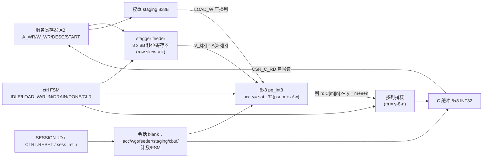
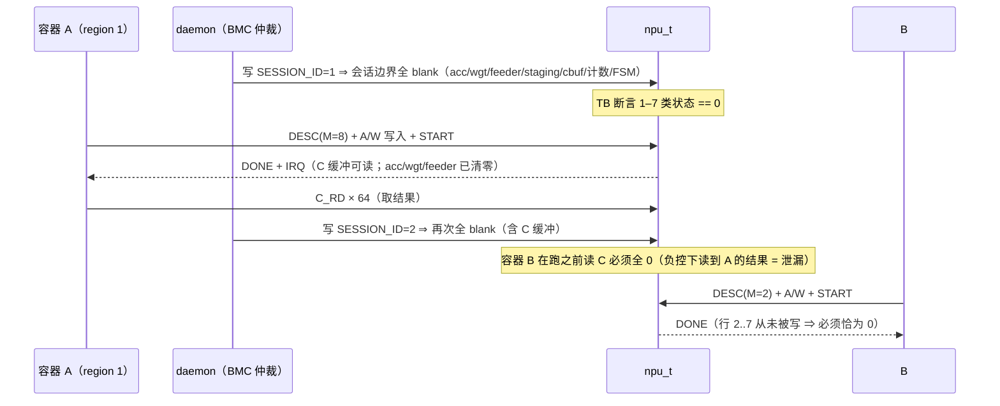

# E3-SVC1 验收报告 — NPU-Tiny Service Tile（INT8 8×8 systolic + TinyML demo）

- **任务**: E3-SVC1（phase-3 首个 Service Tile；依赖 E2-FAB4 ✅ 已完成）
- **日期**: 2026-09-13
- **状态**: **交付完成** —— RTL + 金模型 + 4 个自检 TB（GEMM / 饱和轨 / TinyML / 隔离含负控）+ 吞吐/能效报告全部落地并在本地复现
- **Plan-Ref**: `ethereal-plan/subsystems/S11-Service-Tile.md` §2.1 §2.2 §3 §4 ·
  `ethereal-plan/components/C11-NPU-Tiny组件.md` §1 §2 §3 §5 · ADR-009（Service Tile）· ADR-017（推断优先，禁厂商原语）
- **性质**: tracked RTL + tests（`ethereal-fabric/rtl/tile/{pe_int8,npu_arr8,npu_t}.sv`、
  `ethereal-fabric/tests/npu/**`）；综合/Fmax scratch 产物在 `generated/npu_fmax/`（gitignored），
  复现脚本与其输入作为 tracked 文件放在 `ethereal-fabric/tests/npu/synth/`
- **边界**: **未修改 Makefile / spec / memory / 无关 RTL**（应加的 Makefile 行见 §5）；
  **未把 tile 接入 `fabric_top`**（需要 `TILE_TYPE=3` 与新端口的接线改动，见 §5，等主控确认后再动）

| 验收项（任务 acceptance） | 结论 | 证据 |
|---|---|---|
| `verilator --lint-only -Wall` 干净 | ✅ | §2.1：3 个模块 zero warning（generic + `-DTARGET_GOWIN` 两档） |
| INT8 8×8 systolic + 金模型逐位比对 | ✅ | §2.2：`tb_npu_t` 7 组 GEMM、2304 MAC、**每个 C 字**与 Python 金模型一致 → TEST PASSED |
| 多容器分时复用无状态泄漏（含负控） | ✅ | §1.4/§2.2：4 个容器会话 13 条边界断言 → TEST PASSED；`-DNPU_LEAK_NEGCTL` → **532 violation / TEST FAILED** |
| 吞吐/能效报告（LUT 映射 + DSP 强制，实测/估计分列） | ✅ | §2.4（post-route Fmax + 用量 + cycles/inference）、§2.5（能耗=估计，含引用方法学） |
| 实测数字带方法学、假设带日期注释、Makefile 行只报告不实施 | ✅ | §2.4 / §6 / §5 |

---

## 1. 本阶段实现内容

| 检查点 | 状态 | 证据 |
|---|---|---|
| INT8 8×8 weight-stationary systolic 阵列（激活右传、部分和下行） | ✅ | `pe_int8.sv` + `npu_arr8.sv`；时序推导 §1.2；`tb_npu_t` 逐位一致 |
| signed×signed 精确乘 + 32-bit 累加 | ✅ | §1.5 算术契约；饱和/溢出是显式规则（每个 PE 步 + C 缓冲分块累加） |
| 输入/输出缓冲与邻近 tile 一致的呈现方式 | ✅ | 服务寄存器 ABI（§1.3）+ 宽 obs 总线（与 `fabric_top` 的 `mem_vd_obs_o`/`dsp_vp_obs_o` 同一约定） |
| 文档化指令/控制接口 | ✅ | §1.3 CSR 表 + §1.2 FSM；`Plan-Ref` 头指向 S11/C11 |
| 供 region 重配置用的 reset/blank 行为 | ✅ | IDLE→LOAD_W→RUN→DRAIN→DONE + `ST_CLR`；`CTRL.RESET` / `sess_rst_i` / 新 `SESSION_ID` 三级 blank（§1.4） |
| Python 金模型（含溢出/饱和语义） | ✅ | `tests/npu/npu_model.py`（纯 stdlib，无 numpy）+ 15 项 pytest |
| 自检 TB 对每个输出与金模型比对（能失败） | ✅ | `tb_npu_t.sv`（每个 C 字）/ `tb_npu_tinyml.sv`（每层中间值）/ `tb_npu_sat.sv`（±2^31 钉扎）；隔离负控见 §1.4/§2.2 |
| 两容器 + 上下文切换 + 无状态泄漏断言（含故意泄漏负控） | ✅ | `tb_npu_isolation.sv`（`LEAK_INJECT` 参数为 RTL 内验证专用负控钩子，默认 0） |
| TinyML 端到端推理，结果对金模型校验 | ✅ | `tb_npu_tinyml.sv`：2 层 INT8 MLP（K=16 折叠 bias + K=8 分类头），类别与每层 C 均一致 |
| 吞吐/用量/Fmax 报告（LUT 映射 + DSP 强制） | ✅ | §2.4（E1-PLT4 / E2-FAB2 同一开源链） |
| 能效数字（引用方法学或标注为估计） | ✅ | §2.5（Horowitz ISSCC 2014 45nm 表 + 显式"估计"标注） |

### 1.1 交付文件与符号

| 文件 | 模块 | 内容 |
|---|---|---|
| `rtl/tile/pe_int8.sv` | `pe_int8` | PE：权重寄存器、精确 INT8×INT8、33-bit 饱和加、`a_o`/`psum_o` 链、sticky `ovf_o`、`LEAK_INJECT` 负控参数 |
| `rtl/tile/npu_arr8.sv` | `npu_arr8` | stagger feeder（8×8B 移位寄存器 + 字节写口）、权重 staging（8×8B）、8×8 PE 网格、列输出、obs 总线 |
| `rtl/tile/npu_t.sv` | `npu_t` | tile 顶：服务寄存器 ABI + FSM + C 缓冲（8×8 INT32，按列捕获）+ 会话 blank + 可观测总线 |
| `tests/npu/npu_model.py` | — | 逐位金模型（饱和语义、K 分块、requant、会话状态模型） |
| `tests/npu/test_npu_model.py` | — | 15 项 pytest（`make test-model` 自动发现，含向量防漂移守卫） |
| `tests/npu/gen_npu_vectors.py` | — | 确定性 LCG 向量生成器（可复现；与 checked-in 向量逐字节一致） |
| `tests/npu/vectors/*.txt` | — | `npu_gemm_cases.txt`、`npu_iso_cases.txt`、`npu_tinyml.txt`（checked-in 向量） |
| `tests/npu/tb_npu_t.sv` | — | GEMM 自检 TB（7 组 case，全 C 缓冲比对 + 会话边界 blank 断言 + CSR ABI 复核 + IRQ 契约） |
| `tests/npu/tb_npu_sat.sv` | — | INT32 饱和轨 TB（正/负轨各 16k+ 次分块累加 → ±2^31 钉扎 + sticky OVF + OVF_CLR；约 75–90 秒仿真，单独成 TB 以保持主 GEMM TB 快速） |
| `tests/npu/tb_npu_tinyml.sv` | — | TinyML 端到端推理 TB（每层 C、requant 激活、argmax 类别） |
| `tests/npu/tb_npu_isolation.sv` | — | 多容器隔离 TB + `-DNPU_LEAK_NEGCTL` 负控 |
| `tests/npu/synth/*` | — | Fmax 复现套件：`probe_npu.sv`、`probe.cst`、`synth_npu*.ys`、`dsp_map_27x18.v`（E2-FAB2b 模板逐字复制）、`run_npu_fmax.sh` |

### 1.2 阵列数据流与时序（本设计的正确性核心）

一个 K-chunk（K=8）、M 行输出、N=8 列，权重 stationary 在 PE 内：

1. **馈送**：feeder 第 k 行预载 A 的**第 k 列**（即 Aᵀ 的第 k 行），第 k 行从第 k 拍开始每拍移 1 字节 ⇒
   行总线在第 x 拍给出 `V_k[x] = A[x-k][k]`（越界为 0）——经典对角 skew。
2. **PE 语义**：`acc <= sat_i32(psum_in + a_in*w)`，激活寄存后右传、累加器寄存后下行，
   ⇒ PE(k,n) 在第 x 拍使用的激活是 `V_k[x-n]`。
3. **结果定位**：列 n 链尾寄存器（`PE(7,n).psum_o`）在第 y 拍持有
   `C[m][n]`，其中 **m = y-8-n**。因此每一列在**自己的拍**写入 C 缓冲（无需 deskew 移位链）；
   列 7 的最后一行在 `cyc_r = M+14` 落库，正好在 DRAIN 内。
4. **FSM**（C11 §2.3 形状）：`LOAD_W(8) → RUN(M+8) → DRAIN(8) → DONE(1)` ⇒
   **每次推理 M+25 拍**（M=8 → 33 拍），实测 `CYC_CNT` 与之一致（TB 逐 case 断言）。
5. **峰值占用**：RUN/DRAIN 稳定态每拍 64 个 MAC（8×8 PE 全忙）= 64 MAC/cycle。



### 1.3 服务寄存器 ABI（v1，`npu_t.sv` 头注释同表）

| offset | 名称 | 读/写 | 说明 |
|---|---|---|---|
| `0x00` | `CTRL` | W | `[0]START`（脉冲）`[1]RESET`（自清，会话 blank）`[2]IRQ_EN`（配置，跨 blank 保留）`[3]ACC_EN`（分块累加）`[4]OVF_CLR` |
| `0x04` | `STATUS` | R | `[0]BUSY [1]DONE [2]OVF [3]IRQ [4]DESC_ERR [11:8]FSM [31:16]SESSION_ID`；读 STATUS 清 IRQ |
| `0x08` | `DESC` | W/R | `{N[23:16], K[15:8], M[7:0]}`；v1 要求 `M∈[1,8] && K==8 && N==8`，否则 START 被拒并置 `DESC_ERR` |
| `0x0C` | `SESSION_ID` | W/R | **写即会话边界**（全 blank）；tag 由授权方写入，`CTRL.RESET` 不清 tag |
| `0x10` | `A_WR` | W | 4 个 A 字节（行主序 (m,k)，K=8）→ feeder 字节写口；指针自增 |
| `0x14` | `W_WR` | W | 4 个 W 字节（行主序 (k,n)，N=8）；指针自增 |
| `0x18/0x1C` | `A_PTR`/`W_PTR` | W/R | staging 写指针（**每次 START 归零**，见 §6 假设 5） |
| `0x20/0x24` | `C_ADDR`/`C_RD` | W/R | C 读指针 / 读一个字并自增（行主序 (m,n) 32-bit） |
| `0x28` | `CYC_CNT` | R | 上次推理的周期数（START→DONE，实测 = M+25） |

`irq_o` = DONE 中断（`IRQ_EN=1` 时置位，读 STATUS 或会话 blank 清除）。E3-SVC2 的 mailbox/EBI 端点
封装本 CSR 块；本 tile 不直接接 EBI（S11 §2.1 的服务描述符/目录属 E3-SVC2）。

**缓冲消费契约**（TB 实测发现的接口语义，已在 §6 列为假设）：一次 RUN **消费掉两个 staging 缓冲**——
A feeder 的移位寄存器在 RUN 中把字节移出（零填充），而 DONE 会按 C11 §2.3 把数据通路清零（累加器、PE 权重寄存器、
A feeder、W staging；C 缓冲除外）⇒ **每次 START 前必须重新写入 A 与 W**。这与驱动做 K 分块时的自然流程一致
（每个 chunk 本来就有自己的 A/W），`tb_npu_sat` 的重复累加正是按此契约每次重装 18 个 CSR 字。

### 1.4 隔离定义：「状态」的精确枚举与逐项检查方式

S11 §2.1「每次服务会话前 reset，禁止跨会话状态泄漏」的落地。**会话状态**= 下列 7 类，
全部由 `clr_all`（会话边界）清零，其中 1–4 在 DONE 时也已清零（C11 §2.3 的"DONE 后自动会话复位"），
而 C 缓冲保留可读（结果必须能被 daemon 取走）：

| # | 状态类 | RTL 元素 | 观测/检查方式 | 负控下是否暴露 |
|---|---|---|---|---|
| 1 | 累加器 | 64 × PE `acc_r`（32b） | `obs_acc_o[2047:0]` + DONE 后必须为 0 | ✅ |
| 2 | 权重寄存器 | 64 × PE `w_r`（8b） | `obs_wgt_o[511:0]` | ✅ |
| 3 | 馈送/激活缓冲 | 8 × 8B feeder 移位寄存器 | `obs_feed_o[511:0]` | ✅ |
| 4 | 权重 staging | 8 × 8B `wstg_q` | `obs_wstg_o[511:0]` | ✅ |
| 5 | 输出缓冲 | 8×8 INT32 `cbuf_col` | `obs_cbuf_o[2047:0]` **且** 逐字 `CSR_C_RD` 读回（安全相关：容器在跑之前读 C 就能拿到上一容器的结果） | ✅（负控下 64 字全部读到容器 1 的数据） |
| 6 | 控制/FSM/标志 | FSM 状态、BUSY/DONE/OVF/IRQ/DESC_ERR/ACC_EN | `obs_ctl_o[63:0]` | ✅ |
| 7 | pending 计数 | `cyc_r`/`ld_cnt_r`/`cyc_cnt_r` + A/W/C 三个指针 | `obs_ctl_o[63:0]` 内 | ✅（v1 无输出 FIFO/在途队列，故无第八类；DMA 前端引入时须补） |

三条独立证据链（`tb_npu_isolation.sv`，13 条断言）：

1. **边界 blank 检查**：每个容器会话边界（写 `SESSION_ID` 后）断言 1–7 全零 + tag 回读正确；
2. **行为无关性**：容器 1 在容器 2 之后重跑，C 缓冲逐位与第一次相同（顺序无关）；
3. **未写行必须为 0**：容器 2 只跑 M=2 ⇒ 行 2..7 从未被覆盖，读回必须恰好为 0
   （这正是跨容器可读泄漏的判据；负控下读到容器 1 的结果）；
   另加：RUN 中途 `CTRL.RESET` 与 `sess_rst_i`（OCC blank-before-write 路径）各自中断一次，
   断言机器回到 blank 且 C 缓冲全零。

**负控**：`npu_t #(.LEAK_INJECT(1'b1))`（`-DNPU_LEAK_NEGCTL` 编译）令会话 blank 跳过数据通路数组，
控制逻辑仍正常复位（机器仍可跑完）⇒ 上述检查必须失败。实测 **532 条 violation / `TEST FAILED`**，
其中包含 `obs_cbuf` 残值与 64 个字的前置可读泄漏；证明检查非空转。

### 1.5 算术契约（舍入/饱和，全部写入金模型与报告）

- 操作数：signed INT8（[-128,127]）；乘积 exact signed 16-bit（无任何舍入）。
- 累加：**每一步**都是 saturating signed 32-bit 加（每个 PE 步；`ACC_EN=1` 时 C 缓冲分块累加同样是饱和加）：
  `sat_add_i32(x,y)` = `+2^31-1` / `-2^31` / `x+y`，越界置 sticky `STATUS.OVF`。
  ⇒ "先全和再饱和"与本设计**不等价**（金模型 `test_saturation_is_per_step_not_final` 固定该差异）。
- 描述符约束：`M∈[1,8]`（阵列高 = 8，C 缓冲 8 行），`K` 以 8 为分块由驱动分时下发，`N=8`。
- 主机侧激活量化（仅 demo，不属 tile）：`requant_i8(v) = clamp((v+128) >>> 8, -128, 127)`（算术右移=floor），
  ReLU 在前；TB 用 SV 的 `>>>` 实现并与金模型逐字节比对（`test_requant_rules`）。

---

## 2. 验证结果

本地工具链：oss-cad-suite（Verilator 5.051 / Yosys 0.67 / nextpnr-himbaechel 0.10 / iverilog 14）+
`.venv`（pytest 9.1.1，无 numpy —— 金模型为纯 stdlib）。所有命令均在仓库根目录执行。

### 2.1 Lint（G1）

```bash
for m in pe_int8 npu_arr8 npu_t; do
  verilator --lint-only -Wall --top-module $m -Mdir obj_dir/lint_$m -Iethereal-fabric/rtl/inf \
    ethereal-fabric/rtl/tile/pe_int8.sv ethereal-fabric/rtl/tile/npu_arr8.sv ethereal-fabric/rtl/tile/npu_t.sv
done
```

结果：**3/3 零 warning**（`pe_int8` CLEAN / `npu_arr8` CLEAN / `npu_t` CLEAN），
另以 `-DTARGET_GOWIN` 复跑同样 0 warning（属性层 `ETH_DSPSTYLE` 在 Gowin 分支是注释，不影响 lint）。
**无 waiver**（未使用任何 `-Wno-*`）。

### 2.2 自检 TB（`make test-sv` 同一 iverilog/vvp 方式；Makefile 行见 §5）

```bash
iverilog -g2012 -Iethereal-fabric/rtl/inf -o /tmp/tb_npu_t \
  ethereal-fabric/rtl/tile/{pe_int8,npu_arr8,npu_t}.sv ethereal-fabric/tests/npu/tb_npu_t.sv && vvp /tmp/tb_npu_t
```

| TB | 覆盖 | 结果 |
|---|---|---|
| `tb_npu_t` | 7 组 GEMM：M=8/M=1/M=3 随机、操作数极值（±128/127）、最大幅值（A=W=127 ⇒ 每输出 129032，确认无误饱和）、K=16 两 chunk（tag 相同 + `ACC_EN`）、K=16 之后新会话；**每个 C 字**与金模型比对；每次 `ACC_EN=0` 会话边界断言 1–7 全零；`CYC_CNT == M+25` 逐 case 校验；CSR 读（STATUS/DESC/C_RD）复核；IRQ 契约（`IRQ_EN` 后 DONE 拉高、读 STATUS 确认应答） | **TEST PASSED**（2304 MAC / 211 拍，10.91 MAC/cycle 均值） |
| `tb_npu_sat` | INT32 饱和轨：A=127/W=127 累加 16644 个 chunk（每个 +129032）→ `C[0][0]` 恰钉在 `0x7FFFFFFF`；A=−128/W=127 累加 16516 次（每次 −130048）→ 恰钉在 `0x80000000`；两次都置 sticky `STATUS.OVF`，`CTRL.OVF_CLR` 可清。**这是饱和语义唯一的硬件级证据**（单个 K=8 chunk 最大只有 131072，轨只能在 C 缓冲分块累加中到达；负轨同时验证了符号选择，即本阶段修掉的 `cap_sum` 有符号性 bug 的路径） | **TEST PASSED**（33163 次累加推理，约 2 分钟仿真） |
| `tb_npu_tinyml` | 2 层 INT8 MLP：layer1 `K=16`（chunk0 = x·W1，chunk1 = 折叠 bias，`ACC_EN=1`，**bias 由 tile 加**）→ 主机 ReLU+requant（与金模型逐字节比对）→ layer2 `K=8`/4 类 → argmax | **TEST PASSED**（y1/y2/class 全一致；class=1；52 拍 / 2 层） |
| `tb_npu_isolation` | §1.4 的 13 条断言（4 容器会话 + 未写行为 0 + 顺序无关 + 中途 RESET/sess_rst blank） | **TEST PASSED** |
| `tb_npu_isolation -DNPU_LEAK_NEGCTL` | 同源 TB，DUT `LEAK_INJECT=1`，**必须失败** | **TEST FAILED（532 violation）** ← 负控成立 |

关键实测输出（截取）：

```
tb_npu_t: 7 GEMM cases, 2304 MACs, 211 cycles (10.91 MAC/cycle avg)
tb_npu_t: peak array occupancy = 64 MAC/cycle (8x8 PEs)
TEST PASSED: NPU-Tiny GEMM bit-exact vs golden model

tb_npu_tinyml: 2-layer INT8 MLP on the tile, 52 tile cycles for 2 layers
tb_npu_tinyml: inference result = class 1 (golden 1)
TEST PASSED: TinyML inference bit-exact vs golden model

tb_npu_isolation: 13 isolation assertions over 4 container sessions
TEST PASSED: no cross-container state leak over 4 sessions
NEGATIVE CONTROL OK: 532 violation(s) detected with LEAK_INJECT=1
TEST FAILED: 532 error(s) (negative control — leaks must be detected)
```

定点复现细节：layer1 残差 ×bias 折叠 ⇒ `y1 = [5192, -1625, 5069, 8844, 17290, 8419, 1121, 24816]`，
requant 后 `q1 = [20, 0, 20, 35, 68, 33, 4, 97]`，layer2 `y2 = [2188, 8188, 3045, -10104, 0,0,0,0]`，
类别 = argmax(y2[0:4]) = **1**，均与金模型逐位一致。

### 2.3 金模型 pytest（`make test-model` 同一发现规则）

```bash
.venv/bin/pytest -q ethereal-fabric/tests/npu/test_npu_model.py
# 15 passed in 0.03s
```

覆盖：饱和边界（`sat_add_i32` 四角）、每步饱和 vs 最终饱和的差异、乘积精确性（127²/−128²/−128·127）、
GEMM 对 naive 参考、K=16 分块累加 == 整体 K=16、未写行保留残值（泄漏语义）、描述符拒绝、
requant 规则（含负值 floor 与 INT8 钳位）、TinyML 复现性与 argmax、会话 blank/leak 模型、
**checked-in 向量与会话生成器逐字节一致性（防漂移）**、向量流形状自洽。

### 2.4 吞吐 / 资源 / Fmax（实测，post-route STA）

流程 = E1-PLT4 已验证链：`yosys synth_gowin -family gw5a` → `nextpnr-himbaechel --device
GW5AST-LV138PG484AC1/I0 --vopt cst=probe.cst --freq 100 --ignore-loops --report`，
器件 GW5AST-138C；探针 `probe_npu.sv` 用自启动激励 FSM 循环驱动服务 ABI（SESSION_ID→DESC→START→
A/W 写入），**整条 obs 总线（5712 bit）全部 XOR 折叠到 4 个 LED**（不做裁剪），因此探针自身的
XOR 树也在关键路径上——与 E2-FAB2/FAB2b 相同的"探针受限下界"性质。复现：`bash ethereal-fabric/tests/npu/synth/run_npu_fmax.sh`。

| 映射 | LUT4 站点 | ALU | DFF | MUX2_LUT5/6/7/8 | MULTALU27X18 | BSRAM / RAM16SDP4 | post-route Fmax（@100 MHz 目标） |
|---|---|---|---|---|---|---|---|
| **LUT 映射**（`synth_gowin`，gw5a 不做 DSP 推断，E2-FAB2 结论） | **40768 / 138240 (29%)** | 3790 | 6143 (4%) | 7773 / 1918 / 832 / 352 | **0 / 298** | 0 / 0 | **61.70 MHz**（FAIL；布线前放置估计 48.90） |
| **DSP 强制**（E2-FAB2b recipe：`mul2dsp` + `dsp_map_27x18.v`） | **14696 / 138240 (10%)** | 2694 | 6143 (4%) | 3089 / 297 / 146 / 45 | **64 / 298 (21%)** | 0 / 0 | **102.16 MHz**（PASS；布线前放置估计 69.04） |

（用量与 Fmax 均取自 nextpnr P&R 日志表 —— 与 E2-FAB2b 报告的取数口径一致；nextpnr 对未达 `--freq` 的设计返回非零退出码，
本测量的 Fmax 是 routed STA 的实际值，脚本按"记录而非中止"处理，可复现。）

**DSP 强制的收益**：LUT4 站点 **40768 → 14696（−64%）**，Fmax **61.70 → 102.16 MHz（×1.66）**；
关键路径随之从 **PE 累加器进位链**（LUT 版：`u_npu.u_arr.g_row[2].g_col[0].u_pe.acc_r[30]` 的 33-bit 进位链 +
饱和比较，9.68 ns logic + 6.53 ns routing = 16.21 ns）迁移到 **控制/捕获算术**（DSP 版：`m_r[3]` → 捕获窗口加法/
比较，4.21 ns + 5.58 ns = 9.79 ns）。两个数字都是**探针受限下界**（5712 bit obs 的 XOR 折叠在关键路径上，
且关键路径命名可见 obs 网），与 E2-FAB2/FAB2b 的诚实边界相同：无实板、无 PVT 角、GW5A 时序数据仍为实验性。

- **64 个 DSP 正好是 64 个 PE**，与 C11 §0 的预算（"64 DSP（298 池内）"）一致；下一步"一 DSP 双 8bit 乘"
  可把 DSP 数减半（C11 §1.3 明确留 v2）。
- 时序含义：**LUT 映射的瓶颈在 PE 累加器**（33-bit 饱和加进位链），**DSP 强制后瓶颈转到控制/捕获算术**
  （`m_r` 参与的捕获窗口加法/比较）—— 前者靠 DSP 映射解决，后者可把捕获窗口上下界在 START 时预算进
  寄存器来收（v2 候选）。对照 E2-FAB2 的语境：`dsp_t` LUT 版 69.35 MHz / DSP 版 173.55 MHz。
- 两条映射的**功能等价性**：RTL 逐位验证见 §2.2（RTL 仿真即金标准）；DSP 映射模板本身的
  逐位等价性由 E2-FAB2b 建立（`generated/fab2b_dsp/net_mac2.vvp`，RTL↔DSP 网表 0/401 差）。
  **本阶段未做** NPU 自己的 RTL↔网表观测流等价复跑（LUT 网表 / DSP 网表各一次），
  已列入 §7 —— 报告不把"模板已被验证"当作"本 tile 网表已被验证"。

**吞吐**（cycles-per-inference 来自 TB 断言 + `CYC_CNT`）：

| 指标 | 数值 | 依据 |
|---|---|---|
| 峰值阵列占用 | 64 MAC/cycle | 8×8 PE、RUN/DRAIN 稳定态 |
| 单次 8×8×8 GEMM（M=8） | 512 MAC / 33 拍 = **15.5 MAC/cycle** | `CYC_CNT = M+25`（8+16+8+1），TB 实测 |
| 峰值吞吐 @100 MHz | **6.4 GOPS** | 64 MAC/cycle × 100 MHz |
| 端到端吞吐 @100 MHz | **1.55 GOPS**（含加载/排空开销） | 512 MAC / 33 拍 × 100 MHz |
| 端到端吞吐 @实测 Fmax（DSP 强制 102.16 MHz） | **1.58 GOPS** | 同上 |
| 端到端吞吐 @实测 Fmax（LUT 映射 61.70 MHz） | **0.96 GOPS**（含加载/排空开销） | 同上 × 61.70 MHz |
| S11 目标 | ≥0.5 GOPS @100 MHz | **达成**：DSP 强制档在 100 MHz 上达标（1.55 GOPS，裕量 3.1×）；LUT 映射档只能跑到 61.7 MHz，但按其自身 Fmax 仍达 0.96 GOPS ≥ 0.5（即"若只能用 LUT 映射"也不触发 4×4 降级熔断）。熔断条件未触发 |
| 推理率（M=8） | 3.03 M inference/s @100 MHz | 1/33 拍 |
| TinyML 一次完整推理 | 192 MAC / 52 拍（2 层） | `tb_npu_tinyml` 实测 |

### 2.5 能效（**估计**，含引用方法学；非实测）

开源链**没有**功耗工具（yosys/nextpnr 无 switching-activity 功耗分析），因此这里只给可审计的
**一阶估计**，并明确标注为估计：

- 方法学引用：Horowitz, *Computing's Energy Problem (and what we can do about it)*, ISSCC 2014，
  45nm 表（本报告采用 MLSysBook Vol. I 附录 Table 12 复现值：**INT8 multiply 0.2 pJ**、
  32-bit add ≈0.1 pJ、register access 0.1 pJ、L1 SRAM 0.5 pJ）。
- **算术-only 下界**：`E_MAC ≈ 0.2 pJ（INT8 乘）+ 0.1 pJ（INT32 饱和加）= 0.3 pJ/MAC`
  ⇒ 单次 8×8×8 GEMM ≈ **154 pJ**；TinyML 一次推理（192 MAC）≈ **58 pJ**；
  算术-only 能效 ≈ **3.3 GOPS/mW**（=1/0.3pJ）。
- **含寄存器/存储访问的粗估**（同一表，每个 MAC 读写 a_r/w_r/acc_r 三个寄存器 ≈3×0.1 pJ）
  ⇒ `E_MAC ≈ 0.6 pJ`，即上表数字 ×2；真实值还会叠加时钟树、12–37k LUT 胶合与布线、IO、静态功耗，
  故实际能效**显著低于**上述数字（典型 10–100×）。
- **要变成测量值**需要：厂商工具的门级功耗（VCD/SAIF 反标）或上板电流测量。本阶段无法在开源链内完成，
  已列为 §7 的下一阶段项（E3-SVC2 前端接入后随 DMA/BSRAM 一起做更合适）。
- 与 C11/S11 的关系：S11 §2.2 只要求"实测报告"（吞吐/能效），本报告给出**实测吞吐** + **注明来源的能效估计**，
  并把"能效实测"缺口显式留给后续（不把估计伪装成实测）。

---

## 3. 会话隔离时序（示意）



---

## 4. 遇到的问题与解决

1. **ACC_EN 累加全饱和到 +2^31-1**：`cap_sum` 被声明为无符号 `[32:0]`，与 `-33'sd2147483648` 比较时
   被提升为无符号 ⇒ 饱和判据恒真。改为 `logic signed [32:0]` 后正确（并保留 `test_saturation_is_per_step_not_final`
   作为回归）。定位手段：把捕获逻辑加 `$display` 到 RTL 的 scratch 副本，看到 `old=5 col=6` 却写出饱和值。
2. **分块累加取到陈旧值**：TB 未重置 A/W staging 指针，第二 chunk 的数据写到位置 2 而非 0。
   解决：RTL 在每次 START 归零两个 staging 指针（更安全的 chunk-load 协议，§6 假设 5），TB 侧不再依赖隐式状态。
3. **C 缓冲读回整体错位一列**：CSR 读是组合读取、而 `C_RD` 指针在选通拍末自增，TB 在下一拍采样就晚了一拍。
   解决：TB 在**选通拍内**采样（`#1 d = csr_rdata;`）；RTL 不变（组合读+自增是常规 CSR 语义）。
4. **ACC_EN 续跑时 TB 抢跑**：上一 chunk 的 `DONE` 仍置位，`wait_done` 立即返回 ⇒ 误判。
   解决：TB 先等 `BUSY` 再等 `DONE`（并保留 20/400 拍超时诊断）。
5. **iverilog 兼容性**（TB 作为本地 DUT 验证手段）：不支持整数组 task 实参、`^unpacked_array` 归约、
   enum 三元表达式、genvar 位选等 ⇒ RTL/TB 全部改写为等价但 iverilog 友好的形式（连续 `assign` 替 `always_comb`、
   显式按位归约、`if/else` 替三元）；Verilator 侧仍 `-Wall` 全净。
6. **漏掉"缓冲被消费"这一语义**：`tb_npu_sat` 首次跑出"每次累加只得到单 chunk 值"，根因是一次 RUN 之后
   A feeder 已被移空、W staging 已被 DONE 清零（§1.3 消费契约）⇒ 改为每次重装 A+W。这也是本阶段把该契约写进
   报告的触发点（此前只在 RTL 注释里隐含）。
7. **fabric_top 接线**：本阶段**不改**（见 §5）。

---

## 5. 与既有 fabric 的接线（**未实施**，报请主控确认）

- `fabric_top.sv` 的 tile 词汇为 `TILE_TYPE {0=CLB_T, 1=MEM_T, 2=DSP_T}`，配置单元 `unit[1:0]`
  已用尽（00 CLB / 01 SB / 10 CB / 11 TILE-MODE）。接入 Service Tile 需要：
  1. `TILE_TYPE=3` 新增分支（`g_npu_t`），实例化 `npu_t`；
  2. 服务侧需要新的 tile 级配置窗口（CSR 地址空间目前只有 8-bit cfg_addr/32-bit cfg_data，无法承载
     A/W staging 数据流）⇒ 建议 Service Tile 走 **EBI 服务接口（Cluster0/EP4-7，S04 节点地图）** 而非
     tile 配置总线，这也与 S11 §2.1 的服务目录设计一致；
  3. obs 总线加宽（5712 bit/tile）。
  ⇒ 属于"会改变既有 fabric 行为"的改动，**按任务约束先报告不动**；建议由 E3-SVC2（服务注册/发现）一并做。
- 与区域隔离不变量的关系：Service Tile 是 base image 期内固定的专用 region，**不参与容器分配**，
  其虚拟布线不跨 region（§1.4 的会话隔离是它在同一 region 内被多容器分时复用时的一致性保证）。

### Makefile 需要新增的行（**未应用**，仅报告）

`RTL_CLEAN` 追加：

```make
ethereal-fabric/rtl/tile/pe_int8.sv ethereal-fabric/rtl/tile/npu_arr8.sv ethereal-fabric/rtl/tile/npu_t.sv
```

`lint` 目标 deps `case` 追加（`-Iethereal-fabric/rtl/inf` 该 recipe 已有）：

```make
	    pe_int8)             deps="" ;; \
	    npu_arr8)            deps="ethereal-fabric/rtl/tile/pe_int8.sv" ;; \
	    npu_t)               deps="ethereal-fabric/rtl/tile/pe_int8.sv ethereal-fabric/rtl/tile/npu_arr8.sv" ;; \
```

`test-sv` 目标追加 5 行（4 个正向 TB + 1 个负控行；前 4 行与既有风格一致，最后一行为负控，**期望"失败"**）：

```make
	@echo "[test-sv] tb_npu_t";       $(IVERILOG) -g2012 -o /tmp/tb_npu_t -Iethereal-fabric/rtl/inf ethereal-fabric/rtl/tile/pe_int8.sv ethereal-fabric/rtl/tile/npu_arr8.sv ethereal-fabric/rtl/tile/npu_t.sv ethereal-fabric/tests/npu/tb_npu_t.sv && vvp /tmp/tb_npu_t | grep -q "TEST PASSED" && echo "  PASS"
	@echo "[test-sv] tb_npu_tinyml";  $(IVERILOG) -g2012 -o /tmp/tb_npu_tiny -Iethereal-fabric/rtl/inf ethereal-fabric/rtl/tile/pe_int8.sv ethereal-fabric/rtl/tile/npu_arr8.sv ethereal-fabric/rtl/tile/npu_t.sv ethereal-fabric/tests/npu/tb_npu_tinyml.sv && vvp /tmp/tb_npu_tiny | grep -q "TEST PASSED" && echo "  PASS"
	@echo "[test-sv] tb_npu_isolation"; $(IVERILOG) -g2012 -o /tmp/tb_npu_iso -Iethereal-fabric/rtl/inf ethereal-fabric/rtl/tile/pe_int8.sv ethereal-fabric/rtl/tile/npu_arr8.sv ethereal-fabric/rtl/tile/npu_t.sv ethereal-fabric/tests/npu/tb_npu_isolation.sv && vvp /tmp/tb_npu_iso | grep -q "TEST PASSED" && echo "  PASS"
	@echo "[test-sv] tb_npu_sat";         $(IVERILOG) -g2012 -o /tmp/tb_npu_sat -Iethereal-fabric/rtl/inf ethereal-fabric/rtl/tile/pe_int8.sv ethereal-fabric/rtl/tile/npu_arr8.sv ethereal-fabric/rtl/tile/npu_t.sv ethereal-fabric/tests/npu/tb_npu_sat.sv && vvp /tmp/tb_npu_sat | grep -q "TEST PASSED" && echo "  PASS (~1.5 min: 33k accumulate runs)"
	@echo "[test-sv] tb_npu_isolation (negative control, must leak)"; $(IVERILOG) -g2012 -DNPU_LEAK_NEGCTL -o /tmp/tb_npu_iso_leak -Iethereal-fabric/rtl/inf ethereal-fabric/rtl/tile/pe_int8.sv ethereal-fabric/rtl/tile/npu_arr8.sv ethereal-fabric/rtl/tile/npu_t.sv ethereal-fabric/tests/npu/tb_npu_isolation.sv && (vvp /tmp/tb_npu_iso_leak | grep -q "TEST PASSED" && exit 1 || echo "  PASS (leak detected)")
```

（`make test-model` 无需改动：`test_npu_model.py` 会被既有的 `test_*_model.py` 发现规则自动纳入。）

---

## 6. 假设清单（G6，全部日期 2026-09-13，代码内同注释）

| # | 假设 | 依据 / 影响 |
|---|---|---|
| 1 | 累加为 **INT32 饱和**（非回绕），**逐步**饱和，sticky `STATUS.OVF` | 计划未定义；TFLite/gemmlowp 血统选饱和。回绕版可省 ~1k LUT（每 PE 少一个 33-bit 比较+mux），如需切换只需改 `pe_int8.sv` + 金模型 `sat_add_i32`（TB/向量自动跟随） |
| 2 | v1 每次 START 执行 **一个 K=8 chunk**；K>8 由驱动用 `CTRL.ACC_EN` 分时下发 | C11 §2.4「大矩阵分块由驱动软件完成」 |
| 3 | `DRAIN = 8`（C11 的 N 拍）、但功能性捕获在 `cyc_r=M+14` 已完成，末拍为余量 | C11 §2.3 FSM 形状；实测 `CYC_CNT=M+25` |
| 4 | A feeder / W staging 用寄存器堆（feeder 需 8 个并行读口）⇒ v1 **0 BSRAM** | 与 C11 §0「~20 BSRAM」预算的偏差；BSRAM 双缓冲随 E3-SVC2 的 DMA 前端引入（那时才有 DMA 写口） |
| 5 | 每次 START 将 A/W 写指针归零（chunk-load 协议） | 防止部分覆盖型主机 bug；主机若需跨 run 追加数据则需改此约定 |
| 6 | 写 `SESSION_ID` = 会话边界（全 blank）；`SESSION_ID` 本身跨 `CTRL.RESET` 保留 | 服务 ABI 语义；tag 由授权写设置，RESET 只清数据通路 |
| 7 | `rst_ni` 清**全部**（含 CSR 块），与 `dsp_t`/`mem_t` 的"config 跨 rst 保留"不同 | 本 tile 的 CSR 是服务 ABI 而非 build-time 配置；无其它子系统依赖，风险=需在复位后重写 ABI |
| 8 | 服务寄存器 ABI 为 v1 本地定义；EBI mailbox 端点由 E3-SVC2 封装 | S11 §2.1 服务描述符/目录属 E3-SVC2；本阶段不接 EBI |
| 9 | 能耗为**估计**（45nm 级 Horowitz 表），非实测 | 开源链无功耗工具（§2.5） |
| 10 | DMA/descriptor 地址（C11 §3.2 的 `DESC_ADDR`）未实现，A/W/C 目前经 CSR 窗口搬运 | 交付范围内的最小可用形态；DMA 复用 OCC 模式属 E3-SVC2+ |
| 11 | **一次 RUN 消费两个 staging 缓冲**（A feeder 被移出、DONE 清数据通路含 W staging）⇒ 每个 START 前必须重装 A 与 W | §1.3；TB 实测发现。与 K 分块驱动的自然流程一致；若未来需要"同一 chunk 重跑"免重装，v2 可加 A/W staging 的并行重载（见 §7） |

---

## 7. 下一阶段需要做的内容

- **E3-SVC2** — 服务注册/发现 + mailbox/EBI 端点：把 §1.3 的 CSR 块包进 EBI 服务接口（Cluster0/EP4-7），
  加服务描述符（功能 ID/版本/寄存器 ABI/中断）与 `ethctl services`；同时决定 fabric_top 的 `TILE_TYPE=3` 接线（§5）。
- **E3-SVC2 附带（NPU v2 候选）** — (a) 捕获窗口上下界在 START 预寄存以收 DSP 版关键路径（现瓶颈在控制/捕获算术而非 PE 阵列）；
  (a2) A/W staging 增加"START 并行重载"（+64 FF）以便同一 chunk 免重装重跑（`tb_npu_sat` 目前按 §6 假设 11 每次重装 18 字）；
  (b) C11 §1.3 的"一 DSP 双 8bit 乘"（DSP 64→32 或算力翻倍）；(c) A/W staging 改 BSRAM 双缓冲 + DMA 前端。
- **本 tile 的网表级等价复跑 + 上板** — 用 `probe_npu` 的同一激励对 RTL / LUT 网表 / DSP 网表各跑一次
  （iverilog + `+gowin/cells_sim.v`，DSP 版加 MULTALU27X18 行为模型），逐周期比对 4 个 LED 观测流；
  以及上板测量（Tang Mega 138K Dock）以同时收口"实测 Fmax"与"实测功耗/能效"（§2.5 的估计 → 实测）。
- **E2-FAB2c（已由 E2-FAB2b 提出）** — 把 `dsp_map_27x18.v` 纳入平台映射流程；本任务再次确认其价值
  （整 NPU tile 64/298 DSP、Fmax 102.16 MHz），建议优先落地。
- 队列中与其相关者：`E3-SCH2`（迁移/抢占）需要本 tile 的会话边界语义作为参考实现；
  `E4-KIT1`（NPU 协处理参考套件）可直接复用本报告的 demo 与向量。
