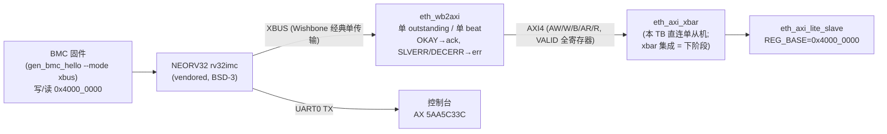

# 报告：P1 BMC XBUS→AXI4 桥（ADR-018 BMC 集成）— eth_wb2axi + 端到端验证

> 任务：ADR-018 BMC 集成 — BMC 成为自研 `eth_axi` 互联上的一等 AXI4 主控
> 日期：实现 2026-08-08 · 验证/加固/提交 2026-08-30
> Plan-Ref：`ethereal-spec/control/eth-axi-v0.md` §3；`docs/adr/ADR-018-axi-noc-riscv-cluster.md`（BMC = AXI master）；`ethereal-plan/components/C05-BMC组件.md` §1（ADR-016 可换核）

## 本阶段实现内容

### ✅ 自研 Wishbone→AXI4 桥 `eth_wb2axi`（`ethereal-shell/rtl/axi/eth_wb2axi.sv`，CERN-OHL-S-2.0）

- 把 NEORV32 的 XBUS（经典单传输 Wishbone 主：cyc/stb/ack）转为 AXI4-Lite 主。上游 NEORV32 `xbus2axi4_bridge.vhd` 为第三方代码，按 ADR-018 自研原则**有意不用**。
- 模型 = **单 outstanding、单 beat**（BMC 是管理核而非带宽引擎；NEORV32 XBUS 一次只发一个经典传输）：写 = 捕获 {adr,dat,sel} 后同驱 AW+W，等 B 完成；读 = 捕获 {adr,sel} 后驱 AR，等 R 完成。
- 错误映射：AXI OKAY→WB ack；SLVERR/DECERR→WB err。cti/tag 直通忽略（v0 永不发 burst，AXI4-Lite 子集隐含 AxLEN=0）。
- G1 合规：`typedef enum` 两段式 FSM；**AXI VALID 全寄存器**（spec §2 规则 1：WB 输入到 AXI VALID 无组合路径）；iverilog 兼容（扁平端口、无 SV interface、无打包二维参数）。

### ✅ `bmc_core` 升级（`ethereal-shell/rtl/bmc/bmc_core.sv`）

- 使能 XBUS，实例化 `eth_wb2axi`，把 AXI4 主通道（AW/W/B/AR/R）暴露为端口供 SoC/xbar 消费。
- XBUS = NEORV32 的"虚空"：凡落在 IMEM(0x0000_0000)/DMEM(0x8000_0000)/IO(0xFFE0_0000+) 之外的访问都路由到 XBUS；固件目标窗 0x4000_0000 安全避开所有内部区。

### ✅ 固件生成器 `--mode xbus`（`ethereal-tools/tools/gen_bmc_hello.py`）

- 新镜像：写 0x5AA5C33C 到 XBUS 窗 0x4000_0000 → 读回 → UART0 打印 `AX 5AA5C33C\n`（8 位大写 hex，MSB 先行）。
- 纯 RV32I 指令级生成（LUI+ADDI 32 位常量加载含进位修正；BLT/JAL 十六进制打印例程），无编译器依赖。ruff 干净。

### ✅ 两个测试台（`ethereal-fabric/tests/`）

- `bmc/tb_bmc_axi_master.sv`：**端到端**——vendored NEORV32（XBUS 使能）→ eth_wb2axi → `eth_axi_lite_slave`（REG_BASE=0x4000_0000）。自检：从机窗观察到写 + UART 字节流精确匹配 `AX 5AA5C33C\n`。
- `axi/tb_eth_wb2axi.sv`：**桥级定向 TB**（本报告验证阶段新增），带**可编程延迟的 AXI 从机模型**（B 滞后 3 拍 / R 滞后 2 拍）：① 延迟-B 写且 ack 不得先于 B；② 紧接第二个写必须完成（证明无悬挂 B 卡死）；③ 延迟-R 读数据正确；④ SLVERR→wb_err_o。

### ✅ vendored 核重新生成（`neorv32_verilog_wrapper.v`，BSD-3）

- GHDL 转换的 NEORV32 网表以 XBUS 使能重新生成（rv32imc + IMEM 16KB ROM-boot + DMEM 16KB + UART0 + XBUS）。
- ⚠️ 再生导致 ROM 后门数组改名 `n6830→n6964`（GHDL 节点重编号），`tb_bmc_hello`/`tb_bmc_axi_master` 的 `$readmemh` 路径已同步更新——**任何再次再生都必须同步**（TB 注释已注明）。

## 关键正确性修复（2026-08-30 个人验证阶段捕获）

- **`eth_wb2axi` 提前应答 bug（真 bug，潜伏）**：原 `S_WDATA` 次态逻辑在 **AW 和 W 握手完成即转 S_RESP**（`if (aw_done && w_done)`），不等 B。AXI 允许从机在 AW/W 接受后任意拍才发 B；此时桥会在 S_RESP 提前脉冲 wb_ack、`bready` 已拉低导致 **B 永远不被消费**——从机写通道悬挂，**下一个写将卡死**。现有 `eth_axi_lite_slave` B 响应快才未暴露。修复：仅在 `m_axi_bvalid` 时转移（B 蕴含 AW&W 已被接受）。**阴性测试证明**：把旧逻辑注入临时副本，新 TB 立即报 `ack before B` + 后续写超时；修复后全过。
- **Makefile 接线缺口**：`tb_bmc_axi_master`/`eth_wb2axi` 未接入任何目标；`bmc_core` lint 依赖缺 `eth_wb2axi.sv`（lint 在 MODMISSING 处失败）。已补齐：RTL_CLEAN + lint deps + `test-sv` 三条新行（含 `gen_bmc_hello --mode xbus` 生成 `generated/bmc/bmc_axi.hex`——TB 读取的文件名与生成器默认输出不一致，已统一）。
- **预存量 Makefile shellcheck 误报**：`help` 目标里 `$(if ...)` 回退文本以 `<` 开头被 shellcheck 当重定向（SC1073），且 make 条件指令 `ifeq` 本非 shell。改为直接 `$(RTL_CLEAN)`（顺带修正：原 `RTL_FILES` 变量已不存在，回退文本永不打印属陈旧信息）；`.pi-lens.json` 新增 `ignore: ["Makefile"]`（Makefile 由 `make` 自身与 CI 验证），4 条缓存误报已按 false-positive 处置。

## 验证结果

| 检查 | 结果 |
| --- | --- |
| `make lint`（verilator -Wall，本地 OSS-CAD 5.051） | ✅ OK — 全项目 RTL lint-clean（含 eth_wb2axi / bmc_core+网表） |
| `make test-sv`（iverilog 14/vvp） | ✅ **22 个自测 TB 全过**（20 + tb_bmc_axi_master + tb_eth_wb2axi） |
| `make test-model`（pytest 黄金模型） | ✅ **2639 passed, 3 xfailed**（无回归） |
| `ruff check`（改动的 Python） | ✅ All checks passed |
| `make formal` | 未新增（skidbuf 证明保持；wb2axi 形式化列入下阶段） |
| mypy --strict | ⚠️ 本地 venv 未安装 mypy（G1 工具链缺口，见待确认清单） |

## 链路图（BMC = AXI 主控）

## 待确认 / ASSUMPTION 清单（G6）

- `// ASSUMPTION: ROM 后门数组名 n6964 随网表再生而变（GHDL 重编号）——再生即同步两个 TB（2026-08-08 已发生一次）`。
- `// ASSUMPTION: XBUS cti=000 恒为经典单传输（v0 不发 burst）——桥按单 beat 设计；若未来 NEORV32 配置改发 burst 需扩展桥（TBD, 2026-08-08）`。
- TB 中 BMC 直连单个 `eth_axi_lite_slave`；**经 xbar 的地址译码路径未覆盖**（tb_axi_xbar 单独覆盖 xbar）。
- mypy 本地缺失：G1 规定 Python 过 `ruff + mypy --strict`，本地 venv 只有 ruff/pytest——是否纳入 sim Docker 镜像统一执行？（待维护者确认）

## 下一阶段需要做的内容

- **BMC→xbar 集成 TB**：BMC 经 `eth_axi_xbar` 访问多从机（EMRI regfile + 配置口），替换 host 直驱路径（E1-BMC1 收尾 → E1-RUN2 真主机）。
- **`eth_wb2axi` 形式化**：sby 证明 VALID 稳定 / ack-仅在-B 后 / 无悬挂 B（沿用 skidbuf 的 `ifdef FORMAL` 模式 + `make formal`）。
- **AXI NI 适配器（AXI↔mailbox NoC）**：region 数据面接 AXI（RFC-002 更新）。
- **xbar v0.1**：完整 AXI4 burst（INCR/WRAP）、ATOP 原子（SMP Linux 前置）。
- **`eth_rv`（Phase B）**：自研 RV64IMC 顺序核，跑在 eth_axi 上，DiffTest vs Spike。
- **E1-BMC2**：bmc-fw 框架（当前固件为生成式 hello，非框架）。
