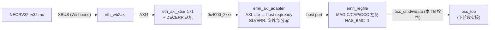

# 报告：P1 BMC→EMRI 管理面贯通（ADR-018 BMC 集成 III）— emri_axi_adapter + 全链路 TB

> 任务：ADR-018 BMC 集成 III — BMC 经自研 AXI 互联读写 EMRI 管理寄存器面（report-P1-bmc-xbar-integration-20260830.md 的"下一阶段"第一项）
> 日期：2026-08-30
> Plan-Ref：`ethereal-spec/control/emri-v0.md` §2/§3（寄存器表 + host 端口）；`ethereal-spec/control/eth-axi-v0.md` §3/§5；`docs/adr/ADR-018-axi-noc-riscv-cluster.md`

## 本阶段实现内容

### ✅ 新 RTL：`emri_axi_adapter`（`ethereal-shell/rtl/emri/emri_axi_adapter.sv`，CERN-OHL-S-2.0）

- AXI4-Lite 从机 → EMRI host 端口适配器——把 `emri_regfile` 挂到 `eth_axi` 互联上，成为控制面外设。emri-v0 §3 写明"the SPI slave / **BMC bus** feeds this port"——本模块即 BMC bus 的 AXI 前端。
- **寄存器边界**：AW/W/AR 各自经 `eth_axi_skidbuf` 捕获（spec §2 规则 1，无组合 input→output 路径）；AW/W 独立捕获（AW/W 解耦合法，§3.2）。
- **单 host 通道串行化**：EMRI host 端口是单一 req/ready 通道，写优先、读写串行；输入 skidbuf 使任意 AXI 主控安全（beat 在 skidbuf 中等待）。BMC 桥单 outstanding，吞吐无损失。
- **host_req 保持到 host_ready**（emri host 协议，与 SPI host 的 hold-until-ready 一致）；emri 写副作用在 stalled 请求下幂等（occ_cmd start 由 `!occ_start_r` 门控、OCC_WDATA push 由 skid 状态门控）。
- **SLVERR 短路**：窗户外 / 部分字节写（wstrb≠全1）不应答 EMRI、直接回 SLVERR。关键：emri 只在 host_req 高时才给 host_ready，所以错误路径**跳过 host 等待**（否则死锁）——初版此处有自捕 bug 已修。
- v0 只支持全字写（EMRI 寄存器是字寄存器，emri-v0 §2 无字节语义——文档化决策）。

### ✅ 两个新 TB（`ethereal-fabric/tests/`）

- `emri/tb_emri_axi_adapter.sv`：适配器 + **真实** emri_regfile（HAS_BMC=1）——MAGIC/CAPABILITIES 读、REGION_SEL→REGION_INFO 的 RW 路径、窗窗外 SLVERR、部分写 SLVERR + 全字写读回。
- `bmc/tb_bmc_axi_emri.sv`：**全链路**——NEORV32 → XBUS → eth_wb2axi → eth_axi_xbar(1×1) → emri_axi_adapter → emri_regfile。固件（`gen_bmc_hello.py --mode emri`）读 MAGIC+CAPABILITIES，UART 打印 `EM 45544852 00000001\n`——BMC 经 AXI fabric 端到端触达统一管理面（ADR-015）。

### ✅ 固件生成器 `--mode emri`（`gen_bmc_hello.py`）

- 新镜像：从 EMRI 窗（0x4000_2000）读 MAGIC（字0）+ CAPABILITIES（字2），UART 打印。复用 `_emit_hex32`/`_const32` 助手。ruff 干净。

### ✅ Makefile 接线

- `emri_axi_adapter.sv` 入 `RTL_CLEAN` + lint deps（emri_pkg + skidbuf，`-Wno-UNUSEDPARAM` 豁免：共享包中适配器只用 SPI_OP_*）。
- `test-sv` 新增 `tb_emri_axi_adapter` + `gen_bmc_hello --mode emri` + `tb_bmc_axi_emri` 三行。
- 修复一处我引入的 Makefile 语法错误：case 分支续行丢 `\` + 新行误用空格缩进（make 要求 TAB）——`make lint` 曾报 missing separator，已修并验证。

## 调试记录（自捕 bug + TB 缺陷）

- **适配器 SLVERR 死锁（设计时自捕）**：初版 FSM 在 SLVERR 时仍等 host_ready，但 emri 只在 host_req=1 时给 ready——host_req 被门控拉低就永远等下去。修：错误路径 `!host_run || host_ready` 直接跳过 host 阶段。**在写 TB 之前读代码发现**，属"不留尾巴"自查。
- **TB AXI 主控模型缺陷**：初版 `axi_write`/`axi_read` 在握手完成后仍持有 VALID（直到 B/R），2 深 skidbuf 会重复捕获同一 beat、破坏配对。修：各通道握手完成即撤 VALID。这是 TB 层缺陷，非 RTL bug。

## 验证结果

| 检查 | 结果 |
| --- | --- |
| `tb_emri_axi_adapter`（iverilog/vvp） | ✅ TEST PASSED（MAGIC/CAP 读 + REGION_SEL/INFO RW + 窗外/部分写 SLVERR） |
| `tb_bmc_axi_emri`（iverilog/vvp） | ✅ TEST PASSED（全链路读 EMRI 身份/能力寄存器，UART 精确匹配） |
| `make lint` | ✅ OK — 全项目 RTL lint-clean（含 emri_axi_adapter） |
| `make test-sv` | ✅ **25 个自测 TB 全过**（23 + tb_emri_axi_adapter + tb_bmc_axi_emri） |
| `make test-model`（pytest） | ✅ 2639 passed, 3 xfailed（无回归） |
| `ruff check` | ✅ All checks passed（gen_bmc_hello.py） |

## 链路图（BMC → EMRI 管理面）

## 待确认 / ASSUMPTION 清单（G6）

- v0 只支持全字写（wstrb=全1）；部分写字节写到 EMRI 无意义（emri-v0 §2 无字节语义），返回 SLVERR。若未来需要字节写，在适配器加 RMW——**待维护者确认是否需要**。
- 本 TB 中 emri_regfile 的 OCC 主口（occ_cmd/wdata）栓空；BMC 经 EMRI 驱动 OCC 触发 region 配置是**下一阶段**（需要 occ_top 实接 + 固件加载流程）。
- 读写串行单 outstanding 模型与 BMC 桥匹配；若未来多主控并发访问 EMRI 需要重新评估吞吐（v0 管理面低频，可接受）。

## 下一阶段需要做的内容

- **BMC 经 EMRI 驱动 OCC**：occ_top 实接到 emri_regfile 的 OCC 主口，固件写 OCC_CMD/OCC_WDATA 触发 region 配置——替换 host 直驱保底路径，达成 E1-BMC1 闭环（BMC 软核运行 daemon 的前置）。
- **`eth_wb2axi` + `emri_axi_adapter` 形式化**：sby 属性证明（ack-仅在-B 后、VALID 稳定、SLVERR 路径不触达 EMRI）。
- **xbar v0.1**：INCR/WRAP burst、ATOP 原子（SMP Linux 前置）。
- **AXI NI 适配器（AXI↔mailbox NoC）**：region 数据面接 AXI（RFC-002 更新）。
- **E1-BMC2**：bmc-fw 框架（boot/驱动/生命周期/trap handler）。
