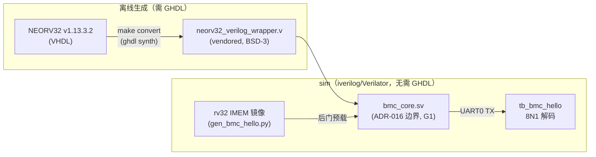

# 报告：P1 BMC NEORV32 仿真路径（G6 Option A）— 真实 rv32 核进 sim

> 任务：E1-BMC1 前置 — NEORV32 仿真路径打通（G6 解决：Option A）+ bmc_core 骨架
> 日期：2026-07-30 · 提交：见本报告提交（继 f17080a het packed capstone）
> Plan-Ref：`ethereal-plan/components/C05-BMC组件.md §1`（ADR-016）、`/memories/repo/neorv32-sim-path.md`

## 本阶段实现内容

### ✅ G6 解决：NEORV32 仿真路径 = Option A（真实核 + SV fabric 同 sim）
- 子代理 web+动手探针（GHDL/Verilator/iverilog + 真实 NEORV32）证实：**唯一**能让**真实 rv32 ISA 核**与 SystemVerilog fabric 同 sim 的 OSS 路径是 **GHDL `make convert` → 扁平化 Verilog wrapper**。
  - GHDL 7.0.0-dev（LLVM 后端）→ 原生可执行；NEORV32 v1.13.3.2 全 SoC TB 在纯 GHDL 下 boot（双核 + JTAG OCD halt/write/resume）。
  - **Verilator lint 该 wrapper: exit 0；iverilog 编译: exit 0。** Verilator/iverilog 不支持 VHDL；VexRiscv 需 SpinalHDL/sbt/java（本机无）。
  - 关键坑：**必须用官方 `neorv32_verilog_wrapper.vhd`（record 端口→标量），不要直接转换 `neorv32_top`**（record 字段会变成 `\ctrl_i[pc_cur]` 转义名）。
- 与锁定 ADR-016 一致：GHDL 转换的 Verilog wrapper **就是**“可换核 bmc_core wrapper”的边界。**不构成新 ADR**（实现既有锁定决策）。

### ✅ 供应商快照（vendored, FROZEN）`ethereal-shell/rtl/bmc/`
- `neorv32_verilog_wrapper.v`（873KB，机器生成，**非 G1**）：来源 stnolting/neorv32 **v1.13.3.2 / commit 05f9896**，BSD-3 保留（`LICENSE.neorv32`）。完整 provenance 头 + 再生方法（`rtl/verilog && make convert`）。
- 配置 = **MINIMAL 骨架**：rv32imc + IMEM 16KB(ROM boot, BOOT_MODE_SELECT=2) + DMEM 16KB + **仅 UART0**（XBUS/EBI/SPI/I2C/DMA/OCD 全关——记录为 ASSUMPTION）。
- `bmc_core.sv`（**唯一 G1-clean 文件**，ADR-016 可换核边界）：薄 SV wrapper，暴露 clk/rst + UART0 + 保留 bus/debug 引脚（v0 扎线）。
- `README.md`：快照/配置/再生方法/IMEM 后门路径说明。

### ✅ 集成 TB `tb_bmc_hello`（iverilog）★ 真实核 boot + UART hello
- 手工 rv32 镜像（`ethereal-tools/tools/gen_bmc_hello.py`，本机无 riscv-gcc → 手汇编 rv32i）经 `$readmemh` 后门预载进 IMEM ROM → NEORV32 boot → 使能 UART0（PRSC=0/BAUD=0 → 1 bit = 2 clk）→ 写 "HI\n"。
- TB 解码 8N1 波形 → 断言收到 `0x48,0x49,0x0a`。**证明真实 rv32 核跑 IMEM 镜像并驱动外设**。

## 关键正确性修复（个人验证阶段捕获）

- **子代理未完成**：vendored wrapper + bmc_core + TB + helper 在，但**无报告/README/Makefile 接线，仓库根有残留 `tb_counter.vhd` 探针，hello 只出 1/3 字节**。
- **UART 采样半位漂移**（真 bug）：子代理 TB 的 `uart_recv_byte` 在 start 沿后 `#(BIT_NS/2)` 校验 start 位，但**额外**的采样节奏错位 → 第 2 字节帧错位。对照 NEORV32 UART 时序（`uart_clk=clkgen(prsc)`，`bit = (baud+1) uart_clk`；prsc=0/baud=0 → 1 bit = 2 clk）+ 用探针 TB 验证正确采样（start 中心 + 每 bit 一 BIT_NS）修正。**逐边 trace 证实 3 字节均发出，是解码器错位，非固件错。**
- **UART 状态位 ABI 核实**：`ctrl_tx_nfull_c=19`（上游 `neorv32_uart.vhd` 锁定）——子代理轮询位正确，未盲改。
- **lint 治理**：vendored netlist 有 ~536 条 vendor 警告（DECLFILENAME/PINCONNECTEMPTY/UNUSEDPARAM…）——**bmc_core.sv 本身零警告**；按 mailbox 模式将 netlist 以**文档化豁免**挂为 bmc_core 的 dep（`NEORV32_NETLIST`，不入 RTL_CLEAN 的 -Wall 闸），bmc_core 严格 G1。

## 验证结果

| 检查 | 结果 |
|---|---|
| `make lint` | OK（bmc_core 严格 -Wall；netlist 文档化豁免） |
| `make test-sv` | **17 SV TB 全过**（16 + tb_bmc_hello） |
| `pytest` | **2639 passed, 3 xfailed**（无回归） |
| `ruff` | gen_bmc_hello.py clean |

## 架构图（BMC sim 路径）

## 下一阶段需要做的内容

- **bmc-fw 真实固件**：手汇编不可持续 —— 需要 riscv toolchain（`riscv64-unknown-elf-gcc` 或预编译 image_gen 产物）跑真实 C 固件（G6：本机无；维护者装 toolchain 或离线预编译）。
- **XBUS/EBI master → EMRI**：把 BMC 外设总线接到 EMRI/EBI（S04 mailbox endpoint），让固件驱动 OCC——这是 BMC 替代 host 直驱的关键一步（对应 C05 §2 固件模块 efp/lifecycle）。
- **丰富配置**：64KB IMEM/DMEM、SPI(EFP-SDI)/I2C(TWD 监控)/DMA(<10ms 热替换)/TRNG/OCD(JTAG+GDB, E1-BMC3)——按 C05 §1.2 frozen generics 逐项开启。
- **boot 双分区 + flash**：C05 §2.1 启动链（base ROM 自检 + A/B 分区 + UART 救援）。
- **core-swap 验证（E2-BMC2）**：VexRiscv 经同一 bmc_core 边界（需 SpinalHDL 工具链）。
- **E1-PLT/IO/DMO**：硬件路径（Gowin EDA / 实板），维护者执行。
