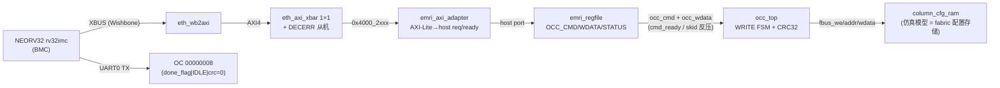

# 报告：P1 BMC 驱动 OCC 区域配置（ADR-018 BMC 集成 IV）— E1-BMC1 仿真闭环

> 任务：E1-BMC1 收尾 — BMC（而非上位机 BFM）经自研 AXI 管理面把真实配置帧写入 fabric
> 日期：2026-08-30
> Plan-Ref：`ethereal-spec/control/emri-v0.md` §3/§4（OCC 命令/状态）；`ethereal-plan/components/C05-BMC组件.md`（BMC 驱动 OCC）；`docs/adr/ADR-018-axi-noc-riscv-cluster.md`（BMC = AXI master）

## 本阶段实现内容

### ✅ 固件生成器 `--mode occ`（`gen_bmc_hello.py`）

- 新镜像执行**完整的区域配置部署序列**（对齐 `tb_emri_occ_loop.sv` 的 host 序列）：
  1. `OCC_FRAME_ADDR = frame_addr`、`OCC_WORD_COUNT = N`
  2. `OCC_CMD = START | WRITE | region`（region 取 frame_addr 高 4 位，与 occ_top 一致）
  3. 经 `OCC_WDATA` 逐字推送 N 个配置字（**BMC 的 `sw` 自然停顿直到 skid 接收**——背压由 emri_axi_adapter 的 host_req-until-ready 透传，固件无需轮询数据通路）
  4. 轮询 `OCC_STATUS` 的 sticky done_flag（bit3），回读并 UART 打印 `OC` + hex(status) + `\n`
- **常量单一来源**：`from emri_constants import ...`（R_OCC_*/OCC_WRITE/OCC_CMD_START/OCC_STATUS_DONE_FLAG），与 `emri_pkg.sv` 对齐，杜绝 ABI 漂移。ruff/mypy 干净。
- 默认帧：frame 0，4 字 `0xC0DE0000..3`（对齐 host 参考 TB 的 `0xC0DE+i` 约定）。

### ✅ 闭环 TB（`ethereal-fabric/tests/bmc/tb_bmc_axi_occ.sv`）

- 完整链路：**NEORV32 → XBUS(Wishbone) → eth_wb2axi → eth_axi_xbar(1×1) → emri_axi_adapter → emri_regfile → occ_top → column_cfg_ram**。
- 与 Phase C 的关键差异：`emri_regfile` 的 OCC 主口**实接 `occ_top`**（不再栓空），occ_top 的 fbus 接 `column_cfg_ram`（仿真模型，fabric 配置存储的替身）。
- 双重自检：
  1. **UART 精确匹配** `OC 00000008\n`（OCC_STATUS = done_flag|IDLE|无 CRC 错误|帧回显 0）；
  2. **后门校验** `column_cfg_ram.mem[0..3]` 恰好收到流写入的 4 个字。
- 这替代了 host 直驱 EMRI/OCC 的保底路径（mFSM 语义），达成 **BMC 作为主控的管理面闭环**。

### ✅ Makefile 接线

- `test-sv` 新增 `gen_bmc_hello --mode occ` 图像重生成 + `tb_bmc_axi_occ` 编译运行行。
- 本阶段无新 RTL 模块（复用已 lint 的 bmc_core / eth_wb2axi / eth_axi_xbar / emri_axi_adapter / emri_regfile / occ_top）。

## 设计验证记录（基于已证实的事实）

- **适配器兼容性（亲验）**：`emri_axi_adapter` 固定用 `SPI_OP_WR` 写。`emri_regfile` 中 `addr_is_occ_wdata_push` 同时接受 `SPI_OP_OCC_PUSH` **或** `SPI_OP_WR + addr==R_OCC_WDATA`；`addr_is_occ_cmd_start` 要求 `SPI_OP_WR + addr==R_OCC_CMD + wdata[bit8]`。两者均被适配器的 WR 路径正确触发——无需改适配器。
- **握手表语义（亲验）**：OCC_CMD start 的 `host_ready = occ_start_r && occ_cmd_ready_i`（多周期，等 occ_top 接受）；OCC_WDATA push 的 `host_ready = !occ_wdata_pending_r || occ_wdata_ready_i`（skid 反压）。适配器 hold-until-ready 协议与之精确匹配，且 emri 写副作用在 stall 下幂等（`!occ_start_r` 门控命令锁存，skid 状态门控数据装载）。
- **blank-before-write**：复位后各 region 干净（`dirty_r=0`，E0-FAB5），故首次 WRITE 无需 BLANK 即被接受。BLANK 路径已由 host 参考 TB（`tb_emri_occ_loop`）覆盖，本 TB 聚焦 BMC 驱动 WRITE 闭环。
- **OCC_STATUS 期望值的确定性**：WRITE 完成后 done_flag=1(sticky)、done_code=0(DONE)、live=IDLE(0)、crc_error=0、region=0、frame_echo=0（frame_addr=0）→ 恰好 `0x00000008`。

## 验证结果

| 检查 | 结果 |
| --- | --- |
| `tb_bmc_axi_occ`（iverilog/vvp） | ✅ TEST PASSED（UART 精确匹配 + RAM 后门校验 4 字） |
| `make lint` | ✅ OK — 全项目 RTL lint-clean |
| `make test-sv` | ✅ **26 个自测 TB 全过**（25 + tb_bmc_axi_occ） |
| `make test-model`（pytest） | ✅ 2639 passed, 3 xfailed（无回归） |
| `ruff check` | ✅ All checks passed（gen_bmc_hello.py） |

## 链路图（BMC 驱动 OCC 区域配置 = E1-BMC1 闭环）

## 待确认 / ASSUMPTION 清单（G6）

- 本 TB 用 `column_cfg_ram`（仿真模型）作为配置存储替身；真实 fabric 的 `fabric_top` 配置口接入（经 frame_decoder，已在 `shell_tb_mgmt_packed` 的 host 路径证明）属下一阶段把整条链换成真实 fabric 的集成目标。
- 固件默认 4 字小帧；大帧（数百字）的流写已由 host 参考 TB 覆盖，BMC 路径的多字/长帧压力测试列入 E1-DMO2 压力阶段。
- READBACK + CRC 自检在本链路未单独开启（host 路径已证明）；BMC 侧读回校验列入后续。

## 下一阶段需要做的内容

- **BMC→真实 fabric 集成 TB**：occ_top fbus → frame_decoder → fabric_top（复用 `shell_tb_mgmt_packed` 的既有接线），BMC 完成端到端真实 fabric 配置。
- **E1-RUN2 真主机化**：把 daemon 的 run/stop/ps/restart 跑在 BMC 固件上（依赖 E1-BMC2 bmc-fw 框架；当前为生成式镜像）。
- **`eth_wb2axi` + `emri_axi_adapter` 形式化**：sby 属性证明（ack-仅在-B 后、VALID 稳定、SLVERR 不触达 EMRI、OCC 命令恰好接受一次）。
- **xbar v0.1**：INCR/WRAP burst、ATOP 原子。
- **AXI NI 适配器（AXI↔mailbox NoC）**：region 数据面接 AXI（RFC-002 更新）。
